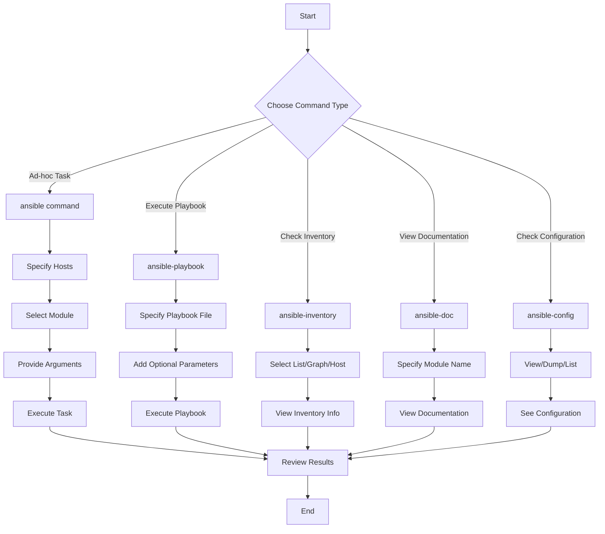

# Ansible Command Line

## Introduction

Ansible is a powerful IT automation tool that simplifies complex tasks like configuration management, application deployment, and orchestration. One of the most accessible ways to start using Ansible is through its command-line interface. In this guide, we'll explore the essential Ansible command-line tools, their syntax, and practical applications to help you automate your infrastructure with confidence.

The Ansible command line provides a direct way to execute automation tasks without needing to write complex playbooks first, making it perfect for beginners or quick one-off tasks.

## Core Ansible Commands

Ansible offers several command-line tools, but the most commonly used are:

1. `ansible` - For running ad-hoc commands
2. `ansible-playbook` - For executing playbooks
3. `ansible-inventory` - For working with inventory files
4. `ansible-config` - For managing configuration
5. `ansible-doc` - For accessing documentation

Let's explore each of these commands in detail.

## The `ansible` Command

The `ansible` command allows you to execute ad-hoc tasks on managed nodes without writing a playbook. This is useful for quick operations like checking system status, installing packages, or restarting services.

### Basic Syntax

```bash
ansible <host-pattern> -m <module-name> -a "<module-arguments>"
```

### Key Components:

- **host-pattern**: The hosts or groups to target (from your inventory)
- **-m**: Specifies the module to use
- **-a**: Provides arguments for the module

### Example 1: Ping all hosts to verify connectivity

```bash
ansible all -m ping
```

**Output:**
```
192.168.1.101 | SUCCESS => {
    "ansible_facts": {
        "discovered_interpreter_python": "/usr/bin/python3"
    },
    "changed": false,
    "ping": "pong"
}
192.168.1.102 | SUCCESS => {
    "ansible_facts": {
        "discovered_interpreter_python": "/usr/bin/python3"
    },
    "changed": false,
    "ping": "pong"
}
```

### Example 2: Checking system information

```bash
ansible webservers -m setup
```

This command returns detailed system information about all hosts in the "webservers" group.

### Example 3: Running shell commands

```bash
ansible all -m command -a "uptime"
```

**Output:**
```
192.168.1.101 | SUCCESS | rc=0 >>
 14:32:56 up 12 days,  3:45,  1 user,  load average: 0.08, 0.03, 0.01

192.168.1.102 | SUCCESS | rc=0 >>
 14:32:57 up 5 days,  7:12,  0 users,  load average: 0.12, 0.05, 0.02
```

### Example 4: Installing a package

```bash
ansible webservers -m apt -a "name=nginx state=present" --become
```

This command installs Nginx on all servers in the "webservers" group. The `--become` flag enables privilege escalation (sudo).

## The `ansible-playbook` Command

While ad-hoc commands are useful, playbooks are at the heart of Ansible's power. The `ansible-playbook` command executes playbook files that contain multiple tasks organized into plays.

### Basic Syntax

```bash
ansible-playbook playbook.yml
```

### Example: Running a simple playbook

Imagine we have a playbook named `web_setup.yml`:

```yaml
---
- name: Web Server Setup
  hosts: webservers
  become: true
  tasks:
    - name: Install Nginx
      apt:
        name: nginx
        state: present
    
    - name: Start Nginx Service
      service:
        name: nginx
        state: started
        enabled: yes
```

To run this playbook:

```bash
ansible-playbook web_setup.yml
```

**Output:**
```
PLAY [Web Server Setup] ************************

TASK [Gathering Facts] ************************
ok: [192.168.1.101]
ok: [192.168.1.102]

TASK [Install Nginx] **************************
changed: [192.168.1.101]
ok: [192.168.1.102]

TASK [Start Nginx Service] ********************
changed: [192.168.1.101]
ok: [192.168.1.102]

PLAY RECAP ***********************************
192.168.1.101              : ok=3    changed=2    unreachable=0    failed=0
192.168.1.102              : ok=3    changed=0    unreachable=0    failed=0
```

### Common `ansible-playbook` Options

- `--limit SUBSET`: Limit execution to specific hosts
- `--check`: Perform a dry run without making changes
- `--diff`: Show differences when files change
- `-v`, `-vv`, `-vvv`: Increase verbosity for debugging
- `--tags TAG_NAME`: Run only tasks with specified tags
- `--skip-tags TAG_NAME`: Skip tasks with specified tags

### Example with options

```bash
ansible-playbook web_setup.yml --limit 192.168.1.101 --check --diff -v
```

This runs the playbook in check mode (no changes), showing differences and increased verbosity, limited to a single host.

## The `ansible-inventory` Command

The `ansible-inventory` command helps examine and visualize your inventory, which is crucial for targeting the right hosts.

### Basic Syntax

```bash
ansible-inventory [options]
```

### Example 1: List all hosts

```bash
ansible-inventory --list
```

**Output (simplified):**
```json
{
  "_meta": {
    "hostvars": {
      "192.168.1.101": {
        "ansible_host": "192.168.1.101",
        "group": "webservers"
      },
      "192.168.1.102": {
        "ansible_host": "192.168.1.102",
        "group": "webservers"
      },
      "192.168.1.103": {
        "ansible_host": "192.168.1.103",
        "group": "databases"
      }
    }
  },
  "all": {
    "children": ["ungrouped", "webservers", "databases"]
  },
  "databases": {
    "hosts": ["192.168.1.103"]
  },
  "webservers": {
    "hosts": ["192.168.1.101", "192.168.1.102"]
  }
}
```

### Example 2: Graph the inventory

```bash
ansible-inventory --graph
```

**Output:**
```
@all:
  |--@ungrouped:
  |--@webservers:
  |  |--192.168.1.101
  |  |--192.168.1.102
  |--@databases:
  |  |--192.168.1.103
```

### Example 3: Show host variables

```bash
ansible-inventory --host 192.168.1.101
```

**Output:**
```json
{
  "ansible_host": "192.168.1.101",
  "group": "webservers"
}
```

## The `ansible-config` Command

The `ansible-config` command helps view and manage your Ansible configuration.

### Basic Syntax

```bash
ansible-config [view|dump|list]
```

### Example 1: View current configuration

```bash
ansible-config view
```

This shows the content of your ansible.cfg file.

### Example 2: Dump all configuration (including defaults)

```bash
ansible-config dump
```

**Output (partial):**
```
ACTION_WARNINGS(default) = True
AGNOSTIC_BECOME_PROMPT(default) = True
ANSIBLE_CONNECTION_PATH(default) = None
ANSIBLE_COW_PATH(default) = None
ANSIBLE_COW_SELECTION(default) = default
ANSIBLE_COW_WHITELIST(default) = ['bud-frogs', 'bunny', 'cheese', 'daemon'...]
...
```

### Example 3: List all configuration options

```bash
ansible-config list
```

This provides a detailed list of all available configuration options with descriptions.

## The `ansible-doc` Command

The `ansible-doc` command provides easy access to documentation for Ansible modules, which is invaluable when you need to understand how to use a particular module.

### Basic Syntax

```bash
ansible-doc [options] [module name]
```

### Example 1: Get documentation for the "apt" module

```bash
ansible-doc apt
```

**Output (partial):**
```
> APT    (/usr/lib/python3/dist-packages/ansible/modules/packaging/os/apt.py)

        Manages apt packages (such as for Debian/Ubuntu).

  * This module is maintained by The Ansible Core Team
  * note: This module has a corresponding action plugin.

OPTIONS (= is mandatory):

- allow_change_held_packages
        Allows changing the version of a package which is on the apt hold list.
        [Default: False]
        type: bool
...
```

### Example 2: List all available modules

```bash
ansible-doc -l
```

This lists all available modules with a brief description of each.

### Example 3: Get a snippet example

```bash
ansible-doc -s copy
```

**Output:**
```
- name: Copy files to remote locations
  copy:
      src:                    # Local path to a file to copy to the remote server; can be absolute or relative.
      content:                # When used instead of 'src', sets the contents of a file directly to the specified value.
      dest:                   # Remote absolute path where the file should be copied to.
      backup:                 # Create a backup file including the timestamp information.
      checksum:               # SHA1 checksum of the file.
      decrypt:                # This option controls the autodecryption of source files using vault.
      directory_mode:         # When doing a recursive copy set the mode for the directories.
      follow:                 # This flag indicates that filesystem links in the destination, if they exist, should be followed.
      force:                  # Influence whether the remote file must always be replaced.
...
```

## Common Patterns and Best Practices

### 1. Testing Commands with `--check`

Before making changes to production systems, use the `--check` flag to perform a dry run:

```bash
ansible webservers -m apt -a "name=nginx state=present" --check
ansible-playbook deployment.yml --check
```

### 2. Targeting Specific Hosts

You can target hosts in various ways:

```bash
# Target a single host
ansible server1.example.com -m ping

# Target multiple hosts
ansible server1.example.com,server2.example.com -m ping

# Target a group
ansible webservers -m ping

# Target multiple groups
ansible webservers,databases -m ping

# Target all hosts except a group
ansible 'all:!databases' -m ping

# Target based on a pattern
ansible 'web*' -m ping
```

### 3. Using Variables at the Command Line

You can pass variables directly at the command line:

```bash
ansible-playbook release.yml --extra-vars "version=1.23.45 environment=staging"
```

### 4. Parallel Execution

Control how many hosts Ansible targets simultaneously:

```bash
ansible all -m apt -a "name=nginx state=present" -f 10
```

This sets the fork count to 10, meaning Ansible will communicate with 10 hosts in parallel.

## Real-world Examples

### Example 1: System Maintenance

```bash
# Update all packages on all servers
ansible all -m apt -a "update_cache=yes upgrade=yes" --become

# Reboot servers with a custom message
ansible webservers -m reboot -a "msg='Scheduled maintenance reboot' reboot_timeout=600" --become
```

### Example 2: Deploying a Configuration Change

```bash
# Copy a configuration file to all web servers
ansible webservers -m copy -a "src=./nginx.conf dest=/etc/nginx/nginx.conf owner=root group=root mode=0644" --become

# Restart the service to apply changes
ansible webservers -m service -a "name=nginx state=restarted" --become
```

### Example 3: Gathering Information

```bash
# Check disk space on all servers
ansible all -m shell -a "df -h"

# Find large files
ansible all -m shell -a "find /var/log -type f -size +100M -exec ls -lh {} \;"
```

### Example 4: Running Playbooks with Different Environments

```bash
# Deploy to staging
ansible-playbook deploy.yml --extra-vars "env=staging"

# Deploy to production with limited concurrency
ansible-playbook deploy.yml --extra-vars "env=production" -f 5
```

## Visualizing Ansible Command Flow



## Summary

The Ansible command line provides powerful tools for infrastructure automation:

- The `ansible` command for running ad-hoc tasks
- `ansible-playbook` for executing more complex, repeatable operations
- `ansible-inventory` for examining your infrastructure inventory
- `ansible-config` for managing configuration settings
- `ansible-doc` for accessing built-in documentation

By mastering these commands, you'll be able to efficiently manage your infrastructure, automate routine tasks, and ensure consistency across your environment. The command-line interface offers a great entry point to Ansible's capabilities before diving into more complex playbook development.

## Additional Resources

- **Practice Exercises**:
  1. Write an ad-hoc command to check free disk space on all your servers
  2. Create a simple playbook to install and configure your favorite web server
  3. Set up a basic inventory file with at least two groups and use `ansible-inventory` to visualize it

- **Further Learning**:
  - Explore Ansible Galaxy for community-contributed roles
  - Learn about Ansible Vault for managing sensitive data
  - Study Ansible's idempotency concept to write safer automation

Remember that while ad-hoc commands are useful for quick tasks, playbooks offer reusability and documentation of your infrastructure as code. As you become more comfortable with the command line, consider evolving your automation into well-structured playbooks for maximum benefit.