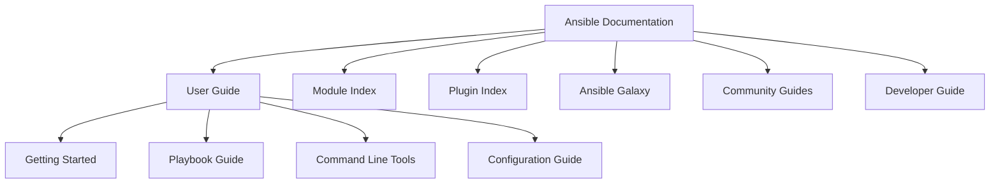
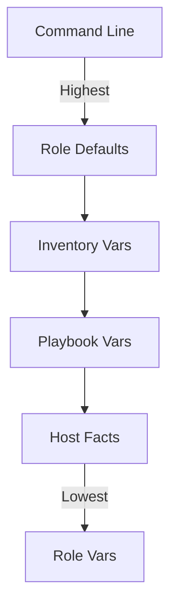

# Ansible Documentation

## Introduction

Ansible documentation is a vital resource for anyone working with Ansible, an open-source automation tool that simplifies configuration management, application deployment, and task automation. Whether you're a beginner just starting with Ansible or an experienced user looking to expand your knowledge, understanding how to navigate and utilize Ansible's documentation effectively will significantly enhance your automation journey.

This guide will walk you through the structure of Ansible documentation, how to find what you need, and how to interpret different types of documentation components like modules, playbooks, and configuration options.

## Understanding Ansible Documentation Structure

Ansible's official documentation is comprehensive and well-organized, but it can be overwhelming for beginners. Let's break down its structure to help you navigate it more efficiently.

### Main Documentation Sections

Ansible documentation is divided into several key sections:

<div className="section-diagram">

</div>

1. **User Guide**: Contains fundamental concepts, getting started guides, and best practices
2. **Module Index**: Comprehensive list of all Ansible modules with detailed usage information
3. **Plugin Index**: Documentation for Ansible plugins that extend its functionality
4. **Ansible Galaxy**: Information about sharing and reusing Ansible content
5. **Community Guides**: Community-contributed documentation and use cases
6. **Developer Guide**: Resources for those developing Ansible content

## Navigating the Documentation

### Finding Information

The most effective ways to find information in Ansible documentation include:

1. **Search functionality**: The documentation site includes a powerful search feature.
2. **Module Index**: When you need to understand a specific module's parameters.
3. **Table of Contents**: For browsing related topics in a structured way.

### Documentation Versions

Ansible documentation is version-specific. Always ensure you're referring to documentation that matches your installed Ansible version:

```bash
# Check your Ansible version
ansible --version

# Output
ansible [core 2.14.1]
  config file = /etc/ansible/ansible.cfg
  configured module search path = ['/home/user/.ansible/plugins/modules', '/usr/share/ansible/plugins/modules']
  ansible python module location = /usr/lib/python3.10/site-packages/ansible
  ansible collection location = /home/user/.ansible/collections:/usr/share/ansible/collections
  executable location = /usr/bin/ansible
  python version = 3.10.4
```

## Core Documentation Components

### Module Documentation

Module documentation is perhaps the most frequently referenced section. Let's look at an example for the `apt` module:

```yaml
# Example apt module usage based on documentation
- name: Install nginx package
  apt:
    name: nginx
    state: present
    update_cache: yes
```

The documentation for this module would include:

- **Synopsis**: Brief description of what the module does
- **Parameters**: All available options with explanations
- **Examples**: Common usage patterns
- **Return Values**: What information the module returns
- **Notes**: Additional information or caveats

### Playbook Examples

The documentation often includes complete playbook examples:

```yaml
# Example playbook from documentation
---
- name: Update web servers
  hosts: webservers
  become: yes
  
  tasks:
    - name: Ensure apache is installed
      apt:
        name: apache2
        state: present
        
    - name: Ensure apache is running
      service:
        name: apache2
        state: started
        enabled: yes
```

### Configuration Settings

Documentation for configuration options is essential for customizing Ansible behavior:

```ini
# Example ansible.cfg settings
[defaults]
inventory = ./inventory
remote_user = deploy
host_key_checking = False
timeout = 30
```

## Practical Examples of Using Documentation

### Example 1: Finding Module Parameters

Let's say you need to copy a file to remote servers but aren't sure about the parameters of the `copy` module:

1. Go to the Module Index
2. Search for "copy"
3. Review the available parameters

The documentation would show you that:

```yaml
# Example based on copy module documentation
- name: Copy configuration file
  copy:
    src: /path/to/local/file.conf
    dest: /etc/service/file.conf
    owner: root
    group: root
    mode: '0644'
    backup: yes
```

### Example 2: Troubleshooting with Documentation

When encountering errors, Ansible documentation can provide solutions:

```bash
# Example error output
TASK [Create application directory] ***********************************************
fatal: [webserver]: FAILED! => {"changed": false, "msg": "Permission denied"}
```

The documentation would guide you to:

1. Check the `become` parameter for privilege escalation
2. Verify file permissions
3. Examine SELinux contexts if applicable

```yaml
# Solution based on documentation
- name: Create application directory
  file:
    path: /var/www/app
    state: directory
    mode: '0755'
  become: yes  # Added based on documentation guidance
```

## Documentation for Special Ansible Features

### Inventory Documentation

Understanding inventory file formats and options:

```ini
# Example inventory file based on documentation
[webservers]
web1.example.com ansible_host=192.168.1.101
web2.example.com ansible_host=192.168.1.102

[databases]
db1.example.com

[webservers:vars]
http_port=80
```

### Variable Precedence

Documentation explains the complex variable precedence rules in Ansible:

<div className="variable-precedence">

</div>

### Filters and Tests

Documentation for Jinja2 filters that can be used in playbooks:

```yaml
# Using filters as documented
- name: Set a variable with a filtered value
  set_fact:
    safe_filename: "{{ original_filename | regex_replace('[^a-zA-Z0-9_-]', '_') }}"
```

## Using Documentation for Learning and Best Practices

Ansible documentation isn't just for reference—it's also an excellent learning resource:

### Example: Learning Loop Structures

The documentation teaches you how to use loops effectively:

```yaml
# Loop example from documentation
- name: Install required packages
  apt:
    name: "{{ item }}"
    state: present
  loop:
    - nginx
    - postgresql
    - python3
```

### Best Practices from Documentation

Ansible documentation includes best practices for organizing playbooks:

```
project/
├── inventories/
│   ├── production/
│   │   ├── hosts
│   │   └── group_vars/
│   └── staging/
│       ├── hosts
│       └── group_vars/
├── roles/
│   ├── common/
│   └── webserver/
├── site.yml
└── webservers.yml
```

## Working with Ansible Collection Documentation

Since Ansible 2.10, collections have become a fundamental part of Ansible. Documentation explains how to find and use collection-specific docs:

```yaml
# Example of using a collection module based on its documentation
- name: Create an S3 bucket
  amazon.aws.s3_bucket:
    name: my-bucket
    state: present
```

## Summary

Ansible documentation is a comprehensive resource that provides detailed information about all aspects of Ansible usage. Key takeaways include:

- Always check the documentation that matches your Ansible version
- Use the search functionality and module index for quick reference
- Study examples to understand the practical application of concepts
- Refer to best practices for organizing your Ansible projects
- Explore community guides for real-world use cases

By becoming proficient in navigating and using Ansible documentation, you'll be able to solve problems more efficiently, discover new features, and implement best practices in your automation projects.

## Additional Resources

- Official Ansible documentation website
- Ansible Galaxy for shared roles and collections
- Ansible community forums for peer support
- Online courses and tutorials for hands-on learning

## Exercises

1. Using the documentation, find three modules related to managing files and compare their parameters.
2. Look up how to implement error handling in playbooks using documentation examples.
3. Research how to use Ansible Vault for securing sensitive data by referring to its documentation.
4. Find documentation for two different collection modules and create a simple playbook using them.
5. Explore the documentation to discover how to create custom Ansible modules.