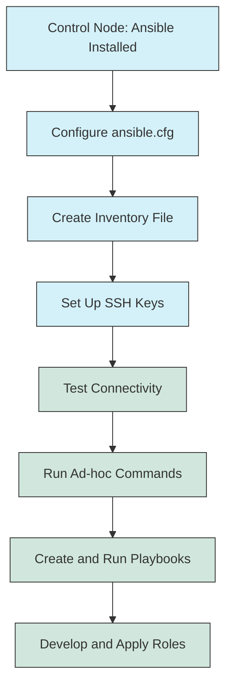

# Ansible Environment Setup

## Introduction

Ansible is a powerful open-source automation tool that simplifies configuration management, application deployment, and task automation. Before you can leverage Ansible's capabilities, you need to set up your environment correctly. This guide will walk you through the process of installing Ansible, configuring your environment, and preparing your system for automation tasks.

Unlike many other automation tools, Ansible is agentless, meaning you don't need to install special software on the managed nodes (target machines). It uses SSH for communication, making it lightweight and easy to implement in existing infrastructure.

## Prerequisites

Before setting up Ansible, ensure you have:

- A control node (your computer or a dedicated server) running Linux, macOS, or WSL on Windows
- Python 3.9 or newer installed on your control node
- SSH access to target machines you want to manage
- Basic understanding of YAML syntax and command-line operations

## Installing Ansible

### Method 1: Using Package Managers

#### For Ubuntu/Debian

```bash
# Update package lists
sudo apt update

# Install Ansible
sudo apt install ansible -y

# Verify installation
ansible --version
```

**Output:**
```
ansible [core 2.14.3]
  config file = /etc/ansible/ansible.cfg
  configured module search path = ['/home/user/.ansible/plugins/modules', '/usr/share/ansible/plugins/modules']
  ansible python module location = /usr/lib/python3/dist-packages/ansible
  ansible collection location = /home/user/.ansible/collections:/usr/share/ansible/collections
  executable location = /usr/bin/ansible
  python version = 3.10.12 (main, Jun 11 2023, 05:26:28) [GCC 11.4.0]
  jinja version = 3.0.3
  libyaml = True
```

#### For Red Hat/CentOS/Fedora

```bash
# Install EPEL repository if not already installed
sudo dnf install epel-release -y

# Install Ansible
sudo dnf install ansible -y

# Verify installation
ansible --version
```

#### For macOS (using Homebrew)

```bash
# Install Homebrew if not already installed
/bin/bash -c "$(curl -fsSL https://raw.githubusercontent.com/Homebrew/install/HEAD/install.sh)"

# Install Ansible
brew install ansible

# Verify installation
ansible --version
```

### Method 2: Using Python pip

Installing Ansible with pip allows you to easily upgrade to the latest version and install in virtual environments.

```bash
# Install pip if not already installed
sudo apt install python3-pip -y  # For Ubuntu/Debian
sudo dnf install python3-pip -y  # For Red Hat/CentOS/Fedora

# Install Ansible
pip3 install ansible

# Verify installation
ansible --version
```

### Method 3: Using Virtual Environments (Recommended for Development)

Virtual environments provide isolation, preventing conflicts with system packages.

```bash
# Install venv if not already installed
sudo apt install python3-venv -y  # For Ubuntu/Debian
sudo dnf install python3-venv -y  # For Red Hat/CentOS/Fedora

# Create a virtual environment
python3 -m venv ansible-env

# Activate the virtual environment
source ansible-env/bin/activate

# Install Ansible within the virtual environment
pip install ansible

# Verify installation
ansible --version

# To deactivate the environment when done
# deactivate
```

## Configuring Your Ansible Environment

### 1. Creating the Ansible Configuration File

Ansible looks for configuration in the following locations (in order of precedence):
1. `ANSIBLE_CONFIG` environment variable
2. `./ansible.cfg` (in the current directory)
3. `~/.ansible.cfg` (in the home directory)
4. `/etc/ansible/ansible.cfg` (global configuration)

Let's create a basic configuration file:

```bash
# Create a project directory
mkdir ~/ansible-project
cd ~/ansible-project

# Create a configuration file
touch ansible.cfg
```

Edit the `ansible.cfg` file with the following content:

```ini
[defaults]
inventory = ./inventory
host_key_checking = False
remote_user = your_ssh_user
private_key_file = ~/.ssh/id_rsa
```

### 2. Setting Up the Inventory

The inventory file defines the hosts Ansible will manage. Create an inventory file in your project directory:

```bash
# Create an inventory file
touch inventory
```

Edit the `inventory` file with your target hosts:

```ini
# Simple inventory example
[webservers]
web1.example.com
web2.example.com

[databases]
db1.example.com
db2.example.com

# You can also use IP addresses
[development]
192.168.1.101
192.168.1.102

# Group of groups
[production:children]
webservers
databases

# You can set variables for hosts or groups
[webservers:vars]
http_port=80
```

For a simple local test, you can use:

```ini
[local]
localhost ansible_connection=local
```

### 3. Setting Up SSH Keys

For passwordless authentication, set up SSH keys:

```bash
# Generate SSH key pair (skip if you already have one)
ssh-keygen -t rsa -b 4096

# Copy the public key to your target hosts
ssh-copy-id your_username@web1.example.com
ssh-copy-id your_username@web2.example.com
# Repeat for all target hosts
```

## Testing Your Ansible Environment

Let's verify that Ansible can communicate with your hosts:

```bash
# Check connectivity to all hosts in your inventory
ansible all -m ping
```

**Output:**
```
web1.example.com | SUCCESS => {
    "changed": false,
    "ping": "pong"
}
web2.example.com | SUCCESS => {
    "changed": false,
    "ping": "pong"
}
db1.example.com | SUCCESS => {
    "changed": false,
    "ping": "pong"
}
db2.example.com | SUCCESS => {
    "changed": false,
    "ping": "pong"
}
```

### Gather Information About Hosts

```bash
# Collect system information about all hosts
ansible all -m setup
```

This command returns detailed information about each host, including hardware, operating system, network configuration, and more.

### Run Your First Ad-Hoc Command

```bash
# Check disk space on all hosts
ansible all -a "df -h"

# Check memory usage
ansible all -a "free -m"

# Update package lists on Debian/Ubuntu systems
ansible all -a "sudo apt update" --become
```

## Project Structure

For organized Ansible projects, consider the following structure:

```
ansible-project/
├── ansible.cfg        # Configuration file
├── inventory/         # Inventory directory
│   ├── production     # Production environment hosts
│   └── development    # Development environment hosts
├── playbooks/         # Directory for playbooks
│   ├── site.yml       # Main playbook
│   ├── webservers.yml # Playbook for web servers
│   └── databases.yml  # Playbook for databases
├── roles/             # Directory for roles
│   ├── common/        # Common role for all servers
│   ├── webserver/     # Role for web servers
│   └── database/      # Role for databases
└── group_vars/        # Variables for groups
    ├── all.yml        # Variables for all hosts
    ├── webservers.yml # Variables for webservers
    └── databases.yml  # Variables for databases
```

## Ansible Environment Workflow

<div className="text-center">

</div>

## Common Issues and Troubleshooting

### SSH Connection Problems

If you encounter SSH connection issues:

```bash
# Enable verbose output for debugging
ansible all -m ping -vvv

# Manually test SSH connection
ssh -v your_username@problematic_host
```

### Permission Issues

If you see permission errors:

```bash
# Use the become flag to escalate privileges
ansible all -m ping --become

# Specify a become method
ansible all -m ping --become --become-method=sudo
```

### Inventory Issues

If hosts aren't being recognized:

```bash
# List all hosts in your inventory
ansible-inventory --list

# Check a specific host
ansible-inventory --host web1.example.com
```

## Practical Example: A Simple Playbook

Let's create a simple playbook to ensure Nginx is installed and running on our web servers:

```yaml
# Create a file named install_nginx.yml
- name: Install and configure Nginx
  hosts: webservers
  become: yes
  
  tasks:
    - name: Ensure Nginx is installed
      package:
        name: nginx
        state: present
    
    - name: Ensure Nginx is started and enabled
      service:
        name: nginx
        state: started
        enabled: yes
    
    - name: Create a custom index.html
      copy:
        content: "<html><body><h1>Hello from Ansible!</h1></body></html>"
        dest: /var/www/html/index.html
        mode: '0644'
      notify: Restart Nginx
  
  handlers:
    - name: Restart Nginx
      service:
        name: nginx
        state: restarted
```

Run the playbook:

```bash
ansible-playbook install_nginx.yml
```

## Summary

In this guide, you've learned how to:

1. Install Ansible using different methods (package managers, pip, virtual environments)
2. Configure your Ansible environment with a configuration file
3. Create an inventory to define managed hosts
4. Set up SSH keys for secure, passwordless authentication
5. Test your Ansible environment with simple commands
6. Create a basic project structure for your Ansible projects
7. Run a simple playbook to automate Nginx installation and configuration

With your Ansible environment now properly set up, you're ready to start automating your infrastructure and application deployments. The agentless nature of Ansible, combined with its simple YAML syntax, makes it an excellent choice for beginners starting their automation journey.

## Next Steps and Resources

Here are some resources to continue learning about Ansible:

- **Practice Exercises**:
  - Create a playbook that installs and configures a different web server (like Apache)
  - Write a playbook that sets up a basic development environment with multiple tools
  - Create a role that configures system security settings across all servers

- **Official Documentation**: 
  The [Ansible Documentation](https://docs.ansible.com/) is comprehensive and well-maintained

- **Community Resources**:
  - [Ansible Galaxy](https://galaxy.ansible.com/) for pre-built roles and collections
  - [Ansible Community Forum](https://forum.ansible.com/)

- **Books**:
  - "Ansible for DevOps" by Jeff Geerling
  - "Ansible: Up and Running" by Lorin Hochstein

Remember that Ansible is best learned through practice, so start with simple tasks and gradually build up to more complex automation scenarios.