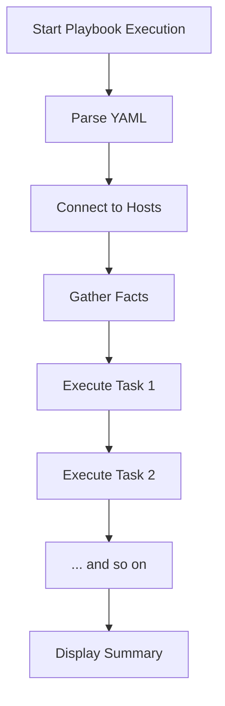

# Ansible First Playbook

## Introduction

In this tutorial, we'll explore how to create and run your first Ansible playbook. Playbooks are at the heart of Ansible's configuration, deployment, and orchestration capabilities. While ad-hoc commands (which we covered earlier) are useful for simple tasks, playbooks allow you to organize multiple tasks, target specific groups of hosts, and create reusable automation workflows.

A playbook is written in YAML format and describes a set of steps (tasks) that should be executed on remote servers. Think of a playbook as a script, but instead of writing procedural code, you're declaring the desired state of your systems.

## Prerequisites

Before creating your first playbook, make sure you have:

1. Ansible installed on your control node
2. SSH access to your target servers
3. A basic understanding of YAML syntax
4. An inventory file with your servers defined

## Understanding Playbook Structure

An Ansible playbook consists of one or more "plays." Each play:

- Targets specific hosts or host groups
- Defines tasks to run on those hosts
- Can include variables, handlers, and other components

Let's look at the basic structure of a playbook:

```yaml
---
- name: Play name
  hosts: target_servers
  become: yes  # Run tasks with elevated privileges (sudo)
  
  tasks:
    - name: First task description
      module_name:
        parameter1: value1
        parameter2: value2
      
    - name: Second task description
      another_module:
        parameter: value
```

## Creating Your First Playbook

Let's create a simple playbook that installs and starts the Nginx web server on target hosts. We'll call it `install_nginx.yml`.

1. First, create a new file using your favorite text editor:

```bash
nano install_nginx.yml
```

2. Add the following content to the file:

```yaml
---
- name: Install and configure Nginx
  hosts: webservers
  become: yes
  
  tasks:
    - name: Install Nginx package
      apt:
        name: nginx
        state: present
        update_cache: yes
      
    - name: Ensure Nginx service is started
      service:
        name: nginx
        state: started
        enabled: yes
```

This playbook has one play targeting the `webservers` group (which should be defined in your inventory). It contains two tasks:
- Install the Nginx package using the `apt` module
- Ensure the Nginx service is running and enabled on boot using the `service` module

## Running Your First Playbook

To run the playbook, use the `ansible-playbook` command:

```bash
ansible-playbook -i inventory.ini install_nginx.yml
```

Where `inventory.ini` is your inventory file.

The output will look something like this:

```
PLAY [Install and configure Nginx] ********************************************

TASK [Gathering Facts] ********************************************************
ok: [webserver1]
ok: [webserver2]

TASK [Install Nginx package] **************************************************
changed: [webserver1]
changed: [webserver2]

TASK [Ensure Nginx service is started] ****************************************
changed: [webserver1]
changed: [webserver2]

PLAY RECAP ********************************************************************
webserver1                 : ok=3    changed=2    unreachable=0    failed=0    skipped=0    rescued=0    ignored=0   
webserver2                 : ok=3    changed=2    unreachable=0    failed=0    skipped=0    rescued=0    ignored=0   
```

The "PLAY RECAP" section gives you a summary of what happened. Here, all tasks were executed successfully, and two tasks resulted in changes to the systems.

## Understanding Playbook Execution Flow

When Ansible runs a playbook:



Ansible executes tasks in order, one at a time, and waits for each task to complete on all hosts before moving to the next task.

## Adding More Complexity

Let's enhance our playbook by adding a custom Nginx configuration and a handler to restart Nginx only when the configuration changes:

```yaml
---
- name: Install and configure Nginx
  hosts: webservers
  become: yes
  
  tasks:
    - name: Install Nginx package
      apt:
        name: nginx
        state: present
        update_cache: yes
      
    - name: Deploy custom Nginx configuration
      template:
        src: templates/nginx.conf.j2
        dest: /etc/nginx/nginx.conf
        owner: root
        group: root
        mode: '0644'
      notify: Restart Nginx
      
    - name: Ensure Nginx service is started
      service:
        name: nginx
        state: started
        enabled: yes
        
  handlers:
    - name: Restart Nginx
      service:
        name: nginx
        state: restarted
```

In this enhanced version:
- We've added a task to deploy a custom Nginx configuration using the `template` module
- We've added a handler that will restart Nginx, but only if the configuration changes
- The `notify` parameter creates this connection between the task and the handler

## Using Variables in Playbooks

Variables make playbooks more flexible and reusable. Let's modify our playbook to use variables:

```yaml
---
- name: Install and configure Nginx
  hosts: webservers
  become: yes
  
  vars:
    nginx_port: 80
    nginx_document_root: /var/www/html
  
  tasks:
    - name: Install Nginx package
      apt:
        name: nginx
        state: present
        update_cache: yes
      
    - name: Deploy custom Nginx configuration
      template:
        src: templates/nginx.conf.j2
        dest: /etc/nginx/nginx.conf
        owner: root
        group: root
        mode: '0644'
      vars:
        server_port: "{{ nginx_port }}"
        document_root: "{{ nginx_document_root }}"
      notify: Restart Nginx
      
    - name: Ensure Nginx service is started
      service:
        name: nginx
        state: started
        enabled: yes
        
  handlers:
    - name: Restart Nginx
      service:
        name: nginx
        state: restarted
```

In this version, we've introduced play-level variables (`nginx_port` and `nginx_document_root`) and task-level variables for the template task.

Our template file (`templates/nginx.conf.j2`) might look like:

```
server {
    listen {{ server_port }};
    root {{ document_root }};
    
    # Other configuration...
}
```

## Verifying Playbook Success

After running your playbook, it's a good practice to verify that everything is working as expected:

```yaml
- name: Verify Nginx is responding
  uri:
    url: "http://{{ inventory_hostname }}:{{ nginx_port }}"
    return_content: yes
  register: response
  failed_when: "'Welcome to nginx' not in response.content"
```

This task uses the `uri` module to make an HTTP request to each server and checks that the response contains the expected content.

## Common Playbook Patterns

### 1. Conditional Tasks

Sometimes you want tasks to run only under certain conditions:

```yaml
- name: Install Apache on Debian-based systems
  apt:
    name: apache2
    state: present
  when: ansible_os_family == "Debian"

- name: Install Apache on RedHat-based systems
  yum:
    name: httpd
    state: present
  when: ansible_os_family == "RedHat"
```

### 2. Loops

For repetitive tasks, use loops:

```yaml
- name: Install multiple packages
  apt:
    name: "{{ item }}"
    state: present
  loop:
    - nginx
    - curl
    - vim
    - git
```

### 3. Tags

Tags let you run only specific parts of a playbook:

```yaml
- name: Install Nginx
  apt:
    name: nginx
    state: present
  tags: install

- name: Configure Nginx
  template:
    src: nginx.conf.j2
    dest: /etc/nginx/nginx.conf
  tags: configure
```

To run only the install task:

```bash
ansible-playbook -i inventory.ini playbook.yml --tags install
```

## Best Practices for Playbooks

1. **Use meaningful names** for plays and tasks
2. **Keep playbooks focused** on a specific purpose
3. **Use variables** for values that might change
4. **Use handlers** for actions that should happen only when a resource changes
5. **Include comments** to explain complex tasks or decisions
6. **Version control** your playbooks (Git)
7. **Test playbooks** in a safe environment before using them in production
8. **Organize related tasks** into separate files and include them using `include_tasks`

## Example: Complete Web Server Setup

Let's create a more complete example that sets up a web server with both Nginx and PHP:

```yaml
---
- name: Set up web server with Nginx and PHP
  hosts: webservers
  become: yes
  
  vars:
    domain_name: example.com
    php_version: 7.4
  
  tasks:
    - name: Update apt cache
      apt:
        update_cache: yes
        cache_valid_time: 3600
    
    - name: Install required packages
      apt:
        name:
          - nginx
          - "php{{ php_version }}-fpm"
          - "php{{ php_version }}-mysql"
          - "php{{ php_version }}-curl"
          - "php{{ php_version }}-gd"
          - "php{{ php_version }}-mbstring"
          - "php{{ php_version }}-xml"
        state: present
    
    - name: Create web root directory
      file:
        path: "/var/www/{{ domain_name }}"
        state: directory
        owner: www-data
        group: www-data
        mode: '0755'
    
    - name: Deploy Nginx virtual host configuration
      template:
        src: templates/vhost.conf.j2
        dest: "/etc/nginx/sites-available/{{ domain_name }}.conf"
        owner: root
        group: root
        mode: '0644'
      notify: Reload Nginx
    
    - name: Enable Nginx virtual host
      file:
        src: "/etc/nginx/sites-available/{{ domain_name }}.conf"
        dest: "/etc/nginx/sites-enabled/{{ domain_name }}.conf"
        state: link
      notify: Reload Nginx
    
    - name: Deploy test PHP file
      copy:
        content: "<?php phpinfo(); ?>"
        dest: "/var/www/{{ domain_name }}/info.php"
        owner: www-data
        group: www-data
        mode: '0644'
    
    - name: Ensure Nginx is running
      service:
        name: nginx
        state: started
        enabled: yes
    
    - name: Ensure PHP-FPM is running
      service:
        name: "php{{ php_version }}-fpm"
        state: started
        enabled: yes
  
  handlers:
    - name: Reload Nginx
      service:
        name: nginx
        state: reloaded
```

This playbook:
1. Updates the apt cache
2. Installs Nginx and PHP-FPM with common extensions
3. Creates a web root directory
4. Deploys and enables a virtual host configuration
5. Deploys a test PHP file
6. Ensures both Nginx and PHP-FPM services are running
7. Includes a handler to reload Nginx when the configuration changes

## Summary

In this tutorial, you've learned how to create and run your first Ansible playbook:

- Playbooks are YAML files describing automation tasks
- Each playbook contains one or more plays targeting specific hosts
- Tasks use Ansible modules to make changes to systems
- Handlers execute only when notified by a task that makes changes
- Variables make playbooks more flexible and reusable
- Best practices ensure playbooks are maintainable and effective

You now have the foundational knowledge to start automating your infrastructure with Ansible playbooks. As you become more comfortable with playbooks, you can explore more advanced features like roles, which help organize and reuse your Ansible code at a higher level.

## Exercises

1. Create a playbook that installs and configures a different web server (like Apache) and compare it to the Nginx example.
2. Modify the web server playbook to deploy a custom HTML welcome page.
3. Create a playbook that installs and configures a database server like MySQL or PostgreSQL.
4. Write a playbook that performs a system hardening task, such as configuring the firewall or disabling unnecessary services.
5. Extend the Nginx+PHP playbook to include a task that creates a MySQL database for a web application.

## Additional Resources

- [Ansible Playbook Documentation](https://docs.ansible.com/ansible/latest/user_guide/playbooks.html)
- [Ansible Module Index](https://docs.ansible.com/ansible/latest/collections/index_module.html)
- [Ansible YAML Syntax](https://docs.ansible.com/ansible/latest/reference_appendices/YAMLSyntax.html)
- [Ansible Best Practices](https://docs.ansible.com/ansible/latest/user_guide/playbooks_best_practices.html)