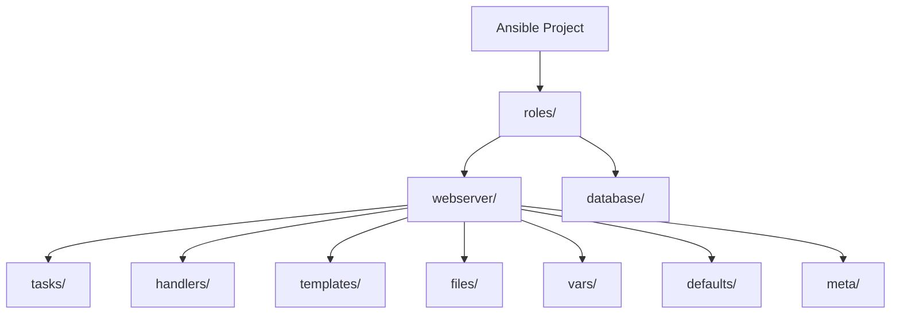

# Ansible Playbook Basics

## Introduction

Ansible playbooks are the foundation of Ansible's configuration, deployment, and orchestration capabilities. They allow you to define and execute automation tasks across your infrastructure in a simple, human-readable format. 

Playbooks are written in YAML (Yet Another Markup Language) format, making them easy to read, write, and understand—even for beginners. They serve as the instruction manual for Ansible, describing the desired state of your systems and the steps needed to achieve that state.

In this guide, we'll explore the basics of Ansible playbooks, their structure, and how to create and run them effectively.

## Prerequisites

Before diving into playbooks, ensure you have:

- Ansible installed on your control node
- Basic understanding of YAML syntax
- SSH access to target hosts
- Inventory file setup with your hosts

## Playbook Structure

An Ansible playbook consists of one or more "plays" in an ordered list. Each play executes a set of tasks on a specified group of hosts defined in your inventory.

Here's the basic structure of a playbook:

```yaml
---
- name: First play
  hosts: webservers
  tasks:
    - name: First task
      module_name:
        key1: value1
        key2: value2

- name: Second play
  hosts: databases
  tasks:
    - name: First task
      module_name:
        key1: value1
```

Let's break down the key components:

1. **Plays**: Each play begins with a dash (`-`) and targets specific hosts or host groups.
2. **Tasks**: Within each play, tasks define the actions to be performed.
3. **Modules**: Each task uses a specific Ansible module (like `yum`, `apt`, `service`, `copy`, etc.).

## Creating Your First Playbook

Let's create a simple playbook that installs and starts the Nginx web server:

```yaml
---
- name: Install and start Nginx
  hosts: webservers
  become: true
  tasks:
    - name: Install Nginx package
      apt:
        name: nginx
        state: present
        update_cache: yes
      
    - name: Start Nginx service
      service:
        name: nginx
        state: started
        enabled: yes
```

### Key Elements Explained:

- `name`: A descriptive name for the play and each task
- `hosts`: Specifies which hosts or groups from your inventory to target
- `become: true`: Enables privilege escalation (runs commands with sudo)
- `tasks`: The list of tasks to execute
- Module options:
  - `apt`: Module for package management on Debian/Ubuntu
  - `service`: Module for managing services

## Running a Playbook

To execute a playbook, use the `ansible-playbook` command followed by the playbook filename:

```bash
ansible-playbook nginx_install.yml
```

Sample output:

```
PLAY [Install and start Nginx] ***************************************

TASK [Gathering Facts] ***********************************************
ok: [webserver1]

TASK [Install Nginx package] *****************************************
changed: [webserver1]

TASK [Start Nginx service] *******************************************
changed: [webserver1]

PLAY RECAP **********************************************************
webserver1                  : ok=3    changed=2    unreachable=0    failed=0    skipped=0    rescued=0    ignored=0
```

## Variables in Playbooks

Variables make your playbooks more flexible and reusable. You can define variables at multiple levels:

```yaml
---
- name: Install specified package
  hosts: webservers
  become: true
  vars:
    package_name: nginx
    service_state: started
  
  tasks:
    - name: Install {{ package_name }} package
      apt:
        name: "{{ package_name }}"
        state: present
    
    - name: Set {{ package_name }} service state
      service:
        name: "{{ package_name }}"
        state: "{{ service_state }}"
        enabled: yes
```

Variables are referenced using double curly braces: `{{ variable_name }}`.

## Handlers: Responding to Changes

Handlers are tasks that only run when notified by another task. They're typically used for restarting services when configuration changes:

```yaml
---
- name: Configure and manage Nginx
  hosts: webservers
  become: true
  tasks:
    - name: Install Nginx
      apt:
        name: nginx
        state: present
    
    - name: Deploy Nginx configuration
      copy:
        src: files/nginx.conf
        dest: /etc/nginx/nginx.conf
      notify: Restart Nginx
  
  handlers:
    - name: Restart Nginx
      service:
        name: nginx
        state: restarted
```

In this example, the "Restart Nginx" handler will only run if the Nginx configuration file is changed by the "Deploy Nginx configuration" task.

## Conditionals

Conditionals allow tasks to run only when certain conditions are met:

```yaml
---
- name: Install web server based on OS
  hosts: webservers
  become: true
  tasks:
    - name: Install Nginx on Debian/Ubuntu
      apt:
        name: nginx
        state: present
      when: ansible_facts['os_family'] == "Debian"
    
    - name: Install Apache on RedHat/CentOS
      yum:
        name: httpd
        state: present
      when: ansible_facts['os_family'] == "RedHat"
```

## Loops

Loops allow you to perform a task multiple times with different values:

```yaml
---
- name: Install multiple packages
  hosts: webservers
  become: true
  tasks:
    - name: Install required packages
      apt:
        name: "{{ item }}"
        state: present
      loop:
        - nginx
        - php-fpm
        - mysql-client
        - python3-pip
```

## Including and Importing Other Playbooks

For better organization, you can split complex playbooks into smaller files:

```yaml
# main.yml
---
- name: Main playbook
  hosts: all
  become: true
  
  tasks:
    - name: Include webserver setup tasks
      include_tasks: webserver_tasks.yml
      when: inventory_hostname in groups['webservers']
    
    - name: Import database setup playbook
      import_playbook: database_setup.yml
```

## Roles: Organizing Your Playbooks

For larger projects, Ansible roles provide a structured way to organize playbooks:



You'll learn more about roles in the advanced Ansible sections.

## Playbook Best Practices

1. **Use meaningful names** for plays and tasks
2. **Indent consistently** (2 spaces is the YAML standard)
3. **Use variables** to make playbooks reusable
4. **Add comments** to explain complex tasks
5. **Test on development** environments before running on production
6. **Use version control** to track changes to your playbooks
7. **Keep playbooks idempotent** (can run multiple times without causing issues)

## Real-world Example: Multi-tier Web Application

Let's put everything together in a more comprehensive example:

```yaml
---
- name: Deploy LAMP Stack Application
  hosts: web_and_db_servers
  become: true
  vars:
    db_name: application_db
    db_user: app_user
    web_server_package: apache2
  
  tasks:
    # Common packages for all servers
    - name: Install common packages
      apt:
        name:
          - vim
          - htop
          - curl
          - git
        state: present
        update_cache: yes
  
- name: Configure Web Servers
  hosts: webservers
  become: true
  tasks:
    - name: Install web server packages
      apt:
        name:
          - apache2
          - php
          - php-mysql
          - libapache2-mod-php
        state: present
    
    - name: Deploy application code
      git:
        repo: https://github.com/example/web-application.git
        dest: /var/www/html/application
      notify: Restart Apache
    
    - name: Configure Apache virtual host
      template:
        src: templates/vhost.conf.j2
        dest: /etc/apache2/sites-available/application.conf
      notify: Enable site and restart Apache
  
  handlers:
    - name: Restart Apache
      service:
        name: apache2
        state: restarted
    
    - name: Enable site and restart Apache
      shell: a2ensite application.conf && systemctl restart apache2

- name: Configure Database Servers
  hosts: dbservers
  become: true
  vars_files:
    - secure_vars/db_credentials.yml
  
  tasks:
    - name: Install MySQL server
      apt:
        name: mysql-server
        state: present
    
    - name: Ensure MySQL is running
      service:
        name: mysql
        state: started
        enabled: yes
    
    - name: Create application database
      mysql_db:
        name: "{{ db_name }}"
        state: present
        login_unix_socket: /var/run/mysqld/mysqld.sock
    
    - name: Create application database user
      mysql_user:
        name: "{{ db_user }}"
        password: "{{ db_password }}"
        priv: "{{ db_name }}.*:ALL"
        host: '%'
        state: present
        login_unix_socket: /var/run/mysqld/mysqld.sock
```

This example demonstrates:
- Multiple plays targeting different host groups
- Variables and variable files
- Multiple modules in action
- Handlers for service management
- Git module for application deployment
- Templates for configuration files
- Secure handling of credentials

## Summary

Ansible playbooks provide a powerful yet simple way to automate infrastructure tasks. Key concepts covered in this guide include:

- Basic playbook structure and syntax
- Creating and running playbooks
- Working with variables
- Using handlers for responding to changes
- Implementing conditionals and loops
- Including external tasks and playbooks
- Following best practices

With these fundamentals, you're well on your way to mastering Ansible automation. The declarative, idempotent nature of playbooks makes infrastructure management more reliable and less error-prone.

## Additional Resources

To continue your Ansible learning journey:

- Practice with the exercises below
- Explore Ansible's official documentation
- Experiment with creating playbooks for your own infrastructure needs
- Learn about Ansible roles for organizing complex playbooks
- Discover Ansible Galaxy for community-maintained roles

## Exercises

1. Create a playbook that installs and configures your favorite development tools on a workstation.
2. Extend the LAMP stack example to include load balancing with HAProxy.
3. Write a playbook that performs system updates and reboots servers only when necessary.
4. Create a playbook that backs up configuration files before making changes.
5. Build a playbook that deploys a simple static website from a Git repository.

Remember, the best way to learn Ansible is by doing. Start with simple tasks and gradually build more complex automation workflows.