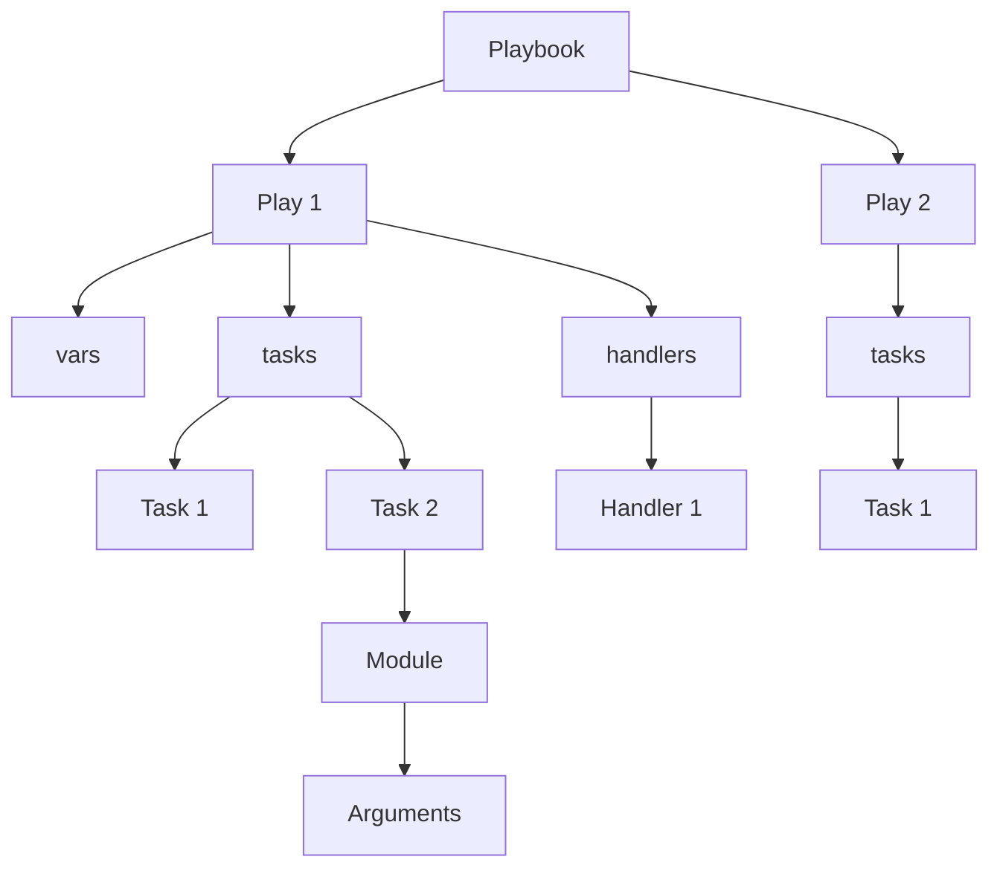

# Ansible YAML Syntax

## Introduction

YAML (YAML Ain't Markup Language) is the foundation of Ansible playbooks. It's a human-readable data serialization format that is used to express Ansible's configuration, automation tasks, and deployments. Understanding YAML syntax is essential for writing effective Ansible playbooks, as its indentation-based structure organizes the hierarchical data that defines your automation.

In this guide, we'll explore the fundamentals of YAML syntax specifically in the context of Ansible playbooks, providing clear examples and practical applications to help you master this critical aspect of infrastructure automation.

## YAML Basics for Ansible

### Key Features of YAML

YAML has several characteristics that make it ideal for configuration files:

- **Human Readable**: Easy to understand at a glance
- **Indentation-Based**: Uses spaces (not tabs) to indicate structure
- **No Curly Braces**: Unlike JSON, YAML doesn't use braces to enclose objects
- **Comments Allowed**: Use `#` to add comments (unlike JSON)
- **Multiple Document Support**: Can contain multiple documents separated by `---`

### Basic YAML Syntax Rules

1. **Indentation**: YAML uses indentation (spaces, not tabs) to denote structure
2. **Colons**: Key-value pairs are connected with colons (`key: value`)
3. **Dashes**: Used to denote list items (`- item`)
4. **Document Start/End**: `---` marks the start of a document, `...` (optional) marks the end

## YAML in Ansible Playbooks

A typical Ansible playbook begins with `---` and contains a list (array) of plays. Each play maps to a set of tasks that will be executed against a specific host or group of hosts.

Here's the basic structure of an Ansible playbook:

```yaml
---
- name: First play
  hosts: webservers
  tasks:
    - name: First task
      ansible.builtin.debug:
        msg: "Hello, Ansible!"

- name: Second play
  hosts: databases
  tasks:
    - name: First database task
      ansible.builtin.debug:
        msg: "Hello, database servers!"
```

### Key-Value Pairs

The most basic YAML construct is a key-value pair:

```yaml
key: value
```

In Ansible, this is used extensively for setting parameters:

```yaml
name: Install nginx
user: admin
state: present
path: /etc/nginx/nginx.conf
```

### Lists/Arrays

Lists in YAML are represented using hyphens:

```yaml
fruits:
  - apple
  - banana
  - cherry
```

In Ansible, lists are commonly used for tasks, roles, and host groups:

```yaml
tasks:
  - name: Install packages
    ansible.builtin.yum:
      name:
        - nginx
        - postgresql
        - git
      state: present
```

### Dictionaries/Mappings

Dictionaries (or mappings) represent key-value collections:

```yaml
person:
  name: John Smith
  age: 32
  occupation: Software Developer
```

In Ansible, dictionaries are used for module arguments and variables:

```yaml
- name: Create user
  ansible.builtin.user:
    name: johndoe
    groups: admin,developers
    shell: /bin/bash
    create_home: yes
```

### Combining Lists and Dictionaries

Ansible playbooks typically combine lists and dictionaries in complex structures:

```yaml
---
- name: Web server configuration
  hosts: webservers
  vars:
    http_port: 80
    server_name: example.com
  tasks:
    - name: Install nginx
      ansible.builtin.apt:
        name: nginx
        state: present
        
    - name: Configure nginx site
      ansible.builtin.template:
        src: nginx.conf.j2
        dest: /etc/nginx/sites-available/default
      notify:
        - restart nginx
  
  handlers:
    - name: restart nginx
      ansible.builtin.service:
        name: nginx
        state: restarted
```

## Advanced YAML Syntax for Ansible

### Multi-line Strings

YAML offers several ways to handle multi-line strings:

#### Folded Style (>)

The `>` character denotes that line breaks should be replaced with spaces:

```yaml
description: >
  This is a multi-line description.
  The line breaks will be converted to spaces.
  This is useful for wrapping text.
```

In Ansible, this might be used for longer command strings:

```yaml
- name: Run a complex script
  ansible.builtin.shell: >
    python3 /opt/scripts/backup.py
    --source /var/www
    --destination /backups
    --compression gzip
```

#### Literal Style (|)

The `|` character preserves line breaks:

```yaml
script_content: |
  #!/bin/bash
  echo "Starting backup"
  rsync -avz /source /destination
  echo "Backup completed"
```

In Ansible, this is perfect for embedding scripts or multi-line content:

```yaml
- name: Create a shell script
  ansible.builtin.copy:
    dest: /opt/scripts/backup.sh
    content: |
      #!/bin/bash
      # Backup important data
      tar -czf /backups/data-$(date +%Y%m%d).tar.gz /var/data
      echo "Backup completed at $(date)" >> /var/log/backup.log
    mode: '0755'
```

### Anchors and Aliases

YAML's anchor (`&`) and alias (`*`) feature allows you to define content once and reference it elsewhere:

```yaml
defaults: &defaults
  timeout: 30
  retries: 3
  
task1:
  <<: *defaults  # Merges the defaults dictionary
  name: First Task
  
task2:
  <<: *defaults
  name: Second Task
  timeout: 60  # Overrides the inherited value
```

In Ansible, this can help reduce repetition in complex playbooks:

```yaml
---
- name: Configure web servers
  hosts: webservers
  vars:
    common: &common_settings
      owner: www-data
      group: www-data
      mode: '0644'
      
  tasks:
    - name: Copy configuration file
      ansible.builtin.copy:
        src: nginx.conf
        dest: /etc/nginx/nginx.conf
        <<: *common_settings
        
    - name: Copy HTML content
      ansible.builtin.copy:
        src: index.html
        dest: /var/www/html/index.html
        <<: *common_settings
        mode: '0444'  # Override the common setting
```

### Boolean Values

YAML has multiple representations for boolean values:

```yaml
# All these represent TRUE
active: true
featured: yes
published: on
valid: True

# All these represent FALSE
active: false
featured: no
published: off
valid: False
```

In Ansible, be consistent with your boolean representations:

```yaml
- name: Create user
  ansible.builtin.user:
    name: johndoe
    create_home: yes
    system: no
```

### Environment Variables

In Ansible playbooks, you often need to use environment variables:

```yaml
- name: Run with specific environment
  ansible.builtin.shell: echo $JAVA_HOME
  environment:
    JAVA_HOME: /usr/lib/jvm/java-11-openjdk
    PATH: "{{ ansible_env.PATH }}:/opt/custom/bin"
```

## Practical Examples

### Example 1: Installing and Configuring a Web Server

```yaml
---
- name: Configure web server
  hosts: webservers
  become: yes
  vars:
    http_port: 80
    https_port: 443
    domain_name: example.com
    
  tasks:
    - name: Update apt cache
      ansible.builtin.apt:
        update_cache: yes
        cache_valid_time: 3600
        
    - name: Install required packages
      ansible.builtin.apt:
        name:
          - nginx
          - certbot
          - python3-certbot-nginx
        state: present
        
    - name: Create web directory
      ansible.builtin.file:
        path: "/var/www/{{ domain_name }}"
        state: directory
        owner: www-data
        group: www-data
        mode: '0755'
        
    - name: Configure Nginx site
      ansible.builtin.template:
        src: nginx-site.conf.j2
        dest: "/etc/nginx/sites-available/{{ domain_name }}"
      notify: restart nginx
      
    - name: Enable site
      ansible.builtin.file:
        src: "/etc/nginx/sites-available/{{ domain_name }}"
        dest: "/etc/nginx/sites-enabled/{{ domain_name }}"
        state: link
      notify: restart nginx
      
  handlers:
    - name: restart nginx
      ansible.builtin.service:
        name: nginx
        state: restarted
```

### Example 2: Database Configuration with Variables

```yaml
---
- name: Configure database servers
  hosts: databases
  become: yes
  vars:
    db_settings:
      user: db_user
      password: !vault |
        $ANSIBLE_VAULT;1.1;AES256
        62313365396636653936653964313163643...
      port: 5432
      max_connections: 100
      data_dir: /var/lib/postgresql/data
      
  tasks:
    - name: Install PostgreSQL
      ansible.builtin.apt:
        name:
          - postgresql
          - postgresql-contrib
          - python3-psycopg2
        state: present
        
    - name: Configure PostgreSQL settings
      ansible.builtin.template:
        src: postgresql.conf.j2
        dest: "{{ db_settings.data_dir }}/postgresql.conf"
        owner: postgres
        group: postgres
        mode: '0600'
      vars:
        port: "{{ db_settings.port }}"
        max_connections: "{{ db_settings.max_connections }}"
      notify: restart postgresql
      
    - name: Create database user
      community.postgresql.postgresql_user:
        name: "{{ db_settings.user }}"
        password: "{{ db_settings.password }}"
        role_attr_flags: CREATEDB,SUPERUSER
      become: yes
      become_user: postgres
      
  handlers:
    - name: restart postgresql
      ansible.builtin.service:
        name: postgresql
        state: restarted
```

## Common YAML Syntax Errors in Ansible

### 1. Indentation Errors

Incorrect indentation is the most common issue:

```yaml
# Incorrect - inconsistent indentation
- name: My task
  ansible.builtin.copy:
    src: file.txt
  dest: /path/to/file.txt  # This should be indented at the same level as 'src'
```

Correct version:

```yaml
# Correct - consistent indentation
- name: My task
  ansible.builtin.copy:
    src: file.txt
    dest: /path/to/file.txt
```

### 2. Mixing Tabs and Spaces

YAML is sensitive to mixing tabs and spaces:

```yaml
# Problematic - mixed tabs and spaces (not visible here but causes errors)
- name: Install packages
  ansible.builtin.apt:
	  name: nginx  # Indented with a tab instead of spaces
    state: present
```

Always use spaces (typically 2) for indentation in YAML.

### 3. Missing Quotes Around Special Characters

Some characters need to be quoted:

```yaml
# Incorrect - unquoted value with special character
server_name: example.com:8080  # The colon makes this invalid without quotes
```

Correct version:

```yaml
# Correct - quoted value with special character
server_name: "example.com:8080"
```

### 4. Issues with Boolean Values

Be careful with boolean values:

```yaml
# Problematic - 'no' is a boolean, not a string
ssh_args: -o StrictHostKeyChecking=no  # This will be interpreted as boolean false
```

Correct version:

```yaml
# Correct - quoted to prevent boolean interpretation
ssh_args: "-o StrictHostKeyChecking=no"
```

## Validating Your YAML Syntax

Before running your playbooks, validate your YAML syntax:

```bash
ansible-playbook --syntax-check playbook.yml
```

This command checks for syntax errors without executing the playbook.

For a more comprehensive check, you can also use:

```bash
yamllint playbook.yml
```

This requires the `yamllint` tool, which you can install via pip: `pip install yamllint`.

## Visualizing YAML Structure

Understanding complex YAML structures can be easier with a visual representation:



## Summary

YAML syntax forms the backbone of Ansible playbooks, providing a readable and maintainable way to define automation tasks. Key points to remember:

- YAML is indentation-sensitive, using spaces to denote structure
- Key-value pairs are connected with colons (`key: value`)
- Lists/arrays use hyphens (`- item`)
- YAML combines dictionaries and lists to create complex data structures
- Multi-line strings can be managed with folded (`>`) or literal (`|`) styles
- Always validate your syntax before running playbooks

By mastering YAML syntax for Ansible, you'll be able to write more efficient, readable, and maintainable playbooks for your automation needs.

## Additional Resources

- [YAML Official Documentation](https://yaml.org/)
- [Ansible Playbook Syntax](https://docs.ansible.com/ansible/latest/reference_appendices/playbooks_keywords.html)
- [YAML Validators Online](http://www.yamllint.com/)

## Practice Exercises

1. Convert the following JSON to YAML format suitable for an Ansible playbook:
   ```json
   {
     "name": "Install web stack",
     "hosts": "all",
     "tasks": [
       {
         "name": "Install packages",
         "apt": {
           "name": ["apache2", "php", "mysql-client"],
           "state": "present"
         }
       }
     ]
   }
   ```

2. Write a playbook that creates multiple users with different privileges, using YAML anchors and aliases to avoid repetition.

3. Create a multi-environment playbook with development, staging, and production settings, using YAML's ability to have multiple documents in one file.