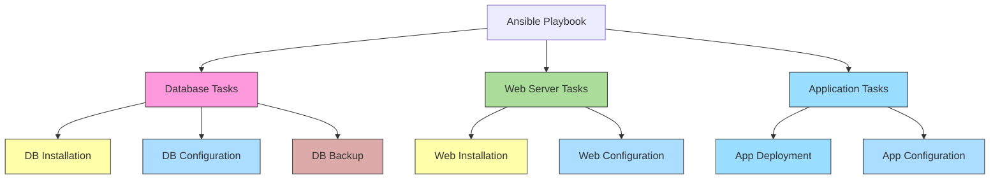

# Ansible Tags

## Introduction

When working with Ansible playbooks that contain dozens or even hundreds of tasks, you might not always want to run every task each time you execute the playbook. Ansible tags provide a powerful way to selectively execute specific tasks or roles within your playbooks, making your automation more flexible and efficient.

Tags allow you to label specific tasks and then choose which tagged tasks to run or skip during playbook execution. This capability is especially useful in complex playbooks where complete execution might take a significant amount of time, or when you only need to perform specific operations.

## Understanding Ansible Tags

### Basic Concept

Tags in Ansible are simply labels that you can apply to tasks, plays, or roles. When you run a playbook, you can specify which tags to run or skip, giving you fine-grained control over the execution.

### How to Add Tags to Tasks

Adding tags to individual tasks is straightforward. You simply add the `tags` attribute to a task:

```yaml
- name: Install Apache web server
  ansible.builtin.yum:
    name: httpd
    state: present
  tags:
    - apache
    - webserver
    - installation
```

In this example, the task has three tags: `apache`, `webserver`, and `installation`. You can apply multiple tags to a single task, allowing for more flexible selection criteria.

### Tagging Plays

You can also add tags at the play level, which will apply to all tasks within that play:

```yaml
- name: Apache configuration play
  hosts: webservers
  tags:
    - apache
    - configuration
  tasks:
    - name: Copy Apache configuration
      ansible.builtin.copy:
        src: httpd.conf
        dest: /etc/httpd/conf/httpd.conf
      
    - name: Restart Apache
      ansible.builtin.service:
        name: httpd
        state: restarted
```

In this play, both tasks inherit the `apache` and `configuration` tags.

### Tagging Roles

Similarly, you can tag entire roles:

```yaml
- name: Web server setup
  hosts: webservers
  roles:
    - role: apache
      tags: 
        - webserver
        - apache
```

All tasks within the apache role will now have the `webserver` and `apache` tags applied.

## Using Tags in Playbook Execution

### Running Specific Tags

To run only tasks with specific tags, use the `--tags` or `-t` option:

```bash
ansible-playbook site.yml --tags "apache,configuration"
```

This command will only run tasks tagged with either `apache` OR `configuration`.

### Skipping Tags

Conversely, to skip tasks with specific tags, use the `--skip-tags` option:

```bash
ansible-playbook site.yml --skip-tags "database,backup"
```

This will run all tasks except those tagged with `database` OR `backup`.

### Special Tags

Ansible provides some special built-in tags:

- `always`: Tasks tagged with `always` will always run, regardless of which tags are specified on the command line (unless explicitly skipped).
- `never`: Tasks tagged with `never` will always be skipped, unless the tag is specifically requested.

Example of using the `always` tag:

```yaml
- name: Security checks
  ansible.builtin.script: security_audit.sh
  tags:
    - always
```

This task will run every time the playbook is executed, regardless of which tags are specified.

## Practical Examples

### Example 1: Multi-tier Application Deployment

Consider a playbook that deploys a complete application stack with database, application server, and web server components:

```yaml
---
# deploy_app.yml
- name: Database server setup
  hosts: dbservers
  tags: 
    - database
  tasks:
    - name: Install MySQL
      ansible.builtin.package:
        name: mysql-server
        state: present
      tags:
        - installation

    - name: Configure MySQL
      ansible.builtin.template:
        src: mysql.conf.j2
        dest: /etc/mysql/my.cnf
      tags:
        - configuration

- name: Application server setup
  hosts: appservers
  tags:
    - application
  tasks:
    - name: Deploy application code
      ansible.builtin.git:
        repo: https://github.com/myorg/myapp.git
        dest: /var/www/application
      tags:
        - deployment
        - code

    - name: Configure application
      ansible.builtin.template:
        src: app_config.j2
        dest: /var/www/application/config.ini
      tags:
        - configuration

- name: Web server setup
  hosts: webservers
  tags:
    - webserver
  tasks:
    - name: Install Nginx
      ansible.builtin.package:
        name: nginx
        state: present
      tags:
        - installation

    - name: Configure Nginx
      ansible.builtin.template:
        src: nginx.conf.j2
        dest: /etc/nginx/sites-available/default
      tags:
        - configuration
```

With this structure, you have great flexibility in running specific parts of your deployment:

```bash
# Only update application code
ansible-playbook deploy_app.yml --tags "code"

# Only configure all components
ansible-playbook deploy_app.yml --tags "configuration"

# Only work on database tier
ansible-playbook deploy_app.yml --tags "database"

# Update web and app servers, but skip database
ansible-playbook deploy_app.yml --skip-tags "database"

# Only run installation tasks
ansible-playbook deploy_app.yml --tags "installation"
```

### Example 2: System Maintenance Playbook

Here's another example for a system maintenance playbook:

```yaml
---
# system_maintenance.yml
- name: System maintenance tasks
  hosts: all
  tasks:
    - name: Check disk space
      ansible.builtin.shell: df -h
      register: disk_space_output
      tags:
        - checks
        - disk

    - name: Update package cache
      ansible.builtin.package:
        update_cache: yes
      tags:
        - packages
        - update
        
    - name: Upgrade all packages
      ansible.builtin.package:
        upgrade: safe
      tags:
        - packages
        - upgrade
        
    - name: Clean package cache
      ansible.builtin.package:
        autoclean: yes
      tags:
        - packages
        - cleanup
        
    - name: Security updates only
      ansible.builtin.apt:
        upgrade: yes
        update_cache: yes
        security: yes
      when: ansible_distribution == 'Ubuntu'
      tags:
        - security
        - packages
        
    - name: Restart critical services
      ansible.builtin.service:
        name: "{{ item }}"
        state: restarted
      loop:
        - sshd
        - nginx
      tags:
        - services
        - restart
        
    - name: Backup configuration files
      ansible.builtin.archive:
        path: /etc
        dest: /backup/etc-{{ ansible_date_time.date }}.tar.gz
      tags:
        - backup
```

With this playbook, you could run various maintenance operations:

```bash
# Just check disk space
ansible-playbook system_maintenance.yml --tags "disk"

# Apply security updates only
ansible-playbook system_maintenance.yml --tags "security"

# Perform all package-related operations
ansible-playbook system_maintenance.yml --tags "packages"

# Do everything except backups
ansible-playbook system_maintenance.yml --skip-tags "backup"
```

## Best Practices for Using Tags

1. **Use Consistent Naming Conventions**:
   Maintain a clear naming convention for your tags to keep them organized and understandable.

2. **Apply Multiple Tags When Appropriate**:
   Tag tasks with multiple relevant labels to provide flexibility in execution.

3. **Document Tags**:
   Keep a record of what tags are available in your playbooks and what they do, especially for complex deployments.

4. **Tag Hierarchically**:
   Consider using both broad category tags (e.g., `database`) and specific operation tags (e.g., `backup`, `installation`) to allow for both wide and narrow selection.

5. **Use the `always` Tag Sparingly**:
   Only tag truly essential tasks with `always` to avoid overriding the user's explicit tag selections.

6. **Tag for Incremental Changes**:
   Design your tagging to support partial and incremental changes to your infrastructure.

## Tag Visualization

Tags can be visualized as a way to create subsets of tasks within your playbooks:



In this diagram, colors represent different tags that can be used to select specific tasks. Each task can have multiple tags, allowing for flexible execution.

## Listing Available Tags

Before running a playbook, you might want to see what tags are available. This can be done using the `--list-tags` option:

```bash
ansible-playbook site.yml --list-tags
```

This will output all available tags in the playbook without executing any tasks, helping you decide which tags to run or skip.

## Summary

Ansible tags provide a powerful mechanism for selectively running parts of your playbooks. By implementing a well-thought-out tagging strategy, you can:

- Run specific portions of large playbooks
- Save time by executing only necessary tasks
- Implement more flexible automation workflows
- Support targeted maintenance and updates

As your Ansible playbooks grow in complexity, effective use of tags becomes essential for maintaining efficiency and flexibility in your automation processes.

## Additional Resources and Exercises

### Resources

- [Ansible Documentation on Tags](https://docs.ansible.com/ansible/latest/user_guide/playbooks_tags.html)
- Ansible Galaxy: Search for roles that implement tagging effectively

### Exercises

1. **Basic Tagging Practice**:
   
   Take an existing playbook and add appropriate tags to its tasks based on function (installation, configuration, backup, etc.).

2. **Tag Structure Design**:
   
   Design a tag structure for a multi-tier application deployment that would allow for:
   - Deployment of the entire stack
   - Updates to only the application code
   - Configuration changes only
   - Database maintenance operations

3. **Tag Execution Challenge**:
   
   Create a maintenance playbook with at least 10 tasks and different tag categories. Then write the commands to:
   - Run only security-related tasks
   - Update configurations across all components
   - Run backup operations only
   - Execute everything except for service restarts

4. **Role Tagging**:
   
   Refactor a playbook into roles and implement a consistent tagging strategy across roles to maintain the ability to run specific types of operations.