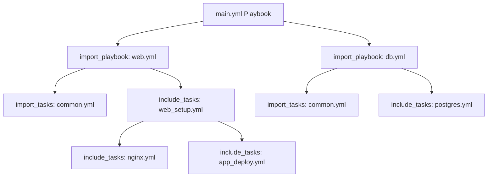

# Ansible Includes

## Introduction

When working with Ansible playbooks, you'll often find yourself writing similar tasks for different scenarios. Rather than duplicating code, Ansible provides powerful mechanisms to organize and reuse your code through includes and imports. These features help keep your playbooks DRY (Don't Repeat Yourself), maintainable, and modular.

In this guide, we'll explore how to effectively use Ansible's include and import statements to organize your automation code.

## Understanding Includes vs Imports

Before diving into examples, let's clarify the difference between includes and imports in Ansible:

| Feature | Include | Import |
|---------|---------|--------|
| Processing time | Dynamic (at runtime) | Static (during playbook parsing) |
| Variables | Can use variables defined later | Must use variables defined before the import |
| Loops | Can be used with loops | Cannot be used with loops |
| Conditionals | Apply to each included task | Apply to all imported tasks |
| Tags | Only applied to specifically tagged tasks | Automatically applied to all imported tasks |

## Including Tasks

Including tasks allows you to break down complex playbooks into smaller, reusable components.

### Basic Task Include

Let's start with a simple example of including tasks:

```yaml
# main.yml
---
- name: Web server configuration
  hosts: webservers
  tasks:
    - name: Include common setup tasks
      include_tasks: common_setup.yml
      
    - name: Include web server specific tasks
      include_tasks: webserver_setup.yml
```

```yaml
# common_setup.yml
---
- name: Install essential packages
  apt:
    name:
      - curl
      - vim
      - htop
    state: present
    update_cache: yes

- name: Configure firewall
  ufw:
    rule: allow
    port: "22"
    state: enabled
```

```yaml
# webserver_setup.yml
---
- name: Install web server packages
  apt:
    name:
      - nginx
      - apache2-utils
    state: present

- name: Start and enable nginx
  systemd:
    name: nginx
    state: started
    enabled: yes
```

### Dynamic Includes with Variables

One of the powerful features of `include_tasks` is the ability to use variables to dynamically determine which file to include:

```yaml
# main.yml
---
- name: Configure server based on role
  hosts: all
  vars:
    server_role: "{{ ansible_facts['hostname'] | regex_search('web|db|cache') }}"
  tasks:
    - name: Include role-specific configuration
      include_tasks: "{{ server_role }}_config.yml"
```

In this example, the playbook will include different task files based on the hostname of the server, looking for patterns like "web", "db", or "cache".

## Including Playbooks

In addition to including tasks, you can include entire playbooks using `import_playbook`:

```yaml
# site.yml
---
- import_playbook: webservers.yml
- import_playbook: dbservers.yml
- import_playbook: monitoring.yml
```

This approach is useful for organizing large infrastructure codebases, allowing you to run specific portions as needed.

## Task Imports

Unlike includes which are processed at runtime, imports are processed during the initial parsing of the playbook:

```yaml
# main.yml
---
- name: Server setup
  hosts: all
  tasks:
    - name: Import common tasks
      import_tasks: common.yml
      
    - name: Run local tasks
      # Additional tasks here
```

### When to Use Import vs Include

- Use `import_tasks` when:
  - You need variables, tags, and conditionals to apply to all imported tasks
  - Your playbook structure is static and doesn't need to change during runtime
  
- Use `include_tasks` when:
  - You need to dynamically decide what to include based on variables
  - You want to use loops with includes
  - You need more granular control over tags and conditionals

## Role Includes and Imports

The include/import concept also applies to roles, giving you the ability to reuse entire roles:

```yaml
# main.yml
---
- name: Server configuration
  hosts: webservers
  tasks:
    - name: Include web role
      include_role:
        name: web
        
    - name: Import database client role
      import_role:
        name: db_client
```

The difference between `include_role` and `import_role` follows the same pattern as tasks: include is dynamic, import is static.

## Practical Examples

Let's explore some real-world applications of includes and imports.

### Example 1: Environment-Specific Configuration

```yaml
# deploy_app.yml
---
- name: Deploy Application
  hosts: app_servers
  vars:
    environment: production
  tasks:
    - name: Include environment variables
      include_vars: "{{ environment }}.yml"
      
    - name: Setup application prerequisites
      import_tasks: app_prereq.yml
      
    - name: Deploy application
      include_tasks: deploy/{{ environment }}.yml
```

This playbook selects different variable files and deployment tasks based on the environment.

### Example 2: Breaking Down Complex Deployments

```yaml
# deploy_microservices.yml
---
- name: Deploy Microservices Architecture
  hosts: all
  tasks:
    - name: Get service list
      shell: cat /etc/ansible/services.json
      register: services_output
      delegate_to: localhost
      run_once: true
      
    - name: Set services fact
      set_fact:
        services: "{{ services_output.stdout | from_json }}"
      
    - name: Deploy each service
      include_tasks: deploy_service.yml
      loop: "{{ services }}"
      vars:
        service_name: "{{ item.name }}"
        service_version: "{{ item.version }}"
```

```yaml
# deploy_service.yml
---
- name: Deploy {{ service_name }}
  debug:
    msg: "Deploying {{ service_name }} version {{ service_version }}"

- name: Install service dependencies
  apt:
    name: "{{ service_name }}-dependencies"
    state: present
  
- name: Deploy service
  include_tasks: "services/{{ service_name }}/deploy.yml"
```

This example shows how to deploy multiple microservices, each with their own deployment tasks.

## Using Tags with Includes and Imports

Tags work differently with includes and imports, which is important to understand for efficient playbook organization:

```yaml
# main.yml
---
- name: Configure system
  hosts: all
  tasks:
    - import_tasks: security.yml
      tags: security
      
    - include_tasks: optional.yml
      tags: optional
```

With `import_tasks`, the "security" tag applies to all tasks in security.yml. With `include_tasks`, you would need to tag individual tasks within optional.yml.

## Using Conditionals

Conditionals also behave differently with includes and imports:

```yaml
# main.yml
---
- name: Setup servers
  hosts: all
  tasks:
    - import_tasks: debian.yml
      when: ansible_os_family == "Debian"
      
    - include_tasks: redhat.yml
      when: ansible_os_family == "RedHat"
```

With `import_tasks`, the condition is evaluated at playbook parsing time. With `include_tasks`, it's evaluated at runtime.

## Best Practices

1. **Structured Directory Layout:** Organize your includes in a logical directory structure
   ```
   playbooks/
   ├── main.yml
   ├── tasks/
   │   ├── setup/
   │   │   ├── users.yml
   │   │   └── packages.yml
   │   └── deploy/
   │       ├── app.yml
   │       └── db.yml
   ├── vars/
   │   ├── production.yml
   │   └── development.yml
   ```

2. **Naming Conventions:** Use consistent and descriptive names for included files

3. **Documentation:** Add comments at the top of each included file to explain its purpose

4. **Granularity:** Keep included tasks focused on a specific function or purpose

5. **Avoid Deep Nesting:** Try to limit includes to one or two levels deep to maintain readability

## Visualizing Includes Flow

Here's a diagram that illustrates how includes work in an Ansible playbook:



## Summary

Ansible includes and imports are powerful features that help you write more maintainable, reusable, and organized automation code. Remember these key points:

- **Includes** are processed at runtime and are dynamic
- **Imports** are processed during playbook parsing and are static
- Use **includes** when you need dynamic behavior, loops, or runtime decisions
- Use **imports** when you want tags and conditionals to apply to all tasks
- Both approaches help you organize code in a DRY, modular way

By mastering includes and imports, you'll be able to create elegant, maintainable Ansible playbooks that scale with your infrastructure.

## Additional Resources

- Try creating a playbook that uses both includes and imports
- Practice refactoring a complex playbook by breaking it down with includes
- Experiment with conditional includes based on host facts

## Exercises

1. Create a playbook that includes different task files based on the operating system family
2. Build a deployment playbook that imports common tasks and includes environment-specific tasks
3. Create a role that uses includes to organize its internal structure