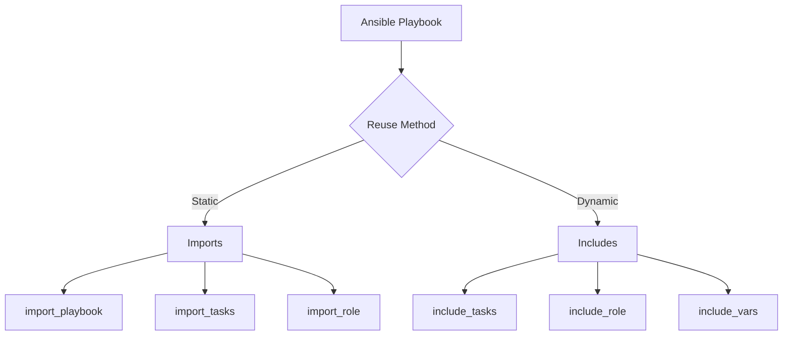

# Ansible Imports

## Introduction

When working with Ansible playbooks, you'll quickly find that organizing your automation code becomes essential as your infrastructure grows. Ansible provides powerful mechanisms for code reuse and organization through **imports** and **includes**. These features allow you to break down complex playbooks into smaller, more manageable pieces and reuse common tasks across multiple playbooks.

In this guide, we'll explore:
- The difference between static imports and dynamic includes
- How to import and include tasks, playbooks, and roles
- Best practices for organizing your Ansible code
- Real-world examples to demonstrate practical applications

## Static vs. Dynamic: Understanding the Difference

Ansible offers two primary methods for reusing content:

1. **Static imports** - Processed during playbook parsing (before execution)
2. **Dynamic includes** - Processed during playbook execution

This distinction is important because it affects how variables are processed and when decisions about execution are made.



## Importing Tasks

### Static Task Imports

The `import_tasks` directive allows you to statically import a file containing task definitions. Variables are interpolated at parse time.

Create a file named `common_tasks.yml`:

```yaml
---
- name: Ensure required packages are installed
  ansible.builtin.apt:
    name: "{{ item }}"
    state: present
  loop:
    - python3
    - python3-pip
    - git

- name: Create application directory
  ansible.builtin.file:
    path: "{{ app_directory }}"
    state: directory
    mode: '0755'
```

Now import these tasks in your main playbook:

```yaml
---
- name: Configure web servers
  hosts: webservers
  vars:
    app_directory: /opt/myapp
  
  tasks:
    - name: Import common setup tasks
      import_tasks: common_tasks.yml
      
    - name: Additional web server tasks
      ansible.builtin.debug:
        msg: "Setting up web server components"
```

When you run this playbook, Ansible processes the import during parsing, essentially replacing the `import_tasks` line with the content of the `common_tasks.yml` file before execution begins.

### Dynamic Task Includes

The `include_tasks` directive dynamically includes tasks during execution. This allows for conditionally including tasks based on runtime variables.

```yaml
---
- name: Configure servers based on environment
  hosts: all
  vars:
    environment: production
  
  tasks:
    - name: Include environment-specific tasks
      include_tasks: "{{ environment }}_setup.yml"
      
    - name: Conditionally include security hardening
      include_tasks: security_tasks.yml
      when: environment == "production"
```

## Importing Playbooks

The `import_playbook` directive allows you to statically import an entire playbook file:

```yaml
---
# main.yml
- name: Import database setup playbook
  import_playbook: database_setup.yml
  
- name: Import application setup playbook
  import_playbook: app_setup.yml
  
- name: Import web server setup playbook
  import_playbook: web_setup.yml
```

This creates a workflow of playbooks that will run in sequence. Each imported playbook can target different host groups and contain its own variables and tasks.

## Working with Roles

Roles are the most comprehensive way to organize reusable content in Ansible. You can use them statically or dynamically:

### Static Role Imports

```yaml
---
- name: Set up application server
  hosts: app_servers
  
  roles:
    - common
    - app_server
    
  tasks:
    - name: Import database client role
      import_role:
        name: database_client
      when: inventory_hostname in groups['primary_app_servers']
```

### Dynamic Role Includes

```yaml
---
- name: Configure servers based on tags
  hosts: all
  
  tasks:
    - name: Include monitoring role
      include_role:
        name: monitoring
      when: "'monitoring' in group_names"
      
    - name: Include application role dynamically
      include_role:
        name: "{{ app_role }}"
        tasks_from: setup
      vars:
        app_role: "{{ 'web_app' if 'web' in group_names else 'worker_app' }}"
```

## Practical Example: Multi-Environment Deployment

Let's build a real-world example for deploying an application across different environments (development, staging, production):

**Project Structure:**
```
ansible/
├── inventory/
│   ├── development
│   ├── staging
│   └── production
├── playbooks/
│   ├── deploy.yml
│   ├── common_tasks/
│   │   ├── prerequisites.yml
│   │   ├── security.yml
│   │   └── monitoring.yml
│   └── environment_tasks/
│       ├── development.yml
│       ├── staging.yml
│       └── production.yml
└── roles/
    ├── application/
    ├── database/
    └── webserver/
```

**Main Deployment Playbook (`deploy.yml`):**

```yaml
---
- name: Deploy application across environments
  hosts: all
  vars:
    deploy_version: "1.2.3"
  
  pre_tasks:
    - name: Import prerequisites tasks
      import_tasks: common_tasks/prerequisites.yml
      
    - name: Include environment-specific variables
      include_vars: "{{ inventory_file | basename }}.yml"
      
    - name: Include environment-specific tasks
      include_tasks: "environment_tasks/{{ inventory_file | basename }}.yml"
  
  roles:
    - common
  
  tasks:
    - name: Import security tasks
      import_tasks: common_tasks/security.yml
      when: apply_security | default(false) | bool
      
    - name: Include application-specific roles
      include_role:
        name: "{{ item }}"
      loop: "{{ required_roles }}"
      
  post_tasks:
    - name: Import monitoring setup
      import_tasks: common_tasks/monitoring.yml
```

**Environment-Specific Task File (`environment_tasks/production.yml`):**

```yaml
---
- name: Set production-specific variables
  ansible.builtin.set_fact:
    apply_security: true
    required_roles:
      - database
      - application
      - webserver
    database_replicas: 2
    
- name: Verify production prerequisites
  ansible.builtin.assert:
    that:
      - deploy_version is version('1.0.0', '>=')
    fail_msg: "Production deployments require version 1.0.0 or higher"
```

## Best Practices for Ansible Imports

1. **Use static imports for predictable structures** - When your playbook structure doesn't change based on runtime factors, static imports provide better error checking.

2. **Use dynamic includes for runtime decisions** - When you need to include different files based on variables or conditions determined during runtime.

3. **Keep imported/included files focused** - Each file should handle a specific aspect of configuration, making them more reusable.

4. **Use roles for complete feature sets** - When you have a collection of tasks, handlers, files, and templates that work together to configure a specific service or feature.

5. **Be aware of variable scope** - Variables defined in a playbook are accessible to imported tasks, but included tasks may have different variable behavior.

6. **Use namespaces for task names** - Prefix task names with the feature they belong to (e.g., "nginx: Install packages") to avoid confusion in logs.

7. **Document dependencies** - If an imported file expects certain variables to be defined, document them at the top of the file.

## Common Gotchas and Solutions

### Loop Variables with Imports

Static imports are processed at parse time, so loop variables won't work as expected:

```yaml
# This won't work as expected
- name: Import tasks with a loop
  import_tasks: setup.yml
  loop:
    - web
    - app
    - db
```

Solution: Use dynamic includes instead:

```yaml
# This works correctly
- name: Include tasks with a loop
  include_tasks: "{{ item }}_setup.yml"
  loop:
    - web
    - app
    - db
```

### Conditional Imports

Similar to loops, conditions on static imports are applied to all tasks within the imported file:

```yaml
# All tasks in security.yml will be conditionally applied
- name: Import security tasks
  import_tasks: security.yml
  when: is_production | bool
```

For finer-grained control, you can place conditions within the imported file or use dynamic includes.

## Summary

Ansible imports and includes are powerful tools for organizing your automation code. By understanding the differences between static imports and dynamic includes, you can choose the right approach for different scenarios:

- **Static imports** (`import_tasks`, `import_playbook`, `import_role`) are processed at parse time and are ideal for consistent, reusable components.
- **Dynamic includes** (`include_tasks`, `include_role`, `include_vars`) are processed at runtime and excel at handling variable conditions and looping.

When building complex automation, consider structuring your code hierarchically using a combination of playbooks, task files, and roles. This approach improves maintainability, promotes reuse, and makes your automation more scalable.

## Additional Resources

- [Ansible Documentation on Reusing Content](https://docs.ansible.com/ansible/latest/playbook_guide/playbooks_reuse.html)
- [Ansible Roles Documentation](https://docs.ansible.com/ansible/latest/playbook_guide/playbooks_reuse_roles.html)
- [Ansible Best Practices](https://docs.ansible.com/ansible/latest/tips_tricks/ansible_tips_tricks.html)

## Exercises

1. Create a playbook that imports common setup tasks and then includes environment-specific tasks based on a variable.
2. Refactor an existing playbook to use roles for different components (web, database, etc.).
3. Create a "security hardening" task file that can be imported into multiple playbooks.
4. Build a playbook that uses conditionals to determine which tasks to include at runtime.
5. Design a role structure for deploying a three-tier application, considering which parts should use static imports vs. dynamic includes.