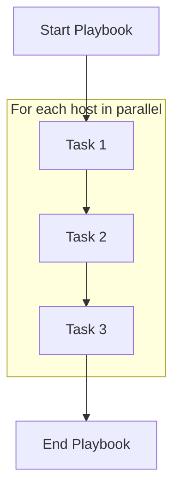

# Ansible Tasks

## Introduction

Tasks are the building blocks of Ansible playbooks. They represent the actions or operations that Ansible will perform on your managed hosts. Each task calls an Ansible module with specific arguments to accomplish a particular goal, such as installing a package, copying a file, or starting a service.

In this guide, we'll explore how to create and use tasks effectively in your Ansible playbooks.

## What Are Ansible Tasks?

A task in Ansible is a single unit of work. When you define a task, you're telling Ansible: "Do this one specific thing on the target servers." Tasks are written in YAML format and typically include:

1. A name (for human readability)
2. A module name
3. Module arguments
4. Optional control parameters

Here's the basic structure of an Ansible task:

```yaml
- name: Description of the task
  module_name:
    arg1: value1
    arg2: value2
  when: condition
```

## Basic Task Syntax

Let's look at some examples of basic tasks:

### Example 1: Installing a Package

```yaml
- name: Install nginx
  apt:
    name: nginx
    state: present
    update_cache: yes
```

This task:
- Uses the `apt` module (for Debian/Ubuntu systems)
- Ensures the nginx package is installed (`state: present`)
- Updates the package cache before installation (`update_cache: yes`)

### Example 2: Starting a Service

```yaml
- name: Start and enable nginx service
  service:
    name: nginx
    state: started
    enabled: yes
```

This task:
- Uses the `service` module
- Ensures the nginx service is running (`state: started`)
- Configures the service to start at boot time (`enabled: yes`)

## Task Execution Flow

When Ansible runs a playbook, it executes tasks in sequence for each host in the inventory before moving to the next task. This behavior can be visualized as:



By default, if a task fails on a host, Ansible will skip all remaining tasks for that host but continue processing tasks for other hosts.

## Task Attributes

Tasks can include several optional attributes that control how they are executed:

### Common Task Attributes

| Attribute | Description |
|-----------|-------------|
| `name` | Human-readable description of the task |
| `become` | Whether to escalate privileges (sudo) |
| `ignore_errors` | Continue even if the task fails |
| `register` | Store the output in a variable |
| `when` | Conditional execution of the task |
| `tags` | Labels for selectively running tasks |
| `changed_when` | Define when a task reports "changed" |
| `failed_when` | Define when a task should be considered failed |

### Example With Attributes

```yaml
- name: Check available disk space
  command: df -h /
  register: disk_space
  changed_when: false
  
- name: Display warning if disk space is low
  debug:
    msg: "Warning: Disk space is low!"
  when: disk_space.stdout is regex("([0-9]+)%.*/$") and (regex_replace(disk_space.stdout, ".*([0-9]+)%.*/$", "\\1") | int > 80)
```

This example:
1. Runs the `df -h /` command and stores the result in `disk_space`
2. Uses `changed_when: false` to prevent the command from reporting a change
3. Uses the `when` clause to conditionally display a warning if disk usage is over 80%

## Handlers and Notifications

Tasks can notify handlers, which are special tasks that run only when triggered and only run once at the end of a play.

```yaml
tasks:
  - name: Copy nginx configuration
    copy:
      src: nginx.conf
      dest: /etc/nginx/nginx.conf
    notify: Restart nginx

handlers:
  - name: Restart nginx
    service:
      name: nginx
      state: restarted
```

In this example, the handler "Restart nginx" will only run if the "Copy nginx configuration" task actually changes something.

## Loops in Tasks

You can use loops to perform a task multiple times with different values:

### Simple Loop

```yaml
- name: Install required packages
  apt:
    name: "{{ item }}"
    state: present
  loop:
    - nginx
    - python3
    - vim
    - htop
```

This task will install each of the listed packages.

### Loop with Complex Items

```yaml
- name: Create user accounts
  user:
    name: "{{ item.name }}"
    groups: "{{ item.groups }}"
    shell: "{{ item.shell | default('/bin/bash') }}"
  loop:
    - { name: 'john', groups: 'admin,dev' }
    - { name: 'sarah', groups: 'dev' }
    - { name: 'deploy', shell: '/bin/sh', groups: 'deploy' }
```

This task creates multiple users with different properties.

## Task Delegation

Sometimes you want to run a task on a different host than the current host in the play:

```yaml
- name: Add server to load balancer
  shell: add_to_lb.sh {{ inventory_hostname }}
  delegate_to: load_balancer.example.com
```

This task will run on `load_balancer.example.com` while referring to the current host being processed.

## Real-World Example: Deploying a Web Application

Let's look at a comprehensive example of tasks for deploying a web application:

```yaml
---
- name: Deploy web application
  hosts: web_servers
  become: yes
  vars:
    app_name: my_webapp
    app_version: 1.2.3
    
  tasks:
    - name: Install required packages
      apt:
        name:
          - nginx
          - python3
          - python3-pip
          - git
        state: present
        update_cache: yes
      
    - name: Clone application repository
      git:
        repo: https://github.com/example/{{ app_name }}.git
        dest: /var/www/{{ app_name }}
        version: "v{{ app_version }}"
      register: git_clone
      
    - name: Install Python dependencies
      pip:
        requirements: /var/www/{{ app_name }}/requirements.txt
        state: present
      when: git_clone.changed
      
    - name: Create Nginx site configuration
      template:
        src: nginx-site.conf.j2
        dest: /etc/nginx/sites-available/{{ app_name }}
      notify: Reload Nginx
      
    - name: Enable Nginx site
      file:
        src: /etc/nginx/sites-available/{{ app_name }}
        dest: /etc/nginx/sites-enabled/{{ app_name }}
        state: link
      notify: Reload Nginx
      
    - name: Start application service
      systemd:
        name: "{{ app_name }}"
        state: restarted
        daemon_reload: yes
        enabled: yes
      
  handlers:
    - name: Reload Nginx
      service:
        name: nginx
        state: reloaded
```

This example shows a series of tasks that:
1. Install required packages
2. Clone a Git repository
3. Install Python dependencies (only if the repository changed)
4. Configure and enable Nginx
5. Start the application service
6. Define a handler to reload Nginx when configuration changes

## Troubleshooting Tasks

When tasks fail, Ansible provides details about what went wrong. Here are some common issues and solutions:

### 1. Task Fails with "Module Not Found"

```
fatal: [server1]: FAILED! => {"msg": "Could not find or access 'foo' on the Ansible Controller."}
```

**Solution**: Check that the module name is correct and that any required dependencies are installed.

### 2. Conditional Task Evaluation Fails

```
fatal: [server1]: FAILED! => {"msg": "The conditional check 'result.stdout_lines[0] == \"active\"' failed"}
```

**Solution**: Use the `debug` module to examine variables and ensure conditions use the correct syntax.

### 3. Understanding Task Output

When running Ansible with increased verbosity (`-v`, `-vv`, or `-vvv`), you can see detailed information about task execution:

```yaml
- name: Debug task variables
  debug:
    var: some_variable
    verbosity: 2  # Only show when running with -vv or higher
```

## Best Practices for Tasks

Follow these guidelines for creating effective tasks:

1. **Give meaningful names**: Make task names descriptive so they create helpful output during playbook runs
2. **One task, one action**: Keep tasks focused on a single responsibility
3. **Use modules, not commands**: Prefer Ansible modules over raw commands when possible
4. **Handle idempotence**: Ensure tasks can run multiple times without negative effects
5. **Use conditionals wisely**: Only run tasks when needed based on facts or previous results
6. **Register important results**: Store and check output of critical operations
7. **Use handlers for service management**: Restart services only when needed
8. **Control changed status**: Use `changed_when` to accurately report when changes occur

## Summary

Ansible tasks are the fundamental units of work in playbooks. They define what actions Ansible will take on your managed systems. By understanding how to write effective tasks, you can create powerful, maintainable automation for your infrastructure.

Key points to remember:
- Tasks use modules to perform specific actions
- Tasks execute in sequence for each host
- Tasks can be conditional, use loops, and delegate to other hosts
- Well-structured tasks are readable, focused, and idempotent

## Additional Resources

- [Ansible Documentation: Working with Playbooks](https://docs.ansible.com/ansible/latest/user_guide/playbooks.html)
- [Ansible Module Index](https://docs.ansible.com/ansible/latest/collections/index_module.html)
- [Ansible GitHub Repository](https://github.com/ansible/ansible)

## Exercises

1. Create a playbook with tasks to install and configure a web server of your choice.
2. Write a task using a loop to create multiple users with different permissions.
3. Create a task that only runs when a specific condition is met (e.g., only on Debian systems).
4. Write a task that delegates an action to a specific host in your inventory.
5. Create a playbook that uses handlers to restart services only when their configuration has changed.