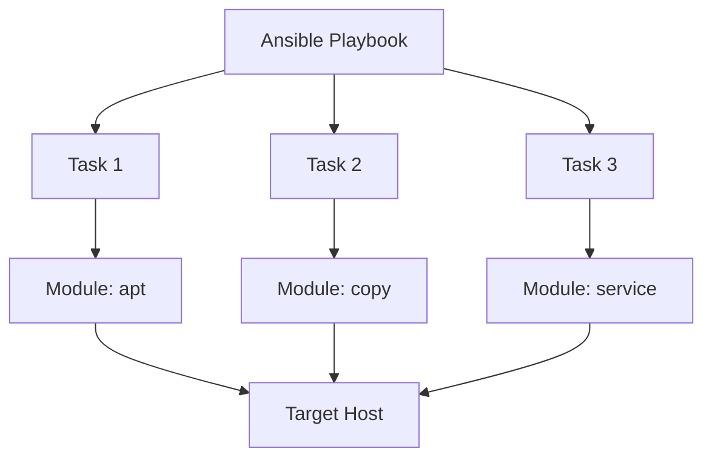

# Ansible Modules

## Introduction

Ansible Modules are the building blocks of Ansible playbooks and serve as the actual "tools" that perform specific tasks during automation. Think of modules as specialized commands that Ansible executes on your behalf on remote systems. They handle everything from managing packages and services to working with files, users, and cloud resources.

While Ansible playbooks define *what* you want to accomplish, modules determine *how* those tasks are executed. Understanding modules is essential for writing effective playbooks and leveraging Ansible's full automation capabilities.

## What Are Ansible Modules?

Modules are discrete units of code that Ansible executes on target hosts. Each module has a specific purpose and accepts parameters to modify its behavior.



### Key Characteristics of Modules

- **Idempotent**: Most modules ensure that repeated executions produce the same result.
- **Self-contained**: Each module handles a specific type of task.
- **Extensible**: You can write custom modules to extend Ansible's capabilities.
- **Declarative**: You specify the desired state, and the module handles the implementation details.

## Types of Ansible Modules

Ansible includes hundreds of built-in modules organized into various categories:

### System Modules

These modules interact with the system's core functions like packages, services, and users.

#### Example: Managing Packages with `apt`

```yaml
- name: Install Nginx web server
  apt:
    name: nginx
    state: present
    update_cache: yes
```

This task instructs Ansible to use the `apt` module to ensure Nginx is installed on Debian/Ubuntu systems.

### Files Modules

These modules manipulate files, directories, and file content.

#### Example: Creating Files with `copy`

```yaml
- name: Create configuration file
  copy:
    content: |
      # Server Configuration
      port = 8080
      max_connections = 100
    dest: /etc/myapp/config.ini
    owner: app_user
    group: app_group
    mode: '0644'
```

### Cloud Modules

Ansible provides modules for interacting with various cloud providers, such as AWS, Azure, and Google Cloud.

#### Example: Creating an EC2 Instance with `ec2`

```yaml
- name: Launch EC2 Instance
  ec2:
    key_name: my_key
    instance_type: t2.micro
    image: ami-123456789
    wait: yes
    region: us-east-1
    count: 1
    vpc_subnet_id: subnet-123456789
    assign_public_ip: yes
    tags:
      Name: "Web Server"
      Environment: "Development"
```

### Database Modules

These modules manage database systems like MySQL, PostgreSQL, and MongoDB.

#### Example: Creating a MySQL Database

```yaml
- name: Create a new database
  mysql_db:
    name: application_db
    state: present
    login_user: admin
    login_password: "{{ db_password }}"
```

## Using Modules in Playbooks

Let's explore how to effectively use modules within Ansible playbooks:

### Basic Module Usage

```yaml
- name: Ensure NTP is installed and running
  hosts: webservers
  become: yes
  tasks:
    - name: Install NTP package
      apt:
        name: ntp
        state: present
        
    - name: Ensure NTP service is running
      service:
        name: ntp
        state: started
        enabled: yes
```

### Module Parameters

Most modules accept parameters that modify their behavior:

```yaml
- name: Create a directory with specific permissions
  file:
    path: /opt/application/logs
    state: directory
    mode: '0755'
    owner: app_user
    group: app_group
```

In this example, `file` is the module name, and `path`, `state`, `mode`, `owner`, and `group` are parameters that control how the module behaves.

## Real-World Example: Deploying a Web Application

Let's see how multiple modules work together to deploy a simple web application:

```yaml
---
- name: Deploy Web Application
  hosts: webservers
  become: yes
  vars:
    app_dir: /var/www/webapp
    app_user: www-data
    app_config:
      port: 8080
      log_level: info
  
  tasks:
    - name: Ensure required packages are installed
      apt:
        name:
          - nginx
          - python3
          - python3-pip
        state: present
        update_cache: yes
    
    - name: Create application directory
      file:
        path: "{{ app_dir }}"
        state: directory
        owner: "{{ app_user }}"
        group: "{{ app_user }}"
        mode: '0755'
    
    - name: Clone application repository
      git:
        repo: https://github.com/example/webapp.git
        dest: "{{ app_dir }}"
        version: master
      notify: Restart Nginx
    
    - name: Install Python dependencies
      pip:
        requirements: "{{ app_dir }}/requirements.txt"
        
    - name: Generate application configuration
      template:
        src: templates/config.j2
        dest: "{{ app_dir }}/config.ini"
        owner: "{{ app_user }}"
        mode: '0644'
      notify: Restart Application
    
    - name: Configure Nginx
      template:
        src: templates/nginx-site.j2
        dest: /etc/nginx/sites-available/webapp
        mode: '0644'
    
    - name: Enable Nginx site
      file:
        src: /etc/nginx/sites-available/webapp
        dest: /etc/nginx/sites-enabled/webapp
        state: link
      notify: Restart Nginx
    
    - name: Ensure application service is configured
      template:
        src: templates/webapp.service.j2
        dest: /etc/systemd/system/webapp.service
        mode: '0644'
      notify: Reload systemd
    
    - name: Ensure application service is running
      service:
        name: webapp
        state: started
        enabled: yes
  
  handlers:
    - name: Restart Nginx
      service:
        name: nginx
        state: restarted
    
    - name: Restart Application
      service:
        name: webapp
        state: restarted
    
    - name: Reload systemd
      systemd:
        daemon_reload: yes
```

This playbook uses multiple modules, including:
- `apt` to install packages
- `file` to create directories and symbolic links
- `git` to clone a repository
- `pip` to install Python dependencies
- `template` to generate configuration files
- `service` to manage system services
- `systemd` to reload systemd configuration

## Finding and Using Module Documentation

Ansible provides comprehensive documentation for all modules. You can access this documentation in several ways:

### Using the Command Line

```bash
ansible-doc <module_name>
```

For example:

```bash
ansible-doc apt
```

This command displays detailed documentation for the `apt` module, including all available parameters and examples.

### Exploring Common Module Parameters

Many modules share common parameters:

- `state`: Defines the desired state (present, absent, started, stopped, etc.)
- `name`: Specifies the name of the resource to manage
- `path`/`dest`: Indicates file or directory paths
- `owner`/`group`/`mode`: Sets file permissions

## Creating Custom Modules

While Ansible provides hundreds of built-in modules, you may need to create custom modules for specific requirements:

### Basic Structure of a Custom Module

Custom modules are typically written in Python and follow this basic structure:

```python
#!/usr/bin/python

DOCUMENTATION = '''
---
module: my_custom_module
short_description: This is my custom module
description:
    - This is my longer description explaining the module
options:
    name:
        description:
            - This is the name parameter
        required: true
'''

EXAMPLES = '''
- name: Test my custom module
  my_custom_module:
    name: example
'''

from ansible.module_utils.basic import AnsibleModule

def main():
    module = AnsibleModule(
        argument_spec=dict(
            name=dict(type='str', required=True),
        ),
        supports_check_mode=True
    )

    result = dict(
        changed=False,
        original_message='',
        message=''
    )

    # Your module logic here
    # ...

    module.exit_json(**result)

if __name__ == '__main__':
    main()
```

Custom modules should be placed in specific directories to be recognized by Ansible.

## Best Practices for Using Modules

1. **Use Idempotent Patterns**: Design tasks to be repeatable without causing errors.
   
   ```yaml
   # Good - Idempotent
   - name: Ensure directory exists
     file:
       path: /opt/myapp
       state: directory
   
   # Avoid - Not idempotent
   - name: Create directory
     command: mkdir /opt/myapp
   ```

2. **Use Appropriate Modules**: Choose the right module for each task.
   
   ```yaml
   # Good - Using dedicated module
   - name: Ensure package is installed
     apt:
       name: nginx
       state: present
   
   # Avoid
   - name: Install package
     shell: apt-get install -y nginx
   ```

3. **Handle Conditionals Properly**: Use conditional execution when needed.
   
   ```yaml
   - name: Restart service only when config changes
     service:
       name: apache2
       state: restarted
     when: config_changed | bool
   ```

4. **Use Module Defaults**: Set default parameters for modules used repeatedly.
   
   ```yaml
   module_defaults:
     file:
       owner: www-data
       group: www-data
       mode: '0644'
     
   tasks:
     # Will use the defaults above
     - name: Create file A
       file:
         path: /path/to/file-a
         state: touch
     
     # Will use the defaults but override mode
     - name: Create file B
       file:
         path: /path/to/file-b
         state: touch
         mode: '0755'
   ```

## Summary

Ansible modules are the workhorses of Ansible automation, providing standardized interfaces for interacting with various systems and services. By understanding how modules work and how to use them effectively, you can create powerful, maintainable automation playbooks.

Key takeaways:
- Modules are discrete units of code that perform specific tasks
- Most modules are idempotent, ensuring consistent results
- Ansible includes hundreds of built-in modules for various purposes
- Modules can be combined to create complex automation workflows
- You can create custom modules for specialized requirements

## Exercises

1. Create a playbook that uses the `user` module to create a new system user with a home directory and specific permissions.
2. Write a playbook that uses the `copy` module to deploy a configuration file and the `service` module to restart a service if the configuration changes.
3. Create a playbook that uses the `apt` module to install a package, the `template` module to configure it, and the `service` module to start it.
4. Explore the `ansible-doc` command to learn about three modules you haven't used before.
5. Create a playbook that uses conditional tasks based on the target system's operating system.

## Additional Resources

- [Ansible Module Index](https://docs.ansible.com/ansible/latest/collections/index_module.html)
- [Developing Ansible Modules](https://docs.ansible.com/ansible/latest/dev_guide/developing_modules_general.html)
- [Ansible Best Practices](https://docs.ansible.com/ansible/latest/user_guide/playbooks_best_practices.html)