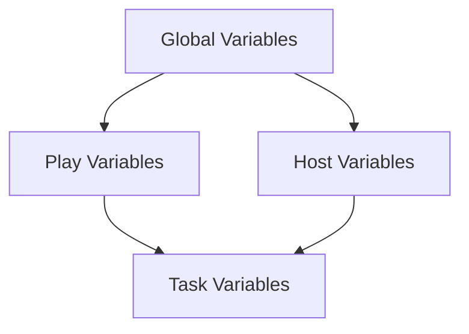

# Ansible Variables

Variables are a fundamental concept in Ansible that allow you to create more flexible, reusable, and maintainable playbooks. By using variables, you can write playbooks once and use them across different environments and scenarios without modifying the code.

## Introduction to Ansible Variables

In automation, hard-coding values like server names, file paths, or configuration settings creates brittle playbooks that aren't easily reused. Variables solve this problem by allowing you to define values in one place and reference them throughout your playbooks.

Think of variables as containers that store values which can be used and reused across your Ansible project.

## Variable Basics

### Defining Variables

Ansible provides several ways to define variables:

1. **In playbooks directly**
2. **In inventory files**
3. **In separate variable files**
4. **On the command line**
5. **In roles**

Let's look at some examples:

```yaml
# Variables defined directly in a playbook
---
- name: Example playbook with variables
  hosts: webservers
  vars:
    http_port: 80
    max_clients: 200
    app_name: "my_application"
  
  tasks:
    - name: Print variables
      debug:
        msg: "Setting up {{ app_name }} with port {{ http_port }}"
```

### Variable Naming Rules

Variable names in Ansible must follow these rules:

- Must start with a letter
- Can only contain letters, numbers, and underscores
- Should be lowercase with underscores separating words (snake_case)

Valid: `user_name`, `http_port`, `max_connections_per_host`  
Invalid: `User-Name`, `1st_variable`, `variable-name`

## Variable Types

Ansible supports various data types for variables:

### Strings

```yaml
app_name: "my_application"
server_message: 'Welcome to our server'
```

### Numbers

```yaml
http_port: 80
max_clients: 200
timeout_seconds: 30
```

### Boolean

```yaml
enable_feature: true
debug_mode: false
```

### Lists

```yaml
users:
  - alice
  - bob
  - charlie

fruits:
  - apple
  - banana
  - cherry
```

### Dictionaries

```yaml
server:
  name: web01
  ip: 192.168.1.100
  ports:
    - 80
    - 443
  
employee:
  name: John Smith
  department: IT
  skills:
    - python
    - ansible
    - linux
```

## Accessing Variables

### Basic Variable Access

To use a variable in Ansible, wrap it in double curly braces:

```yaml
- name: Create configuration file
  template:
    src: app.conf.j2
    dest: /etc/app/app.conf
    owner: "{{ app_user }}"
    group: "{{ app_group }}"
    mode: '0644'
```

### Accessing Dictionary Values

To access values in dictionaries:

```yaml
- name: Print server details
  debug:
    msg: "Server name is {{ server.name }} with IP {{ server.ip }}"
```

### Accessing List Items

To access list items by index:

```yaml
- name: Print first user
  debug:
    msg: "First user is {{ users[0] }}"
```

## Variable Files

For better organization, you can store variables in separate YAML files:

```yaml
# group_vars/webservers.yml
---
http_port: 80
https_port: 443
max_clients: 200
app_name: "web_application"
```

```yaml
# host_vars/web01.yml
---
server_ip: 192.168.1.10
backup_enabled: true
monitoring_interval: 5
```

Your inventory might look like:

```ini
# inventory.ini
[webservers]
web01
web02
web03
```

When you run a playbook, Ansible automatically loads variables from:
- `group_vars/all.yml` (applies to all hosts)
- `group_vars/webservers.yml` (applies to hosts in the webservers group)
- `host_vars/web01.yml` (applies to the specific host web01)

## Practical Examples

### Example 1: Configuring a Web Server

```yaml
---
- name: Configure web servers
  hosts: webservers
  vars:
    http_port: 80
    doc_root: /var/www/html
    app_env: production
  
  tasks:
    - name: Install Apache
      apt:
        name: apache2
        state: present
      become: true
    
    - name: Configure Apache port
      lineinfile:
        path: /etc/apache2/ports.conf
        regexp: '^Listen '
        line: "Listen {{ http_port }}"
      notify: restart apache
      become: true
    
    - name: Create document root
      file:
        path: "{{ doc_root }}"
        state: directory
        owner: www-data
        group: www-data
        mode: '0755'
      become: true
    
    - name: Deploy environment configuration
      template:
        src: env.conf.j2
        dest: "{{ doc_root }}/.env"
        owner: www-data
        group: www-data
        mode: '0644'
      become: true
  
  handlers:
    - name: restart apache
      service:
        name: apache2
        state: restarted
      become: true
```

With template file `env.conf.j2`:

```
APP_ENV={{ app_env }}
APP_PORT={{ http_port }}
APP_ROOT={{ doc_root }}
```

### Example 2: User Management with Variable Files

Define users in a variable file:

```yaml
# group_vars/all.yml
---
users:
  - username: alice
    groups: admin,developers
    shell: /bin/bash
    ssh_key: "ssh-rsa AAAA..."
  
  - username: bob
    groups: developers
    shell: /bin/bash
    ssh_key: "ssh-rsa BBBB..."
  
  - username: charlie
    groups: testers
    shell: /bin/zsh
    ssh_key: "ssh-rsa CCCC..."
```

Create a playbook that uses this variable file:

```yaml
---
- name: Manage users
  hosts: all
  
  tasks:
    - name: Create user groups
      group:
        name: "{{ item }}"
        state: present
      loop:
        - admin
        - developers
        - testers
      become: true
    
    - name: Create users
      user:
        name: "{{ item.username }}"
        groups: "{{ item.groups }}"
        shell: "{{ item.shell }}"
        state: present
      loop: "{{ users }}"
      become: true
    
    - name: Add SSH keys
      authorized_key:
        user: "{{ item.username }}"
        key: "{{ item.ssh_key }}"
        state: present
      loop: "{{ users }}"
      become: true
```

## Variable Precedence

Ansible follows a specific order when determining which variable value to use. Here's a simplified precedence list (from lowest to highest):

1. Default variables defined in roles
2. Group variables defined in inventory file
3. Host variables defined in inventory file
4. Group variables defined in group_vars/ directory 
5. Host variables defined in host_vars/ directory
6. Variables defined in playbook
7. Variables passed on the command line with `-e` or `--extra-vars`

This means command-line variables will override any other definitions, which is useful for temporary changes.

## Using Jinja2 with Variables

Ansible uses Jinja2 templating, allowing for powerful variable manipulation:

### Filters

```yaml
- name: Convert to uppercase
  debug:
    msg: "{{ app_name | upper }}"

- name: Default value if undefined
  debug:
    msg: "{{ optional_var | default('default_value') }}"

- name: Join list into string
  debug:
    msg: "Users: {{ users | join(', ') }}"
```

### Conditionals

```yaml
- name: Install package based on OS
  package:
    name: "{{ package_name }}"
    state: present
  when: ansible_distribution == "Ubuntu"
```

## Variable Registration

You can capture output from tasks into variables using `register`:

```yaml
- name: Check if file exists
  stat:
    path: /etc/myapp.conf
  register: stat_result

- name: Display information about the file
  debug:
    msg: "File exists: {{ stat_result.stat.exists }}"
  when: stat_result.stat.exists
```

## Environment Variables

Ansible can access and set environment variables:

```yaml
- name: Run command with environment variables
  shell: my_app --config-check
  environment:
    APP_ENV: production
    DEBUG: "false"
    API_KEY: "{{ api_key }}"
  register: command_output
```

## Variable Encryption with Ansible Vault

For sensitive variables like passwords, use Ansible Vault:

```bash
# Creating an encrypted variable file
ansible-vault create secret_vars.yml
```

You might put the following in the encrypted file:

```yaml
# Inside secret_vars.yml (encrypted)
db_password: SuperS3cretP@ssw0rd
api_key: 9a72h3b8c0edf5g6h7j8k9l0
```

Include the encrypted file in your playbook:

```yaml
---
- name: Database configuration
  hosts: database_servers
  vars_files:
    - secret_vars.yml
  
  tasks:
    - name: Configure database password
      template:
        src: db.conf.j2
        dest: /etc/db.conf
        owner: root
        group: root
        mode: '0600'
```

Run the playbook with the vault password:

```bash
ansible-playbook db_playbook.yml --ask-vault-pass
# Or with a password file
ansible-playbook db_playbook.yml --vault-password-file ~/.vault_pass
```

## Variable Prompts

Ansible can prompt for variables at runtime:

```yaml
---
- name: Interactive playbook
  hosts: all
  vars_prompt:
    - name: username
      prompt: "Enter username"
      private: no
    
    - name: password
      prompt: "Enter password"
      private: yes
  
  tasks:
    - name: Create user account
      user:
        name: "{{ username }}"
        password: "{{ password | password_hash('sha512') }}"
        state: present
      become: true
```

## Debugging Variables

When troubleshooting, use the `debug` module:

```yaml
- name: Debug all variables
  debug:
    var: vars
    verbosity: 1

- name: Debug a specific variable
  debug:
    var: server
    verbosity: 1

- name: Display formatted message
  debug:
    msg: "Connection to {{ server.name }} ({{ server.ip }}) on port {{ server.ports[0] }}"
```

## Variable Scope

Variables in Ansible have different scopes:

- **Global scope**: Variables defined at the playbook level
- **Host scope**: Variables defined for specific hosts
- **Play scope**: Variables defined for a specific play



## Summary

Ansible variables provide the flexibility needed to create reusable automation:

- Variables allow you to write playbooks once and use them across different environments
- You can define variables in playbooks, inventory, separate files, or the command line
- Ansible supports various data types: strings, numbers, booleans, lists, and dictionaries
- Variable precedence determines which value takes priority when variables are defined in multiple places
- Jinja2 templating provides powerful ways to manipulate and use variables
- Ansible Vault helps secure sensitive variable information

## Exercises

1. Create a playbook that deploys a web application to different environments (dev, staging, prod) using variables to control the configuration.
2. Write a playbook that uses host variables to configure different database settings for each server in your database group.
3. Create a role that installs and configures a service, using variables to make every aspect of the configuration customizable.
4. Practice using Jinja2 filters by creating a template that formats a complex data structure into a configuration file.
5. Set up an Ansible Vault to store sensitive information and use it in a playbook.

## Additional Resources

- [Ansible Documentation: Using Variables](https://docs.ansible.com/ansible/latest/user_guide/playbooks_variables.html)
- [Ansible Documentation: Jinja2 Templating](https://docs.ansible.com/ansible/latest/user_guide/playbooks_templating.html)
- [Ansible Documentation: Vault](https://docs.ansible.com/ansible/latest/user_guide/vault.html)
- [Red Hat Ansible Blog: Best Practices for Variables](https://www.redhat.com/en/blog/ansible-best-practices-tips-and-tricks-for-managing-variables)