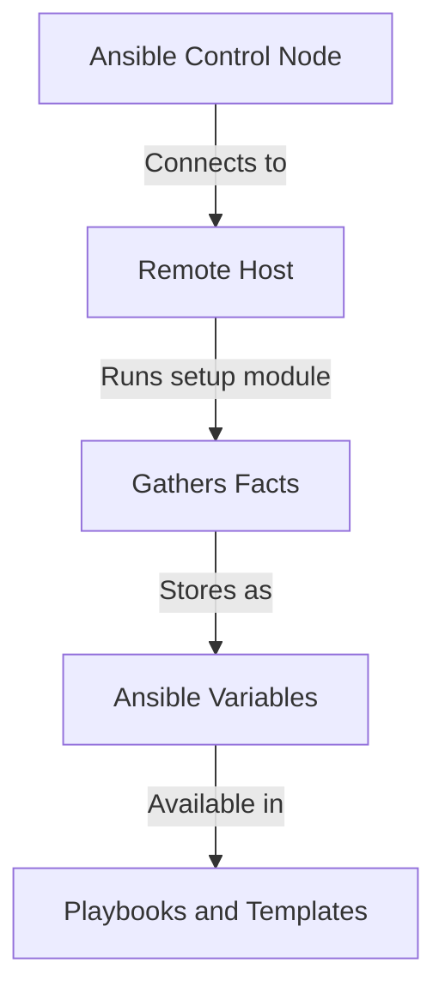

# Ansible Facts

## Introduction

Ansible Facts are pieces of information about remote systems that Ansible automatically discovers during playbook execution. These facts include a wide range of system details such as IP addresses, operating system information, hardware specifications, network configurations, and more. Facts provide a powerful way to make your playbooks adaptable and dynamic by allowing you to write conditional logic based on the target system's characteristics.

Think of Ansible Facts as a comprehensive system inventory that's automatically generated and made available to your playbooks without requiring any additional scripts or commands.

## How Ansible Facts Work

When Ansible connects to a remote host, it automatically runs a special module called `setup` that collects system information. This information is stored as variables that can be used throughout your playbooks.



## Viewing Ansible Facts

Before diving into using facts in playbooks, let's explore how to view the facts that Ansible collects about your systems.

### Using the setup module directly

You can use the `setup` module with the `ansible` command to view all facts:

```bash
ansible hostname -m setup
```

This command returns a large JSON structure containing all facts about the specified host. Here's a shortened example of what you might see:

```json
{
    "ansible_facts": {
        "ansible_architecture": "x86_64",
        "ansible_distribution": "Ubuntu",
        "ansible_distribution_major_version": "22",
        "ansible_distribution_release": "jammy",
        "ansible_distribution_version": "22.04",
        "ansible_hostname": "webserver01",
        "ansible_memtotal_mb": 8024,
        "ansible_processor_cores": 4,
        "ansible_interfaces": [
            "lo",
            "eth0"
        ],
        "ansible_eth0": {
            "ipv4": {
                "address": "192.168.1.100",
                "netmask": "255.255.255.0"
            }
        }
    }
}
```

### Filtering facts

You can filter facts to see only specific information using the `filter` parameter:

```bash
ansible hostname -m setup -a "filter=ansible_distribution*"
```

This command returns only facts that start with "ansible_distribution".

## Using Facts in Playbooks

Now that we understand what facts are and how to view them, let's explore how to use them in playbooks.

### Basic fact usage

Here's a simple playbook that uses facts to display information about the target system:

```yaml
---
- name: Display System Information
  hosts: all
  tasks:
    - name: Print system information
      debug:
        msg: "The system {{ ansible_hostname }} is running {{ ansible_distribution }} {{ ansible_distribution_version }}"
```

When executed, this playbook might output:

```
TASK [Print system information] *************************************************
ok: [webserver01] => {
    "msg": "The system webserver01 is running Ubuntu 22.04"
}
```

### Conditional tasks based on facts

One of the most powerful ways to use facts is to create conditional tasks that execute only on specific systems:

```yaml
---
- name: Install appropriate web server package
  hosts: webservers
  tasks:
    - name: Install Apache on Debian/Ubuntu
      apt:
        name: apache2
        state: present
      when: ansible_distribution in ['Debian', 'Ubuntu']

    - name: Install Apache on RHEL/CentOS
      yum:
        name: httpd
        state: present
      when: ansible_distribution in ['RedHat', 'CentOS', 'Fedora']
```

This playbook installs the appropriate web server package based on the Linux distribution of the target system.

### Using facts with templates

Facts are especially useful with Jinja2 templates:

```yaml
---
- name: Configure web server
  hosts: webservers
  tasks:
    - name: Create custom index.html
      template:
        src: index.html.j2
        dest: /var/www/html/index.html
```

And your template file (`index.html.j2`) might look like:

```html
<!DOCTYPE html>
<html>
<head>
    <title>System Information</title>
</head>
<body>
    <h1>Welcome to {{ ansible_hostname }}</h1>
    <p>This server is running {{ ansible_distribution }} {{ ansible_distribution_version }}</p>
    <p>It has {{ ansible_processor_cores }} CPU cores and {{ ansible_memtotal_mb }} MB of RAM</p>
</body>
</html>
```

## Creating Custom Facts

In addition to the built-in facts, Ansible allows you to create custom facts specific to your environment.

### Static custom facts

You can create static custom facts by placing files in the `/etc/ansible/facts.d` directory on the target host. These files can be in INI, JSON, or executable script formats.

Here's an example of a static custom fact in INI format (`/etc/ansible/facts.d/application.fact`):

```ini
[application]
name=inventory_app
version=1.2.3
env=production
```

### Dynamic custom facts

For dynamic custom facts, you can create executable scripts that output facts in JSON format. The script must be placed in the `/etc/ansible/facts.d` directory and have executable permissions.

Here's an example of a dynamic custom fact script (`/etc/ansible/facts.d/app_status.fact`):

```bash
#!/bin/bash
echo '{"application_status": "running", "last_updated": "'$(date +%s)'"}'
```

### Accessing custom facts

Custom facts are accessible under the `ansible_local` variable:

```yaml
---
- name: Use custom facts
  hosts: application_servers
  tasks:
    - name: Show application information
      debug:
        msg: "Running {{ ansible_local.application.name }} version {{ ansible_local.application.version }} in {{ ansible_local.application.env }} environment"
```

## Creating Facts in Playbooks

You can also set facts within a playbook using the `set_fact` module:

```yaml
---
- name: Set and use custom facts
  hosts: all
  tasks:
    - name: Set a fact based on another fact
      set_fact:
        is_ubuntu_server: "{{ ansible_distribution == 'Ubuntu' and ansible_distribution_version is version('20.04', '>=') }}"

    - name: Take action based on custom fact
      debug:
        msg: "This is a modern Ubuntu server supporting our application"
      when: is_ubuntu_server | bool
```

## Caching Facts

For large infrastructures, fact gathering can be time-consuming. Ansible provides fact caching to improve performance:

```yaml
# In ansible.cfg
[defaults]
fact_caching = jsonfile
fact_caching_connection = /path/to/cache/directory
fact_caching_timeout = 86400  # seconds (24 hours)
```

With this configuration, Ansible will cache facts for 24 hours before gathering them again.

## Disabling Fact Gathering

In some scenarios, you might want to disable fact gathering to improve playbook execution time:

```yaml
---
- name: Playbook without facts
  hosts: all
  gather_facts: no
  tasks:
    - name: Simple task that doesn't need facts
      debug:
        msg: "Facts gathering disabled for speed"
```

## Practical Examples

### Example 1: System Report Generation

This playbook creates a comprehensive system report using facts:

```yaml
---
- name: Generate System Report
  hosts: all
  tasks:
    - name: Create reports directory
      file:
        path: /tmp/system_reports
        state: directory
      delegate_to: localhost
      run_once: true

    - name: Generate system report
      template:
        src: system_report.j2
        dest: "/tmp/system_reports/{{ ansible_hostname }}_report.md"
      delegate_to: localhost
```

With a template file (`system_report.j2`):

```markdown
# System Report for {{ ansible_hostname }}

## System Information
- Hostname: {{ ansible_hostname }}
- FQDN: {{ ansible_fqdn }}
- Operating System: {{ ansible_distribution }} {{ ansible_distribution_version }}
- Kernel: {{ ansible_kernel }}
- Architecture: {{ ansible_architecture }}

## Hardware
- Processor: {{ ansible_processor[2] }}
- Processor Cores: {{ ansible_processor_cores }}
- Memory: {{ (ansible_memtotal_mb / 1024) | round(2) }} GB

## Network


### Interface: {{ interface }}

- IPv4 Address: {{ ansible_facts[interface].ipv4.address }}
- IPv4 Netmask: {{ ansible_facts[interface].ipv4.netmask }}




## Disk Usage

- Mount: {{ mount.mount }} ({{ mount.device }})
  - Size: {{ (mount.size_total / 1073741824) | round(2) }} GB
  - Used: {{ ((mount.size_total - mount.size_available) / 1073741824) | round(2) }} GB
  - Available: {{ (mount.size_available / 1073741824) | round(2) }} GB
  - Usage: {{ ((mount.size_total - mount.size_available) / mount.size_total * 100) | round(2) }}%

```

### Example 2: Dynamic Configuration Management

This playbook uses facts to configure a service differently based on system characteristics:

```yaml
---
- name: Configure application service
  hosts: app_servers
  vars:
    base_memory_mb: 512
  tasks:
    - name: Calculate optimal Java heap size
      set_fact:
        java_heap_size: "{{ (ansible_memtotal_mb * 0.6) | int }}m"
        java_heap_min: "{{ base_memory_mb }}m"

    - name: Create Java service configuration
      template:
        src: java_service.j2
        dest: /etc/sysconfig/java_app
```

With a template (`java_service.j2`):

```ini
# Generated by Ansible on {{ ansible_date_time.iso8601 }}
# System-specific optimal configuration

JAVA_OPTS="-Xms{{ java_heap_min }} -Xmx{{ java_heap_size }}"


PARALLEL_GC_THREADS={{ ansible_processor_cores }}

PARALLEL_GC_THREADS=2



RHEL_SPECIFIC_OPTION="enabled"

```

## Summary

Ansible Facts provide a powerful way to gather information about your infrastructure and use it to create dynamic, adaptable playbooks. By automatically discovering system details, facts allow you to write conditional logic, customize configurations, and make informed decisions about how tasks should be executed on different systems.

Key takeaways from this guide:

1. Facts are automatically collected when Ansible connects to remote hosts
2. Facts can be accessed as variables in playbooks and templates
3. You can create conditional tasks based on system characteristics
4. Custom facts can extend Ansible's built-in fact gathering
5. Fact caching can improve performance in large environments

By leveraging Ansible Facts effectively, you can create more intelligent automation that adapts to the specific needs of each system in your infrastructure.

## Additional Resources and Exercises

### Exercises

1. **Basic Fact Exploration**: Write a playbook that gathers facts from your servers and outputs the operating system, memory, and IP address information.

2. **Conditional Deployment**: Create a playbook that installs different packages depending on the distribution and version of the target system.

3. **Custom Fact Creation**: Write a custom fact that detects if a specific application is installed and make a playbook that uses this fact.

4. **System Capacity Planning**: Create a playbook that checks if systems meet minimum requirements (CPU, RAM, disk space) for an application deployment and reports systems that need upgrades.

### Further Learning

- Explore the complete list of available facts by running the `setup` module against different types of systems in your infrastructure.
- Learn how to combine facts with Jinja2 filters for advanced data manipulation in templates.
- Experiment with fact caching mechanisms to improve performance in large environments.