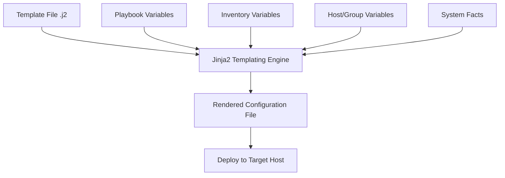

# Ansible Templates

## Introduction

Ansible Templates are a powerful feature that allows you to create dynamic configuration files based on variables and conditions. Instead of maintaining multiple versions of similar configuration files for different environments or servers, you can create a single template file and let Ansible generate the appropriate configuration based on the target system's facts and variables.

Ansible uses the [Jinja2](https://jinja.palletsprojects.com/) templating engine to render these templates. Jinja2 provides a rich set of features including variables, conditionals, loops, and filters that make your configuration management flexible and powerful.

## Understanding Jinja2 Templates

Jinja2 templates look like regular text files but contain placeholders and expressions that get replaced with values when the template is rendered. These placeholders and expressions are enclosed in specific delimiters:

- `{{ variable }}` - For expressions and variables
- `` - For control statements like loops and conditionals
- `{# comment #}` - For comments that aren't included in the rendered output

## Basic Template Usage

Let's start with a basic example. Suppose you want to create a configuration file for a web server that needs different settings based on the environment (development, staging, production).

First, create a template file with a `.j2` extension (which indicates it's a Jinja2 template):

```jinja
# server.conf.j2
server {
    listen {{ server_port }};
    server_name {{ server_name }};
    
    
    error_log /var/log/nginx/error.log warn;
    access_log /var/log/nginx/access.log main;
    
    error_log /var/log/nginx/error.log debug;
    access_log /var/log/nginx/access.log;
    
    
    root {{ document_root }};
}
```

Then, in your Ansible playbook, you can use the `template` module to apply this template:

```yaml
- name: Configure web server
  template:
    src: server.conf.j2
    dest: /etc/nginx/conf.d/server.conf
    owner: root
    group: root
    mode: '0644'
  vars:
    server_port: 80
    server_name: "example.com"
    environment: "production"
    document_root: "/var/www/html"
```

When Ansible runs this task, it will process the Jinja2 template with the provided variables and create a configuration file on the target server.

## Using Variables in Templates

You can use variables from various sources in your templates:

1. Variables defined in the playbook
2. Variables defined in inventory
3. Variables defined in group_vars or host_vars
4. Facts gathered from the target system

Here's an example showing different sources of variables:

```yaml
# playbook.yml
- hosts: webservers
  vars:
    app_name: "my_application"
  tasks:
    - name: Generate app configuration
      template:
        src: app_config.j2
        dest: "/opt/{{ app_name }}/config.ini"
```

```jinja
# app_config.j2
[server]
hostname={{ ansible_hostname }}
ipaddress={{ ansible_default_ipv4.address }}
app_name={{ app_name }}

[database]
db_host={{ hostvars['db_server']['ansible_hostname'] }}
db_port={{ db_port | default(5432) }}
```

## Conditionals in Templates

Jinja2 templates support conditionals that allow you to include or exclude sections based on certain conditions:

```jinja
# sshd_config.j2
# SSH Server Configuration

Port {{ ssh_port | default(22) }}


# Ubuntu specific settings
UsePAM yes
PasswordAuthentication no

# CentOS specific settings
UsePAM yes
PasswordAuthentication yes

# Default settings
UsePAM no
PasswordAuthentication yes


# Common settings for all distributions
PermitRootLogin no
X11Forwarding no
```

## Loops in Templates

You can use loops to generate repetitive sections in your configuration:

```jinja
# virtual_hosts.conf.j2
# Apache Virtual Hosts Configuration


<VirtualHost *:80>
    ServerName {{ vhost.domain }}
    
    ServerAlias {{ vhost.alias }}
    
    DocumentRoot {{ vhost.document_root }}
    
    <Directory {{ vhost.document_root }}>
        AllowOverride All
        Require all granted
    </Directory>
    
    ErrorLog ${APACHE_LOG_DIR}/{{ vhost.domain }}-error.log
    CustomLog ${APACHE_LOG_DIR}/{{ vhost.domain }}-access.log combined
</VirtualHost>

```

In your playbook:

```yaml
- name: Configure Apache virtual hosts
  template:
    src: virtual_hosts.conf.j2
    dest: /etc/apache2/sites-available/virtual_hosts.conf
  vars:
    virtual_hosts:
      - domain: example.com
        document_root: /var/www/example
      - domain: blog.example.com
        alias: www.blog.example.com
        document_root: /var/www/blog
```

## Filters in Templates

Jinja2 provides filters that allow you to transform data in your templates. Ansible extends these with additional useful filters:

```jinja
# user_configuration.j2
# User Access Configuration

admin_password: {{ admin_password | password_hash('sha512') }}

# List of authorized users
authorized_users:

  - name: {{ user.name | lower }}
    role: {{ user.role | default('user') | upper }}
    last_login: {{ user.last_login | default('never') }}


# System paths
paths:
  logs: {{ log_path | default('/var/log') | regex_replace('^/', '') }}
  data: {{ data_path | default('/opt/data') | basename }}
```

Common filters include:
- `default`: Provides a default value if the variable is undefined
- `upper`/`lower`: Converts text to uppercase or lowercase
- `basename`: Gets the filename from a path
- `to_yaml`/`to_json`: Converts data to YAML or JSON format
- `regex_replace`: Performs text substitution using regular expressions

## Template Inheritance and Includes

Jinja2 supports template inheritance and includes, which can help you organize and reuse template code:

```jinja
{# base.j2 #}
# Configuration File
# Generated by Ansible on {{ ansible_date_time.date }}


[general]
application={{ app_name }}
environment={{ environment }}
debug=false



# Custom settings go here

```

```jinja
{# app_config.j2 #}



[custom]
log_level={{ log_level | default('info') }}
max_connections={{ max_connections | default(100) }}
timeout={{ timeout | default(30) }}

```

You can also include other templates:

```jinja
{# main_config.j2 #}
# Main Configuration File



# Database Settings


# Cache Settings

```

## Practical Example: Creating a Complete Application Configuration

Let's look at a comprehensive example that brings together multiple template concepts. Consider a scenario where you're deploying a web application that needs different configurations for different environments:

```yaml
# playbook.yml
- hosts: app_servers
  vars:
    app_name: "my_webapp"
    app_version: "1.2.3"
  tasks:
    - name: Gather database credentials from vault
      include_vars:
        file: "vault/{{ environment }}_db_credentials.yml"
      
    - name: Generate application configuration
      template:
        src: app_config.j2
        dest: "/opt/{{ app_name }}/config.yml"
        owner: app
        group: app
        mode: '0640'
      notify: restart application
```

```jinja
# app_config.j2
---
# {{ app_name }} Configuration
# Environment: {{ environment }}
# Generated by Ansible on {{ ansible_date_time.iso8601 }}

application:
  name: {{ app_name }}
  version: {{ app_version }}
  environment: {{ environment }}
  debug: {{ 'true' if environment == 'development' else 'false' }}
  
server:
  host: {{ ansible_fqdn }}
  port: {{ app_port | default(8080) }}
  workers: {{ ansible_processor_vcpus * 2 }}
  max_requests: {{ max_requests | default(1000) }}
  
database:
  host: {{ db_host }}
  port: {{ db_port | default(5432) }}
  name: {{ db_name }}
  user: {{ db_user }}
  password: {{ db_password }}
  
logging:
  level: {{ 'DEBUG' if environment == 'development' else 'INFO' }}
  file: {{ log_file | default('/var/log/' + app_name + '.log') }}
  

cache:
  backend: {{ cache_backend | default('redis') }}
  host: {{ cache_host | default('localhost') }}
  port: {{ cache_port | default(6379) }}
  ttl: {{ cache_ttl | default(300) }}


allowed_hosts:

  - {{ host }}


features:

  {{ feature }}: {{ enabled | bool | lower }}

```

## Best Practices for Ansible Templates

1. **Use meaningful variable names**: Make your templates more readable with descriptive variable names.

2. **Provide default values**: Use the `default` filter to provide fallback values for optional variables.

```jinja
timeout={{ timeout | default(30) }}
```

3. **Comment your templates**: Add comments to explain complex logic or configurations.

```jinja
{# This section configures the database connection pool #}
```

4. **Validate templates**: Use `ansible-playbook --syntax-check` and template validation to catch errors before deployment.

5. **Use template directories**: Organize templates in subdirectories to keep your project structure clean.

6. **Handle sensitive data carefully**: Be careful with sensitive data in templates. Consider using Ansible Vault or external secret management.

7. **Add template headers**: Include headers with metadata about the template, such as when it was generated and by whom.

```jinja
# {{ filename }}
# Generated by Ansible on {{ ansible_date_time.date }}
# MANAGED FILE - DO NOT EDIT DIRECTLY
```

8. **Error handling**: Use conditional checks to provide graceful fallbacks for missing data.

```jinja

# Database configuration

# No database configuration provided

```

## Template Debugging

When working with complex templates, debugging can be challenging. Here are some tips:

1. **Debug variables with debug task**:

```yaml
- name: Debug variables
  debug:
    var: some_variable
```

2. **Use verbose output** with `-v` flag when running playbooks.

3. **Create a debug template** that outputs the variables:

```jinja
# debug.j2
---
# Debug Template

{{ key }}: {{ value }}

```

```yaml
- name: Generate debug output
  template:
    src: debug.j2
    dest: /tmp/ansible_debug.yml
  delegate_to: localhost
```

## Template Flow Control Diagram

Here's a diagram illustrating the template processing flow in Ansible:



## Summary

Ansible Templates with Jinja2 provide a powerful way to manage configuration files across different environments and servers. They allow you to:

- Create dynamic configurations based on variables and facts
- Use conditionals to adapt configurations to different circumstances
- Implement loops to handle repetitive configurations
- Transform data using filters
- Organize and reuse template code through inheritance and includes

By mastering templates, you can significantly reduce duplication in your configuration management and make your Ansible workflows more efficient and maintainable.

## Additional Resources and Exercises

### Resources
- [Official Ansible Templates Documentation](https://docs.ansible.com/ansible/latest/playbook_guide/playbooks_templating.html)
- [Jinja2 Documentation](https://jinja.palletsprojects.com/en/3.0.x/templates/)

### Exercises

1. **Basic Template**: Create a template for an NGINX configuration file that sets different worker processes based on the server's CPU count.

2. **Conditional Template**: Write a template for an SSH configuration that applies different security settings based on whether the server is public-facing or internal.

3. **Loop-based Template**: Create a template that generates a hosts file with entries for all servers in your inventory, grouped by their role.

4. **Advanced Template**: Develop a template for a complex application that includes database connections, cache settings, and environment-specific configurations.

5. **Template Inheritance**: Implement a base template with common settings and extend it for different application environments (development, staging, production).