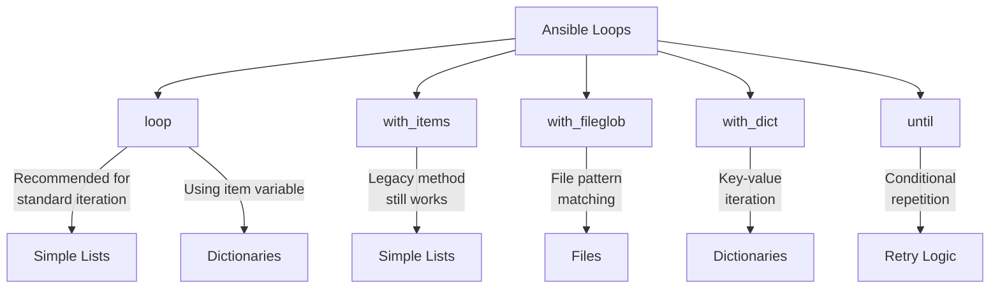

# Ansible Loops

## Introduction

When writing Ansible playbooks, you'll often need to perform the same task multiple times with different values. Rather than writing repetitive tasks, Ansible provides powerful looping mechanisms that allow you to iterate over collections of items, reducing code duplication and making your playbooks more maintainable.

In this guide, we'll explore various types of loops in Ansible, their syntax, and practical applications to help you write more efficient automation scripts.

## Basic Loops with `loop`

The `loop` keyword is the recommended way to create loops in Ansible. It allows you to iterate over a list of items and perform the same task for each item.

### Basic Syntax

```yaml
- name: Install required packages
  ansible.builtin.apt:
    name: "{{ item }}"
    state: present
  loop:
    - nginx
    - postgresql
    - python3
```

In this example, Ansible will install three packages: nginx, postgresql, and python3. The `item` variable automatically references the current value in each iteration.

### Output

When you run this playbook, you'll see output similar to:

```
TASK [Install required packages] ************************************************
changed: [server1] => (item=nginx)
changed: [server1] => (item=postgresql)
changed: [server1] => (item=python3)
```

## Looping Over Dictionaries

You can loop over dictionaries (key-value pairs) using either a list of dictionaries or the `dict2items` filter.

### Using a List of Dictionaries

```yaml
- name: Create user accounts
  ansible.builtin.user:
    name: "{{ item.name }}"
    groups: "{{ item.groups }}"
    shell: "{{ item.shell }}"
  loop:
    - { name: 'john', groups: 'admin', shell: '/bin/bash' }
    - { name: 'jane', groups: 'developers', shell: '/bin/zsh' }
    - { name: 'bob', groups: 'support', shell: '/bin/bash' }
```

### Using dict2items Filter

```yaml
- name: Create user accounts
  ansible.builtin.user:
    name: "{{ item.key }}"
    groups: "{{ item.value.groups }}"
    shell: "{{ item.value.shell }}"
  loop: "{{ users | dict2items }}"
  vars:
    users:
      john:
        groups: admin
        shell: /bin/bash
      jane:
        groups: developers
        shell: /bin/zsh
      bob:
        groups: support
        shell: /bin/bash
```

## Nested Loops with `loop_control`

For more complex scenarios, you might need nested loops. Ansible provides `loop_control` to manage nested loops and customize loop behavior.

```yaml
- name: Configure virtual hosts
  ansible.builtin.template:
    src: "vhost.conf.j2"
    dest: "/etc/nginx/sites-available/{{ item.0.domain }}"
  loop: "{{ domains|product(environments)|list }}"
  loop_control:
    label: "{{ item.0.domain }} - {{ item.1 }}"
  vars:
    domains:
      - { domain: 'example.com', root: '/var/www/example' }
      - { domain: 'test.com', root: '/var/www/test' }
    environments:
      - 'development'
      - 'staging'
      - 'production'
```

This will create virtual host configurations for each combination of domain and environment.

## Looping with Index Using `loop_control`

You can access the loop index using the `index_var` parameter:

```yaml
- name: Create sequentially numbered files
  ansible.builtin.copy:
    content: "This is file number {{ my_idx }}"
    dest: "/tmp/file{{ my_idx }}.txt"
  loop:
    - alpha
    - beta
    - gamma
  loop_control:
    index_var: my_idx
```

This will create three files numbered 0, 1, and 2.

## Looping Over Files with `with_fileglob`

To iterate over files matching a pattern:

```yaml
- name: Add configuration files
  ansible.builtin.copy:
    src: "{{ item }}"
    dest: "/etc/app/conf/"
  with_fileglob:
    - "files/*.conf"
```

This task will copy all `.conf` files from the `files` directory to `/etc/app/conf/`.

## Looping with Conditionals

You can combine loops with conditionals for more control:

```yaml
- name: Install packages based on OS
  ansible.builtin.package:
    name: "{{ item }}"
    state: present
  loop: "{{ packages }}"
  when: ansible_facts['os_family'] == 'Debian'
  vars:
    packages:
      - nginx
      - python3-pip
      - build-essential
```

## Loop Until a Condition is Met

Use `until` to repeat a task until a condition is satisfied:

```yaml
- name: Wait for application to start
  ansible.builtin.uri:
    url: http://localhost:8080/health
    status_code: 200
  register: result
  until: result.status == 200
  retries: 10
  delay: 5
```

This task will check the health endpoint up to 10 times, with 5 seconds between attempts, until it receives a 200 status code.

## Loop Comparison Chart

Here's a comparison of the different loop methods in Ansible:



## Real-World Example: Configuring a Web Farm

Let's see a practical example of using loops to configure a web server farm:

```yaml
---
- name: Configure Web Farm
  hosts: webservers
  become: yes
  vars:
    web_apps:
      - name: blog
        domain: blog.example.com
        repository: git@github.com:company/blog.git
        branch: main
        webroot: /var/www/blog
      - name: store
        domain: store.example.com
        repository: git@github.com:company/store.git
        branch: production
        webroot: /var/www/store
      - name: api
        domain: api.example.com
        repository: git@github.com:company/api.git
        branch: stable
        webroot: /var/www/api
  
  tasks:
    - name: Install required packages
      ansible.builtin.apt:
        name: "{{ item }}"
        state: present
        update_cache: yes
      loop:
        - nginx
        - git
        - python3-pip
    
    - name: Create application directories
      ansible.builtin.file:
        path: "{{ item.webroot }}"
        state: directory
        owner: www-data
        group: www-data
        mode: '0755'
      loop: "{{ web_apps }}"
    
    - name: Clone application repositories
      ansible.builtin.git:
        repo: "{{ item.repository }}"
        dest: "{{ item.webroot }}"
        version: "{{ item.branch }}"
      loop: "{{ web_apps }}"
    
    - name: Configure Nginx virtual hosts
      ansible.builtin.template:
        src: vhost.conf.j2
        dest: "/etc/nginx/sites-available/{{ item.domain }}"
      loop: "{{ web_apps }}"
    
    - name: Enable virtual hosts
      ansible.builtin.file:
        src: "/etc/nginx/sites-available/{{ item.domain }}"
        dest: "/etc/nginx/sites-enabled/{{ item.domain }}"
        state: link
      loop: "{{ web_apps }}"
      notify: Reload Nginx
  
  handlers:
    - name: Reload Nginx
      ansible.builtin.service:
        name: nginx
        state: reloaded
```

This playbook configures multiple web applications on a server farm using loops to avoid repetitive tasks.

## Common Loop Pitfalls and Best Practices

### Performance Considerations

When using loops, be mindful of performance:

- **Delegate to Localhost**: For tasks that don't need to run on all hosts, use `delegate_to: localhost` to run the task once.
- **Use `loop` Instead of `with_items`**: The `loop` directive is optimized for performance.
- **Avoid Large Loops**: Break large loops into smaller tasks or use asynchronous actions for long-running tasks.

### Handling Errors in Loops

To continue even when some iterations fail:

```yaml
- name: Install packages, ignoring errors
  ansible.builtin.apt:
    name: "{{ item }}"
    state: present
  loop:
    - nginx
    - nonexistent-package
    - postgresql
  ignore_errors: yes
```

### When to Avoid Loops

Not every repetitive task needs a loop. Consider alternatives:

- **Package Module with Lists**: Many modules accept lists directly.

```yaml
# Better approach - no loop needed
- name: Install packages efficiently
  ansible.builtin.apt:
    name:
      - nginx
      - postgresql
      - python3
    state: present
```

## Summary

Loops in Ansible are a powerful feature that allow you to:

- Perform repetitive tasks efficiently
- Iterate over lists, dictionaries, files, and other data structures
- Reduce code duplication and improve playbook maintainability
- Create dynamic configurations based on variables

By mastering loops, you'll be able to write more concise, powerful, and maintainable Ansible playbooks that can scale to manage even the most complex infrastructures.

## Additional Resources and Exercises

### Practice Exercises

1. Create a playbook that installs different packages based on the operating system using loops and conditionals.
2. Write a playbook that creates multiple users with different permissions using a loop over a dictionary.
3. Develop a playbook that configures multiple virtual hosts with different settings using nested loops.

### Resources for Further Learning

- [Ansible Documentation on Loops](https://docs.ansible.com/ansible/latest/user_guide/playbooks_loops.html)
- [Ansible Best Practices](https://docs.ansible.com/ansible/latest/user_guide/playbooks_best_practices.html)
- [Ansible Galaxy](https://galaxy.ansible.com/) for community roles and collections that demonstrate loop usage