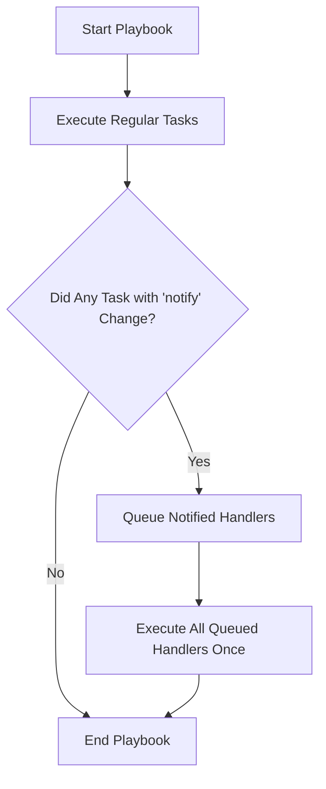

# Ansible Handlers

## Introduction

Handlers are a special type of task in Ansible that only run when triggered by a notification from another task. They're designed to respond to changes rather than running on every playbook execution. This makes handlers perfect for operations like restarting services or rebooting servers that should only happen when a configuration has actually changed.

Think of handlers as event-driven tasks - they remain dormant until explicitly notified, making your playbooks more efficient and preventing unnecessary service disruptions.

## Understanding Handlers

### What Are Handlers?

Handlers are tasks that only execute when notified by other tasks. They follow the same syntax as regular tasks but are defined in a separate `handlers` section of your playbook.

### Key Characteristics

- **Change-driven execution**: Handlers only run when triggered by a task that reports a "changed" status
- **Single execution**: Even if notified multiple times, a handler will only run once at the end of a play
- **Execution order**: Handlers always run at the end of a play after all tasks are complete
- **Conditional execution**: Helps prevent unnecessary service restarts or reboots

## Basic Handler Syntax

Here's a simple example of how to define a handler and notify it from a task:

```yaml
---
- name: Handler demonstration
  hosts: webservers
  tasks:
    - name: Copy Apache configuration file
      ansible.builtin.copy:
        src: files/httpd.conf
        dest: /etc/httpd/conf/httpd.conf
      notify: Restart Apache

  handlers:
    - name: Restart Apache
      ansible.builtin.service:
        name: httpd
        state: restarted
```

In this example:
1. We define a task that copies an Apache configuration file
2. The task includes a `notify` directive pointing to a handler called "Restart Apache"
3. The handler definition appears in the `handlers` section
4. The handler will only run if the configuration file was actually changed

## How Handlers Work

The workflow for handlers follows this pattern:



## Important Handler Behaviors

### 1. Handlers Run Only Once

If multiple tasks notify the same handler, it will still only run once at the end of the play. This prevents redundant operations like restarting a service multiple times.

```yaml
---
- name: Multiple notifications example
  hosts: webservers
  tasks:
    - name: Copy main config
      ansible.builtin.copy:
        src: files/main.conf
        dest: /etc/service/main.conf
      notify: Restart Service

    - name: Copy secondary config
      ansible.builtin.copy:
        src: files/secondary.conf
        dest: /etc/service/secondary.conf
      notify: Restart Service

  handlers:
    - name: Restart Service
      ansible.builtin.service:
        name: myservice
        state: restarted
```

Even if both copy tasks change and notify the handler, the service will only restart once.

### 2. Handler Names Must Match Exactly

The string in the `notify` directive must exactly match the handler name:

```yaml
tasks:
  - name: Update configuration
    ansible.builtin.template:
      src: template.j2
      dest: /etc/app/config.conf
    notify: "Restart application server"  # Must match the handler name exactly

handlers:
  - name: "Restart application server"    # Name must match what's in the notify
    ansible.builtin.service:
      name: app-server
      state: restarted
```

### 3. Handlers Run at the End of the Play

By default, all handlers run at the end of the play after all tasks complete. This means your service restarts happen at a predictable time.

## Forcing Handlers to Run

Sometimes you need handlers to run even if a later task fails. For this scenario, Ansible provides the `--force-handlers` command-line option or the `force_handlers: true` playbook directive:

```yaml
---
- name: Force handlers example
  hosts: webservers
  force_handlers: true
  tasks:
    - name: Copy config file
      ansible.builtin.copy:
        src: files/config.conf
        dest: /etc/service/config.conf
      notify: Restart Service
      
    - name: This task might fail
      ansible.builtin.command: /bin/false
      
  handlers:
    - name: Restart Service
      ansible.builtin.service:
        name: myservice
        state: restarted
```

With `force_handlers: true`, the "Restart Service" handler will run even if the second task fails.

## Using Handlers Across Roles and Includes

Handlers can be included from external files or roles:

```yaml
---
- name: Include handlers example
  hosts: webservers
  tasks:
    - name: Update nginx config
      ansible.builtin.template:
        src: nginx.conf.j2
        dest: /etc/nginx/nginx.conf
      notify: Restart nginx
  
  handlers:
    - name: Include handlers from external file
      ansible.builtin.import_tasks: handlers/service_handlers.yml
```

Where `handlers/service_handlers.yml` might contain:

```yaml
---
- name: Restart nginx
  ansible.builtin.service:
    name: nginx
    state: restarted
```

## Advanced Handler Techniques

### Running Handlers Mid-Play

If you need handlers to run before the end of the play, you can use the `meta: flush_handlers` task:

```yaml
---
- name: Flush handlers mid-play
  hosts: webservers
  tasks:
    - name: Update web configuration
      ansible.builtin.template:
        src: web.conf.j2
        dest: /etc/web/config.conf
      notify: Restart web service
    
    - name: Run handlers now instead of at end of play
      meta: flush_handlers
    
    - name: Continue with other tasks that require the service to be restarted
      ansible.builtin.debug:
        msg: "Continuing with other tasks..."
  
  handlers:
    - name: Restart web service
      ansible.builtin.service:
        name: web
        state: restarted
```

### Listen Directive

The `listen` directive allows multiple handlers to respond to a single notification:

```yaml
---
- name: Listen directive example
  hosts: webservers
  tasks:
    - name: Update multiple web configurations
      ansible.builtin.template:
        src: "{{ item.src }}"
        dest: "{{ item.dest }}"
      loop:
        - { src: 'nginx.conf.j2', dest: '/etc/nginx/nginx.conf' }
        - { src: 'app.conf.j2', dest: '/etc/nginx/conf.d/app.conf' }
      notify: "web configuration updated"
  
  handlers:
    - name: Restart Nginx
      ansible.builtin.service:
        name: nginx
        state: restarted
      listen: "web configuration updated"
    
    - name: Reload Application
      ansible.builtin.command: /usr/local/bin/app-reload
      listen: "web configuration updated"
```

In this example, both handlers will run when any task notifies "web configuration updated".

## Real-World Examples

### Example 1: Configuring and Managing a Web Server

```yaml
---
- name: Configure web server
  hosts: webservers
  tasks:
    - name: Install Nginx
      ansible.builtin.package:
        name: nginx
        state: present

    - name: Deploy Nginx configuration
      ansible.builtin.template:
        src: templates/nginx.conf.j2
        dest: /etc/nginx/nginx.conf
      notify: Restart Nginx

    - name: Deploy website content
      ansible.builtin.copy:
        src: files/website/
        dest: /var/www/html/
      notify: Reload Nginx

    - name: Ensure Nginx is running
      ansible.builtin.service:
        name: nginx
        state: started
        enabled: yes

  handlers:
    - name: Restart Nginx
      ansible.builtin.service:
        name: nginx
        state: restarted

    - name: Reload Nginx
      ansible.builtin.service:
        name: nginx
        state: reloaded
```

This playbook demonstrates:
- Different handlers for different needs (restart vs. reload)
- Proper notification based on the type of change made

### Example 2: Deploying a Database with Configuration Changes

```yaml
---
- name: Configure database server
  hosts: dbservers
  tasks:
    - name: Install PostgreSQL
      ansible.builtin.package:
        name: postgresql-server
        state: present

    - name: Initialize PostgreSQL database
      ansible.builtin.command: postgresql-setup initdb
      args:
        creates: /var/lib/pgsql/data/postgresql.conf
      notify: Start PostgreSQL first time

    - name: Configure PostgreSQL authentication
      ansible.builtin.template:
        src: templates/pg_hba.conf.j2
        dest: /var/lib/pgsql/data/pg_hba.conf
      notify: Restart PostgreSQL

    - name: Configure PostgreSQL settings
      ansible.builtin.template:
        src: templates/postgresql.conf.j2
        dest: /var/lib/pgsql/data/postgresql.conf
      notify: Restart PostgreSQL

    - name: Create application database
      ansible.builtin.postgresql_db:
        name: appdb
        state: present
      become: yes
      become_user: postgres
      notify: Run database migrations

  handlers:
    - name: Start PostgreSQL first time
      ansible.builtin.service:
        name: postgresql
        state: started
        enabled: yes

    - name: Restart PostgreSQL
      ansible.builtin.service:
        name: postgresql
        state: restarted

    - name: Run database migrations
      ansible.builtin.command: /usr/local/bin/db-migrate
      become: yes
      become_user: app_user
```

This example shows:
- Multiple handlers triggered by different tasks
- Order of operations controlled through the playbook structure
- Handlers used for initialization, restarting, and post-configuration tasks

## Common Patterns and Best Practices

### 1. Use Descriptive Handler Names

Name handlers according to what they do, not just the service they affect:

```yaml
# Good
handlers:
  - name: Reload Nginx configuration
    ansible.builtin.service:
      name: nginx
      state: reloaded

# Avoid
handlers:
  - name: Nginx
    ansible.builtin.service:
      name: nginx
      state: reloaded
```

### 2. Group Related Handlers

Group handlers for the same service together and use comments to clarify their purpose:

```yaml
handlers:
  # Apache handlers
  - name: Restart Apache
    ansible.builtin.service:
      name: httpd
      state: restarted

  - name: Reload Apache
    ansible.builtin.service:
      name: httpd
      state: reloaded

  # Database handlers
  - name: Restart MySQL
    ansible.builtin.service:
      name: mysql
      state: restarted
```

### 3. Use Reload Instead of Restart When Possible

Many services support reloading configuration without full restarts:

```yaml
- name: Update Nginx configuration
  ansible.builtin.template:
    src: nginx.conf.j2
    dest: /etc/nginx/nginx.conf
  notify: Reload Nginx  # Reload is less disruptive than restart

handlers:
  - name: Reload Nginx
    ansible.builtin.service:
      name: nginx
      state: reloaded
```

### 4. Use Handler Includes for Complex Playbooks

For large playbooks, organize handlers in separate files:

```yaml
# Main playbook.yml
handlers:
  - name: Include web handlers
    ansible.builtin.import_tasks: handlers/web_handlers.yml
  - name: Include db handlers
    ansible.builtin.import_tasks: handlers/db_handlers.yml
```

## Troubleshooting Handlers

### Handler Not Running?

Common issues and solutions:

1. **Task didn't report "changed"**: Handlers only run when their triggering task reports a change
   ```yaml
   # Add 'changed_when' if you need to force a change status
   - name: Custom command that doesn't report changes
     ansible.builtin.command: /usr/local/bin/update-config
     changed_when: true  # Force this task to always report changed
     notify: Restart Service
   ```

2. **Handler name mismatch**: Check that the handler name exactly matches the notify string
   ```yaml
   # These don't match!
   tasks:
     - name: Update config
       ansible.builtin.copy:
         src: config.conf
         dest: /etc/app/config.conf
       notify: restart app  # lowercase, no spaces
   
   handlers:
     - name: Restart App  # capitalized with space
       ansible.builtin.service:
         name: app
         state: restarted
   ```

3. **Play failed before handlers could run**: Use `force_handlers: true` to ensure handlers run even after failures

## Summary

Ansible handlers are a powerful feature that allows you to:

- Execute tasks only when changes occur
- Prevent redundant operations like multiple service restarts
- Structure your automation in a more efficient, event-driven manner
- Control when service disruptions happen during your deployment

By using handlers correctly, you can make your playbooks more efficient and reduce unnecessary service interruptions. They are especially valuable in production environments where minimizing downtime is critical.

## Additional Resources and Exercises

### Exercises

1. **Basic Handler Practice**: Create a playbook that deploys a configuration file and restarts a service only when the file changes.

2. **Multiple Notification Practice**: Write a playbook with multiple tasks that notify the same handler, and verify it only runs once.

3. **Handler Ordering Challenge**: Create a playbook with multiple handlers and use `meta: flush_handlers` to control when they execute.

4. **Listen Directive Exercise**: Use the `listen` directive to have multiple handlers respond to a single notification.

### Further Reading

- [Ansible Documentation on Handlers](https://docs.ansible.com/ansible/latest/playbook_guide/playbooks_handlers.html)
- [Ansible Best Practices Guide](https://docs.ansible.com/ansible/latest/tips_tricks/ansible_tips_tricks.html)
- [Red Hat's Ansible Playbook Best Practices](https://www.redhat.com/sysadmin/ansible-playbook-best-practices)