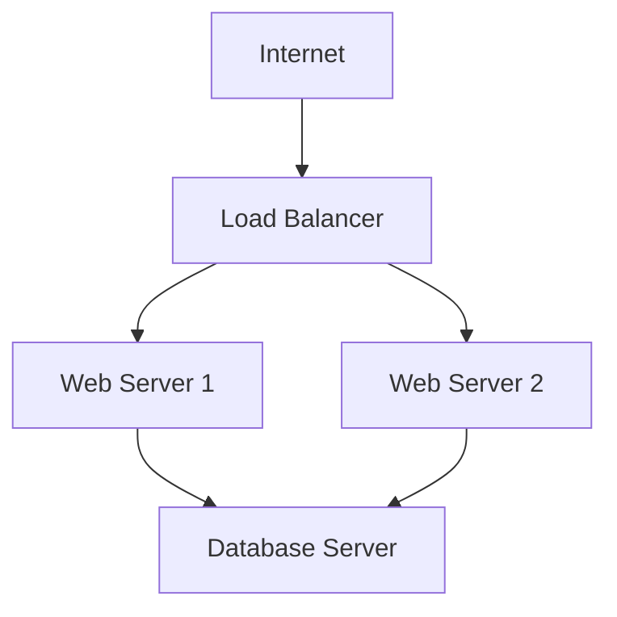

# Ansible Provisioning

## Introduction

Provisioning is the process of setting up the infrastructure resources needed for your applications to run. This includes creating virtual machines, configuring networks, setting up storage, and installing the necessary software. Ansible provides a powerful, agentless approach to provisioning that allows you to define your infrastructure as code, making it repeatable, reliable, and version-controlled.

In this guide, we'll explore how Ansible can be used for provisioning infrastructure resources, from simple virtual machines to complex multi-tier environments. We'll cover the core concepts, tools, and practical examples to help you get started with Ansible provisioning.

## What is Ansible Provisioning?

Ansible provisioning refers to using Ansible to automate the creation and configuration of infrastructure resources. Unlike traditional provisioning methods that might involve manual setup or complex scripts, Ansible uses declarative YAML files called "playbooks" to describe the desired state of your infrastructure.

### Key Benefits of Ansible Provisioning

- **Agentless Architecture**: No need to install agents on target systems
- **Idempotency**: Playbooks can be run multiple times without changing the result
- **Infrastructure as Code**: Infrastructure defined as code that can be version-controlled
- **Multi-platform Support**: Works across different cloud providers and on-premises infrastructure
- **Human-readable Syntax**: YAML-based configuration that's easy to understand

## Core Components for Provisioning

### Inventory Files

Inventory files define the hosts and groups of hosts upon which commands, modules, and tasks in a playbook operate. For provisioning, these often include cloud provider details.

```yaml
# inventory.yml
all:
  hosts:
    webserver:
      ansible_host: 192.168.1.10
  children:
    webservers:
      hosts:
        web1:
          ansible_host: 192.168.1.11
        web2:
          ansible_host: 192.168.1.12
    databases:
      hosts:
        db1:
          ansible_host: 192.168.1.20
```

### Dynamic Inventory

For cloud environments, Ansible provides dynamic inventory plugins that can query your cloud provider API to get an up-to-date list of instances.

```yaml
# aws_ec2.yml
plugin: aws_ec2
regions:
  - us-east-1
  - us-west-1
filters:
  tag:Environment: production
```

### Playbooks for Provisioning

Playbooks are YAML files that describe the tasks to be executed. For provisioning, these tasks might include creating VMs, configuring networks, or setting up security groups.

```yaml
# provision_webserver.yml
---
- name: Provision Web Servers
  hosts: localhost
  connection: local
  gather_facts: false
  
  tasks:
    - name: Create EC2 instance
      amazon.aws.ec2:
        key_name: my_key
        instance_type: t2.micro
        image: ami-123456
        wait: yes
        group: webserver
        count: 1
        vpc_subnet_id: subnet-123456
        assign_public_ip: yes
        region: us-east-1
        tags:
          Name: web-server
          Environment: production
      register: ec2
    
    - name: Add new instance to host group
      add_host:
        hostname: "{{ item.public_ip }}"
        groupname: launched
      loop: "{{ ec2.instances }}"
    
    - name: Wait for SSH to come up
      wait_for:
        host: "{{ item.public_ip }}"
        port: 22
        delay: 60
        timeout: 320
        state: started
      loop: "{{ ec2.instances }}"

- name: Configure Web Server
  hosts: launched
  become: true
  
  tasks:
    - name: Install Nginx
      apt:
        name: nginx
        state: present
        update_cache: yes
    
    - name: Start Nginx Service
      service:
        name: nginx
        state: started
        enabled: yes
```

### Modules for Different Providers

Ansible includes modules for various cloud providers, allowing you to provision resources across different platforms:

- **AWS**: `amazon.aws.ec2`, `amazon.aws.ec2_vpc_net`, etc.
- **Azure**: `azure.azcollection.azure_rm_virtualmachine`, etc.
- **Google Cloud**: `google.cloud.gcp_compute_instance`, etc.
- **VMware**: `community.vmware.vmware_guest`, etc.
- **OpenStack**: `openstack.cloud.server`, etc.

## Step-by-Step Guide to Provisioning with Ansible

### 1. Setting Up Your Environment

Before you start provisioning with Ansible, you need to set up your environment:

```bash
# Install Ansible
pip install ansible

# Install cloud provider Python dependencies
pip install boto3  # For AWS
pip install azure-cli  # For Azure
pip install google-auth  # For GCP

# Install required Ansible collections
ansible-galaxy collection install amazon.aws
ansible-galaxy collection install azure.azcollection
ansible-galaxy collection install google.cloud
```

### 2. Creating Configuration Files

Create an Ansible configuration file to set default behaviors:

```ini
# ansible.cfg
[defaults]
inventory = ./inventory
host_key_checking = False
deprecation_warnings = False
remote_user = ubuntu
private_key_file = ~/.ssh/my_key.pem

[inventory]
enable_plugins = aws_ec2
```

### 3. Define Your Infrastructure

Create YAML files that define the structure of your infrastructure. Here's a simplified example for provisioning a web server and database:

```yaml
# infrastructure.yml
---
- name: Provision Infrastructure
  hosts: localhost
  connection: local
  gather_facts: false
  vars:
    region: us-east-1
    vpc_id: vpc-123456
    web_subnet_id: subnet-123456
    db_subnet_id: subnet-789012
  
  tasks:
    - name: Create Security Group for Web Servers
      amazon.aws.ec2_security_group:
        name: web-sg
        description: Security group for web servers
        vpc_id: "{{ vpc_id }}"
        region: "{{ region }}"
        rules:
          - proto: tcp
            ports: 80
            cidr_ip: 0.0.0.0/0
          - proto: tcp
            ports: 22
            cidr_ip: 0.0.0.0/0
      register: web_sg
    
    - name: Create Security Group for Databases
      amazon.aws.ec2_security_group:
        name: db-sg
        description: Security group for databases
        vpc_id: "{{ vpc_id }}"
        region: "{{ region }}"
        rules:
          - proto: tcp
            ports: 3306
            group_id: "{{ web_sg.group_id }}"
          - proto: tcp
            ports: 22
            cidr_ip: 0.0.0.0/0
      register: db_sg
    
    - name: Launch Web Server
      amazon.aws.ec2:
        key_name: my_key
        instance_type: t2.micro
        image: ami-123456
        wait: yes
        group_id: "{{ web_sg.group_id }}"
        vpc_subnet_id: "{{ web_subnet_id }}"
        assign_public_ip: yes
        region: "{{ region }}"
        count: 2
        tags:
          Name: web-server
          Role: web
      register: web_instances
    
    - name: Launch Database Server
      amazon.aws.ec2:
        key_name: my_key
        instance_type: t2.medium
        image: ami-123456
        wait: yes
        group_id: "{{ db_sg.group_id }}"
        vpc_subnet_id: "{{ db_subnet_id }}"
        region: "{{ region }}"
        count: 1
        tags:
          Name: db-server
          Role: database
      register: db_instances
```

### 4. Run the Provisioning Playbook

Execute your playbook to start the provisioning process:

```bash
$ ansible-playbook infrastructure.yml

PLAY [Provision Infrastructure] *************************************************

TASK [Create Security Group for Web Servers] ***********************************
changed: [localhost]

TASK [Create Security Group for Databases] *************************************
changed: [localhost]

TASK [Launch Web Server] *******************************************************
changed: [localhost]

TASK [Launch Database Server] **************************************************
changed: [localhost]

PLAY RECAP *********************************************************************
localhost                  : ok=4    changed=4    unreachable=0    failed=0    skipped=0    rescued=0    ignored=0
```

### 5. Configure the Provisioned Resources

After provisioning your infrastructure, you can configure the instances with another playbook:

```yaml
# configure.yml
---
- name: Configure Web Servers
  hosts: tag_Role_web
  become: true
  
  tasks:
    - name: Install Nginx
      apt:
        name: nginx
        state: present
        update_cache: yes
    
    - name: Deploy Application Code
      git:
        repo: https://github.com/yourusername/webapp.git
        dest: /var/www/html
    
    - name: Start Nginx Service
      service:
        name: nginx
        state: started
        enabled: yes

- name: Configure Database Servers
  hosts: tag_Role_database
  become: true
  
  tasks:
    - name: Install MySQL
      apt:
        name: mysql-server
        state: present
        update_cache: yes
    
    - name: Start MySQL Service
      service:
        name: mysql
        state: started
        enabled: yes
    
    - name: Create Application Database
      mysql_db:
        name: webapp
        state: present
    
    - name: Create Database User
      mysql_user:
        name: webapp_user
        password: secure_password
        priv: 'webapp.*:ALL'
        host: '%'
        state: present
```

## Advanced Provisioning Techniques

### Using Ansible Roles

Roles provide a way to organize playbooks and reuse code. Here's how to structure a role for provisioning:

```
roles/
  aws_provisioning/
    tasks/
      main.yml           # Primary tasks for provisioning
      security_groups.yml  # Tasks for creating security groups
      instances.yml      # Tasks for creating instances
    vars/
      main.yml           # Default variables
    defaults/
      main.yml           # Default values that can be overridden
```

You can then use this role in your playbook:

```yaml
# main_playbook.yml
---
- name: Provision AWS Infrastructure
  hosts: localhost
  connection: local
  
  roles:
    - role: aws_provisioning
      vars:
        instance_type: t2.large
        instance_count: 3
```

### Using Ansible Galaxy Collections

Ansible Galaxy provides collections that extend Ansible's functionality for specific providers:

```yaml
# requirements.yml
collections:
  - name: amazon.aws
    version: 1.5.0
  - name: community.aws
    version: 2.0.0
```

Install the collections:

```bash
$ ansible-galaxy collection install -r requirements.yml
```

### Terraform with Ansible

For complex infrastructure, you might combine Terraform (for provisioning) with Ansible (for configuration):

```hcl
# main.tf
resource "aws_instance" "web" {
  count         = 2
  ami           = "ami-123456"
  instance_type = "t2.micro"
  
  provisioner "local-exec" {
    command = "ANSIBLE_HOST_KEY_CHECKING=False ansible-playbook -i '${self.public_ip},' configure_web.yml"
  }
}
```

## Real-World Example: Multi-Tier Application

Let's look at a complete example of provisioning a multi-tier application with a load balancer, web servers, and a database server:



### Step 1: Create the Base Infrastructure

```yaml
# provision_network.yml
---
- name: Provision Network Infrastructure
  hosts: localhost
  connection: local
  gather_facts: false
  
  tasks:
    - name: Create VPC
      amazon.aws.ec2_vpc_net:
        name: application-vpc
        cidr_block: 10.0.0.0/16
        region: us-east-1
        tags:
          Environment: production
      register: vpc
    
    - name: Create Internet Gateway
      amazon.aws.ec2_vpc_igw:
        vpc_id: "{{ vpc.vpc.id }}"
        region: us-east-1
        tags:
          Name: app-igw
      register: igw
    
    - name: Create Public Subnet for Load Balancer
      amazon.aws.ec2_vpc_subnet:
        vpc_id: "{{ vpc.vpc.id }}"
        cidr: 10.0.1.0/24
        az: us-east-1a
        region: us-east-1
        tags:
          Name: lb-subnet
      register: lb_subnet
    
    - name: Create Public Subnets for Web Servers
      amazon.aws.ec2_vpc_subnet:
        vpc_id: "{{ vpc.vpc.id }}"
        cidr: "10.0.{{ item }}.0/24"
        az: "us-east-1{{ item | chr(96 + item) }}"
        region: us-east-1
        tags:
          Name: web-subnet-{{ item }}
      register: web_subnets
      loop: [2, 3]
    
    - name: Create Private Subnet for Database
      amazon.aws.ec2_vpc_subnet:
        vpc_id: "{{ vpc.vpc.id }}"
        cidr: 10.0.4.0/24
        az: us-east-1c
        region: us-east-1
        tags:
          Name: db-subnet
      register: db_subnet
```

### Step 2: Provision Instances

```yaml
# provision_instances.yml
---
- name: Provision Application Instances
  hosts: localhost
  connection: local
  gather_facts: false
  vars:
    vpc_id: "{{ vpc_id }}"
    web_subnet_ids: ["{{ web_subnet_1_id }}", "{{ web_subnet_2_id }}"]
    db_subnet_id: "{{ db_subnet_id }}"
    region: us-east-1
  
  tasks:
    - name: Create Security Groups
      include_tasks: tasks/security_groups.yml
    
    - name: Create Load Balancer
      amazon.aws.elb_application_lb:
        name: app-load-balancer
        subnets: "{{ web_subnet_ids }}"
        security_groups: "{{ lb_sg.group_id }}"
        region: "{{ region }}"
        listeners:
          - Protocol: HTTP
            Port: 80
            DefaultActions:
              - Type: forward
                TargetGroupName: web-target-group
      register: lb
    
    - name: Launch Web Servers
      amazon.aws.ec2:
        key_name: my_key
        instance_type: t2.micro
        image: ami-123456
        wait: yes
        group_id: "{{ web_sg.group_id }}"
        vpc_subnet_id: "{{ item }}"
        assign_public_ip: yes
        region: "{{ region }}"
        count: 1
        tags:
          Name: web-server-{{ loop.index }}
          Role: web
      register: web_instances
      loop: "{{ web_subnet_ids }}"
    
    - name: Launch Database Server
      amazon.aws.ec2:
        key_name: my_key
        instance_type: t2.medium
        image: ami-123456
        wait: yes
        group_id: "{{ db_sg.group_id }}"
        vpc_subnet_id: "{{ db_subnet_id }}"
        region: "{{ region }}"
        count: 1
        tags:
          Name: db-server
          Role: database
      register: db_instance
    
    - name: Wait for instances to be available
      wait_for:
        host: "{{ item.public_ip }}"
        port: 22
        timeout: 300
      loop: "{{ web_instances.instances + db_instance.instances }}"
      when: item.public_ip is defined
```

### Step 3: Configure the Application

```yaml
# configure_application.yml
---
- name: Configure Web Servers
  hosts: tag_Role_web
  become: true
  
  tasks:
    - name: Install Web Server Dependencies
      apt:
        name:
          - nginx
          - php-fpm
          - php-mysql
        state: present
        update_cache: yes
    
    - name: Configure Nginx
      template:
        src: templates/nginx.conf.j2
        dest: /etc/nginx/sites-available/default
      notify: Restart Nginx
    
    - name: Deploy Application Code
      git:
        repo: https://github.com/yourusername/webapp.git
        dest: /var/www/html
    
    - name: Configure Application
      template:
        src: templates/config.php.j2
        dest: /var/www/html/config.php
      vars:
        db_host: "{{ hostvars[groups['tag_Role_database'][0]].private_ip }}"
        db_name: webapp
        db_user: webapp_user
        db_password: secure_password
  
  handlers:
    - name: Restart Nginx
      service:
        name: nginx
        state: restarted

- name: Configure Database Server
  hosts: tag_Role_database
  become: true
  
  tasks:
    - name: Install MySQL
      apt:
        name: mysql-server
        state: present
        update_cache: yes
    
    - name: Configure MySQL for Remote Access
      template:
        src: templates/mysql.conf.j2
        dest: /etc/mysql/mysql.conf.d/mysqld.cnf
      notify: Restart MySQL
    
    - name: Create Application Database
      mysql_db:
        name: webapp
        state: present
    
    - name: Import Initial Schema
      mysql_db:
        name: webapp
        state: import
        target: /tmp/schema.sql
      
    - name: Create Database User
      mysql_user:
        name: webapp_user
        password: secure_password
        priv: 'webapp.*:ALL'
        host: '%'
        state: present
  
  handlers:
    - name: Restart MySQL
      service:
        name: mysql
        state: restarted
```

## Best Practices for Ansible Provisioning

1. **Use Version Control**: Keep your Ansible playbooks and roles in a Git repository to track changes.

2. **Parameterize Your Playbooks**: Use variables to make your playbooks reusable across different environments.

3. **Organize with Roles**: Structure your Ansible code using roles for better organization and reusability.

4. **Secure Sensitive Data**: Use Ansible Vault to encrypt sensitive information like passwords and API keys.

5. **Test Before Production**: Always test your provisioning playbooks in a staging environment before applying to production.

6. **Use Tags**: Add tags to tasks for selective execution:

   ```yaml
   tasks:
     - name: Install Nginx
       apt:
         name: nginx
         state: present
       tags: [web, nginx]
   ```

7. **Handle Errors Gracefully**: Use blocks to handle errors and provide cleanup:

   ```yaml
   tasks:
     - name: Handle provisioning with error handling
       block:
         - name: Create EC2 instance
           amazon.aws.ec2:
             # parameters here
       rescue:
         - name: Notify on failure
           debug:
             msg: "Failed to provision instance"
       always:
         - name: Cleanup temporary files
           file:
             path: /tmp/ansible-tmp
             state: absent
   ```

8. **Dynamic Inventory**: Use dynamic inventory scripts or plugins to automatically fetch infrastructure information.

9. **Use Callbacks for Better Logging**: Configure callback plugins to get better logs of your provisioning process.

10. **Regular Maintenance**: Periodically review and update your Ansible playbooks to accommodate changes in cloud providers' APIs.

## Summary

Ansible provides a powerful and flexible approach to infrastructure provisioning. By defining your infrastructure as code using Ansible playbooks, you can create repeatable, version-controlled processes for setting up your environment across multiple platforms.

Key takeaways from this guide:

- Ansible allows for agentless provisioning of infrastructure resources
- Playbooks define the desired state of your infrastructure
- Ansible modules are available for all major cloud providers
- Roles and collections help organize and reuse provisioning code
- Combining with other tools like Terraform can create powerful automation workflows

By following the steps and examples in this guide, you should now have a solid foundation for provisioning infrastructure with Ansible and be ready to apply these concepts to your own projects.

## Additional Resources

### Further Learning

- [Ansible Documentation](https://docs.ansible.com)
- [Ansible for DevOps](https://www.ansiblefordevops.com/) - A book by Jeff Geerling
- [Ansible Up & Running](https://www.oreilly.com/library/view/ansible-up-and/9781491979792/) - O'Reilly Book

### Practice Exercises

1. **Basic Provisioning**: Create a playbook to provision a single web server on your cloud provider of choice.

2. **Multi-Environment Setup**: Extend your playbook to support both development and production environments with different configurations.

3. **Auto-Scaling Group**: Create a playbook that sets up an auto-scaling group with a load balancer.

4. **Multi-Cloud Deployment**: Create a playbook that can provision similar infrastructure across two different cloud providers.

5. **Disaster Recovery**: Design a provisioning solution that includes backup and recovery processes for your infrastructure.