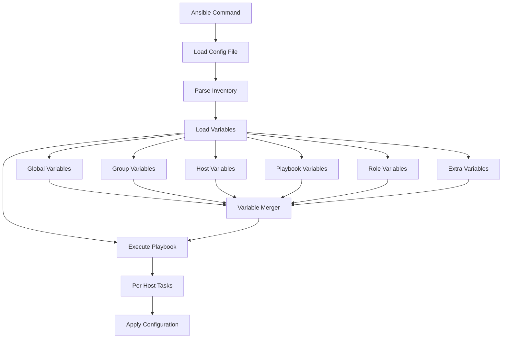

# Ansible Configuration Management

## Introduction

Configuration management is a cornerstone of modern IT infrastructure management, enabling consistent, predictable, and scalable system administration. Ansible excels in this space with its simple yet powerful approach to configuration management.

In this guide, we'll explore how Ansible handles configurations, from the global settings that control Ansible's behavior to the inventory files that define your infrastructure and the variables that make your playbooks flexible and reusable.

## Understanding Ansible Configuration Files

Ansible uses configuration files to define its behavior. When you run an Ansible command, it looks for configuration settings in multiple locations, following a specific order of precedence.

### Configuration File Locations

Ansible checks these locations in order:

1. `ANSIBLE_CONFIG` environment variable (if set)
2. `ansible.cfg` in the current directory
3. `~/.ansible.cfg` (in the user's home directory)
4. `/etc/ansible/ansible.cfg` (the global system-wide configuration)

The first file found is the one used, and all others are ignored.

### Creating a Basic Configuration File

Let's create a simple `ansible.cfg` file:

```ini
[defaults]
inventory = ./inventory
remote_user = ansible
host_key_checking = False
forks = 5

[privilege_escalation]
become = True
become_method = sudo
become_user = root
become_ask_pass = False
```

This configuration:
- Sets the inventory file location
- Defines the remote user as "ansible"
- Disables SSH host key checking (useful for testing environments)
- Limits concurrent connections to 5
- Enables privilege escalation using sudo

## Inventory Management

The inventory is where you define the hosts and groups that Ansible will manage.

### Basic Inventory File

Create a file named `inventory` with the following content:

```ini
[webservers]
web1.example.com
web2.example.com

[databases]
db1.example.com
db2.example.com

[development]
dev.example.com

[production]
web1.example.com
db1.example.com
```

This defines two types of servers (webservers and databases) and two environments (development and production).

### Dynamic Inventories

For larger environments, you can use dynamic inventories that generate the host list from external sources like cloud providers, CMDB systems, or custom scripts.

Here's a simple example of a dynamic inventory script in Python:

```python
#!/usr/bin/env python3

import json

inventory = {
    "webservers": {
        "hosts": ["web1.example.com", "web2.example.com"],
        "vars": {
            "http_port": 80
        }
    },
    "databases": {
        "hosts": ["db1.example.com", "db2.example.com"],
        "vars": {
            "db_port": 5432
        }
    },
    "_meta": {
        "hostvars": {
            "web1.example.com": {
                "ansible_host": "192.168.1.10"
            },
            "web2.example.com": {
                "ansible_host": "192.168.1.11"
            }
        }
    }
}

print(json.dumps(inventory))
```

Save this as `inventory.py`, make it executable with `chmod +x inventory.py`, and use it with:

```bash
ansible-playbook -i inventory.py playbook.yml
```

## Working with Variables

Variables make your Ansible playbooks flexible and reusable. There are multiple ways to define variables in Ansible.

### Variable Precedence

Ansible has a complex precedence system for variables. From lowest to highest precedence:

1. Command line values (e.g., `-e "user=example"`)
2. Role defaults (defined in role/defaults/main.yml)
3. Inventory file or script group vars
4. Playbook group vars
5. Inventory host vars
6. Playbook host vars
7. Host facts / cached set_facts
8. Play vars
9. Play vars_prompt
10. Play vars_files
11. Role and include vars
12. Block vars (only for tasks in block)
13. Task vars (only for the task)
14. Role (and include_role) params
15. Include params
16. Extra vars (always win precedence)

### Variable Files

Create group-specific variables in the `group_vars` directory:

```yaml
# group_vars/webservers.yml
http_port: 80
max_clients: 200
```

Create host-specific variables in the `host_vars` directory:

```yaml
# host_vars/web1.example.com.yml
http_port: 8080
backup_dir: /var/www/backup
```

### Using Variables in Playbooks

Here's how to use these variables in a playbook:

```yaml
---
- name: Configure web servers
  hosts: webservers
  vars:
    http_conf: httpd.conf
  tasks:
    - name: Write Apache configuration
      template:
        src: templates/httpd.conf.j2
        dest: /etc/httpd/conf/{{ http_conf }}
      notify: Restart Apache

  handlers:
    - name: Restart Apache
      service:
        name: httpd
        state: restarted
```

And the corresponding template (`templates/httpd.conf.j2`):

```jinja
# Apache Configuration
Listen {{ http_port }}
MaxClients {{ max_clients }}


# Backup directory is configured
BackupDirectory {{ backup_dir }}

```

## Practical Example: Complete Infrastructure Setup

Let's combine these concepts into a practical example that configures multiple server types.

### Directory Structure

```
ansible-project/
├── ansible.cfg
├── inventory
├── group_vars/
│   ├── webservers.yml
│   └── databases.yml
├── host_vars/
│   ├── web1.example.com.yml
│   └── db1.example.com.yml
├── templates/
│   ├── httpd.conf.j2
│   └── my.cnf.j2
└── site.yml
```

### Main Playbook (site.yml)

```yaml
---
- name: Configure all servers
  hosts: all
  tasks:
    - name: Install common packages
      package:
        name:
          - vim
          - htop
          - git
        state: present

- name: Configure web servers
  hosts: webservers
  tasks:
    - name: Install Apache
      package:
        name: httpd
        state: present
      
    - name: Deploy Apache configuration
      template:
        src: templates/httpd.conf.j2
        dest: /etc/httpd/conf/httpd.conf
      notify: Restart Apache

    - name: Ensure Apache is running
      service:
        name: httpd
        state: started
        enabled: yes

  handlers:
    - name: Restart Apache
      service:
        name: httpd
        state: restarted

- name: Configure database servers
  hosts: databases
  vars:
    mysql_root_password: "{{ vault_mysql_root_password }}"
  tasks:
    - name: Install MySQL
      package:
        name: mysql-server
        state: present
      
    - name: Deploy MySQL configuration
      template:
        src: templates/my.cnf.j2
        dest: /etc/my.cnf
      notify: Restart MySQL

    - name: Set MySQL root password
      mysql_user:
        name: root
        password: "{{ mysql_root_password }}"
        host_all: yes
        state: present
      no_log: true

    - name: Ensure MySQL is running
      service:
        name: mysqld
        state: started
        enabled: yes

  handlers:
    - name: Restart MySQL
      service:
        name: mysqld
        state: restarted
```

### Execution and Output

Running this playbook:

```bash
$ ansible-playbook site.yml

PLAY [Configure all servers] ************************************************

TASK [Install common packages] **********************************************
changed: [web1.example.com]
changed: [web2.example.com]
changed: [db1.example.com]
changed: [db2.example.com]

PLAY [Configure web servers] ***********************************************

TASK [Install Apache] *****************************************************
changed: [web1.example.com]
changed: [web2.example.com]

TASK [Deploy Apache configuration] *****************************************
changed: [web1.example.com]
changed: [web2.example.com]

TASK [Ensure Apache is running] *******************************************
changed: [web1.example.com]
changed: [web2.example.com]

PLAY [Configure database servers] *****************************************

TASK [Install MySQL] *****************************************************
changed: [db1.example.com]
changed: [db2.example.com]

TASK [Deploy MySQL configuration] ****************************************
changed: [db1.example.com]
changed: [db2.example.com]

TASK [Set MySQL root password] *******************************************
changed: [db1.example.com]
changed: [db2.example.com]

TASK [Ensure MySQL is running] ******************************************
changed: [db1.example.com]
changed: [db2.example.com]

PLAY RECAP ***************************************************************
web1.example.com : ok=7  changed=7  unreachable=0  failed=0
web2.example.com : ok=7  changed=7  unreachable=0  failed=0
db1.example.com  : ok=7  changed=7  unreachable=0  failed=0
db2.example.com  : ok=7  changed=7  unreachable=0  failed=0
```

## Advanced Configuration Techniques

### Using Vault for Sensitive Data

Ansible Vault encrypts sensitive variables:

```bash
# Create an encrypted file
ansible-vault create group_vars/all/vault.yml

# Edit an encrypted file
ansible-vault edit group_vars/all/vault.yml

# Run a playbook with vault
ansible-playbook site.yml --ask-vault-pass
```

Inside `vault.yml`, you can store sensitive information:

```yaml
vault_mysql_root_password: SuperSecretPassword123
```

### Using Roles

Roles provide a way to organize playbooks into modular, reusable components:

```
roles/
├── common/
│   ├── defaults/
│   │   └── main.yml
│   ├── tasks/
│   │   └── main.yml
│   └── templates/
│       └── ntp.conf.j2
├── webserver/
│   ├── defaults/
│   │   └── main.yml
│   ├── tasks/
│   │   ���── main.yml
│   └── templates/
│       └── httpd.conf.j2
└── database/
    ├── defaults/
    │   └── main.yml
    ├── tasks/
    │   └── main.yml
    └── templates/
        └── my.cnf.j2
```

Then, your playbook becomes much simpler:

```yaml
---
- name: Configure all servers
  hosts: all
  roles:
    - common

- name: Configure web servers
  hosts: webservers
  roles:
    - webserver

- name: Configure database servers
  hosts: databases
  roles:
    - database
```

### Configuration Flow Visualization



## Best Practices for Ansible Configuration

1. **Version Control**: Keep all Ansible configurations in version control
2. **Limit Access to Sensitive Data**: Use Ansible Vault for passwords and secrets
3. **Test in Development**: Always test changes in development before production
4. **Keep it Simple**: Start simple and add complexity only when needed
5. **Document Everything**: Comment your code and maintain documentation
6. **Use Tags**: Tag tasks for selective execution
7. **Idempotence**: Ensure playbooks can be run multiple times without issues
8. **Use Roles**: Organize your code into reusable roles
9. **Use Meaningful Names**: Name tasks, plays, and variables clearly
10. **Regular Updates**: Keep Ansible and modules up to date

## Summary

Ansible Configuration Management provides a powerful framework for managing infrastructure as code. By understanding the configuration hierarchy, inventory management, and variable system, you can create flexible, reusable automation for your entire IT infrastructure.

In this guide, we've covered:
- Ansible configuration files and their precedence
- Inventory management (static and dynamic)
- Variable management and precedence
- Practical examples for configuring different server types
- Advanced techniques like Ansible Vault and roles
- Best practices for Ansible configuration

## Additional Resources

1. **Practice Exercises**:
   - Create a playbook to configure a web server with a custom virtual host
   - Set up a dynamic inventory for your cloud provider
   - Refactor an existing playbook to use roles

2. **Recommended Reading**:
   - [Ansible Documentation](https://docs.ansible.com/)
   - "Ansible for DevOps" by Jeff Geerling
   - "Ansible: Up and Running" by Lorin Hochstein

3. **Community Resources**:
   - Ansible Galaxy for community-contributed roles
   - Ansible mailing lists and forums
   - Local DevOps and Ansible meetups