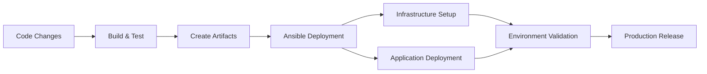

# Ansible Continuous Delivery

## Introduction

Continuous Delivery (CD) is a software engineering approach where teams produce software in short cycles, ensuring that code can be reliably released at any time. When combined with Ansible, an open-source automation tool, you can create powerful, repeatable deployment pipelines that reduce manual effort and minimize errors.

In this guide, we'll explore how to implement continuous delivery practices using Ansible, allowing you to automate the entire application deployment process from code changes to production release.

## Understanding Continuous Delivery with Ansible

Continuous Delivery extends beyond Continuous Integration (CI) by automating the delivery of applications to selected infrastructure environments. Ansible fits perfectly into this workflow because of its:

- **Agentless architecture**: No need to install agents on managed servers
- **Simple YAML syntax**: Easy to read and write automation scripts
- **Idempotent operations**: Safe to run playbooks multiple times
- **Extensive module library**: Built-in support for most infrastructure tasks

Let's visualize how Ansible fits into a typical CD pipeline:



## Setting Up Your Ansible CD Environment

### Prerequisites

Before implementing Ansible for continuous delivery, ensure you have:

- Ansible installed on your control node
- SSH access to target servers
- Version control system (like Git)
- A CI server (Jenkins, GitLab CI, or similar)

### Basic Directory Structure

A well-organized Ansible project structure is crucial for CD implementations:

```
ansible-cd-project/
├── inventory/
│   ├── production
│   ├── staging
│   └── development
├── playbooks/
│   ├── deploy.yml
│   ├── provision.yml
│   └── rollback.yml
├── roles/
│   ├── common/
│   ├── web/
│   ├── database/
│   └── monitoring/
├── group_vars/
│   ├── all.yml
│   ├── production.yml
│   └── staging.yml
└── ansible.cfg
```

## Creating a Basic Deployment Playbook

Let's create a simple deployment playbook that updates a web application:

```yaml
---
# deploy.yml
- name: Deploy web application
  hosts: webservers
  become: yes
  vars:
    app_version: "{{ lookup('env', 'APP_VERSION') | default('latest', true) }}"
    deploy_path: /var/www/myapp
    
  tasks:
    - name: Ensure deployment directory exists
      file:
        path: "{{ deploy_path }}"
        state: directory
        owner: www-data
        group: www-data
        mode: '0755'
        
    - name: Download application artifact
      get_url:
        url: "https://artifacts.example.com/myapp-{{ app_version }}.tar.gz"
        dest: "/tmp/myapp-{{ app_version }}.tar.gz"
        
    - name: Create backup of current version
      command: cp -r {{ deploy_path }} {{ deploy_path }}.bak
      args:
        creates: "{{ deploy_path }}.bak"
        
    - name: Extract application to deployment directory
      unarchive:
        src: "/tmp/myapp-{{ app_version }}.tar.gz"
        dest: "{{ deploy_path }}"
        remote_src: yes
        owner: www-data
        group: www-data
        
    - name: Update configuration files
      template:
        src: templates/config.j2
        dest: "{{ deploy_path }}/config.json"
        owner: www-data
        group: www-data
        
    - name: Restart web service
      service:
        name: nginx
        state: restarted
```

## Integrating with CI Systems

### Jenkins Integration Example

Here's how to call Ansible from a Jenkins pipeline:

```groovy
pipeline {
    agent any
    
    environment {
        APP_VERSION = "${env.BUILD_NUMBER}"
    }
    
    stages {
        stage('Build') {
            steps {
                // Build application code
                sh 'npm install && npm run build'
                
                // Create artifact
                sh "tar -czf myapp-${APP_VERSION}.tar.gz dist/"
            }
        }
        
        stage('Test') {
            steps {
                sh 'npm test'
            }
        }
        
        stage('Deploy to Staging') {
            steps {
                // Run Ansible playbook for staging deployment
                sh "ansible-playbook -i inventory/staging playbooks/deploy.yml -e app_version=${APP_VERSION}"
            }
        }
        
        stage('Run Acceptance Tests') {
            steps {
                sh 'npm run test:e2e'
            }
        }
        
        stage('Deploy to Production') {
            when {
                branch 'main'
            }
            steps {
                // Require manual approval
                input message: 'Deploy to production?'
                
                // Run Ansible playbook for production deployment
                sh "ansible-playbook -i inventory/production playbooks/deploy.yml -e app_version=${APP_VERSION}"
            }
        }
    }
    
    post {
        failure {
            // Rollback if needed
            sh "ansible-playbook -i inventory/staging playbooks/rollback.yml"
        }
    }
}
```

### GitLab CI Integration

Here's how to use Ansible with GitLab CI:

```yaml
stages:
  - build
  - test
  - deploy_staging
  - deploy_production

variables:
  APP_VERSION: $CI_PIPELINE_ID

build:
  stage: build
  script:
    - npm install
    - npm run build
    - tar -czf myapp-$APP_VERSION.tar.gz dist/
  artifacts:
    paths:
      - myapp-$APP_VERSION.tar.gz

test:
  stage: test
  script:
    - npm test

deploy_staging:
  stage: deploy_staging
  script:
    - ansible-playbook -i inventory/staging playbooks/deploy.yml -e app_version=$APP_VERSION
  environment:
    name: staging
    url: https://staging.example.com

deploy_production:
  stage: deploy_production
  script:
    - ansible-playbook -i inventory/production playbooks/deploy.yml -e app_version=$APP_VERSION
  environment:
    name: production
    url: https://production.example.com
  when: manual
  only:
    - main
```

## Advanced Ansible CD Techniques

### Role-Based Deployments

For more complex applications, use roles to organize your deployment logic:

```yaml
---
# deploy.yml using roles
- name: Deploy full application stack
  hosts: all
  become: yes
  
  roles:
    - { role: common, tags: ['common'] }
    - { role: database, tags: ['database'], when: "'database_servers' in group_names" }
    - { role: web, tags: ['web'], when: "'web_servers' in group_names" }
    - { role: cache, tags: ['cache'], when: "'cache_servers' in group_names" }
    - { role: monitoring, tags: ['monitoring'] }
```

### Implementing Rolling Deployments

To achieve zero-downtime deployments:

```yaml
---
# rolling_deploy.yml
- name: Perform rolling deployment
  hosts: webservers
  serial: 1  # Update one server at a time
  max_fail_percentage: 25
  become: yes
  
  pre_tasks:
    - name: Remove server from load balancer
      delegate_to: "{{ groups['loadbalancer'][0] }}"
      shell: "remove_from_lb.sh {{ inventory_hostname }}"
      
  roles:
    - web_app
    
  post_tasks:
    - name: Add server back to load balancer
      delegate_to: "{{ groups['loadbalancer'][0] }}"
      shell: "add_to_lb.sh {{ inventory_hostname }}"
      
    - name: Wait for server to be healthy
      uri:
        url: "http://{{ inventory_hostname }}/health"
        status_code: 200
      register: health_check
      until: health_check.status == 200
      retries: 5
      delay: 10
```

### Creating Rollback Strategies

Always prepare for failure with a robust rollback plan:

```yaml
---
# rollback.yml
- name: Rollback application deployment
  hosts: webservers
  become: yes
  vars:
    deploy_path: /var/www/myapp
    
  tasks:
    - name: Check if backup exists
      stat:
        path: "{{ deploy_path }}.bak"
      register: backup_exists
      
    - name: Restore from backup
      command: mv {{ deploy_path }}.bak {{ deploy_path }}
      when: backup_exists.stat.exists
      
    - name: Restart web service
      service:
        name: nginx
        state: restarted
      when: backup_exists.stat.exists
      
    - name: Notify if no backup exists
      debug:
        msg: "No backup found at {{ deploy_path }}.bak"
      when: not backup_exists.stat.exists
```

## Implementing Environment-Specific Configurations

Use Ansible's variable system to manage different environments:

```yaml
# group_vars/all.yml - Common variables
---
app_name: myapp
base_deploy_path: /var/www
health_check_path: /health
```

```yaml
# group_vars/production.yml - Production-specific variables
---
app_domain: myapp.example.com
db_host: prod-db.example.com
cache_servers:
  - prod-cache-01.example.com
  - prod-cache-02.example.com
min_instances: 3
```

```yaml
# group_vars/staging.yml - Staging-specific variables
---
app_domain: staging-myapp.example.com
db_host: staging-db.example.com
cache_servers:
  - staging-cache.example.com
min_instances: 1
```

Then reference these variables in your templates:

```yaml
# templates/nginx.conf.j2
server {
    listen 80;
    server_name {{ app_domain }};
    
    location / {
        proxy_pass http://localhost:3000;
        proxy_set_header Host $host;
    }
    
    location /health {
        return 200 'OK';
    }
}
```

## Testing Your Ansible CD Pipeline

### Creating Test Playbooks

Implement testing playbooks to verify your deployment:

```yaml
---
# test.yml
- name: Verify deployment
  hosts: webservers
  gather_facts: no
  become: no
  
  tasks:
    - name: Check if application is responding
      uri:
        url: "http://{{ inventory_hostname }}/health"
        status_code: 200
      register: health_result
      failed_when: health_result.status != 200
      
    - name: Verify database connection
      command: curl -s http://{{ inventory_hostname }}/api/db-check
      register: db_check
      failed_when: '"Connected" not in db_check.stdout'
      
    - name: Check application version
      command: curl -s http://{{ inventory_hostname }}/api/version
      register: version_check
      failed_when: app_version not in version_check.stdout
```

### Testing with Molecule

For testing Ansible roles themselves, use Molecule:

```yaml
---
# molecule/default/molecule.yml
dependency:
  name: galaxy
driver:
  name: docker
platforms:
  - name: instance
    image: geerlingguy/docker-debian10-ansible:latest
    pre_build_image: true
provisioner:
  name: ansible
verifier:
  name: ansible
```

## Best Practices for Ansible CD

1. **Use version control for everything**: Store all Ansible code in a Git repository
2. **Keep secrets secure**: Use Ansible Vault to encrypt sensitive data
3. **Validate playbooks before running**:
   ```bash
   ansible-playbook playbook.yml --syntax-check
   ansible-lint playbook.yml
   ```
4. **Use tags for selective execution**:
   ```bash
   ansible-playbook playbook.yml --tags "config,service"
   ```
5. **Implement idempotent tasks**: Ensure playbooks can be run multiple times safely
6. **Document everything**: Include comments in playbooks and README files
7. **Use dynamic inventories**: Connect to cloud providers for auto-updating server lists

## Real-World Example: Full-Stack Application Deployment

Let's see a complete example deploying a Node.js application with MongoDB:

```yaml
---
# deploy_fullstack.yml
- name: Deploy database servers
  hosts: database_servers
  become: yes
  roles:
    - mongodb
  tags:
    - database

- name: Deploy cache layer
  hosts: cache_servers
  become: yes
  roles:
    - redis
  tags:
    - cache

- name: Deploy application backend
  hosts: app_servers
  become: yes
  vars:
    app_version: "{{ lookup('env', 'APP_VERSION') }}"
  roles:
    - nodejs
    - app_backend
  tags:
    - backend

- name: Deploy web frontend
  hosts: web_servers
  become: yes
  vars:
    app_version: "{{ lookup('env', 'APP_VERSION') }}"
  roles:
    - nginx
    - app_frontend
  tags:
    - frontend

- name: Configure load balancer
  hosts: load_balancers
  become: yes
  roles:
    - haproxy
  tags:
    - loadbalancer

- name: Verify full deployment
  hosts: load_balancers
  tasks:
    - name: Check application health
      uri:
        url: "https://{{ app_domain }}/health"
        status_code: 200
      register: health_check
      retries: 5
      delay: 10
      until: health_check.status == 200
```

## Summary

Ansible provides a powerful framework for implementing continuous delivery pipelines. By combining infrastructure as code, automated deployments, and pipeline integration, you can deliver applications more reliably and with less manual effort.

Key takeaways:
- Ansible's simple syntax and agentless architecture make it ideal for CD implementations
- Structuring projects with roles and inventories improves scalability
- Environment-specific variables enable clean multi-environment deployments
- Integrating with CI systems creates end-to-end automation
- Rolling deployments and proper rollback strategies ensure reliability

## Further Learning Resources

- Advanced Ansible playbook techniques
- Infrastructure testing strategies with Molecule
- Implementing blue-green deployments
- Ansible Tower/AWX for enterprise CD pipelines
- Containerized deployments with Ansible and Docker

## Exercises

1. Create a simple CD pipeline that deploys a static website using Ansible
2. Extend the pipeline to include a database deployment
3. Implement environment-specific configurations for development and production
4. Add a rollback mechanism to your deployment process
5. Integrate your Ansible playbooks with a CI system of your choice