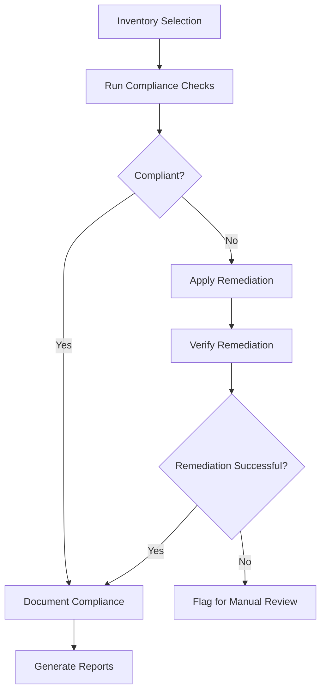

# Ansible Compliance Automation

## Introduction

In today's rapidly evolving IT landscape, maintaining compliance with security standards and regulatory requirements is a critical challenge for organizations. Manual compliance checks are time-consuming, error-prone, and difficult to scale across large infrastructures. This is where **Ansible Compliance Automation** comes into play.

Ansible Compliance Automation leverages Ansible's infrastructure-as-code approach to systematically verify and enforce compliance requirements across your entire environment. By automating compliance processes, you can consistently apply security standards, quickly identify and remediate issues, and generate evidence for auditing purposes—all while reducing the operational burden on your team.

## Why Automate Compliance with Ansible?

Ansible offers several advantages for compliance automation:

- **Idempotent execution**: Run checks repeatedly without changing system state unnecessarily
- **Agentless architecture**: No need to install additional software on target systems
- **Declarative language**: Define the desired state rather than specific commands
- **Extensive module library**: Ready-made modules for common compliance tasks
- **Playbook reusability**: Create compliance checks once and apply them consistently

## Getting Started with Ansible Compliance Automation

Let's explore how to implement compliance automation using Ansible through practical examples and explanations.

### Prerequisites

Before diving into compliance automation, ensure you have:

1. Ansible installed (version 2.9+)
2. SSH access to target systems
3. Basic understanding of YAML syntax
4. Familiarity with compliance requirements applicable to your environment

### Basic Compliance Playbook Structure

A compliance automation playbook typically consists of three main components:

1. **Check tasks**: Verify if systems meet compliance requirements
2. **Remediation tasks**: Fix non-compliant configurations
3. **Reporting tasks**: Document compliance status and actions taken

Let's visualize this workflow:



## Building Your First Compliance Playbook

Let's create a simple playbook that checks and enforces password policies on Linux systems:

```yaml
---
- name: Password Policy Compliance
  hosts: all
  become: true
  vars:
    min_password_length: 12
    password_max_days: 90
    
  tasks:
    # Check current password policy
    - name: Check password minimum length
      command: grep "^PASS_MIN_LEN" /etc/login.defs
      register: min_len_check
      changed_when: false
      failed_when: false
      
    - name: Check password expiration policy
      command: grep "^PASS_MAX_DAYS" /etc/login.defs
      register: max_days_check
      changed_when: false
      failed_when: false
      
    # Set compliance status
    - name: Set compliance status facts
      set_fact:
        min_length_compliant: "{{ min_len_check.stdout.split()[1]|int >= min_password_length if min_len_check.rc == 0 else false }}"
        max_days_compliant: "{{ max_days_check.stdout.split()[1]|int <= password_max_days if max_days_check.rc == 0 else false }}"
        
    # Remediation tasks
    - name: Remediate minimum password length
      lineinfile:
        path: /etc/login.defs
        regexp: '^PASS_MIN_LEN'
        line: "PASS_MIN_LEN {{ min_password_length }}"
      when: not min_length_compliant
      
    - name: Remediate password expiration policy
      lineinfile:
        path: /etc/login.defs
        regexp: '^PASS_MAX_DAYS'
        line: "PASS_MAX_DAYS {{ password_max_days }}"
      when: not max_days_compliant
      
    # Reporting
    - name: Report compliance status
      debug:
        msg:
          - "Password minimum length: {{ 'COMPLIANT' if min_length_compliant else 'NON-COMPLIANT - Remediated' }}"
          - "Password expiration: {{ 'COMPLIANT' if max_days_compliant else 'NON-COMPLIANT - Remediated' }}"
```

### Running Your Compliance Playbook

To execute the playbook against your infrastructure:

```bash
ansible-playbook password_compliance.yml -i inventory.ini
```

### Sample Output:

```
PLAY [Password Policy Compliance] ***********************************

TASK [Gathering Facts] **********************************************
ok: [server1.example.com]

TASK [Check password minimum length] ********************************
ok: [server1.example.com]

TASK [Check password expiration policy] *****************************
ok: [server1.example.com]

TASK [Set compliance status facts] **********************************
ok: [server1.example.com]

TASK [Remediate minimum password length] ****************************
changed: [server1.example.com]

TASK [Remediate password expiration policy] *************************
ok: [server1.example.com]

TASK [Report compliance status] *************************************
ok: [server1.example.com] => {
    "msg": [
        "Password minimum length: NON-COMPLIANT - Remediated",
        "Password expiration: COMPLIANT"
    ]
}

PLAY RECAP **********************************************************
server1.example.com : ok=7    changed=1    unreachable=0    failed=0
```

## Advanced Compliance Automation Techniques

As you become more comfortable with basic compliance automation, you can implement more sophisticated techniques:

### Compliance Roles for Reusability

Instead of monolithic playbooks, organize compliance checks into reusable roles:

```
roles/
├── compliance/
│   ├── ssh-security/
│   │   ├── tasks/
│   │   │   ├── main.yml
│   │   │   ├── check.yml
│   │   │   └── remediate.yml
│   │   └── vars/
│   │       └── main.yml
│   ├── password-policy/
│   │   └── ...
│   └── file-permissions/
│       └── ...
```

Then use a main playbook to include the relevant roles:

```yaml
---
- name: System Compliance Check
  hosts: all
  become: true
  
  roles:
    - role: compliance/ssh-security
      tags: [security, ssh]
    - role: compliance/password-policy
      tags: [security, passwords]
    - role: compliance/file-permissions
      tags: [security, files]
```

### Conditional Remediation

Provide options for check-only mode versus automated remediation:

```yaml
---
- name: File Permissions Compliance
  hosts: all
  become: true
  vars:
    remediate: false  # Set to true to apply fixes
  
  tasks:
    - name: Check permissions on sensitive files
      stat:
        path: "{{ item }}"
      loop:
        - /etc/passwd
        - /etc/shadow
        - /etc/ssh/sshd_config
      register: file_perms
      
    - name: Identify non-compliant permissions
      set_fact:
        noncompliant_files: "{{ noncompliant_files|default([]) + [item.item] }}"
      loop: "{{ file_perms.results }}"
      when: item.stat.mode != '0600' and item.item == '/etc/ssh/sshd_config' or
            item.stat.mode != '0644' and item.item == '/etc/passwd' or
            item.stat.mode != '0400' and item.item == '/etc/shadow'
      
    - name: Fix permissions on /etc/passwd
      file:
        path: /etc/passwd
        mode: '0644'
      when: remediate and '/etc/passwd' in noncompliant_files
      
    - name: Fix permissions on /etc/shadow
      file:
        path: /etc/shadow
        mode: '0400'
      when: remediate and '/etc/shadow' in noncompliant_files
      
    - name: Fix permissions on /etc/ssh/sshd_config
      file:
        path: /etc/ssh/sshd_config
        mode: '0600'
      when: remediate and '/etc/ssh/sshd_config' in noncompliant_files
```

### Generating Compliance Reports

Compliance automation becomes even more valuable when it produces evidence for audits:

```yaml
---
- name: Generate Compliance Reports
  hosts: all
  become: true
  vars:
    report_dir: /var/log/compliance
    
  tasks:
    - name: Ensure report directory exists
      file:
        path: "{{ report_dir }}"
        state: directory
        mode: '0750'
      delegate_to: localhost
      become: false
      
    - name: Collect compliance data
      include_role:
        name: compliance/collect-data
      
    - name: Generate JSON report
      template:
        src: templates/compliance_report.json.j2
        dest: "{{ report_dir }}/{{ inventory_hostname }}-compliance-{{ ansible_date_time.date }}.json"
      delegate_to: localhost
      become: false
      
    - name: Convert JSON to HTML report
      command: "python3 scripts/json_to_html.py {{ report_dir }}/{{ inventory_hostname }}-compliance-{{ ansible_date_time.date }}.json"
      delegate_to: localhost
      become: false
```

## Real-World Example: CIS Benchmark Automation

Let's look at a practical example of implementing a subset of Center for Internet Security (CIS) benchmarks for Linux servers:

```yaml
---
- name: CIS Benchmark Compliance
  hosts: linux_servers
  become: true
  vars:
    cis_level: 1  # Level 1 or 2
    
  tasks:
    # 1.1.1 Ensure mounting of cramfs filesystems is disabled
    - name: 1.1.1 Check if cramfs is loaded
      command: lsmod | grep cramfs
      register: cramfs_loaded
      changed_when: false
      failed_when: false
      
    - name: 1.1.1 Disable cramfs in modprobe
      lineinfile:
        path: /etc/modprobe.d/CIS.conf
        line: "install cramfs /bin/true"
        create: true
        mode: '0644'
      when: cramfs_loaded.rc == 0
      
    # 1.1.2 Ensure mounting of freevxfs filesystems is disabled
    - name: 1.1.2 Check if freevxfs is loaded
      command: lsmod | grep freevxfs
      register: freevxfs_loaded
      changed_when: false
      failed_when: false
      
    - name: 1.1.2 Disable freevxfs in modprobe
      lineinfile:
        path: /etc/modprobe.d/CIS.conf
        line: "install freevxfs /bin/true"
        create: true
        mode: '0644'
      when: freevxfs_loaded.rc == 0
      
    # 5.2.1 Ensure SSH Protocol is set to 2
    - name: 5.2.1 Check SSH Protocol setting
      command: grep "^Protocol" /etc/ssh/sshd_config
      register: ssh_protocol
      changed_when: false
      failed_when: false
      
    - name: 5.2.1 Set SSH Protocol to 2
      lineinfile:
        path: /etc/ssh/sshd_config
        regexp: '^Protocol'
        line: 'Protocol 2'
      when: ssh_protocol.rc != 0 or 'Protocol 2' not in ssh_protocol.stdout
      notify: Restart SSH
      
  handlers:
    - name: Restart SSH
      service:
        name: "{{ 'sshd' if ansible_os_family == 'RedHat' else 'ssh' }}"
        state: restarted
```

To run only specific checks, use tags:

```bash
ansible-playbook cis_benchmarks.yml --tags="ssh,filesystem"
```

## Integrating with Compliance Tools

Ansible can integrate with specialized compliance tools for enhanced capabilities:

### OpenSCAP Integration

The Security Content Automation Protocol (SCAP) is a standardized approach for maintaining system security. Ansible can automate OpenSCAP scans:

```yaml
---
- name: Run OpenSCAP Compliance Scan
  hosts: all
  become: true
  vars:
    profile: xccdf_org.ssgproject.content_profile_pci-dss
    
  tasks:
    - name: Ensure OpenSCAP scanner is installed
      package:
        name: 
          - openscap-scanner
          - scap-security-guide
        state: present
          
    - name: Run OpenSCAP scan
      command: >
        oscap xccdf eval 
        --profile {{ profile }} 
        --results /tmp/scap-results.xml 
        --report /tmp/scap-report.html 
        /usr/share/xml/scap/ssg/content/ssg-rhel7-ds.xml
      when: ansible_distribution == 'RedHat' and ansible_distribution_major_version == '7'
      register: oscap_results
      changed_when: false
      
    - name: Fetch SCAP results
      fetch:
        src: /tmp/scap-report.html
        dest: "reports/{{ inventory_hostname }}-scap-report.html"
        flat: yes
```

### InSpec Integration

Chef InSpec is a compliance as code framework. You can trigger InSpec scans from Ansible:

```yaml
---
- name: Run InSpec Compliance Profiles
  hosts: all
  vars:
    inspec_profile: linux-baseline
    
  tasks:
    - name: Ensure InSpec is installed
      delegate_to: localhost
      become: false
      gem:
        name: inspec
        state: present
        user_install: true
        
    - name: Run InSpec compliance profile
      delegate_to: localhost
      become: false
      command: >
        inspec exec {{ inspec_profile }} 
        -t ssh://{{ ansible_user }}@{{ inventory_hostname }} 
        --key-files {{ ansible_ssh_private_key_file }}
        --reporter json:/tmp/inspec-{{ inventory_hostname }}.json html:/tmp/inspec-{{ inventory_hostname }}.html
      register: inspec_results
      changed_when: false
```

## Implementing Continuous Compliance

For ongoing compliance assurance, integrate Ansible compliance automation into your CI/CD pipeline or schedule regular runs:

### Example Scheduled Compliance Check with Ansible Tower/AWX

In Ansible Tower or AWX, create a template for your compliance playbook and set up a schedule:

1. Navigate to Templates > Add Template
2. Select your compliance playbook
3. Under Schedules, add a new schedule (e.g., daily at 2 AM)
4. Configure notifications to alert on failures

### Example CI/CD Integration with GitLab CI

```yaml
# .gitlab-ci.yml
stages:
  - compliance

compliance_check:
  stage: compliance
  script:
    - ansible-playbook -i inventory.yml compliance_checks.yml --check
  only:
    - schedules
  artifacts:
    paths:
      - reports/
    expire_in: 30 days
```

## Best Practices for Ansible Compliance Automation

To maximize the effectiveness of your compliance automation efforts:

1. **Version control your playbooks**: Track changes to compliance requirements and implementations
2. **Use check mode first**: Run with `--check` to identify issues without making changes
3. **Tag compliance tasks**: Organize by compliance standard or system component for selective runs
4. **Separate checks from remediation**: Allow for assessment-only runs when needed
5. **Generate detailed reports**: Create evidence for audits and historical tracking
6. **Implement idempotent remediation**: Ensure tasks can run repeatedly without unintended changes
7. **Test in development environments**: Validate compliance automation before production deployment
8. **Document compliance mapping**: Maintain clear mapping between automation tasks and compliance requirements

## Summary

Ansible Compliance Automation provides a powerful framework for ensuring your infrastructure adheres to security standards and regulatory requirements consistently and efficiently. By leveraging Ansible's declarative approach and extensive module library, you can:

- Automatically verify compliance across your entire infrastructure
- Remediate non-compliant configurations consistently
- Generate evidence for audits and compliance reporting
- Integrate with specialized compliance tools for enhanced capabilities
- Implement continuous compliance through scheduling and CI/CD integration

As security and compliance requirements continue to evolve, Ansible offers a flexible and scalable approach to meeting these challenges while reducing manual effort and human error.

## Additional Resources and Exercises

### Resources
- [Ansible Documentation](https://docs.ansible.com/)
- [CIS Benchmarks](https://www.cisecurity.org/cis-benchmarks/)
- [NIST Cybersecurity Framework](https://www.nist.gov/cyberframework)
- [Ansible Galaxy Security Roles](https://galaxy.ansible.com/search?keywords=security)

### Exercises

1. **Basic Password Policy Compliance**
   - Create a playbook that checks and enforces password complexity requirements
   - Add checks for account lockout policy and password reuse restrictions

2. **File Integrity Monitoring**
   - Develop a playbook that identifies unauthorized changes to critical system files
   - Implement automated remediation for file permission and ownership issues

3. **Firewall Rule Compliance**
   - Build automation to validate that firewall rules match your security policy
   - Create reports highlighting deviations from approved configurations

4. **Custom Compliance Profile**
   - Combine multiple compliance checks into a comprehensive profile for your organization
   - Implement different levels of compliance based on system roles or environment types