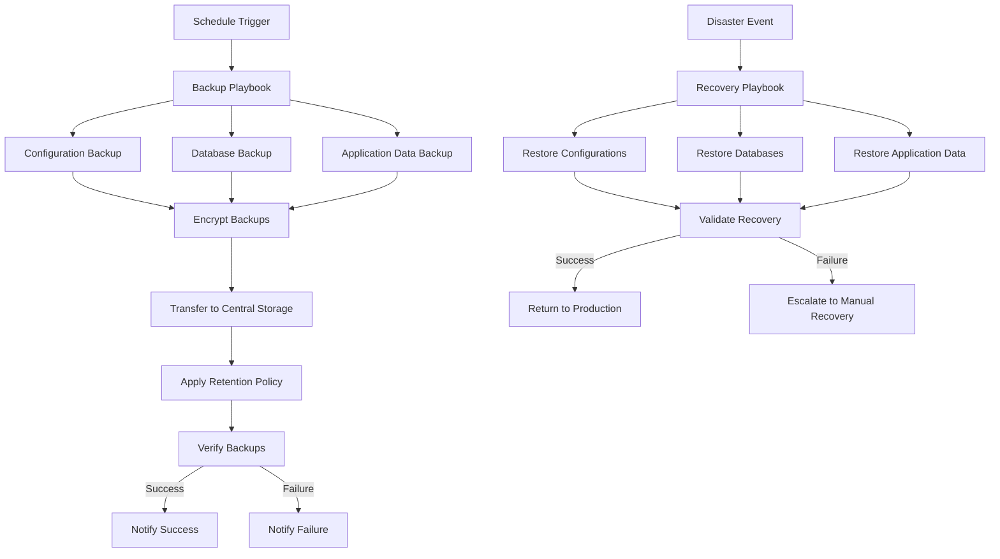

# Ansible Backup Recovery

## Introduction

In modern infrastructure management, ensuring reliable backup and recovery procedures is critical for maintaining business continuity and protecting against data loss. Ansible, a powerful automation tool, offers robust capabilities for creating, managing, and restoring backups across your entire infrastructure. This guide will walk you through implementing effective backup and recovery strategies using Ansible, allowing you to automate these essential processes and reduce the risk of human error.

## Why Use Ansible for Backup and Recovery?

Ansible provides several advantages for backup and recovery operations:

- **Idempotency**: Run the same playbook multiple times without causing unexpected side effects
- **Agentless architecture**: No need to install backup agents on target systems
- **Parallel execution**: Run backup operations across multiple systems simultaneously
- **Version control**: Store your backup configurations as code in your repository
- **Scheduled automation**: Combine with cron or other scheduling mechanisms for fully automated backups

## Basic Backup Strategy with Ansible

Let's start by creating a simple playbook to back up configuration files on remote servers:

```yaml
---
# backup_configs.yml
- name: Backup configuration files
  hosts: webservers
  become: yes
  vars:
    backup_dir: "/var/backups/ansible"
    timestamp: "{{ ansible_date_time.date }}_{{ ansible_date_time.time | replace(':', '-') }}"
  
  tasks:
    - name: Ensure backup directory exists
      file:
        path: "{{ backup_dir }}"
        state: directory
        mode: '0755'
    
    - name: Backup nginx configuration
      copy:
        src: /etc/nginx/nginx.conf
        dest: "{{ backup_dir }}/nginx.conf.{{ timestamp }}"
        remote_src: yes
    
    - name: Backup application config
      copy:
        src: /opt/myapp/config.yml
        dest: "{{ backup_dir }}/myapp_config.{{ timestamp }}"
        remote_src: yes
    
    - name: Create backup archive
      archive:
        path: "{{ backup_dir }}/*.{{ timestamp }}"
        dest: "{{ backup_dir }}/config_backup_{{ timestamp }}.tar.gz"
        format: gz
    
    - name: Clean up temporary files
      file:
        path: "{{ item }}"
        state: absent
      with_fileglob:
        - "{{ backup_dir }}/*.{{ timestamp }}"
```

In this playbook:
1. We define a timestamp variable to ensure backup uniqueness
2. We create a backup directory if it doesn't exist
3. We copy important configuration files with the timestamp appended
4. We archive the collected files and clean up temporary files

## Database Backup with Ansible

Backing up databases is a common requirement. Here's how to back up a MySQL/MariaDB database:

```yaml
---
# backup_database.yml
- name: Backup MySQL databases
  hosts: db_servers
  become: yes
  vars:
    backup_dir: "/var/backups/mysql"
    timestamp: "{{ ansible_date_time.date }}_{{ ansible_date_time.time | replace(':', '-') }}"
    mysql_user: "backup_user"
    mysql_password: "{{ vault_mysql_backup_password }}"  # Use Ansible Vault to store passwords securely
  
  tasks:
    - name: Ensure backup directory exists
      file:
        path: "{{ backup_dir }}"
        state: directory
        mode: '0755'
    
    - name: Get list of databases
      command: mysql -u {{ mysql_user }} -p{{ mysql_password }} -e "SHOW DATABASES;"
      register: database_list
      changed_when: false
      no_log: true
    
    - name: Parse database list
      set_fact:
        databases: "{{ database_list.stdout_lines | select('match', '^[a-zA-Z]') | list | difference(['information_schema', 'performance_schema', 'mysql', 'sys']) }}"
    
    - name: Backup each database
      command: mysqldump -u {{ mysql_user }} -p{{ mysql_password }} --single-transaction --quick --lock-tables=false {{ item }} | gzip > {{ backup_dir }}/{{ item }}_{{ timestamp }}.sql.gz
      with_items: "{{ databases }}"
      no_log: true
    
    - name: Set proper permissions on backup files
      file:
        path: "{{ backup_dir }}"
        mode: '0600'
        recurse: yes
```

This playbook:
1. Discovers available databases automatically
2. Excludes system databases
3. Creates compressed SQL dumps of each database
4. Sets proper permissions on backup files

## Securing Your Backups

When implementing backup strategies, security is paramount. Let's encrypt our backups using Ansible:

```yaml
---
# encrypt_backups.yml
- name: Encrypt backup archives
  hosts: backup_server
  become: yes
  vars:
    backup_dir: "/var/backups"
    gpg_recipient: "backup@example.com"  # GPG key to use for encryption
  
  tasks:
    - name: Find backup archives
      find:
        paths: "{{ backup_dir }}"
        patterns: "*.tar.gz,*.sql.gz"
        recurse: yes
        file_type: file
        excludes: "*.gpg"  # Don't include already encrypted files
      register: backup_files
    
    - name: Encrypt backup files
      command: gpg --batch --yes --trust-model always --recipient {{ gpg_recipient }} --encrypt {{ item.path }}
      with_items: "{{ backup_files.files }}"
      register: encryption_result
    
    - name: Remove original files if encryption successful
      file:
        path: "{{ item.path }}"
        state: absent
      with_items: "{{ backup_files.files }}"
      when: encryption_result is succeeded
```

## Implementing a Centralized Backup Strategy

For larger infrastructures, centralizing backups is recommended. Here's how to collect backups from multiple servers:

```yaml
---
# centralized_backup.yml
- name: Collect backups from servers
  hosts: backup_server
  become: yes
  vars:
    central_backup_dir: "/mnt/backup_storage"
    timestamp: "{{ ansible_date_time.date }}"
  
  tasks:
    - name: Ensure central backup directory exists
      file:
        path: "{{ central_backup_dir }}/{{ timestamp }}"
        state: directory
        mode: '0755'
    
    - name: Fetch backups from web servers
      synchronize:
        src: "/var/backups/ansible/"
        dest: "{{ central_backup_dir }}/{{ timestamp }}/webservers/"
        mode: pull
      delegate_to: "{{ inventory_hostname }}"
      with_items: "{{ groups['webservers'] }}"
    
    - name: Fetch backups from database servers
      synchronize:
        src: "/var/backups/mysql/"
        dest: "{{ central_backup_dir }}/{{ timestamp }}/databases/"
        mode: pull
      delegate_to: "{{ inventory_hostname }}"
      with_items: "{{ groups['db_servers'] }}"
    
    - name: Create backup manifest
      template:
        src: templates/backup_manifest.j2
        dest: "{{ central_backup_dir }}/{{ timestamp }}/manifest.yml"
```

## Automating Backup Rotation and Retention

Managing backup retention is crucial to prevent running out of storage. Here's how to implement a backup rotation policy:

```yaml
---
# backup_rotation.yml
- name: Implement backup rotation
  hosts: backup_server
  become: yes
  vars:
    backup_dir: "/mnt/backup_storage"
    daily_retention: 7  # Keep daily backups for 7 days
    weekly_retention: 4  # Keep weekly backups for 4 weeks
    monthly_retention: 6  # Keep monthly backups for 6 months
  
  tasks:
    - name: Find daily backups older than retention period
      find:
        paths: "{{ backup_dir }}"
        patterns: "daily_*"
        age: "{{ daily_retention }}d"
        recurse: no
        file_type: directory
      register: old_daily_backups
    
    - name: Remove expired daily backups
      file:
        path: "{{ item.path }}"
        state: absent
      with_items: "{{ old_daily_backups.files }}"
    
    - name: Find weekly backups older than retention period
      find:
        paths: "{{ backup_dir }}"
        patterns: "weekly_*"
        age: "{{ weekly_retention * 7 }}d"
        recurse: no
        file_type: directory
      register: old_weekly_backups
    
    - name: Remove expired weekly backups
      file:
        path: "{{ item.path }}"
        state: absent
      with_items: "{{ old_weekly_backups.files }}"
    
    - name: Find monthly backups older than retention period
      find:
        paths: "{{ backup_dir }}"
        patterns: "monthly_*"
        age: "{{ monthly_retention * 30 }}d"
        recurse: no
        file_type: directory
      register: old_monthly_backups
    
    - name: Remove expired monthly backups
      file:
        path: "{{ item.path }}"
        state: absent
      with_items: "{{ old_monthly_backups.files }}"
```

## Testing Backup Recovery

Creating backups is only half the solution—you need to verify they can be restored. Let's create a playbook for testing recovery:

```yaml
---
# test_recovery.yml
- name: Test backup recovery
  hosts: test_recovery_server
  become: yes
  vars:
    backup_dir: "/mnt/backup_storage/latest"
    restore_dir: "/opt/restore_test"
    test_database: "test_recovery_db"
    mysql_user: "restore_user"
    mysql_password: "{{ vault_mysql_restore_password }}"
  
  tasks:
    - name: Ensure restore directory exists
      file:
        path: "{{ restore_dir }}"
        state: directory
        mode: '0755'
    
    - name: Extract configuration backup
      unarchive:
        src: "{{ backup_dir }}/webservers/config_backup_latest.tar.gz"
        dest: "{{ restore_dir }}/configs"
        remote_src: yes
    
    - name: Create test database
      mysql_db:
        name: "{{ test_database }}"
        state: present
        login_user: "{{ mysql_user }}"
        login_password: "{{ mysql_password }}"
    
    - name: Restore database from backup
      mysql_db:
        name: "{{ test_database }}"
        state: import
        target: "{{ backup_dir }}/databases/customer_db_latest.sql.gz"
        login_user: "{{ mysql_user }}"
        login_password: "{{ mysql_password }}"
    
    - name: Verify database recovery
      command: mysql -u {{ mysql_user }} -p{{ mysql_password }} -e "SELECT COUNT(*) FROM users;" {{ test_database }}
      register: db_test_result
      changed_when: false
      no_log: true
    
    - name: Display test results
      debug:
        msg: "Recovery test completed. Database has {{ db_test_result.stdout_lines[-1] }} user records."
```

## Implementing a Complete Workflow

Putting everything together, let's create a diagram of a complete backup and recovery workflow:



## Real-World Example: Complete Disaster Recovery

Let's look at a comprehensive disaster recovery playbook:

```yaml
---
# disaster_recovery.yml
- name: Disaster Recovery Procedure
  hosts: all
  become: yes
  vars:
    backup_source: "/mnt/backup_storage/latest"
  
  tasks:
    - name: Check server status
      ping:
      register: connectivity
      ignore_errors: yes
      
    - name: Create server groups based on status
      group_by:
        key: "{{ 'online_servers' if connectivity is succeeded else 'offline_servers' }}"

- name: Restore offline servers
  hosts: offline_servers
  become: yes
  gather_facts: no
  
  tasks:
    - name: Attempt to power on servers via out-of-band management
      command: ipmitool -I lanplus -H {{ hostvars[inventory_hostname]['ipmi_address'] }} -U {{ ipmi_user }} -P {{ ipmi_password }} power on
      delegate_to: localhost
      when: hostvars[inventory_hostname]['ipmi_address'] is defined
      ignore_errors: yes
      
    - name: Wait for server to come online
      wait_for:
        host: "{{ inventory_hostname }}"
        port: 22
        delay: 30
        timeout: 300
      delegate_to: localhost

- name: Restore systems
  hosts: all
  become: yes
  serial: 5  # Restore 5 servers at a time
  vars:
    backup_source: "/mnt/backup_storage/latest"
    
  tasks:
    - name: Mount recovery media
      mount:
        path: /mnt/recovery
        src: "{{ backup_server }}:/backups/{{ inventory_hostname }}"
        fstype: nfs
        state: mounted
      
    - name: Restore system configuration
      include_role:
        name: system_restore
      
    - name: Restore application stack
      include_role:
        name: application_restore
      
    - name: Validate restoration
      include_role:
        name: validation
      register: validation_result
      
    - name: Report recovery status
      debug:
        msg: "Recovery of {{ inventory_hostname }} {{ 'successful' if validation_result.success else 'failed' }}"
      
    - name: Add to success group
      group_by:
        key: "recovery_success"
      when: validation_result.success|bool
      
    - name: Add to failure group
      group_by:
        key: "recovery_failure"
      when: not validation_result.success|bool

- name: Final recovery report
  hosts: localhost
  gather_facts: no
  tasks:
    - name: Generate recovery report
      template:
        src: templates/recovery_report.j2
        dest: "/var/log/ansible/recovery_{{ ansible_date_time.date }}.log"
      
    - name: Send notification
      mail:
        subject: "Disaster Recovery Operation Completed"
        to: admin@example.com
        body: "{{ lookup('file', '/var/log/ansible/recovery_{{ ansible_date_time.date }}.log') }}"
      when: groups['recovery_success'] is defined or groups['recovery_failure'] is defined
```

## Best Practices for Ansible Backup and Recovery

1. **Test regularly**: Schedule periodic recovery tests to ensure your backup strategy works.
2. **Use Ansible Vault**: Encrypt sensitive data like database credentials using Ansible Vault.
3. **Document thoroughly**: Maintain comprehensive documentation of your backup and recovery procedures.
4. **Monitor and alert**: Implement monitoring and alerting for backup jobs.
5. **Version control**: Keep your Ansible playbooks in version control for change tracking.
6. **Immutable backups**: Consider implementing immutable backups that cannot be altered once created.
7. **Geographic redundancy**: Store backups in multiple geographic locations.

## Monitoring Backup Operations

Monitoring your backup operations is critical. Here's a simple playbook to check backup status:

```yaml
---
# monitor_backups.yml
- name: Monitor backup status
  hosts: backup_server
  become: yes
  vars:
    backup_dir: "/mnt/backup_storage"
    alert_email: "admin@example.com"
    max_age_hours: 24
  
  tasks:
    - name: Check for recent backups
      find:
        paths: "{{ backup_dir }}"
        file_type: directory
        age: "{{ max_age_hours }}h"
        age_stamp: mtime
        recurse: no
      register: recent_backups
    
    - name: Check backup file integrity
      command: find {{ backup_dir }}/latest -type f -name "*.gz" -exec gunzip -t {} \;
      register: integrity_check
      changed_when: false
      failed_when: false
    
    - name: Send alert if no recent backups
      mail:
        subject: "ALERT: No recent backups found"
        to: "{{ alert_email }}"
        body: "No backups have been created in the last {{ max_age_hours }} hours. Please investigate."
      when: recent_backups.matched == 0
    
    - name: Send alert if integrity check failed
      mail:
        subject: "ALERT: Backup integrity check failed"
        to: "{{ alert_email }}"
        body: "The integrity check for backups has failed. Error: {{ integrity_check.stderr }}"
      when: integrity_check.rc != 0
```

## Summary

Implementing an automated backup and recovery strategy with Ansible provides significant benefits for infrastructure management:

- **Consistency**: Ensure backups are taken consistently across your entire infrastructure
- **Reliability**: Automated processes reduce the risk of human error
- **Efficiency**: Save time and resources through automation
- **Scalability**: Easily adapt your backup strategy as your infrastructure grows
- **Auditability**: Maintain clear records of backup and recovery operations

By following the practices outlined in this guide, you can build a robust backup and recovery system using Ansible that will help protect your infrastructure from data loss and minimize downtime in case of disasters.

## Additional Resources

- Practice implementing the playbooks in a test environment
- Expand the playbooks to include specific backup procedures for your applications
- Create custom roles for different types of systems in your infrastructure
- Consider integrating with a backup monitoring system for enhanced visibility

## Exercises

1. Modify the database backup playbook to include specific options for backing up PostgreSQL databases.
2. Create a playbook that tests restoration into a containerized environment.
3. Implement a pre-backup verification step that checks for available disk space.
4. Design a role-based structure for organizing your backup playbooks.
5. Extend the monitoring playbook to send notifications through different channels (Slack, Teams, etc.).