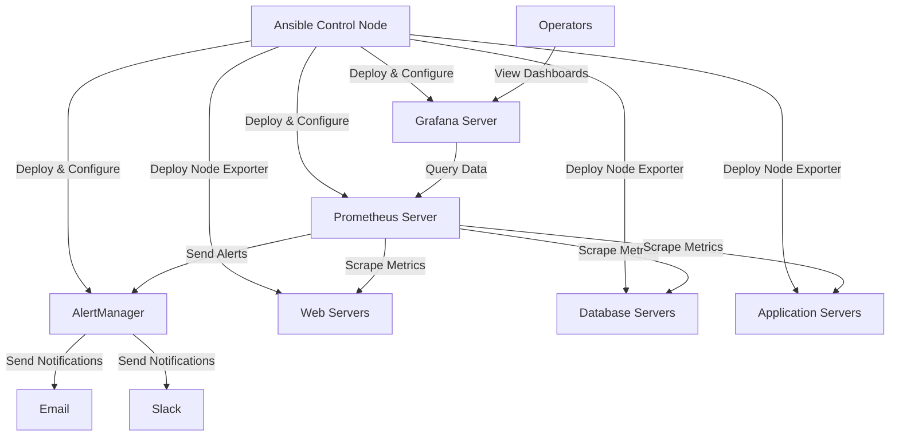

# Ansible Infrastructure Monitoring

## Introduction

Infrastructure monitoring is a critical aspect of maintaining healthy, performant systems in modern IT environments. As infrastructure scales, manual monitoring becomes impractical and error-prone. This is where Ansible shines - it allows you to automate the deployment, configuration, and maintenance of monitoring solutions across your entire infrastructure.

In this guide, we'll explore how to use Ansible to implement monitoring solutions that help you maintain visibility into your systems, detect issues proactively, and respond to problems efficiently.

## Understanding Infrastructure Monitoring with Ansible

Infrastructure monitoring involves collecting metrics, logs, and status information from various components of your IT environment. Ansible can automate this process by:

1. Installing and configuring monitoring agents and collectors
2. Deploying central monitoring servers
3. Setting up dashboards and visualization tools
4. Configuring alerting mechanisms
5. Creating regular maintenance and update workflows

Let's dive into how we can implement these capabilities using Ansible's automation framework.

## Setting Up Your Environment

Before we begin, ensure you have:

- Ansible installed (version 2.9+)
- SSH access to your target servers
- Appropriate privileges to install software
- A basic inventory file

Here's a simple inventory structure for our examples:

```ini
[monitoring_servers]
monitor01.example.com

[web_servers]
web01.example.com
web02.example.com

[database_servers]
db01.example.com

[all:vars]
ansible_user=ansible
```

## Deploying Prometheus with Ansible

[Prometheus](https://prometheus.io/) is a popular open-source monitoring system that works well with Ansible automation. Let's create a playbook to deploy Prometheus.

### Step 1: Create the Prometheus Role Structure

First, let's set up a role for Prometheus:

```bash
ansible-galaxy init roles/prometheus
```

This creates a standard role directory structure:

```
roles/prometheus/
├── defaults
│   └── main.yml
├── files
├── handlers
│   └── main.yml
├── meta
│   └── main.yml
├── tasks
│   └── main.yml
├── templates
│   └── prometheus.yml.j2
└── vars
    └── main.yml
```

### Step 2: Define Prometheus Configuration Variables

In `roles/prometheus/defaults/main.yml`:

```yaml
---
prometheus_version: 2.36.0
prometheus_web_listen_address: "0.0.0.0:9090"
prometheus_storage_retention: "15d"

prometheus_scrape_configs:
  - job_name: 'prometheus'
    scrape_interval: 5s
    static_configs:
      - targets: ['localhost:9090']

  - job_name: 'node'
    scrape_interval: 15s
    static_configs:
      - targets: ['localhost:9100']
```

### Step 3: Create Prometheus Configuration Template

In `roles/prometheus/templates/prometheus.yml.j2`:

```yaml
global:
  scrape_interval: 15s
  evaluation_interval: 15s

scrape_configs:

  - job_name: {{ scrape_config.job_name | quote }}
    scrape_interval: {{ scrape_config.scrape_interval }}
    static_configs:

      - targets: {{ static_config.targets }}


```

### Step 4: Define Installation Tasks

In `roles/prometheus/tasks/main.yml`:

```yaml
---
- name: Create Prometheus system group
  group:
    name: prometheus
    state: present
    system: true

- name: Create Prometheus system user
  user:
    name: prometheus
    group: prometheus
    system: true
    shell: /sbin/nologin
    create_home: false

- name: Create Prometheus directories
  file:
    path: "{{ item }}"
    state: directory
    owner: prometheus
    group: prometheus
    mode: 0755
  with_items:
    - /etc/prometheus
    - /var/lib/prometheus

- name: Download and extract Prometheus binary
  unarchive:
    src: "https://github.com/prometheus/prometheus/releases/download/v{{ prometheus_version }}/prometheus-{{ prometheus_version }}.linux-amd64.tar.gz"
    dest: /tmp
    remote_src: yes
    creates: "/tmp/prometheus-{{ prometheus_version }}.linux-amd64"

- name: Copy Prometheus binaries
  copy:
    src: "/tmp/prometheus-{{ prometheus_version }}.linux-amd64/{{ item }}"
    dest: "/usr/local/bin/{{ item }}"
    remote_src: yes
    owner: prometheus
    group: prometheus
    mode: 0755
  with_items:
    - prometheus
    - promtool

- name: Create Prometheus configuration
  template:
    src: prometheus.yml.j2
    dest: /etc/prometheus/prometheus.yml
    owner: prometheus
    group: prometheus
    mode: 0644
  notify: restart prometheus

- name: Create Prometheus systemd service
  template:
    src: prometheus.service.j2
    dest: /etc/systemd/system/prometheus.service
    owner: root
    group: root
    mode: 0644
  notify: restart prometheus

- name: Enable and start Prometheus service
  systemd:
    name: prometheus
    state: started
    enabled: yes
    daemon_reload: yes
```

### Step 5: Create the Service Template

In `roles/prometheus/templates/prometheus.service.j2`:

```ini
[Unit]
Description=Prometheus Time Series Collection and Processing Server
Documentation=https://prometheus.io/docs/introduction/overview/
Wants=network-online.target
After=network-online.target

[Service]
User=prometheus
Group=prometheus
Type=simple
ExecStart=/usr/local/bin/prometheus \
    --config.file=/etc/prometheus/prometheus.yml \
    --storage.tsdb.path=/var/lib/prometheus \
    --storage.tsdb.retention.time={{ prometheus_storage_retention }} \
    --web.listen-address={{ prometheus_web_listen_address }} \
    --web.console.templates=/etc/prometheus/consoles \
    --web.console.libraries=/etc/prometheus/console_libraries

Restart=always

[Install]
WantedBy=multi-user.target
```

### Step 6: Define Handlers

In `roles/prometheus/handlers/main.yml`:

```yaml
---
- name: restart prometheus
  systemd:
    name: prometheus
    state: restarted
```

### Step 7: Create the Main Playbook

Now let's create the main playbook to use our role:

```yaml
---
- name: Deploy Prometheus Monitoring Server
  hosts: monitoring_servers
  become: true
  roles:
    - prometheus
```

This playbook can be executed with:

```bash
ansible-playbook -i inventory prometheus_setup.yml
```

## Deploying Node Exporter for System Metrics

To monitor your infrastructure, you need to collect metrics from individual nodes. Prometheus's Node Exporter is perfect for this:

### Step 1: Create Node Exporter Role

```bash
ansible-galaxy init roles/node_exporter
```

### Step 2: Define Node Exporter Tasks

In `roles/node_exporter/tasks/main.yml`:

```yaml
---
- name: Create Node Exporter system group
  group:
    name: node_exporter
    state: present
    system: true

- name: Create Node Exporter system user
  user:
    name: node_exporter
    group: node_exporter
    system: true
    shell: /sbin/nologin
    create_home: false

- name: Download and extract Node Exporter
  unarchive:
    src: "https://github.com/prometheus/node_exporter/releases/download/v1.3.1/node_exporter-1.3.1.linux-amd64.tar.gz"
    dest: /tmp
    remote_src: yes
    creates: "/tmp/node_exporter-1.3.1.linux-amd64"

- name: Copy Node Exporter binary
  copy:
    src: "/tmp/node_exporter-1.3.1.linux-amd64/node_exporter"
    dest: "/usr/local/bin/node_exporter"
    remote_src: yes
    owner: node_exporter
    group: node_exporter
    mode: 0755

- name: Create Node Exporter systemd service
  template:
    src: node_exporter.service.j2
    dest: /etc/systemd/system/node_exporter.service
    owner: root
    group: root
    mode: 0644
  notify: restart node_exporter

- name: Enable and start Node Exporter service
  systemd:
    name: node_exporter
    state: started
    enabled: yes
    daemon_reload: yes
```

### Step 3: Create Service Template

In `roles/node_exporter/templates/node_exporter.service.j2`:

```ini
[Unit]
Description=Node Exporter
Documentation=https://github.com/prometheus/node_exporter
Wants=network-online.target
After=network-online.target

[Service]
User=node_exporter
Group=node_exporter
Type=simple
ExecStart=/usr/local/bin/node_exporter

Restart=always

[Install]
WantedBy=multi-user.target
```

### Step 4: Define Handlers

In `roles/node_exporter/handlers/main.yml`:

```yaml
---
- name: restart node_exporter
  systemd:
    name: node_exporter
    state: restarted
```

### Step 5: Create Node Exporter Playbook

```yaml
---
- name: Deploy Node Exporter to All Servers
  hosts: all:!monitoring_servers
  become: true
  roles:
    - node_exporter
```

Run the playbook:

```bash
ansible-playbook -i inventory node_exporter_setup.yml
```

### Step 6: Update Prometheus Configuration

Now we need to update Prometheus to scrape metrics from our nodes. Let's modify our Prometheus configuration:

```yaml
- name: Configure Prometheus to monitor all nodes
  hosts: monitoring_servers
  become: true
  vars:
    prometheus_scrape_configs:
      - job_name: 'prometheus'
        scrape_interval: 5s
        static_configs:
          - targets: ['localhost:9090']
      
      - job_name: 'node'
        scrape_interval: 15s
        static_configs:
          - targets:
            - 'web01.example.com:9100'
            - 'web02.example.com:9100'
            - 'db01.example.com:9100'
  roles:
    - prometheus
```

## Setting Up Grafana for Visualization

Prometheus collects data, but Grafana provides beautiful visualizations. Let's set it up:

### Step 1: Create Grafana Role

```bash
ansible-galaxy init roles/grafana
```

### Step 2: Define Grafana Tasks

In `roles/grafana/tasks/main.yml`:

```yaml
---
- name: Add Grafana GPG key
  apt_key:
    url: https://packages.grafana.com/gpg.key
    state: present
  when: ansible_os_family == "Debian"

- name: Add Grafana repository (Debian/Ubuntu)
  apt_repository:
    repo: "deb https://packages.grafana.com/oss/deb stable main"
    state: present
  when: ansible_os_family == "Debian"

- name: Install Grafana package (Debian/Ubuntu)
  apt:
    name: grafana
    state: present
    update_cache: yes
  when: ansible_os_family == "Debian"
  notify: restart grafana

- name: Add Grafana repository (RedHat/CentOS)
  yum_repository:
    name: grafana
    description: Grafana repository
    baseurl: https://packages.grafana.com/oss/rpm
    gpgcheck: 1
    gpgkey: https://packages.grafana.com/gpg.key
  when: ansible_os_family == "RedHat"

- name: Install Grafana package (RedHat/CentOS)
  yum:
    name: grafana
    state: present
  when: ansible_os_family == "RedHat"
  notify: restart grafana

- name: Configure Grafana datasources
  template:
    src: datasource.yml.j2
    dest: /etc/grafana/provisioning/datasources/default.yml
    owner: grafana
    group: grafana
    mode: 0644
  notify: restart grafana

- name: Enable and start Grafana service
  systemd:
    name: grafana-server
    state: started
    enabled: yes
```

### Step 3: Create Datasource Template

In `roles/grafana/templates/datasource.yml.j2`:

```yaml
apiVersion: 1

datasources:
  - name: Prometheus
    type: prometheus
    access: proxy
    url: http://localhost:9090
    isDefault: true
    editable: false
```

### Step 4: Define Handlers

In `roles/grafana/handlers/main.yml`:

```yaml
---
- name: restart grafana
  systemd:
    name: grafana-server
    state: restarted
```

### Step 5: Create Grafana Playbook

```yaml
---
- name: Deploy Grafana Visualization Platform
  hosts: monitoring_servers
  become: true
  roles:
    - grafana
```

Run the playbook:

```bash
ansible-playbook -i inventory grafana_setup.yml
```

## Automating Alerts with Ansible

Monitoring is incomplete without alerts. Let's configure Prometheus AlertManager:

### Step 1: Create AlertManager Role

```bash
ansible-galaxy init roles/alertmanager
```

### Step 2: Define AlertManager Tasks

In `roles/alertmanager/tasks/main.yml`:

```yaml
---
- name: Create AlertManager system group
  group:
    name: alertmanager
    state: present
    system: true

- name: Create AlertManager system user
  user:
    name: alertmanager
    group: alertmanager
    system: true
    shell: /sbin/nologin
    create_home: false

- name: Create AlertManager directories
  file:
    path: "{{ item }}"
    state: directory
    owner: alertmanager
    group: alertmanager
    mode: 0755
  with_items:
    - /etc/alertmanager
    - /var/lib/alertmanager

- name: Download and extract AlertManager binary
  unarchive:
    src: "https://github.com/prometheus/alertmanager/releases/download/v0.24.0/alertmanager-0.24.0.linux-amd64.tar.gz"
    dest: /tmp
    remote_src: yes
    creates: "/tmp/alertmanager-0.24.0.linux-amd64"

- name: Copy AlertManager binaries
  copy:
    src: "/tmp/alertmanager-0.24.0.linux-amd64/{{ item }}"
    dest: "/usr/local/bin/{{ item }}"
    remote_src: yes
    owner: alertmanager
    group: alertmanager
    mode: 0755
  with_items:
    - alertmanager
    - amtool

- name: Create AlertManager configuration
  template:
    src: alertmanager.yml.j2
    dest: /etc/alertmanager/alertmanager.yml
    owner: alertmanager
    group: alertmanager
    mode: 0644
  notify: restart alertmanager

- name: Create AlertManager systemd service
  template:
    src: alertmanager.service.j2
    dest: /etc/systemd/system/alertmanager.service
    owner: root
    group: root
    mode: 0644
  notify: restart alertmanager

- name: Enable and start AlertManager service
  systemd:
    name: alertmanager
    state: started
    enabled: yes
    daemon_reload: yes
```

### Step 3: Create Service and Configuration Templates

In `roles/alertmanager/templates/alertmanager.service.j2`:

```ini
[Unit]
Description=AlertManager
Documentation=https://github.com/prometheus/alertmanager
Wants=network-online.target
After=network-online.target

[Service]
User=alertmanager
Group=alertmanager
Type=simple
ExecStart=/usr/local/bin/alertmanager \
    --config.file=/etc/alertmanager/alertmanager.yml \
    --storage.path=/var/lib/alertmanager

Restart=always

[Install]
WantedBy=multi-user.target
```

In `roles/alertmanager/templates/alertmanager.yml.j2`:

```yaml
global:
  resolve_timeout: 5m
  slack_api_url: '{{ alertmanager_slack_webhook_url | default("") }}'

route:
  group_by: ['alertname', 'job']
  group_wait: 30s
  group_interval: 5m
  repeat_interval: 4h
  receiver: 'email-notifications'

receivers:
- name: 'email-notifications'
  email_configs:
  - to: '{{ alertmanager_email | default("admin@example.com") }}'
    from: '{{ alertmanager_email_from | default("alertmanager@example.com") }}'
    smarthost: '{{ alertmanager_email_smarthost | default("smtp.example.com:587") }}'
    auth_username: '{{ alertmanager_email_username | default("") }}'
    auth_password: '{{ alertmanager_email_password | default("") }}'
    require_tls: {{ alertmanager_email_require_tls | default(true) }}

inhibit_rules:
  - source_match:
      severity: 'critical'
    target_match:
      severity: 'warning'
    equal: ['alertname', 'instance']
```

### Step 4: Define Handlers

In `roles/alertmanager/handlers/main.yml`:

```yaml
---
- name: restart alertmanager
  systemd:
    name: alertmanager
    state: restarted
```

### Step 5: Update Prometheus for AlertManager

Now let's modify our Prometheus configuration to work with AlertManager. Add the following to `roles/prometheus/templates/prometheus.yml.j2`:

```yaml
alerting:
  alertmanagers:
    - static_configs:
        - targets: ['localhost:9093']

rule_files:
  - "/etc/prometheus/rules/*.yml"
```

### Step 6: Create Alert Rules

First, create a directory for rules in the Prometheus role:

```yaml
- name: Create rules directory
  file:
    path: /etc/prometheus/rules
    state: directory
    owner: prometheus
    group: prometheus
    mode: 0755
```

Then create a template for rules in `roles/prometheus/templates/node_alerts.yml.j2`:

```yaml
groups:
- name: node_alerts
  rules:
  - alert: HighCPULoad
    expr: 100 - (avg by(instance) (irate(node_cpu_seconds_total{mode="idle"}[5m])) * 100) > 80
    for: 5m
    labels:
      severity: warning
    annotations:
      summary: "High CPU load (instance {{ $labels.instance }})"
      description: "CPU load is > 80%
  VALUE = {{ $value }}
  LABELS = {{ $labels }}"

  - alert: HighMemoryLoad
    expr: (node_memory_MemTotal_bytes - node_memory_MemAvailable_bytes) / node_memory_MemTotal_bytes * 100 > 80
    for: 5m
    labels:
      severity: warning
    annotations:
      summary: "High memory load (instance {{ $labels.instance }})"
      description: "Memory load is > 80%
  VALUE = {{ $value }}
  LABELS = {{ $labels }}"

  - alert: HighDiskUsage
    expr: (node_filesystem_size_bytes - node_filesystem_free_bytes) / node_filesystem_size_bytes * 100 > 85
    for: 5m
    labels:
      severity: warning
    annotations:
      summary: "High disk usage (instance {{ $labels.instance }})"
      description: "Disk usage is > 85%
  VALUE = {{ $value }}
  LABELS = {{ $labels }}"
```

Add a task to copy this file:

```yaml
- name: Copy alert rules
  template:
    src: node_alerts.yml.j2
    dest: /etc/prometheus/rules/node_alerts.yml
    owner: prometheus
    group: prometheus
    mode: 0644
  notify: restart prometheus
```

### Step 7: Create Complete Monitoring Playbook

Let's create a comprehensive playbook that sets up the entire monitoring stack:

```yaml
---
- name: Deploy Complete Monitoring Solution
  hosts: monitoring_servers
  become: true
  vars:
    alertmanager_email: "alerts@yourdomain.com"
    alertmanager_email_from: "monitoring@yourdomain.com"
    alertmanager_email_smarthost: "smtp.yourdomain.com:587"
    alertmanager_email_username: "monitoring@yourdomain.com"
    alertmanager_email_password: "your-password"
  roles:
    - prometheus
    - alertmanager
    - grafana

- name: Deploy Node Exporter to All Servers
  hosts: all:!monitoring_servers
  become: true
  roles:
    - node_exporter
```

Run the complete monitoring setup:

```bash
ansible-playbook -i inventory monitoring_setup.yml
```

## Automating Monitoring Checks with Ansible

Beyond setting up the monitoring infrastructure, Ansible can also perform ad-hoc monitoring checks:

### Creating a Monitoring Check Playbook

```yaml
---
- name: Perform infrastructure health checks
  hosts: all
  become: true
  tasks:
    - name: Check disk space
      command: df -h
      register: df_output
      changed_when: false

    - name: Check memory usage
      command: free -m
      register: free_output
      changed_when: false

    - name: Check load average
      command: uptime
      register: uptime_output
      changed_when: false

    - name: Check for failed services
      command: systemctl --failed
      register: failed_services
      changed_when: false

    - name: Display health check results
      debug:
        msg: 
          - "Disk space: {{ df_output.stdout_lines }}"
          - "Memory usage: {{ free_output.stdout_lines }}"
          - "Load average: {{ uptime_output.stdout }}"
          - "Failed services: {{ failed_services.stdout_lines }}"

    - name: Alert on critical disk usage
      fail:
        msg: "Critical disk usage detected on {{ ansible_hostname }}"
      when: df_output.stdout is search('([8-9][0-9]|100)%')
```

This playbook can be run on-demand or scheduled via cron to perform health checks.

## Visualizing Your Monitoring Architecture

Let's visualize our complete monitoring architecture:



## Dynamic Inventory for Monitoring

For large, dynamic environments, you can use Ansible's dynamic inventory to automatically discover and monitor new servers:

```yaml
---
- name: Update Prometheus targets from dynamic inventory
  hosts: monitoring_servers
  become: true
  tasks:
    - name: Get all hosts from inventory
      set_fact:
        all_hosts: "{{ groups['all'] | difference(groups['monitoring_servers']) }}"

    - name: Template Prometheus configuration with dynamic targets
      template:
        src: prometheus_dynamic.yml.j2
        dest: /etc/prometheus/prometheus.yml
        owner: prometheus
        group: prometheus
        mode: 0644
      vars:
        node_targets: "{{ all_hosts | map('regex_replace', '^(.*)$', '\\1:9100') | list }}"
      notify: restart prometheus

  handlers:
    - name: restart prometheus
      systemd:
        name: prometheus
        state: restarted
```

With a template like:

```yaml
global:
  scrape_interval: 15s
  evaluation_interval: 15s

rule_files:
  - "/etc/prometheus/rules/*.yml"

scrape_configs:
  - job_name: 'prometheus'
    scrape_interval: 5s
    static_configs:
      - targets: ['localhost:9090']

  - job_name: 'node'
    scrape_interval: 15s
    static_configs:
      - targets: {{ node_targets | to_nice_yaml | indent(8) }}
```

## Best Practices for Monitoring with Ansible

When implementing infrastructure monitoring with Ansible, follow these best practices:

1. **Use roles for reusability**: Package your monitoring components in roles for easier reuse and sharing.

2. **Separate configuration from code**: Use variables and templates to separate configuration from implementation.

3. **Use Ansible Vault for sensitive data**: Store credentials and sensitive information in Ansible Vault:

   ```bash
   ansible-vault create monitoring_secrets.yml
   ```

4. **Implement tags for selective execution**:

   ```yaml
   tasks:
     - name: Install Prometheus
       # task details
       tags: [prometheus, install]
   ```

   Then run with `--tags`:

   ```bash
   ansible-playbook -i inventory monitoring.yml --tags "prometheus"
   ```

5. **Implement monitoring for Ansible itself**: Track the success and failure of Ansible runs using callback plugins.

6. **Version your monitoring configuration**: Keep your monitoring setup in git or another version control system.

7. **Test monitoring in staging first**: Always test your monitoring setup in a staging environment before production.

## Summary

In this guide, we've explored how to use Ansible to automate infrastructure monitoring:

1. We deployed Prometheus as a central metrics collection system
2. We installed Node Exporter on target servers to collect system metrics
3. We set up Grafana to create beautiful dashboards and visualizations
4. We configured AlertManager to notify operators of problems
5. We created alert rules to detect common system issues
6. We built ad-hoc monitoring checks using Ansible playbooks
7. We implemented dynamic inventory integration for auto-discovery

By automating your monitoring with Ansible, you can ensure consistent implementation across your infrastructure, rapidly deploy monitoring to new systems, and maintain a reliable observability platform that grows with your environment.

## Additional Resources and Exercises

### Further Learning

- [Official Ansible Documentation](https://docs.ansible.com/)
- [Prometheus Documentation](https://prometheus.io/docs/)
- [Grafana Documentation](https://grafana.com/docs/)

### Exercises

1. **Basic**: Extend the Node Exporter role to collect additional metrics specific to web servers or database servers.

2. **Intermediate**: Create custom Grafana dashboards via Ansible for different server types (web, database, application).

3. **Advanced**: Implement a role that uses the Ansible Tower/AWX API to create monitoring jobs that automatically remediate common issues.

4. **Challenge**: Create a complete CI/CD pipeline that tests monitoring configuration before deploying it to production.

### Sample Ansible Project Structure

For a complete monitoring solution, consider this project structure:

```
ansible-monitoring/
├── inventory/
│   ├── production
│   └── staging
├── group_vars/
│   ├── all.yml
│   ├── monitoring_servers.yml
│   └── web_servers.yml
├── host_vars/
│   └── monitor01.example.com.yml
├── roles/
│   ├── prometheus/
│   ├── node_exporter/
│   ├── alertmanager/
│   └── grafana/
├── playbooks/
│   ├── monitoring_setup.yml
│   ├── ad_hoc_checks.yml
│   └── remediation.yml
└── ansible.cfg
```

By following this guide, you now have the skills to implement comprehensive infrastructure monitoring using Ansible automation!