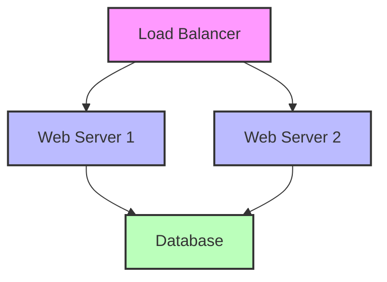

# Ansible Infrastructure as Code

## Introduction

Infrastructure as Code (IaC) is a modern approach to infrastructure management where infrastructure configurations are defined using code instead of manual processes. Ansible, a powerful automation tool, excels at implementing IaC principles by allowing you to describe your infrastructure using simple, human-readable YAML files.

This guide will introduce you to using Ansible as an Infrastructure as Code tool, explaining the core concepts and providing practical examples to get you started on your automation journey.

## What is Infrastructure as Code?

Infrastructure as Code treats infrastructure configuration as software code that can be:

- **Version controlled**: Track changes over time
- **Tested**: Validate before deployment
- **Reused**: Apply the same configuration to multiple environments
- **Automated**: Eliminate manual, error-prone processes

<div className="info-box">
  <strong>Why Infrastructure as Code?</strong>
  <p>IaC ensures consistent, reproducible environments and reduces the risk of configuration drift—when manually configured systems gradually become inconsistent due to ad-hoc changes.</p>
</div>

## Ansible as an IaC Tool

Ansible stands out among IaC tools for several key reasons:

- **Agentless architecture**: No need to install software on managed nodes
- **YAML-based syntax**: Easy to read and write, even for beginners
- **Idempotent operations**: Running the same playbook multiple times produces the same result
- **Extensive module library**: Built-in support for most infrastructure components

## Core Components of Ansible IaC

### Inventory Files

Inventory files define the hosts and groups that Ansible manages. These can be static files or dynamic scripts that pull host information from external sources.

```yaml
# inventory.yml
webservers:
  hosts:
    web1.example.com:
      http_port: 80
    web2.example.com:
      http_port: 8080
  vars:
    ansible_user: deploy

databases:
  hosts:
    db1.example.com:
    db2.example.com:
```

### Variables

Variables allow you to customize your infrastructure configuration for different environments or use cases.

```yaml
# group_vars/webservers.yml
http_port: 80
deploy_path: /var/www/html
app_version: 1.2.3

# host_vars/web1.example.com.yml
http_port: 8080  # Override group variable
```

### Playbooks

Playbooks are the heart of Ansible's IaC approach. They define a series of tasks to configure systems to the desired state.

```yaml
# webserver-setup.yml
---
- name: Configure webservers
  hosts: webservers
  become: true
  vars:
    doc_root: /var/www/html
    
  tasks:
    - name: Install Apache
      apt:
        name: apache2
        state: present
        update_cache: yes
      
    - name: Start and enable Apache
      service:
        name: apache2
        state: started
        enabled: yes
      
    - name: Deploy application
      copy:
        src: files/index.html
        dest: "{{ doc_root }}/index.html"
        owner: www-data
        group: www-data
        mode: '0644'
```

### Roles

Roles provide a framework for fully independent or interdependent collections of variables, tasks, files, templates, and modules.

```
roles/
  webserver/
    tasks/
      main.yml
    handlers/
      main.yml
    files/
      index.html
    templates/
      httpd.conf.j2
    vars/
      main.yml
    defaults/
      main.yml
    meta/
      main.yml
```

Example usage in a playbook:

```yaml
# site.yml
---
- name: Configure webservers
  hosts: webservers
  become: true
  roles:
    - webserver
    - { role: monitoring, when: monitoring_enabled }
```

## Practical Example: Complete Infrastructure Deployment

Let's walk through a practical example of using Ansible to define and deploy a complete web application infrastructure.

### Step 1: Define Your Inventory

```yaml
# inventory.yml
---
all:
  children:
    webservers:
      hosts:
        web1:
          ansible_host: 192.168.1.10
        web2:
          ansible_host: 192.168.1.11
    loadbalancers:
      hosts:
        lb1:
          ansible_host: 192.168.1.5
    databases:
      hosts:
        db1:
          ansible_host: 192.168.1.20
  vars:
    ansible_user: deploy
    ansible_ssh_private_key_file: ~/.ssh/id_rsa
```

### Step 2: Create Roles for Each Component

Let's create a role for our web server configuration:

```yaml
# roles/webserver/tasks/main.yml
---
- name: Install necessary packages
  apt:
    name:
      - nginx
      - python3
      - python3-pip
    state: present
    update_cache: yes

- name: Configure Nginx
  template:
    src: nginx.conf.j2
    dest: /etc/nginx/sites-available/default
    owner: root
    group: root
    mode: '0644'
  notify: Restart Nginx

- name: Deploy application code
  git:
    repo: https://github.com/example/webapp.git
    dest: /var/www/html
    version: master
  notify: Restart Application
```

And handlers to respond to changes:

```yaml
# roles/webserver/handlers/main.yml
---
- name: Restart Nginx
  service:
    name: nginx
    state: restarted

- name: Restart Application
  command: /var/www/html/scripts/restart.sh
```

### Step 3: Create a Main Playbook

```yaml
# site.yml
---
- name: Configure databases
  hosts: databases
  become: true
  roles:
    - database

- name: Configure web servers
  hosts: webservers
  become: true
  roles:
    - webserver
    - app_config

- name: Configure load balancers
  hosts: loadbalancers
  become: true
  roles:
    - loadbalancer
```

### Step 4: Run Your Infrastructure Deployment

```bash
# Command line execution
ansible-playbook -i inventory.yml site.yml
```

Output example:

```
PLAY [Configure databases] *************************

TASK [database : Install MySQL] ********************
ok: [db1]

TASK [database : Configure MySQL] ******************
changed: [db1]

PLAY [Configure web servers] **********************

TASK [webserver : Install necessary packages] ******
ok: [web1]
ok: [web2]

TASK [webserver : Configure Nginx] ****************
changed: [web1]
changed: [web2]

TASK [webserver : Deploy application code] *********
changed: [web1]
changed: [web2]

PLAY [Configure load balancers] *******************

TASK [loadbalancer : Install HAProxy] *************
ok: [lb1]

TASK [loadbalancer : Configure HAProxy] ***********
changed: [lb1]

PLAY RECAP ****************************************
db1    : ok=2    changed=1    unreachable=0    failed=0
web1   : ok=3    changed=2    unreachable=0    failed=0
web2   : ok=3    changed=2    unreachable=0    failed=0
lb1    : ok=2    changed=1    unreachable=0    failed=0
```

## Advanced IaC Techniques with Ansible

### Infrastructure Visualization

You can create visualizations of your infrastructure using Mermaid diagrams:



### Orchestration

Ansible can orchestrate complex deployments with fine-grained control:

```yaml
# orchestration.yml
---
- name: Database migration
  hosts: databases
  become: true
  tasks:
    - name: Backup database
      command: /usr/local/bin/backup.sh
      
    - name: Run migrations
      command: /usr/local/bin/migrate.sh
      
- name: Deploy new application version
  hosts: webservers
  serial: 1  # One server at a time
  become: true
  tasks:
    - name: Pull new code
      git:
        repo: https://github.com/example/webapp.git
        dest: /var/www/html
        version: "{{ app_version }}"
        
    - name: Run tests
      command: /var/www/html/test.sh
      register: test_result
      
    - name: Restart application
      service:
        name: webapp
        state: restarted
      when: test_result.rc == 0
      
    - name: Verify deployment
      uri:
        url: http://localhost/health
        return_content: yes
      register: health_check
      failed_when: "'OK' not in health_check.content"
      
    - name: Rollback if necessary
      command: /usr/local/bin/rollback.sh
      when: health_check is failed
```

### Environment Templating

Use templates to maintain different configurations for different environments:

```yaml
# templates/nginx.conf.j2
server {
    listen {{ http_port }};
    server_name {{ server_name }};
    
    root {{ doc_root }};
    
    
    ssl on;
    ssl_certificate {{ ssl_cert_path }};
    ssl_certificate_key {{ ssl_key_path }};
    
    
    location / {
        try_files $uri $uri/ /index.html;
    }
}
```

## Best Practices for Ansible IaC

1. **Version Control**: Store all your Ansible code in a git repository
2. **Modular Design**: Use roles to create reusable components
3. **Environment Separation**: Maintain separate variables for dev, test, and production
4. **Secret Management**: Use Ansible Vault to encrypt sensitive data:

```bash
# Encrypting sensitive data
ansible-vault encrypt group_vars/all/secrets.yml

# Using encrypted files
ansible-playbook site.yml --ask-vault-pass
```

5. **Testing**: Test your playbooks in a development environment before production
6. **Documentation**: Document your infrastructure code with comments and README files
7. **Continuous Integration**: Validate your Ansible code with automated testing

## Implementing CI/CD for Infrastructure

A powerful IaC approach is to implement CI/CD for your infrastructure changes:

```yaml
# .gitlab-ci.yml example
stages:
  - lint
  - test
  - deploy

lint:
  stage: lint
  script:
    - ansible-lint *.yml

test:
  stage: test
  script:
    - ansible-playbook --check -i inventory.dev.yml site.yml

deploy_staging:
  stage: deploy
  script:
    - ansible-playbook -i inventory.staging.yml site.yml
  environment: staging
  only:
    - main

deploy_production:
  stage: deploy
  script:
    - ansible-playbook -i inventory.production.yml site.yml
  environment: production
  when: manual
  only:
    - tags
```

## Summary

Ansible's approach to Infrastructure as Code provides a powerful yet accessible way to automate your infrastructure management. By defining your infrastructure using YAML playbooks and roles, you can ensure consistency, track changes, and deploy with confidence.

The key benefits of using Ansible for IaC include:

- Simple, human-readable syntax
- Agentless architecture
- Powerful templating and variable system
- Extensive module library
- Community support and plugins

As you continue your journey with Ansible IaC, focus on building modular, reusable components that can be composed to create complete infrastructure deployments.

## Additional Resources

- Practice exercises:
  1. Create a playbook to deploy a simple web application
  2. Modify your playbook to support multiple environments
  3. Convert your playbook into reusable roles
  4. Implement a CI/CD pipeline for your infrastructure code

- Books and documentation:
  - Ansible official documentation
  - "Ansible for DevOps" by Jeff Geerling
  - "Infrastructure as Code" by Kief Morris

<div className="callout callout-info">
  <p><strong>Remember:</strong> The key to successful Infrastructure as Code with Ansible is starting simple and iteratively improving your automation. Begin with automating a single, well-understood process, and gradually expand to more complex infrastructure components.</p>
</div>