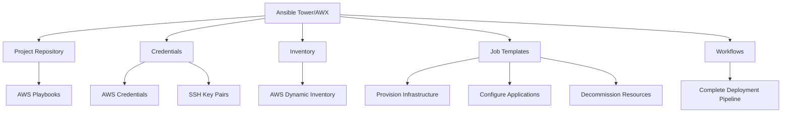

# Ansible AWS Integration

## Introduction

Ansible is a powerful automation tool that can be used to configure systems, deploy applications, and orchestrate complex IT tasks. Amazon Web Services (AWS) is one of the leading cloud providers, offering a vast array of services for building and hosting applications. Integrating Ansible with AWS allows you to automate the provisioning, configuration, and management of your AWS cloud infrastructure using the same simple, agentless approach that makes Ansible popular for on-premises automation.

In this guide, we'll explore how to use Ansible to automate AWS operations, from setting up your environment to implementing real-world scenarios. By the end, you'll understand how to leverage Ansible's AWS modules to create infrastructure as code for your cloud resources.

## Prerequisites

Before you begin, make sure you have:

- Basic understanding of Ansible concepts (playbooks, inventory, modules)
- Basic familiarity with AWS services
- Ansible installed on your control node
- AWS account with appropriate permissions
- AWS CLI configured (optional but recommended)

## Setting Up Your Environment

### Installing Required Packages

To interact with AWS using Ansible, you'll need to install the `boto3` Python library, which is AWS's SDK for Python:

```bash
pip install boto3
```

Ensure you have the latest version of Ansible that includes the AWS collection:

```bash
pip install ansible
ansible-galaxy collection install amazon.aws
```

### Configuring AWS Authentication

Ansible needs AWS credentials to interact with your AWS account. You can provide these credentials in several ways:

1. **Environment variables**:

```bash
export AWS_ACCESS_KEY_ID='your-access-key'
export AWS_SECRET_ACCESS_KEY='your-secret-key'
export AWS_REGION='us-east-1'
```

2. **AWS config files** located at `~/.aws/credentials` and `~/.aws/config`

3. **Directly in your Ansible playbook** (not recommended for security reasons):

```yaml
- name: Provision an EC2 instance
  amazon.aws.ec2_instance:
    aws_access_key: your-access-key
    aws_secret_key: your-secret-key
    region: us-east-1
    # other parameters
```

For security best practices, using environment variables or AWS configuration files is recommended.

## Basic AWS Operations with Ansible

### Creating an EC2 Instance

Let's start with a simple example of launching an EC2 instance:

```yaml
---
- name: Launch EC2 instances
  hosts: localhost
  gather_facts: false
  vars:
    instance_type: t2.micro
    security_group: default
    ami_id: ami-0c55b159cbfafe1f0  # Amazon Linux 2 AMI ID (replace with current AMI)
    region: us-east-1
    keypair: my-keypair
    
  tasks:
    - name: Launch instance
      amazon.aws.ec2_instance:
        name: "ansible-demo-instance"
        key_name: "{{ keypair }}"
        instance_type: "{{ instance_type }}"
        security_group: "{{ security_group }}"
        image_id: "{{ ami_id }}"
        region: "{{ region }}"
        network:
          assign_public_ip: true
        tags:
          Environment: Testing
          Project: AnsibleDemo
        wait: true
        count: 1
      register: ec2
        
    - name: Add new instance to host group
      add_host:
        hostname: "{{ item.public_ip_address }}"
        groupname: launched_instances
      loop: "{{ ec2.instances }}"
    
    - name: Wait for SSH to come up
      wait_for:
        host: "{{ item.public_ip_address }}"
        port: 22
        delay: 10
        timeout: 320
      loop: "{{ ec2.instances }}"
      
- name: Configure newly created EC2 instances
  hosts: launched_instances
  become: true
  tasks:
    - name: Install Nginx
      yum:
        name: nginx
        state: present
        
    - name: Start Nginx
      service:
        name: nginx
        state: started
```

This playbook:
1. Launches an EC2 instance with specified parameters
2. Adds the new instance to a dynamic host group
3. Waits for SSH to become available
4. Installs and starts Nginx on the new instance

### Creating an S3 Bucket

Let's create an S3 bucket and upload a file to it:

```yaml
---
- name: S3 operations
  hosts: localhost
  gather_facts: false
  vars:
    bucket_name: ansible-demo-bucket-unique-name-123
    region: us-east-1
    
  tasks:
    - name: Create an S3 bucket
      amazon.aws.s3_bucket:
        name: "{{ bucket_name }}"
        region: "{{ region }}"
        state: present
        tags:
          Environment: Testing
          Project: AnsibleDemo
          
    - name: Enable versioning on the S3 bucket
      amazon.aws.s3_bucket:
        name: "{{ bucket_name }}"
        region: "{{ region }}"
        versioning: true
          
    - name: Upload file to S3 bucket
      amazon.aws.s3_object:
        bucket: "{{ bucket_name }}"
        object: hello.txt
        content: "Hello from Ansible!"
        mode: put
        permission: public-read
```

This playbook creates an S3 bucket, enables versioning, and uploads a simple text file.

## Dynamic Inventory for AWS

Instead of maintaining a static inventory of your AWS resources, you can use Ansible's dynamic inventory to automatically discover and manage your AWS instances.

### Setup AWS Dynamic Inventory

Create an inventory file named `aws_ec2.yaml`:

```yaml
---
plugin: aws_ec2
regions:
  - us-east-1
  - us-west-2
keyed_groups:
  - key: tags.Environment
    prefix: env
  - key: tags.Project
    prefix: project
  - key: instance_type
    prefix: type
```

This configuration:
- Uses the `aws_ec2` inventory plugin
- Discovers EC2 instances in both the us-east-1 and us-west-2 regions
- Groups instances by their Environment tag, Project tag, and instance type

### Using the Dynamic Inventory

To use the dynamic inventory:

```bash
ansible-inventory -i aws_ec2.yaml --list
```

To run a playbook against all your EC2 instances:

```bash
ansible-playbook -i aws_ec2.yaml playbook.yml
```

Or target specific groups based on tags:

```bash
ansible-playbook -i aws_ec2.yaml -l env_Production playbook.yml
```

## Advanced AWS Operations

### Creating a VPC with Subnets

Let's create a complete VPC environment:

```yaml
---
- name: Create VPC Infrastructure
  hosts: localhost
  gather_facts: false
  vars:
    region: us-east-1
    vpc_name: "ansible-vpc"
    vpc_cidr: "10.0.0.0/16"
    public_subnet_1_cidr: "10.0.1.0/24"
    public_subnet_2_cidr: "10.0.2.0/24"
    private_subnet_1_cidr: "10.0.3.0/24"
    private_subnet_2_cidr: "10.0.4.0/24"
    
  tasks:
    - name: Create VPC
      amazon.aws.ec2_vpc_net:
        name: "{{ vpc_name }}"
        cidr_block: "{{ vpc_cidr }}"
        region: "{{ region }}"
        tags:
          Environment: Production
          Project: AnsibleDemo
        tenancy: default
      register: vpc
      
    - name: Create Internet Gateway
      amazon.aws.ec2_vpc_igw:
        vpc_id: "{{ vpc.vpc.id }}"
        region: "{{ region }}"
        state: present
        tags:
          Name: "{{ vpc_name }}-igw"
      register: igw
      
    - name: Create Public Subnet 1
      amazon.aws.ec2_vpc_subnet:
        vpc_id: "{{ vpc.vpc.id }}"
        cidr: "{{ public_subnet_1_cidr }}"
        az: "{{ region }}a"
        region: "{{ region }}"
        state: present
        map_public: true
        tags:
          Name: "{{ vpc_name }}-public-subnet-1"
      register: public_subnet_1
      
    - name: Create Public Subnet 2
      amazon.aws.ec2_vpc_subnet:
        vpc_id: "{{ vpc.vpc.id }}"
        cidr: "{{ public_subnet_2_cidr }}"
        az: "{{ region }}b"
        region: "{{ region }}"
        state: present
        map_public: true
        tags:
          Name: "{{ vpc_name }}-public-subnet-2"
      register: public_subnet_2
      
    - name: Create Private Subnet 1
      amazon.aws.ec2_vpc_subnet:
        vpc_id: "{{ vpc.vpc.id }}"
        cidr: "{{ private_subnet_1_cidr }}"
        az: "{{ region }}a"
        region: "{{ region }}"
        state: present
        tags:
          Name: "{{ vpc_name }}-private-subnet-1"
      register: private_subnet_1
      
    - name: Create Private Subnet 2
      amazon.aws.ec2_vpc_subnet:
        vpc_id: "{{ vpc.vpc.id }}"
        cidr: "{{ private_subnet_2_cidr }}"
        az: "{{ region }}b"
        region: "{{ region }}"
        state: present
        tags:
          Name: "{{ vpc_name }}-private-subnet-2"
      register: private_subnet_2
      
    - name: Create Public Route Table
      amazon.aws.ec2_vpc_route_table:
        vpc_id: "{{ vpc.vpc.id }}"
        region: "{{ region }}"
        tags:
          Name: "{{ vpc_name }}-public-route-table"
        subnets:
          - "{{ public_subnet_1.subnet.id }}"
          - "{{ public_subnet_2.subnet.id }}"
        routes:
          - dest: "0.0.0.0/0"
            gateway_id: "{{ igw.gateway_id }}"
      register: public_route_table
```

This playbook creates a VPC with public and private subnets across two availability zones, complete with an internet gateway and route tables.

### Auto Scaling Group with Load Balancer

Here's how to create an Auto Scaling Group with a Load Balancer:

```yaml
---
- name: Create Auto Scaling Group with Load Balancer
  hosts: localhost
  gather_facts: false
  vars:
    region: us-east-1
    vpc_id: vpc-12345678  # Replace with your VPC ID
    subnet_ids:
      - subnet-12345678   # Replace with your subnet IDs
      - subnet-87654321
    security_group: sg-12345678  # Replace with your security group ID
    keypair: my-keypair
    ami_id: ami-0c55b159cbfafe1f0  # Replace with your AMI ID
    
  tasks:
    - name: Create Launch Template
      amazon.aws.ec2_launch_template:
        name: ansible-launch-template
        image_id: "{{ ami_id }}"
        instance_type: t2.micro
        key_name: "{{ keypair }}"
        security_group_ids:
          - "{{ security_group }}"
        region: "{{ region }}"
        user_data: |
          #!/bin/bash
          yum update -y
          yum install -y nginx
          systemctl start nginx
          systemctl enable nginx
        tags:
          Name: web-server
          Environment: Production
      register: launch_template
      
    - name: Create Application Load Balancer
      amazon.aws.elb_application_lb:
        name: ansible-alb
        region: "{{ region }}"
        security_groups:
          - "{{ security_group }}"
        subnets: "{{ subnet_ids }}"
        state: present
        tags:
          Name: ansible-alb
          Environment: Production
      register: alb
      
    - name: Create ALB Target Group
      amazon.aws.elb_target_group:
        name: ansible-target-group
        region: "{{ region }}"
        protocol: HTTP
        port: 80
        vpc_id: "{{ vpc_id }}"
        health_check_protocol: HTTP
        health_check_path: /
        health_check_port: 80
        successful_response_codes: "200"
        target_type: instance
        state: present
      register: target_group
      
    - name: Create ALB Listener
      amazon.aws.elb_application_lb_listener:
        region: "{{ region }}"
        load_balancer_arn: "{{ alb.loadbalancer.load_balancer_arn }}"
        protocol: HTTP
        port: 80
        default_actions:
          - type: forward
            target_group_arn: "{{ target_group.target_group_arn }}"
        state: present
      register: listener
      
    - name: Create Auto Scaling Group
      amazon.aws.autoscaling_group:
        name: ansible-asg
        launch_template:
          version: "{{ launch_template.version }}"
          launch_template_name: "{{ launch_template.name }}"
        min_size: 2
        max_size: 5
        desired_capacity: 2
        vpc_zone_identifier: "{{ subnet_ids }}"
        target_group_arns:
          - "{{ target_group.target_group_arn }}"
        health_check_type: ELB
        health_check_grace_period: 300
        region: "{{ region }}"
        availability_zones:
          - "{{ region }}a"
          - "{{ region }}b"
        tags:
          - key: Name
            value: ansible-asg-instance
            propagate_at_launch: true
          - key: Environment
            value: Production
            propagate_at_launch: true
```

This playbook creates:
1. A launch template defining the EC2 instances
2. An Application Load Balancer
3. A target group and listener for the load balancer
4. An Auto Scaling Group that uses the launch template and connects to the load balancer

## Real-World Example: Complete Web Application Deployment

Let's put everything together to deploy a complete web application infrastructure:

```yaml
---
- name: Deploy Web Application Infrastructure
  hosts: localhost
  gather_facts: false
  vars:
    region: us-east-1
    application_name: my-web-app
    vpc_cidr: "10.0.0.0/16"
    environment: Production
    
  tasks:
    - name: Create VPC and Networking Components
      include_tasks: vpc-setup.yml
      
    - name: Create Security Groups
      amazon.aws.ec2_security_group:
        name: "{{ application_name }}-web-sg"
        description: Security group for web servers
        vpc_id: "{{ vpc.vpc.id }}"
        region: "{{ region }}"
        rules:
          - proto: tcp
            ports: 80
            cidr_ip: 0.0.0.0/0
            rule_desc: Allow HTTP from anywhere
          - proto: tcp
            ports: 443
            cidr_ip: 0.0.0.0/0
            rule_desc: Allow HTTPS from anywhere
          - proto: tcp
            ports: 22
            cidr_ip: 10.0.0.0/8
            rule_desc: Allow SSH from internal network
      register: web_sg
      
    - name: Create RDS Security Group
      amazon.aws.ec2_security_group:
        name: "{{ application_name }}-db-sg"
        description: Security group for database
        vpc_id: "{{ vpc.vpc.id }}"
        region: "{{ region }}"
        rules:
          - proto: tcp
            ports: 3306
            group_id: "{{ web_sg.group_id }}"
            rule_desc: Allow MySQL from web servers
      register: db_sg
      
    - name: Create RDS Subnet Group
      amazon.aws.rds_subnet_group:
        name: "{{ application_name }}-subnet-group"
        description: Subnet group for RDS
        region: "{{ region }}"
        state: present
        subnets:
          - "{{ private_subnet_1.subnet.id }}"
          - "{{ private_subnet_2.subnet.id }}"
      register: db_subnet_group
      
    - name: Create RDS Instance
      amazon.aws.rds_instance:
        db_instance_identifier: "{{ application_name }}-db"
        engine: mysql
        engine_version: "8.0"
        db_instance_class: db.t3.small
        allocated_storage: 20
        storage_type: gp2
        storage_encrypted: true
        master_username: admin
        master_user_password: "{{ lookup('password', '/dev/null length=16 chars=ascii_letters,digits') }}"
        vpc_security_group_ids:
          - "{{ db_sg.group_id }}"
        db_subnet_group_name: "{{ db_subnet_group.subnet_group.db_subnet_group_name }}"
        region: "{{ region }}"
        tags:
          Environment: "{{ environment }}"
          Application: "{{ application_name }}"
      register: rds
      
    - name: Create S3 Bucket for Static Assets
      amazon.aws.s3_bucket:
        name: "{{ application_name }}-assets"
        region: "{{ region }}"
        state: present
        tags:
          Environment: "{{ environment }}"
          Application: "{{ application_name }}"
      register: s3_bucket
      
    - name: Set Bucket Policy for Public Read
      amazon.aws.s3_bucket_policy:
        bucket: "{{ s3_bucket.name }}"
        policy: |
          {
            "Version": "2012-10-17",
            "Statement": [
              {
                "Sid": "PublicReadForGetBucketObjects",
                "Effect": "Allow",
                "Principal": "*",
                "Action": "s3:GetObject",
                "Resource": "arn:aws:s3:::{{ s3_bucket.name }}/*"
              }
            ]
          }
          
    - name: Create Launch Template for Web Servers
      amazon.aws.ec2_launch_template:
        name: "{{ application_name }}-launch-template"
        image_id: ami-0c55b159cbfafe1f0  # Replace with your AMI ID
        instance_type: t3.small
        security_group_ids:
          - "{{ web_sg.group_id }}"
        region: "{{ region }}"
        user_data: |
          #!/bin/bash
          yum update -y
          yum install -y nginx mysql php php-mysqlnd
          systemctl start nginx
          systemctl enable nginx
          
          # Configure application
          cat > /var/www/html/index.php << 'EOF'
          <?php
          echo "<h1>Hello from " . gethostname() . "</h1>";
          $conn = new mysqli("{{ rds.endpoint.address }}", "admin", "{{ rds.master_user_password }}", "mysql");
          if ($conn->connect_error) {
            die("Connection failed: " . $conn->connect_error);
          }
          echo "<p>Successfully connected to database</p>";
          $conn->close();
          ?>
          EOF
        tags:
          Name: "{{ application_name }}-web-server"
          Environment: "{{ environment }}"
      register: launch_template
      
    - name: Create Load Balancer and Auto Scaling Group
      include_tasks: lb-asg-setup.yml
      
    - name: Create CloudFront Distribution for S3
      amazon.aws.cloudfront_distribution:
        state: present
        origins:
          - id: "{{ s3_bucket.name }}.s3.amazonaws.com"
            domain_name: "{{ s3_bucket.name }}.s3.amazonaws.com"
            origin_path: ""
            s3_origin_config:
              origin_access_identity: ""
        default_cache_behavior:
          target_origin_id: "{{ s3_bucket.name }}.s3.amazonaws.com"
          viewer_protocol_policy: redirect-to-https
          allowed_methods: ["GET", "HEAD"]
          cached_methods: ["GET", "HEAD"]
          forwarded_values:
            query_string: false
            cookies:
              forward: none
        enabled: true
        comment: "{{ application_name }} static assets"
        tags:
          Environment: "{{ environment }}"
          Application: "{{ application_name }}"
      register: cloudfront
      
    - name: Output Application URLs
      debug:
        msg:
          - "Web Application URL: http://{{ alb.loadbalancer.dns_name }}"
          - "Static Assets URL: https://{{ cloudfront.distribution.domain_name }}"
          - "Database Endpoint: {{ rds.endpoint.address }}:{{ rds.endpoint.port }}"
          - "RDS Master Username: admin"
          - "RDS Master Password: {{ rds.master_user_password }}"
```

This comprehensive playbook:
1. Creates a VPC with public and private subnets
2. Sets up security groups for web and database tiers
3. Deploys an RDS MySQL database
4. Creates an S3 bucket for static assets with a CloudFront distribution
5. Configures auto-scaling web servers with a load balancer
6. Outputs all the necessary connection information

## Using Ansible Tower/AWX with AWS

For larger teams and enterprises, Ansible Tower (or its open-source counterpart AWX) provides a web-based interface for running Ansible jobs with role-based access control, scheduling, and notifications.

Here's how you can structure your AWS automation with Tower/AWX:



With Tower/AWX, you can:
- Store AWS credentials securely
- Schedule infrastructure checks and updates
- Set up approval workflows for provisioning resources
- Integrate with CI/CD pipelines
- Provide self-service infrastructure capabilities to developers

## Best Practices for Ansible AWS Integration

1. **Use Infrastructure as Code principles**:
   - Keep all your Ansible playbooks in version control
   - Use variables for environment-specific settings
   - Document your infrastructure code

2. **Secure your credentials**:
   - Use AWS IAM roles where possible instead of access keys
   - Never hardcode credentials in playbooks
   - Use Ansible Vault for sensitive information

3. **Organize your playbooks**:
   - Create reusable roles for common AWS patterns
   - Separate provisioning from configuration
   - Use tags for better resource management

4. **Implement proper error handling**:
   - Use `register` and conditional checks to catch and handle errors
   - Implement idempotency in your playbooks
   - Add proper validation before making changes

5. **Optimize for cost efficiency**:
   - Include resource cleanup in your automation
   - Use tags to track costs
   - Implement scheduled scaling for non-production environments

## Troubleshooting Common Issues

### Authentication Failures

If you encounter authentication errors:
- Verify your AWS credentials are correct and not expired
- Check that your IAM user/role has the necessary permissions
- Ensure you're using the correct region

### Module Errors

If Ansible modules aren't working as expected:
- Check that boto3 and botocore are installed and up to date
- Verify you're using the correct module parameters
- Look at the AWS documentation for any service-specific requirements

### Resource Limitations

If you hit AWS service limits:
- Use the `retries` and `delay` parameters for resources that may take time to create
- Implement proper error handling for service quotas
- Consider requesting limit increases from AWS for your production needs

## Summary

In this guide, we've explored how to integrate Ansible with AWS to automate your cloud infrastructure. We've covered:

- Setting up your environment with the necessary packages and authentication
- Basic AWS operations like launching EC2 instances and creating S3 buckets
- Using dynamic inventory to discover and manage your AWS resources
- Advanced operations including VPC creation and auto scaling groups
- A comprehensive real-world example of deploying a complete web application
- Best practices for using Ansible with AWS

By leveraging Ansible's AWS modules, you can treat your infrastructure as code, making it more reliable, repeatable, and maintainable. This approach allows you to apply the same automation principles to both on-premises and cloud resources, creating a unified management strategy.

## Additional Resources

- [Ansible AWS Collection Documentation](https://docs.ansible.com/ansible/latest/collections/amazon/aws/index.html)
- [AWS SDK for Python (Boto3) Documentation](https://boto3.amazonaws.com/v1/documentation/api/latest/index.html)
- [AWS CLI Documentation](https://docs.aws.amazon.com/cli/latest/userguide/cli-chap-welcome.html)
- [Ansible Tower User Guide](https://docs.ansible.com/ansible-tower/latest/html/userguide/index.html)

## Exercises

1. **Basic Exercise**: Create a playbook that launches an EC2 instance and installs a web server.
2. **Intermediate Exercise**: Build a VPC with public and private subnets, and deploy a web application that connects to an RDS database.
3. **Advanced Exercise**: Create a complete infrastructure including auto scaling, load balancing, and CloudFront distribution, with proper monitoring and alerting.
4. **Challenge**: Implement a blue-green deployment strategy for your application using Ansible and AWS.