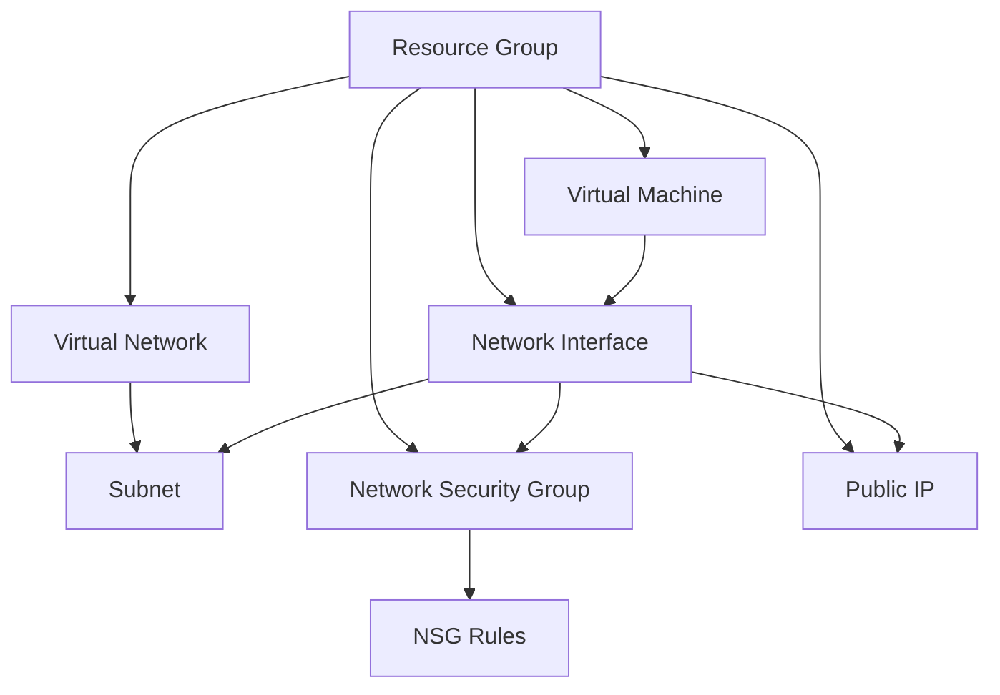

# Ansible Azure Integration

## Introduction

Ansible is a powerful open-source automation tool that simplifies the process of configuring and managing servers, applications, and infrastructure. Microsoft Azure is one of the leading cloud service providers offering a wide range of services including virtual machines, storage, databases, and more.

Ansible Azure integration combines these two technologies to provide a seamless way to automate the deployment, configuration, and management of Azure resources using Ansible's simple, human-readable YAML-based playbooks.

In this guide, we'll explore how to set up Ansible to work with Azure and create playbooks to manage Azure resources effectively.

## Prerequisites

Before diving into Ansible Azure integration, ensure you have:

- Ansible installed (version 2.9+)
- Python 3.6+ installed
- Azure CLI installed
- An active Azure account
- Basic knowledge of Ansible concepts (playbooks, inventory, modules)

## Setting Up Ansible for Azure

### Step 1: Install Required Python Packages

Ansible needs specific Python packages to communicate with Azure. Install them using pip:

```bash
pip install azure-cli azure-mgmt-compute azure-mgmt-network azure-mgmt-resource azure-mgmt-storage azure-identity
```

### Step 2: Set Up Azure Credentials

Ansible needs authentication credentials to interact with your Azure account. There are several ways to authenticate:

#### Option 1: Service Principal Authentication (Recommended for Automation)

1. Create a service principal:

```bash
az ad sp create-for-rbac --name AnsibleSP --role Contributor
```

2. This command will output JSON similar to:

```json
{
  "appId": "XXXXXXXX-XXXX-XXXX-XXXX-XXXXXXXXXXXX",
  "displayName": "AnsibleSP",
  "name": "http://AnsibleSP",
  "password": "XXXXXXXXXXXXXXXXXXXXXXXXXXXX",
  "tenant": "XXXXXXXX-XXXX-XXXX-XXXX-XXXXXXXXXXXX"
}
```

3. Save these credentials in an Ansible configuration file (credentials.yml):

```yaml
subscription_id: your-subscription-id
client_id: your-appId
secret: your-password
tenant: your-tenant
```

4. Secure the file with ansible-vault:

```bash
ansible-vault encrypt credentials.yml
```

#### Option 2: Environment Variables

You can set Azure credentials as environment variables:

```bash
export AZURE_SUBSCRIPTION_ID=your-subscription-id
export AZURE_CLIENT_ID=your-appId
export AZURE_SECRET=your-password
export AZURE_TENANT=your-tenant
```

## Creating Your First Azure Playbook

Let's create a basic playbook to provision a resource group in Azure:

```yaml
---
- name: Create Azure Resource Group
  hosts: localhost
  connection: local
  vars_files:
    - credentials.yml
  tasks:
    - name: Create resource group
      azure_rm_resourcegroup:
        name: ansible-rg
        location: eastus
        state: present
      register: rg_result
    
    - name: Display resource group result
      debug:
        var: rg_result
```

Save this playbook as `create_resource_group.yml` and run it with:

```bash
ansible-playbook create_resource_group.yml --ask-vault-pass
```

## Ansible Azure Modules

Ansible provides numerous modules specifically for Azure. Here are some commonly used ones:

### Resource Groups

```yaml
- name: Create a resource group
  azure_rm_resourcegroup:
    name: myResourceGroup
    location: eastus
    state: present
```

### Virtual Networks

```yaml
- name: Create virtual network
  azure_rm_virtualnetwork:
    resource_group: myResourceGroup
    name: myVnet
    address_prefixes: "10.0.0.0/16"
```

### Subnets

```yaml
- name: Create subnet
  azure_rm_subnet:
    resource_group: myResourceGroup
    virtual_network: myVnet
    name: mySubnet
    address_prefix: "10.0.1.0/24"
```

### Network Security Groups

```yaml
- name: Create network security group
  azure_rm_securitygroup:
    resource_group: myResourceGroup
    name: myNetworkSecurityGroup
    rules:
      - name: SSH
        protocol: Tcp
        destination_port_range: 22
        access: Allow
        priority: 1001
        direction: Inbound
```

### Virtual Machines

```yaml
- name: Create VM
  azure_rm_virtualmachine:
    resource_group: myResourceGroup
    name: myVM
    vm_size: Standard_DS1_v2
    admin_username: azureuser
    ssh_password_enabled: false
    ssh_public_keys:
      - path: /home/azureuser/.ssh/authorized_keys
        key_data: "{{ ssh_public_key }}"
    network_interfaces: myNIC
    image:
      offer: CentOS
      publisher: OpenLogic
      sku: '7.5'
      version: latest
```

## Dynamic Inventory for Azure

Ansible can dynamically discover and manage your Azure resources using a dynamic inventory script. This is particularly useful when your Azure infrastructure changes frequently.

### Step 1: Configure Azure Dynamic Inventory

Create an inventory configuration file named `azure_rm.yml`:

```yaml
plugin: azure_rm
include_vm_resource_groups:
  - ansible-rg
auth_source: auto
```

### Step 2: Test the Dynamic Inventory

```bash
ansible-inventory -i azure_rm.yml --graph
```

This will display a list of all Azure resources discovered by Ansible.

### Step 3: Use Dynamic Inventory in Playbooks

You can now use this dynamic inventory in your playbooks:

```yaml
---
- name: Manage Azure VMs
  hosts: azure_vm
  tasks:
    - name: Ensure NTP is installed
      package:
        name: ntp
        state: present
      become: true
```

## Real-world Example: Complete Azure Environment

Let's create a more comprehensive example that sets up a complete environment with a Virtual Network, Subnet, Network Security Group, and a Virtual Machine:



Here's the playbook to set this up:

```yaml
---
- name: Deploy Complete Azure Environment
  hosts: localhost
  connection: local
  vars_files:
    - credentials.yml
  vars:
    resource_group: ansible-complete-rg
    location: eastus
    vnet_name: ansible-vnet
    subnet_name: ansible-subnet
    nsg_name: ansible-nsg
    vm_name: ansible-vm
    admin_username: azureuser
    
  tasks:
    - name: Create resource group
      azure_rm_resourcegroup:
        name: "{{ resource_group }}"
        location: "{{ location }}"
    
    - name: Create virtual network
      azure_rm_virtualnetwork:
        resource_group: "{{ resource_group }}"
        name: "{{ vnet_name }}"
        address_prefixes: "10.0.0.0/16"
    
    - name: Create subnet
      azure_rm_subnet:
        resource_group: "{{ resource_group }}"
        virtual_network_name: "{{ vnet_name }}"
        name: "{{ subnet_name }}"
        address_prefix: "10.0.1.0/24"
      register: subnet
    
    - name: Create network security group
      azure_rm_securitygroup:
        resource_group: "{{ resource_group }}"
        name: "{{ nsg_name }}"
        rules:
          - name: SSH
            protocol: Tcp
            destination_port_range: 22
            access: Allow
            priority: 1001
            direction: Inbound
          - name: HTTP
            protocol: Tcp
            destination_port_range: 80
            access: Allow
            priority: 1002
            direction: Inbound
      register: nsg
    
    - name: Create public IP address
      azure_rm_publicipaddress:
        resource_group: "{{ resource_group }}"
        allocation_method: Static
        name: "{{ vm_name }}-pip"
      register: public_ip
    
    - name: Create network interface
      azure_rm_networkinterface:
        resource_group: "{{ resource_group }}"
        name: "{{ vm_name }}-nic"
        virtual_network: "{{ vnet_name }}"
        subnet: "{{ subnet_name }}"
        public_ip_name: "{{ vm_name }}-pip"
        security_group: "{{ nsg_name }}"
      register: nic
    
    - name: Generate SSH key pair
      openssh_keypair:
        path: ./id_rsa
        force: false
      register: ssh_key
    
    - name: Create virtual machine
      azure_rm_virtualmachine:
        resource_group: "{{ resource_group }}"
        name: "{{ vm_name }}"
        vm_size: Standard_DS1_v2
        admin_username: "{{ admin_username }}"
        ssh_password_enabled: false
        ssh_public_keys:
          - path: /home/{{ admin_username }}/.ssh/authorized_keys
            key_data: "{{ ssh_key.public_key }}"
        network_interfaces: "{{ vm_name }}-nic"
        image:
          offer: UbuntuServer
          publisher: Canonical
          sku: '18.04-LTS'
          version: latest
    
    - name: Get VM facts
      azure_rm_virtualmachine_info:
        resource_group: "{{ resource_group }}"
        name: "{{ vm_name }}"
      register: vm_facts
    
    - name: Display public IP
      debug:
        msg: "VM public IP is {{ public_ip.state.ip_address }}"
```

## Idempotency in Ansible Azure Playbooks

One of Ansible's key features is idempotency - the ability to run the same playbook multiple times without causing changes unless necessary. All Azure modules in Ansible are designed to be idempotent.

When you run the previous playbook multiple times:
1. If the resources don't exist, they will be created
2. If they already exist with the specified configuration, no changes will be made
3. If they exist but with different configurations, they will be updated to match

This makes Ansible Azure playbooks safe to run repeatedly, perfect for maintaining infrastructure state.

## Error Handling and Debugging

When working with Azure, you might encounter errors. Here's how to handle them gracefully:

```yaml
- name: Create Azure Resource
  azure_rm_resourcegroup:
    name: myResourceGroup
    location: eastus
  register: result
  ignore_errors: true

- name: Handle errors
  debug:
    msg: "Failed to create resource group: {{ result.msg }}"
  when: result.failed
```

For debugging, you can increase Ansible's verbosity:

```bash
ansible-playbook -vvv playbook.yml
```

## Managing Azure Resources at Scale

For larger environments, you can:

1. Use variables and loops:

```yaml
- name: Create multiple VMs
  azure_rm_virtualmachine:
    resource_group: "{{ resource_group }}"
    name: "vm-{{ item }}"
    vm_size: Standard_DS1_v2
    # other parameters...
  loop: "{{ range(1, 5 + 1) | list }}"
```

2. Use tags for resource organization:

```yaml
- name: Create tagged resource group
  azure_rm_resourcegroup:
    name: tagged-rg
    location: eastus
    tags:
      environment: development
      project: website
```

3. Use role-based organization for complex deployments:

```yaml
---
- name: Deploy complex infrastructure
  hosts: localhost
  roles:
    - azure_networking
    - azure_security
    - azure_compute
```

## Cleaning Up Resources

It's good practice to clean up resources after you're done. Here's a playbook to remove all resources created in the previous examples:

```yaml
---
- name: Clean up Azure resources
  hosts: localhost
  connection: local
  vars_files:
    - credentials.yml
  vars:
    resource_group: ansible-complete-rg
  
  tasks:
    - name: Delete resource group and all resources
      azure_rm_resourcegroup:
        name: "{{ resource_group }}"
        state: absent
        force_deletion_types:
          - Microsoft.Compute/virtualMachines
          - Microsoft.Network/networkInterfaces
        force: true
```

## Summary

In this guide, you've learned:

1. How to set up Ansible for Azure automation
2. Authentication methods for connecting Ansible to Azure
3. Basic Azure modules for resource management
4. How to create comprehensive infrastructure using playbooks
5. Working with dynamic inventories in Azure
6. Handling errors and scaling your infrastructure
7. Cleaning up resources when they're no longer needed

Ansible Azure integration provides a powerful way to manage cloud infrastructure as code. By using Ansible's declarative approach, you can create reproducible, version-controlled environments and automate complex deployment tasks.

## Additional Resources

- [Official Ansible Azure Documentation](https://docs.ansible.com/ansible/latest/collections/azure/azcollection/index.html)
- [Azure Resource Manager Documentation](https://docs.microsoft.com/en-us/azure/azure-resource-manager/)
- [Ansible Azure Collection on GitHub](https://github.com/ansible-collections/azure)

## Exercises

1. Create a playbook that deploys an Azure Web App with a SQL database.
2. Modify the complete environment playbook to include load balancing for multiple VMs.
3. Create a playbook that automatically scales VM instances based on predefined criteria.
4. Develop a role-based structure for deploying a three-tier web application in Azure.
5. Create a playbook that backs up all your Azure VMs and exports the data to Azure Blob Storage.