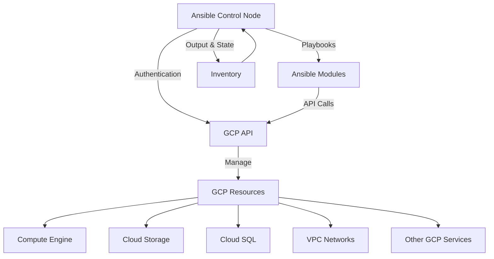

# Ansible GCP Integration

## Introduction

Ansible is a powerful open-source automation tool that allows you to configure systems, deploy software, and orchestrate advanced IT tasks. Google Cloud Platform (GCP) is one of the leading cloud providers that offers a wide range of services including compute, storage, networking, and more.

The integration between Ansible and GCP enables you to automate the provisioning, configuration, and management of your GCP resources using Ansible's declarative approach. This means you can define the desired state of your GCP infrastructure in simple YAML files and let Ansible handle the implementation details.

In this guide, we'll explore how to use Ansible for GCP automation, set up the necessary requirements, and work through practical examples that demonstrate the power of this integration.

## Prerequisites

Before we begin, you'll need:

- Ansible installed (version 2.9 or higher)
- Python 3.6 or higher
- GCP account with a project set up
- Basic knowledge of Ansible concepts (playbooks, modules, inventories)
- Basic understanding of GCP services

## Setting Up Ansible for GCP

### 1. Install Required Packages

First, let's install the necessary Python packages:

```bash
pip install ansible google-auth requests
```

### 2. Install GCP Collection

Ansible provides a collection specifically for GCP:

```bash
ansible-galaxy collection install google.cloud
```

### 3. Set Up Authentication

Ansible needs to authenticate with GCP. The recommended approach is using a service account:

1. Create a service account in the GCP Console
2. Assign appropriate roles to the service account
3. Download the service account key file (JSON)
4. Set the environment variable or configure the auth in your playbook:

```bash
export GCP_SERVICE_ACCOUNT_FILE=/path/to/your-service-account-file.json
```

## Basic GCP Module Usage

Let's start with a simple example of managing a GCP Compute Engine instance:

```yaml
---
- name: Create a GCP VM instance
  hosts: localhost
  gather_facts: false
  vars:
    gcp_project: your-project-id
    gcp_cred_kind: serviceaccount
    gcp_cred_file: /path/to/your-service-account-file.json
    zone: us-central1-a
    machine_type: e2-medium

  tasks:
    - name: Create a disk
      google.cloud.gcp_compute_disk:
        name: "ansible-disk"
        size_gb: 10
        source_image: "projects/debian-cloud/global/images/family/debian-10"
        zone: "{{ zone }}"
        project: "{{ gcp_project }}"
        auth_kind: "{{ gcp_cred_kind }}"
        service_account_file: "{{ gcp_cred_file }}"
        state: present
      register: disk

    - name: Create a VM instance
      google.cloud.gcp_compute_instance:
        name: "ansible-instance"
        machine_type: "{{ machine_type }}"
        disks:
          - auto_delete: true
            boot: true
            source: "{{ disk }}"
        network_interfaces:
          - network: null  # Uses the default network
            access_configs:
              - name: "External NAT"
                nat_ip: null
                type: "ONE_TO_ONE_NAT"
        zone: "{{ zone }}"
        project: "{{ gcp_project }}"
        auth_kind: "{{ gcp_cred_kind }}"
        service_account_file: "{{ gcp_cred_file }}"
        state: present
      register: instance

    - name: Show instance details
      debug:
        var: instance
```

This playbook:
1. Creates a disk with Debian 10 OS image
2. Provisions a VM instance using the created disk
3. Displays the resulting instance details

## Using Dynamic Inventory with GCP

Ansible can dynamically discover and inventory your GCP resources, making it easier to manage large-scale deployments.

### Setting Up Dynamic Inventory

Create a file named `gcp.yml` with the following content:

```yaml
plugin: google.cloud.gcp_compute
projects:
  - your-project-id
zones:
  - us-central1-a
  - us-central1-b
hostnames:
  - name
filters: []
auth_kind: serviceaccount
service_account_file: /path/to/your-service-account-file.json
```

You can then use this inventory with Ansible commands:

```bash
ansible-inventory -i gcp.yml --list
```

And in playbooks:

```yaml
---
- name: Manage GCP instances
  hosts: all
  gather_facts: false
  tasks:
    - name: Install Apache
      apt:
        name: apache2
        state: present
      become: true
      when: "'apache-servers' in group_names"
```

## Managing GCP Resources

Let's look at a more comprehensive example that manages multiple GCP resources:

### Creating a Complete GCP Environment

```yaml
---
- name: Set up a complete GCP environment
  hosts: localhost
  gather_facts: false
  vars:
    gcp_project: your-project-id
    gcp_cred_kind: serviceaccount
    gcp_cred_file: /path/to/your-service-account-file.json
    region: us-central1
    zone: us-central1-a

  tasks:
    # Create a VPC Network
    - name: Create a custom VPC network
      google.cloud.gcp_compute_network:
        name: "ansible-network"
        auto_create_subnetworks: false
        project: "{{ gcp_project }}"
        auth_kind: "{{ gcp_cred_kind }}"
        service_account_file: "{{ gcp_cred_file }}"
        state: present
      register: network

    # Create a Subnet
    - name: Create a subnet
      google.cloud.gcp_compute_subnetwork:
        name: "ansible-subnet"
        region: "{{ region }}"
        network: "{{ network }}"
        ip_cidr_range: "10.0.0.0/24"
        project: "{{ gcp_project }}"
        auth_kind: "{{ gcp_cred_kind }}"
        service_account_file: "{{ gcp_cred_file }}"
        state: present
      register: subnet

    # Create a Firewall Rule
    - name: Allow HTTP traffic
      google.cloud.gcp_compute_firewall:
        name: "allow-http"
        network: "{{ network }}"
        allowed:
          - ip_protocol: tcp
            ports:
              - '80'
        source_ranges:
          - '0.0.0.0/0'
        project: "{{ gcp_project }}"
        auth_kind: "{{ gcp_cred_kind }}"
        service_account_file: "{{ gcp_cred_file }}"
        state: present

    # Create Multiple VM Instances
    - name: Create VMs for web application
      google.cloud.gcp_compute_instance:
        name: "web-server-{{ item }}"
        machine_type: "e2-medium"
        disks:
          - auto_delete: true
            boot: true
            initialize_params:
              source_image: "projects/debian-cloud/global/images/family/debian-10"
              disk_size_gb: 10
        network_interfaces:
          - network: "{{ network }}"
            subnetwork: "{{ subnet }}"
            access_configs:
              - name: "External NAT"
                nat_ip: null
                type: "ONE_TO_ONE_NAT"
        tags:
          items:
            - http-server
            - web-server
        metadata:
          items:
            - key: startup-script
              value: |
                #!/bin/bash
                apt-get update
                apt-get install -y apache2
                echo "Hello from Ansible-managed GCP VM $(hostname)" > /var/www/html/index.html
        zone: "{{ zone }}"
        project: "{{ gcp_project }}"
        auth_kind: "{{ gcp_cred_kind }}"
        service_account_file: "{{ gcp_cred_file }}"
        state: present
      register: instances
      loop:
        - 1
        - 2
        - 3

    # Create a Load Balancer
    - name: Create a health check
      google.cloud.gcp_compute_health_check:
        name: "http-health-check"
        type: HTTP
        http_health_check:
          port: 80
          request_path: "/"
        project: "{{ gcp_project }}"
        auth_kind: "{{ gcp_cred_kind }}"
        service_account_file: "{{ gcp_cred_file }}"
        state: present
      register: health_check

    - name: Create a backend service
      google.cloud.gcp_compute_backend_service:
        name: "web-backend-service"
        health_checks:
          - "{{ health_check }}"
        backends:
          - group: "{{ item.selfLink }}"
            balancing_mode: "UTILIZATION"
            capacity_scaler: 1.0
        protocol: "HTTP"
        project: "{{ gcp_project }}"
        auth_kind: "{{ gcp_cred_kind }}"
        service_account_file: "{{ gcp_cred_file }}"
        state: present
      register: backend_service
      with_items: "{{ instances.results }}"
```

This playbook creates a complete environment including:
- Custom VPC network
- Subnet
- Firewall rules
- Multiple VM instances with Apache installed
- Load balancer configuration

## Using Ansible Variables and Templates with GCP

Ansible's templating capabilities allow us to create more dynamic and reusable playbooks:

### Creating a GCP Infrastructure Template

First, create a template file named `instance_template.j2`:

```jinja
---
name: "{{ instance_name }}"
machine_type: "{{ machine_type }}"
disks:
  - auto_delete: true
    boot: true
    initialize_params:
      source_image: "{{ image }}"
      disk_size_gb: {{ disk_size }}
network_interfaces:
  - network: null
    access_configs:
      - name: "External NAT"
        nat_ip: null
        type: "ONE_TO_ONE_NAT"


  items:

    - {{ tag }}


zone: "{{ zone }}"
```

Then, use this template in your playbook:

```yaml
---
- name: Deploy from template
  hosts: localhost
  gather_facts: false
  vars:
    gcp_project: your-project-id
    gcp_cred_kind: serviceaccount
    gcp_cred_file: /path/to/your-service-account-file.json
    zone: us-central1-a
    instances:
      - name: web-1
        machine_type: e2-medium
        disk_size: 10
        tags:
          - web
          - production
      - name: web-2
        machine_type: e2-medium
        disk_size: 10
        tags:
          - web
          - production
      - name: db-1
        machine_type: e2-standard-2
        disk_size: 50
        tags:
          - database
          - production

  tasks:
    - name: Create instances from template
      google.cloud.gcp_compute_instance:
        project: "{{ gcp_project }}"
        auth_kind: "{{ gcp_cred_kind }}"
        service_account_file: "{{ gcp_cred_file }}"
        state: present
        name: "{{ item.name }}"
        machine_type: "{{ item.machine_type }}"
        disks:
          - auto_delete: true
            boot: true
            initialize_params:
              source_image: "projects/debian-cloud/global/images/family/debian-10"
              disk_size_gb: "{{ item.disk_size }}"
        network_interfaces:
          - network: null
            access_configs:
              - name: "External NAT"
                nat_ip: null
                type: "ONE_TO_ONE_NAT"
        tags:
          items: "{{ item.tags }}"
        zone: "{{ zone }}"
      loop: "{{ instances }}"
```

## Working with Cloud Storage

Ansible can also manage GCP Storage resources:

```yaml
---
- name: Manage GCP Storage
  hosts: localhost
  gather_facts: false
  vars:
    gcp_project: your-project-id
    gcp_cred_kind: serviceaccount
    gcp_cred_file: /path/to/your-service-account-file.json
    
  tasks:
    # Create a bucket
    - name: Create a GCS bucket
      google.cloud.gcp_storage_bucket:
        name: "ansible-gcp-bucket-{{ gcp_project }}"
        project: "{{ gcp_project }}"
        auth_kind: "{{ gcp_cred_kind }}"
        service_account_file: "{{ gcp_cred_file }}"
        state: present
      register: bucket
      
    # Upload a file
    - name: Create a local file
      copy:
        content: "This is a test file created by Ansible"
        dest: "/tmp/test-file.txt"
        
    - name: Upload file to bucket
      google.cloud.gcp_storage_object:
        bucket: "{{ bucket.name }}"
        src: "/tmp/test-file.txt"
        dest: "uploaded-by-ansible/test-file.txt"
        project: "{{ gcp_project }}"
        auth_kind: "{{ gcp_cred_kind }}"
        service_account_file: "{{ gcp_cred_file }}"
        state: present
```

## Visualizing Ansible GCP Integration

Let's create a simple diagram to illustrate how Ansible integrates with GCP:



## Best Practices for Ansible GCP Integration

When working with Ansible and GCP, consider the following best practices:

1. **Use Service Accounts with Limited Permissions**
   - Follow the principle of least privilege
   - Create different service accounts for different environments

2. **Organize Your Playbooks**
   - Keep tasks modular and reusable
   - Use roles for complex infrastructure setups

3. **Use Variables and Templates**
   - Store environment-specific variables separately
   - Template complex configurations

4. **Manage State**
   - Be careful with `state: absent` operations
   - Use `--check` mode to preview changes

5. **Version Control Everything**
   - Store playbooks in a version control system
   - Use tags to mark stable versions

6. **Use Dynamic Inventory**
   - Leverage dynamic inventory for large-scale deployments
   - Group resources logically

## Example: Complete Web Application Deployment

Let's put everything together to deploy a complete web application:

```yaml
---
- name: Deploy Web Application to GCP
  hosts: localhost
  gather_facts: false
  vars:
    gcp_project: your-project-id
    gcp_cred_kind: serviceaccount
    gcp_cred_file: /path/to/your-service-account-file.json
    region: us-central1
    zone: us-central1-a
    app_name: my-web-app
    instance_count: 2
    
  tasks:
    # Create VPC
    - name: Create VPC network
      google.cloud.gcp_compute_network:
        name: "{{ app_name }}-network"
        auto_create_subnetworks: false
        project: "{{ gcp_project }}"
        auth_kind: "{{ gcp_cred_kind }}"
        service_account_file: "{{ gcp_cred_file }}"
        state: present
      register: network

    # Create subnet
    - name: Create subnet
      google.cloud.gcp_compute_subnetwork:
        name: "{{ app_name }}-subnet"
        region: "{{ region }}"
        network: "{{ network }}"
        ip_cidr_range: "10.0.0.0/24"
        project: "{{ gcp_project }}"
        auth_kind: "{{ gcp_cred_kind }}"
        service_account_file: "{{ gcp_cred_file }}"
        state: present
      register: subnet

    # Create firewall rules
    - name: Create firewall rules
      google.cloud.gcp_compute_firewall:
        name: "{{ app_name }}-{{ item.name }}"
        network: "{{ network }}"
        allowed: "{{ item.allowed }}"
        source_ranges: "{{ item.source_ranges }}"
        project: "{{ gcp_project }}"
        auth_kind: "{{ gcp_cred_kind }}"
        service_account_file: "{{ gcp_cred_file }}"
        state: present
      loop:
        - name: allow-http
          allowed:
            - ip_protocol: tcp
              ports:
                - '80'
          source_ranges:
            - '0.0.0.0/0'
        - name: allow-ssh
          allowed:
            - ip_protocol: tcp
              ports:
                - '22'
          source_ranges:
            - '0.0.0.0/0'

    # Create instance template
    - name: Create instance template
      google.cloud.gcp_compute_instance_template:
        name: "{{ app_name }}-template"
        properties:
          machine_type: e2-medium
          disks:
            - auto_delete: true
              boot: true
              initialize_params:
                source_image: "projects/debian-cloud/global/images/family/debian-10"
          network_interfaces:
            - network: "{{ network }}"
              subnetwork: "{{ subnet }}"
              access_configs:
                - name: "External NAT"
                  type: "ONE_TO_ONE_NAT"
          metadata:
            items:
              - key: startup-script
                value: |
                  #!/bin/bash
                  apt-get update
                  apt-get install -y apache2 git
                  git clone https://github.com/example/web-app.git /var/www/html/
                  systemctl restart apache2
          tags:
            items:
              - http-server
              - web-app
        project: "{{ gcp_project }}"
        auth_kind: "{{ gcp_cred_kind }}"
        service_account_file: "{{ gcp_cred_file }}"
        state: present
      register: template

    # Create instance group
    - name: Create managed instance group
      google.cloud.gcp_compute_instance_group_manager:
        name: "{{ app_name }}-igm"
        base_instance_name: "{{ app_name }}"
        instance_template: "{{ template }}"
        target_size: "{{ instance_count }}"
        zone: "{{ zone }}"
        project: "{{ gcp_project }}"
        auth_kind: "{{ gcp_cred_kind }}"
        service_account_file: "{{ gcp_cred_file }}"
        state: present
      register: instance_group

    # Create health check
    - name: Create HTTP health check
      google.cloud.gcp_compute_health_check:
        name: "{{ app_name }}-health-check"
        type: HTTP
        http_health_check:
          port: 80
          request_path: "/"
        project: "{{ gcp_project }}"
        auth_kind: "{{ gcp_cred_kind }}"
        service_account_file: "{{ gcp_cred_file }}"
        state: present
      register: health_check

    # Create backend service
    - name: Create backend service
      google.cloud.gcp_compute_backend_service:
        name: "{{ app_name }}-backend"
        backends:
          - group: "{{ instance_group.instanceGroup }}"
        health_checks:
          - "{{ health_check }}"
        protocol: "HTTP"
        region: "{{ region }}"
        project: "{{ gcp_project }}"
        auth_kind: "{{ gcp_cred_kind }}"
        service_account_file: "{{ gcp_cred_file }}"
        state: present
      register: backend_service

    # Create URL map
    - name: Create URL map
      google.cloud.gcp_compute_url_map:
        name: "{{ app_name }}-url-map"
        default_service: "{{ backend_service }}"
        project: "{{ gcp_project }}"
        auth_kind: "{{ gcp_cred_kind }}"
        service_account_file: "{{ gcp_cred_file }}"
        state: present
      register: url_map

    # Create HTTP proxy
    - name: Create HTTP proxy
      google.cloud.gcp_compute_target_http_proxy:
        name: "{{ app_name }}-http-proxy"
        url_map: "{{ url_map }}"
        project: "{{ gcp_project }}"
        auth_kind: "{{ gcp_cred_kind }}"
        service_account_file: "{{ gcp_cred_file }}"
        state: present
      register: http_proxy

    # Create forwarding rule
    - name: Create forwarding rule
      google.cloud.gcp_compute_global_forwarding_rule:
        name: "{{ app_name }}-forwarding-rule"
        target: "{{ http_proxy }}"
        port_range: "80-80"
        project: "{{ gcp_project }}"
        auth_kind: "{{ gcp_cred_kind }}"
        service_account_file: "{{ gcp_cred_file }}"
        state: present
      register: forwarding_rule

    # Output the public IP
    - name: Display app URL
      debug:
        msg: "Application deployed! Access it at: http://{{ forwarding_rule.IPAddress }}"
```

This playbook demonstrates a complete web application deployment including:
1. Network infrastructure
2. Instance templates and managed instance groups
3. Load balancing
4. Health checks
5. HTTP proxies and forwarding rules

## Troubleshooting Ansible GCP Integration

If you encounter issues with your Ansible GCP integration, consider these troubleshooting steps:

1. **Authentication Issues**
   - Verify service account credentials are correct
   - Check permissions of the service account
   - Validate environment variables

2. **Module Errors**
   - Ensure you're using the correct module version
   - Check parameter syntax and requirements
   - Review GCP API quotas and limits

3. **Debugging Tips**
   - Use the `-vvv` flag for verbose output
   - Check GCP Activity Logs for API errors
   - Use `register` and `debug` tasks to inspect variables

Example debugging playbook:

```yaml
---
- name: Debug GCP Connection
  hosts: localhost
  gather_facts: false
  vars:
    gcp_project: your-project-id
    gcp_cred_kind: serviceaccount
    gcp_cred_file: /path/to/your-service-account-file.json
    
  tasks:
    - name: Verify authentication
      google.cloud.gcp_compute_disk_info:
        zone: us-central1-a
        project: "{{ gcp_project }}"
        auth_kind: "{{ gcp_cred_kind }}"
        service_account_file: "{{ gcp_cred_file }}"
      register: result
      
    - name: Display result
      debug:
        var: result
        verbosity: 0
```

## Summary

In this guide, we've explored how to integrate Ansible with Google Cloud Platform to automate cloud infrastructure management. We've covered:

- Setting up Ansible for GCP
- Creating basic GCP resources with Ansible modules
- Using dynamic inventory for managing GCP instances
- Deploying complete infrastructure stacks
- Using templates and variables for more flexible deployments
- Managing cloud storage resources
- Best practices and troubleshooting tips

Ansible's integration with GCP provides a powerful way to manage cloud resources using Infrastructure as Code principles, enabling you to create reproducible, version-controlled, and automated cloud deployments.

## Additional Resources

To further your learning about Ansible GCP integration, consider these resources:

1. [Ansible GCP Collection Documentation](https://docs.ansible.com/ansible/latest/collections/google/cloud/)
2. [Google Cloud Platform Documentation](https://cloud.google.com/docs)
3. [Ansible Best Practices](https://docs.ansible.com/ansible/latest/user_guide/playbooks_best_practices.html)

## Exercises

To practice your skills, try these exercises:

1. Create a playbook that deploys a three-tier web application (web, application, database) on GCP.
2. Modify the example playbooks to use Ansible Vault for securing GCP credentials.
3. Create a dynamic inventory script that groups GCP instances by their tags or labels.
4. Implement a blue-green deployment strategy using Ansible and GCP instance groups.
5. Automate the backup of a GCP VM instance using snapshots and scheduled Ansible playbooks.