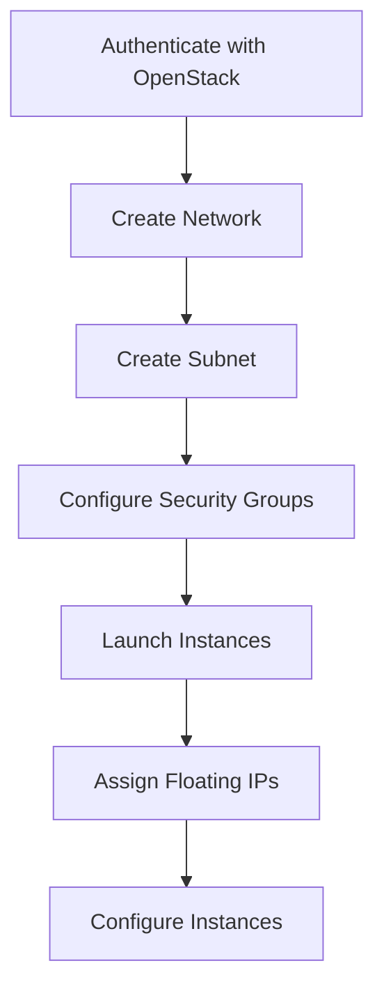

# Ansible OpenStack Integration

## Introduction

OpenStack is a powerful open-source cloud computing platform that allows you to manage and provision large pools of compute, storage, and networking resources through a datacenter. When combined with Ansible's automation capabilities, you can programmatically control your OpenStack infrastructure, making it easier to deploy, scale, and manage cloud resources.

In this guide, we'll explore how to integrate Ansible with OpenStack to automate cloud infrastructure management. You'll learn how to authenticate with OpenStack, create and manage cloud resources, and build complex infrastructure deployments using Ansible playbooks.

## Prerequisites

Before we begin, you should have:

- Basic understanding of Ansible concepts (playbooks, inventory, modules)
- Basic knowledge of cloud computing concepts
- Ansible installed (version 2.9+)
- Access to an OpenStack cloud environment
- Python `openstacksdk` package installed on your control node

You can install the required OpenStack SDK using pip:

```bash
pip install openstacksdk
```

## Setting Up OpenStack Authentication

To interact with OpenStack, Ansible needs to authenticate. OpenStack uses credentials typically stored in a file called `clouds.yaml`.

### Creating the clouds.yaml File

Create a `clouds.yaml` file in one of these locations:
- Current directory
- `~/.config/openstack/`
- `/etc/openstack/`

Here's an example `clouds.yaml` file:

```yaml
clouds:
  mycloud:
    auth:
      auth_url: https://openstack.example.com:5000/v3
      username: "your-username"
      password: "your-password"
      project_name: "your-project"
      project_domain_name: "Default"
      user_domain_name: "Default"
    region_name: "RegionOne"
    interface: "public"
    identity_api_version: 3
```

### Using Environment Variables

Alternatively, you can use environment variables:

```bash
export OS_AUTH_URL=https://openstack.example.com:5000/v3
export OS_USERNAME=your-username
export OS_PASSWORD=your-password
export OS_PROJECT_NAME=your-project
export OS_PROJECT_DOMAIN_NAME=Default
export OS_USER_DOMAIN_NAME=Default
export OS_REGION_NAME=RegionOne
export OS_INTERFACE=public
export OS_IDENTITY_API_VERSION=3
```

## Basic OpenStack Inventory

Ansible can dynamically discover and inventory your OpenStack resources. Create a file named `openstack_inventory.yml`:

```yaml
plugin: openstack
fail_on_errors: false
expand_hostvars: true
inventory_hostname: name
```

Then use it with:

```bash
ansible-inventory -i openstack_inventory.yml --list
```

## Core OpenStack Modules in Ansible

Ansible provides several modules for interacting with OpenStack services:

### Authentication Modules

- `os_auth`: Retrieve an auth token
- `os_client_config`: Get OpenStack client configuration

### Compute Modules

- `os_server`: Manage OpenStack compute instances
- `os_server_info`: Retrieve information about servers
- `os_keypair`: Add/remove SSH keypairs

### Network Modules

- `os_network`: Manage OpenStack networks
- `os_subnet`: Create and manage subnets
- `os_router`: Control OpenStack routers
- `os_port`: Manage network ports
- `os_floating_ip`: Assign/remove floating IPs

### Storage Modules

- `os_volume`: Manage block storage volumes
- `os_volume_snapshot`: Create and manage volume snapshots

### Identity Modules

- `os_user`: Manage OpenStack Identity users
- `os_project`: Manage OpenStack Identity projects

## Basic Examples

Let's start with some basic examples of using Ansible with OpenStack.

### Creating a Network

```yaml
- name: Create a network
  os_network:
    cloud: mycloud
    state: present
    name: my_ansible_network
    external: false
  register: network_result

- name: Show network result
  debug:
    var: network_result
```

### Creating a Subnet

```yaml
- name: Create a subnet
  os_subnet:
    cloud: mycloud
    state: present
    network_name: my_ansible_network
    name: my_ansible_subnet
    cidr: 192.168.0.0/24
    dns_nameservers:
      - 8.8.8.8
      - 8.8.4.4
  register: subnet_result
```

### Launching an Instance

```yaml
- name: Launch an instance
  os_server:
    cloud: mycloud
    state: present
    name: my_ansible_instance
    image: ubuntu-20.04
    flavor: m1.small
    network: my_ansible_network
    security_groups: default
    key_name: my_ssh_key
    wait: yes
  register: server_result
```

## Advanced OpenStack Workflow

Let's build a complete infrastructure deployment workflow:



### Complete Deployment Playbook

Here's a complete playbook that creates a basic OpenStack infrastructure:

```yaml
---
- name: Deploy OpenStack Infrastructure
  hosts: localhost
  gather_facts: false
  vars:
    cloud: mycloud
    key_name: my_ansible_key
    network_name: ansible_network
    subnet_name: ansible_subnet
    router_name: ansible_router
    instance_name: ansible_instance
    security_group_name: ansible_secgroup
    image: ubuntu-20.04
    flavor: m1.small
    public_network: public

  tasks:
    - name: Create network
      os_network:
        cloud: "{{ cloud }}"
        state: present
        name: "{{ network_name }}"
      register: network

    - name: Create subnet
      os_subnet:
        cloud: "{{ cloud }}"
        state: present
        network_name: "{{ network_name }}"
        name: "{{ subnet_name }}"
        cidr: 192.168.10.0/24
        dns_nameservers:
          - 8.8.8.8
      register: subnet

    - name: Create router
      os_router:
        cloud: "{{ cloud }}"
        state: present
        name: "{{ router_name }}"
        network: "{{ public_network }}"
        interfaces:
          - "{{ subnet_name }}"

    - name: Create security group
      os_security_group:
        cloud: "{{ cloud }}"
        state: present
        name: "{{ security_group_name }}"
        description: Security group for Ansible-managed instances

    - name: Allow SSH access
      os_security_group_rule:
        cloud: "{{ cloud }}"
        security_group: "{{ security_group_name }}"
        protocol: tcp
        port_range_min: 22
        port_range_max: 22
        remote_ip_prefix: 0.0.0.0/0

    - name: Allow HTTP access
      os_security_group_rule:
        cloud: "{{ cloud }}"
        security_group: "{{ security_group_name }}"
        protocol: tcp
        port_range_min: 80
        port_range_max: 80
        remote_ip_prefix: 0.0.0.0/0

    - name: Create instance
      os_server:
        cloud: "{{ cloud }}"
        state: present
        name: "{{ instance_name }}"
        image: "{{ image }}"
        flavor: "{{ flavor }}"
        key_name: "{{ key_name }}"
        security_groups: "{{ security_group_name }}"
        networks:
          - name: "{{ network_name }}"
        wait: yes
      register: instance

    - name: Assign floating IP
      os_floating_ip:
        cloud: "{{ cloud }}"
        state: present
        server: "{{ instance_name }}"
        network: "{{ public_network }}"
        wait: yes
        timeout: 180
      register: floating_ip

    - name: Display instance info
      debug:
        msg: "Instance created with IP: {{ floating_ip.floating_ip.floating_ip_address }}"
```

### Execution and Output

When you run this playbook:

```bash
ansible-playbook deploy_openstack.yml
```

You should see output similar to:

```
PLAY [Deploy OpenStack Infrastructure] **************************************

TASK [Create network] ******************************************************
changed: [localhost]

TASK [Create subnet] *******************************************************
changed: [localhost]

...

TASK [Display instance info] ***********************************************
ok: [localhost] => {
    "msg": "Instance created with IP: 203.0.113.42"
}

PLAY RECAP ****************************************************************
localhost                  : ok=8    changed=7    unreachable=0    failed=0
```

## Real-World Application: Deploying a Web Application

Let's extend our example to deploy a web server:

```yaml
---
- name: Deploy OpenStack Web Infrastructure
  hosts: localhost
  gather_facts: false
  vars:
    cloud: mycloud
    key_name: my_ansible_key
    network_name: web_network
    subnet_name: web_subnet
    router_name: web_router
    web_instance_name: web_server
    db_instance_name: db_server
    security_group_name: web_secgroup
    image: ubuntu-20.04
    web_flavor: m1.medium
    db_flavor: m1.large
    public_network: public

  tasks:
    # Network infrastructure tasks as above...

    - name: Create web server
      os_server:
        cloud: "{{ cloud }}"
        state: present
        name: "{{ web_instance_name }}"
        image: "{{ image }}"
        flavor: "{{ web_flavor }}"
        key_name: "{{ key_name }}"
        security_groups: "{{ security_group_name }}"
        networks:
          - name: "{{ network_name }}"
        wait: yes
        userdata: |
          #!/bin/bash
          apt-get update
          apt-get install -y nginx
          echo "<h1>Deployed with Ansible and OpenStack</h1>" > /var/www/html/index.html
      register: web_instance

    - name: Create database server
      os_server:
        cloud: "{{ cloud }}"
        state: present
        name: "{{ db_instance_name }}"
        image: "{{ image }}"
        flavor: "{{ db_flavor }}"
        key_name: "{{ key_name }}"
        security_groups: "{{ security_group_name }}"
        networks:
          - name: "{{ network_name }}"
        wait: yes
      register: db_instance

    - name: Assign floating IP to web server
      os_floating_ip:
        cloud: "{{ cloud }}"
        state: present
        server: "{{ web_instance_name }}"
        network: "{{ public_network }}"
        wait: yes
      register: web_floating_ip

    - name: Add instances to inventory
      add_host:
        name: "{{ web_floating_ip.floating_ip.floating_ip_address }}"
        groups: web_servers
        ansible_ssh_user: ubuntu
        ansible_ssh_private_key_file: "~/.ssh/{{ key_name }}"

- name: Configure web server
  hosts: web_servers
  become: yes
  tasks:
    - name: Install additional packages
      apt:
        name: 
          - php-fpm
          - php-mysql
        state: present
        update_cache: yes

    - name: Configure Nginx for PHP
      copy:
        dest: /etc/nginx/sites-available/default
        content: |
          server {
              listen 80 default_server;
              root /var/www/html;
              index index.php index.html index.htm;

              location / {
                  try_files $uri $uri/ =404;
              }

              location ~ \.php$ {
                  include snippets/fastcgi-php.conf;
                  fastcgi_pass unix:/var/run/php/php7.4-fpm.sock;
              }
          }
      notify: restart nginx

  handlers:
    - name: restart nginx
      service:
        name: nginx
        state: restarted
```

## Handling State and Idempotency

Ansible's OpenStack modules are designed to be idempotent, meaning they can be run multiple times without changing the result beyond the initial application.

To delete resources when they're no longer needed, set `state: absent`:

```yaml
- name: Remove instance
  os_server:
    cloud: mycloud
    state: absent
    name: my_ansible_instance
    timeout: 200
```

## Using OpenStack Inventory with Dynamic Groups

You can organize your OpenStack inventory into dynamic groups based on metadata:

```yaml
# openstack_inventory.yml
plugin: openstack
strict: false
fail_on_errors: false
expand_hostvars: true
inventory_hostname: name
compose:
  # Set ansible_host to the first public IP address
  ansible_host: (public_v4 or public_v6 or private_v4 or private_v6)
groups:
  # Add all instances to their respective groups based on metadata
  webserver: metadata.role == 'web'
  database: metadata.role == 'db'
  production: metadata.environment == 'production'
  development: metadata.environment == 'development'
```

When launching instances, set metadata:

```yaml
- name: Create web server
  os_server:
    # ... other parameters ...
    metadata:
      role: web
      environment: production
```

## OpenStack Inventory in Action

Let's see how to use dynamic inventory with a simple playbook:

```yaml
---
# site.yml
- name: Configure all servers
  hosts: all
  become: yes
  tasks:
    - name: Install common packages
      apt:
        name: ["htop", "vim", "tmux"]
        state: present
        update_cache: yes

- name: Configure web servers
  hosts: webserver
  become: yes
  tasks:
    - name: Install web server packages
      apt:
        name: ["nginx", "php-fpm"]
        state: present

- name: Configure database servers
  hosts: database
  become: yes
  tasks:
    - name: Install database packages
      apt:
        name: ["mysql-server"]
        state: present
```

Run with:

```bash
ansible-playbook -i openstack_inventory.yml site.yml
```

## Advanced Techniques

### Using OpenStack Server Metadata for Configuration

You can store server configuration details in metadata and retrieve them in your playbooks:

```yaml
- name: Get server details
  os_server_info:
    cloud: mycloud
    server: "{{ instance_name }}"
  register: server_info

- name: Configure server based on metadata
  debug:
    msg: "Server role is {{ server_info.openstack_servers[0].metadata.role }}"
```

### Server Groups for Instance Affinity

You can use server groups to control instance placement:

```yaml
- name: Create server group
  os_server_group:
    cloud: mycloud
    name: app_server_group
    policies:
      - anti-affinity
  register: server_group

- name: Create instances in server group
  os_server:
    cloud: mycloud
    name: "app-server-{{ item }}"
    image: ubuntu-20.04
    flavor: m1.medium
    scheduler_hints:
      group: "{{ server_group.id }}"
    # ... other parameters ...
  loop: [1, 2, 3]
```

### Using Ansible's os_stack Module for Heat Templates

Heat is OpenStack's orchestration service. You can use the `os_stack` module to deploy complex templates:

```yaml
- name: Create stack from Heat template
  os_stack:
    cloud: mycloud
    name: application-stack
    template: "{{ lookup('file', 'templates/app_stack.yaml') }}"
    parameters:
      image: ubuntu-20.04
      flavor: m1.medium
      key_name: my_ansible_key
      public_network: public
    wait: yes
  register: stack
```

## Performance Optimization and Best Practices

### Use Nova Server Groups for Placement

Control where your instances are placed:

```yaml
- name: Create anti-affinity server group
  os_server_group:
    cloud: mycloud
    name: web_ha_group
    policies:
      - anti-affinity
  register: ha_group

- name: Launch HA web servers
  os_server:
    cloud: mycloud
    name: "web-{{ item }}"
    # ... other parameters ...
    scheduler_hints:
      group: "{{ ha_group.id }}"
  loop: [1, 2, 3]
```

### Use Wait and Timeout Parameters

Ensure your instances are fully created before proceeding:

```yaml
- name: Create instance
  os_server:
    # ... other parameters ...
    wait: yes
    timeout: 600  # 10 minutes
```

### Use Tags for Resource Management

Apply tags to resources for easier management:

```yaml
- name: Create tagged resources
  os_network:
    cloud: mycloud
    name: app_network
    state: present
    tags:
      - project:webapp
      - environment:production
```

## Troubleshooting Common Issues

### Authentication Issues

If you encounter authentication errors:

1. Verify your `clouds.yaml` file contains correct credentials
2. Check environment variables if using them instead
3. Ensure the project/domain information is correct
4. Verify API endpoint URLs

### Connectivity Issues

If instances can't communicate:

1. Check security group rules to ensure proper access
2. Verify subnet CIDR ranges don't overlap
3. Ensure router interfaces are properly connected
4. Check if gateway is properly set up

### Resource Quota Limitations

If you hit quota limits:

1. Use `openstack quota show` to check your current limits
2. Request quota increases if needed
3. Clean up unused resources to free up quota

## Summary

Ansible's integration with OpenStack provides a powerful way to automate cloud infrastructure management. By using Ansible playbooks, you can:

1. Create and manage networking components like networks, subnets, and routers
2. Launch and configure instances with specific properties
3. Apply security groups and firewall rules
4. Organize resources with metadata and tags
5. Orchestrate complex deployments across multiple resources

This automation reduces human error, increases deployment speed, and allows for consistent, repeatable infrastructure provisioning. With Ansible and OpenStack, you can manage your cloud resources using infrastructure-as-code principles, making your deployments more reliable and easier to maintain.

## Additional Resources

Here are some additional resources to further your learning:

- **Practice Exercises:**
  1. Create a multi-tier application with web, app, and database servers
  2. Set up a load-balanced web application with high availability
  3. Build a CI/CD pipeline on OpenStack using Ansible

- **Useful Documentation:**
  - [Ansible OpenStack Module Documentation](https://docs.ansible.com/ansible/latest/collections/openstack/cloud/index.html)
  - [OpenStack User Guide](https://docs.openstack.org/users/)
  - [Ansible Best Practices](https://docs.ansible.com/ansible/latest/user_guide/playbooks_best_practices.html)