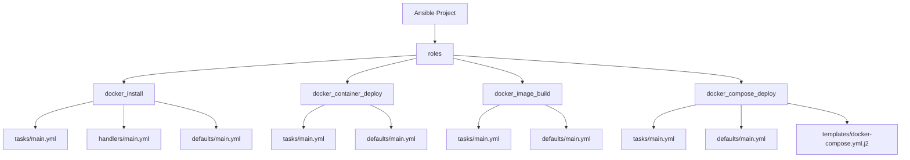

# Ansible Docker Integration

## Introduction

Docker has revolutionized how we package and deploy applications, while Ansible excels at automation and configuration management. When combined, these technologies create a powerful solution for managing containerized environments at scale. This guide explores how to integrate Ansible with Docker to automate container deployment, configuration, and orchestration tasks.

Ansible's Docker integration allows you to:
- Deploy and manage Docker containers consistently across multiple hosts
- Automate Docker image building and distribution
- Orchestrate multi-container applications
- Implement infrastructure-as-code practices for containerized environments

## Prerequisites

Before diving into Ansible Docker integration, ensure you have:

- Basic knowledge of Ansible concepts (playbooks, roles, modules)
- Docker installed on your control node and target hosts
- Ansible 2.10+ installed (for the latest Docker modules)
- Basic understanding of containerization concepts

## Ansible Docker Modules

Ansible provides several modules specifically designed for Docker interaction:

| Module | Purpose |
| ------ | ------- |
| `docker_container` | Manage Docker containers |
| `docker_image` | Manage Docker images |
| `docker_network` | Manage Docker networks |
| `docker_volume` | Manage Docker volumes |
| `docker_compose` | Manage multi-container applications with Docker Compose |

## Installing Docker with Ansible

Before working with containers, you might need to install Docker on your hosts. Here's an Ansible playbook to do just that:

```yaml
---
- name: Install Docker on target hosts
  hosts: docker_hosts
  become: true
  tasks:
    - name: Install required packages
      ansible.builtin.apt:
        name:
          - apt-transport-https
          - ca-certificates
          - curl
          - gnupg
          - lsb-release
        state: present
        update_cache: yes

    - name: Add Docker GPG key
      ansible.builtin.apt_key:
        url: https://download.docker.com/linux/ubuntu/gpg
        state: present

    - name: Add Docker repository
      ansible.builtin.apt_repository:
        repo: "deb [arch=amd64] https://download.docker.com/linux/ubuntu {{ ansible_distribution_release }} stable"
        state: present

    - name: Install Docker Engine
      ansible.builtin.apt:
        name:
          - docker-ce
          - docker-ce-cli
          - containerd.io
        state: present
        update_cache: yes

    - name: Ensure Docker service is started and enabled
      ansible.builtin.service:
        name: docker
        state: started
        enabled: yes

    - name: Add current user to docker group
      ansible.builtin.user:
        name: "{{ ansible_user }}"
        groups: docker
        append: yes
```

## Managing Docker Containers with Ansible

### Basic Container Deployment

Let's start with a simple example of deploying a Nginx container:

```yaml
---
- name: Deploy Nginx container
  hosts: web_servers
  tasks:
    - name: Pull Nginx image
      docker_image:
        name: nginx:latest
        source: pull

    - name: Create Nginx container
      docker_container:
        name: web_server
        image: nginx:latest
        ports:
          - "80:80"
        restart_policy: always
        state: started
```

### Managing Container State

You can use Ansible to ensure containers are in specific states:

```yaml
- name: Restart a container
  docker_container:
    name: web_server
    state: started
    restart: yes

- name: Stop a container
  docker_container:
    name: web_server
    state: stopped

- name: Remove a container
  docker_container:
    name: web_server
    state: absent
    force_kill: yes
```

## Building Custom Docker Images

Ansible can automate the image building process:

```yaml
---
- name: Build custom Docker image
  hosts: docker_builder
  tasks:
    - name: Create Dockerfile directory
      ansible.builtin.file:
        path: /tmp/docker_build
        state: directory

    - name: Copy Dockerfile
      ansible.builtin.copy:
        content: |
          FROM python:3.9-slim
          WORKDIR /app
          COPY app.py .
          RUN pip install flask
          EXPOSE 5000
          CMD ["python", "app.py"]
        dest: /tmp/docker_build/Dockerfile

    - name: Copy application file
      ansible.builtin.copy:
        content: |
          from flask import Flask
          app = Flask(__name__)
          
          @app.route('/')
          def hello():
              return "Hello from a Docker container managed by Ansible!"
          
          if __name__ == '__main__':
              app.run(host='0.0.0.0')
        dest: /tmp/docker_build/app.py

    - name: Build custom image
      docker_image:
        name: my-flask-app
        build:
          path: /tmp/docker_build
        source: build
        tag: v1.0
```

## Working with Docker Networks

Create and manage Docker networks for container communication:

```yaml
---
- name: Set up Docker network
  hosts: docker_hosts
  tasks:
    - name: Create a bridge network
      docker_network:
        name: app_network
        driver: bridge

    - name: Deploy container on custom network
      docker_container:
        name: networked_app
        image: nginx:latest
        networks:
          - name: app_network
```

## Volume Management

Manage persistent storage for your containers:

```yaml
---
- name: Configure Docker volumes
  hosts: docker_hosts
  tasks:
    - name: Create a Docker volume
      docker_volume:
        name: data_volume

    - name: Deploy container with mounted volume
      docker_container:
        name: data_container
        image: postgres:13
        volumes:
          - data_volume:/var/lib/postgresql/data
        env:
          POSTGRES_PASSWORD: secure_password
```

## Docker Compose Integration

For multi-container applications, Ansible can work with Docker Compose:

```yaml
---
- name: Deploy application with Docker Compose
  hosts: app_server
  tasks:
    - name: Create project directory
      ansible.builtin.file:
        path: /opt/my_webapp
        state: directory

    - name: Copy docker-compose file
      ansible.builtin.copy:
        content: |
          version: '3'
          services:
            web:
              image: nginx:latest
              ports:
                - "80:80"
              volumes:
                - ./html:/usr/share/nginx/html
            api:
              image: my-flask-app:v1.0
              ports:
                - "5000:5000"
              environment:
                - DB_HOST=db
            db:
              image: postgres:13
              volumes:
                - db_data:/var/lib/postgresql/data
              environment:
                - POSTGRES_PASSWORD=secure_password
          volumes:
            db_data:
        dest: /opt/my_webapp/docker-compose.yml

    - name: Create HTML content directory
      ansible.builtin.file:
        path: /opt/my_webapp/html
        state: directory

    - name: Create index.html
      ansible.builtin.copy:
        content: |
          <!DOCTYPE html>
          <html>
          <head>
            <title>Ansible Docker Integration</title>
          </head>
          <body>
            <h1>Hello from Nginx managed by Ansible!</h1>
            <p>This container is part of a multi-container setup.</p>
          </body>
          </html>
        dest: /opt/my_webapp/html/index.html

    - name: Deploy with Docker Compose
      docker_compose:
        project_src: /opt/my_webapp
        state: present
```

## Ansible Roles for Docker Management

For more maintainable code, organize your Docker automation tasks into Ansible roles. Here's a structure example:



### Example Role Usage

Create a playbook that leverages roles for Docker management:

```yaml
---
- name: Full Docker environment setup
  hosts: docker_servers
  become: true
  roles:
    - role: docker_install
    - role: docker_image_build
      vars:
        app_version: "1.2.0"
    - role: docker_container_deploy
      vars:
        container_name: "web_app"
        container_ports:
          - "80:80"
          - "443:443"
```

## Best Practices

1. **Use Variables**: Parameterize your playbooks to make them reusable across environments.

```yaml
---
- name: Deploy container with variables
  hosts: docker_hosts
  vars:
    container_name: app_server
    image_name: nginx
    image_tag: latest
    container_ports:
      - "80:80"
  tasks:
    - name: Create container
      docker_container:
        name: "{{ container_name }}"
        image: "{{ image_name }}:{{ image_tag }}"
        ports: "{{ container_ports }}"
```

2. **Implement Idempotency**: Ensure your playbooks can be run multiple times without causing problems.

3. **Use Tags**: Add tags to tasks for selective execution.

```yaml
---
- name: Docker management
  hosts: docker_hosts
  tasks:
    - name: Pull images
      docker_image:
        name: nginx:latest
        source: pull
      tags: [images, pull]

    - name: Start containers
      docker_container:
        name: web
        image: nginx:latest
        state: started
      tags: [containers, start]
```

4. **Implement CI/CD Pipelines**: Use Ansible for Docker deployments within your CI/CD workflow.

## Real-World Example: Deploying a Web Application

Let's see a complete example deploying a web application with a database:

```yaml
---
- name: Deploy Web Application Stack
  hosts: production_servers
  become: true
  vars:
    app_name: my_web_app
    app_version: v1.2
    db_password: "{{ vault_db_password }}"  # Use Ansible Vault for sensitive data
  
  tasks:
    - name: Ensure Docker is installed
      ansible.builtin.include_role:
        name: docker_install

    - name: Create application network
      docker_network:
        name: "{{ app_name }}_network"
        driver: bridge

    - name: Create database volume
      docker_volume:
        name: "{{ app_name }}_db_data"

    - name: Deploy database container
      docker_container:
        name: "{{ app_name }}_db"
        image: postgres:13
        networks:
          - name: "{{ app_name }}_network"
        volumes:
          - "{{ app_name }}_db_data:/var/lib/postgresql/data"
        env:
          POSTGRES_PASSWORD: "{{ db_password }}"
          POSTGRES_USER: app_user
          POSTGRES_DB: app_database
        restart_policy: always

    - name: Deploy application container
      docker_container:
        name: "{{ app_name }}"
        image: "mycompany/webapp:{{ app_version }}"
        networks:
          - name: "{{ app_name }}_network"
        ports:
          - "80:8080"
        env:
          DB_HOST: "{{ app_name }}_db"
          DB_USER: app_user
          DB_PASSWORD: "{{ db_password }}"
          DB_NAME: app_database
        restart_policy: always
        state: started

    - name: Check if application is running
      ansible.builtin.uri:
        url: "http://localhost:80/health"
        status_code: 200
      register: health_check
      retries: 5
      delay: 10
      until: health_check.status == 200
```

## Ansible Container: Running Ansible in Docker

You can also run Ansible itself from within a Docker container, which is useful for CI/CD pipelines:

```yaml
---
- name: Demonstrate Ansible in Docker
  hosts: localhost
  tasks:
    - name: Run Ansible in Docker container
      docker_container:
        name: ansible_runner
        image: ansible/ansible-runner
        command: >
          ansible-playbook -i /playbooks/inventory /playbooks/deploy.yml
        volumes:
          - ./playbooks:/playbooks:ro
        detach: false
        cleanup: yes
```

## Monitoring Docker Containers

Use Ansible to deploy monitoring solutions for your Docker containers:

```yaml
---
- name: Set up container monitoring
  hosts: docker_hosts
  tasks:
    - name: Deploy Prometheus container
      docker_container:
        name: prometheus
        image: prom/prometheus:latest
        ports:
          - "9090:9090"
        volumes:
          - prometheus_data:/prometheus
          - ./prometheus.yml:/etc/prometheus/prometheus.yml:ro

    - name: Deploy Grafana container
      docker_container:
        name: grafana
        image: grafana/grafana:latest
        ports:
          - "3000:3000"
        volumes:
          - grafana_data:/var/lib/grafana
        links:
          - prometheus
```

## Troubleshooting Common Issues

Here are solutions to common issues you might encounter:

### Connection Issues

If Ansible can't connect to the Docker daemon:

```yaml
- name: Configure Docker socket permissions
  ansible.builtin.file:
    path: /var/run/docker.sock
    mode: '0666'
  become: true
```

### Image Pulling Failures

For private registry authentication:

```yaml
- name: Log in to private Docker registry
  docker_login:
    registry: private-registry.example.com
    username: "{{ registry_username }}"
    password: "{{ registry_password }}"
```

## Summary

Ansible's Docker integration provides a powerful way to automate and orchestrate containerized environments. By using Ansible to manage Docker containers, you can:

- Ensure consistent deployment across development, testing, and production environments
- Automate repetitive tasks like container creation, image building, and configuration
- Implement infrastructure as code for your containerized applications
- Orchestrate complex multi-container setups with minimal effort

The combination of Ansible's automation capabilities with Docker's containerization technology creates a robust foundation for modern DevOps practices.

## Additional Resources

To further enhance your Ansible Docker integration skills:

- Practice by containerizing an existing application and automating its deployment
- Create a CI/CD pipeline that uses Ansible to deploy Docker containers
- Explore advanced Ansible features like dynamic inventories for Docker environments

## Exercises

1. Create an Ansible playbook to deploy a simple web application with Nginx and a custom index page
2. Extend your playbook to include a database container and network configuration
3. Implement a backup and restore solution for container volumes using Ansible
4. Create an Ansible role that can build a custom Docker image from your application code