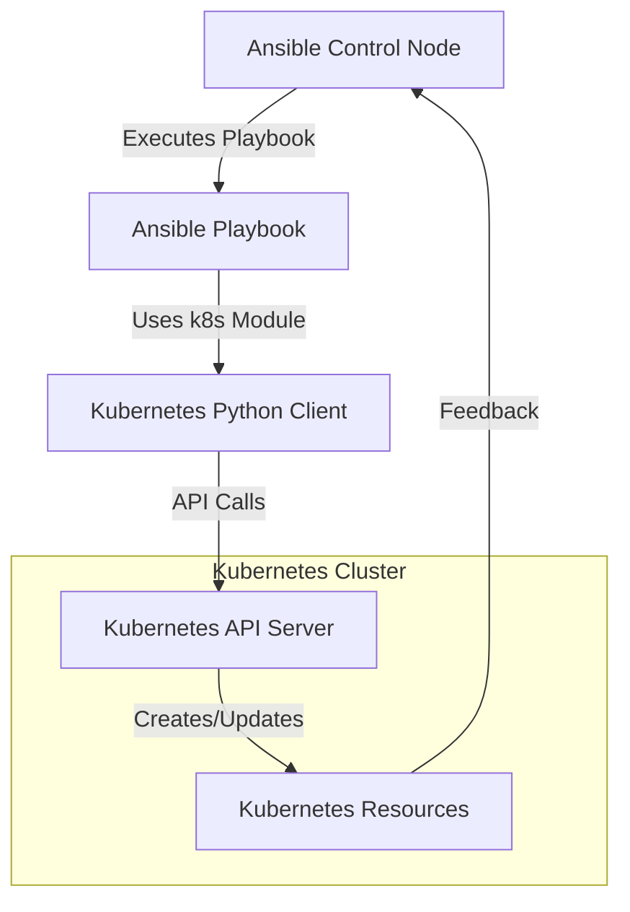

# Ansible Kubernetes Integration

## Introduction

In today's cloud-native landscape, Kubernetes has become the de facto standard for container orchestration. However, managing Kubernetes clusters and deployments can be complex and time-consuming. This is where Ansible comes in - a powerful automation tool that can simplify Kubernetes management.

Ansible's Kubernetes integration allows you to automate the deployment, scaling, and management of containerized applications. By combining Ansible's simplicity with Kubernetes' powerful orchestration capabilities, you can create reproducible, version-controlled infrastructure as code.

In this tutorial, we'll explore how to use Ansible to automate various Kubernetes tasks, from cluster setup to application deployment and management.

## Prerequisites

Before we begin, make sure you have:

- Basic knowledge of Ansible concepts (playbooks, modules, inventory)
- Basic understanding of Kubernetes concepts (pods, deployments, services)
- Ansible (version 2.9+) installed on your control node
- Access to a Kubernetes cluster or minikube for local testing
- `kubectl` configured to communicate with your cluster

## Ansible Kubernetes Modules

Ansible offers several modules specifically designed for Kubernetes integration:

- `k8s`: The main module for managing Kubernetes objects
- `k8s_info`: For gathering information about Kubernetes resources
- `k8s_service`: For managing Kubernetes service objects
- `k8s_scale`: For scaling Kubernetes deployments, replica sets, etc.

Let's start by installing the required Python dependencies:

```bash
pip install kubernetes openshift
```

## Basic Kubernetes Resource Management

### Creating a Deployment with Ansible

Here's a simple playbook to create a Kubernetes deployment:

```yaml
---
- name: Create Kubernetes Deployment
  hosts: localhost
  connection: local
  gather_facts: no
  tasks:
    - name: Create a Deployment
      k8s:
        state: present
        definition:
          apiVersion: apps/v1
          kind: Deployment
          metadata:
            name: nginx-deployment
            namespace: default
          spec:
            replicas: 3
            selector:
              matchLabels:
                app: nginx
            template:
              metadata:
                labels:
                  app: nginx
              spec:
                containers:
                - name: nginx
                  image: nginx:1.21
                  ports:
                  - containerPort: 80
```

Save this as `create_deployment.yml` and run it with:

```bash
ansible-playbook create_deployment.yml
```

**Output:**
```
PLAY [Create Kubernetes Deployment] ***************************

TASK [Create a Deployment] ***********************************
changed: [localhost]

PLAY RECAP **************************************************
localhost                  : ok=1    changed=1    unreachable=0    failed=0    skipped=0    rescued=0    ignored=0
```

After running the playbook, verify the deployment with:

```bash
kubectl get deployments
```

You should see your nginx-deployment with 3 pods running.

### Using Resource Files with Ansible

Instead of defining resources directly in the playbook, you can use separate YAML files:

```yaml
---
- name: Apply Kubernetes resources from files
  hosts: localhost
  connection: local
  gather_facts: no
  tasks:
    - name: Apply a deployment from a file
      k8s:
        state: present
        src: deployment.yml
```

Where `deployment.yml` would contain:

```yaml
apiVersion: apps/v1
kind: Deployment
metadata:
  name: web-app
  namespace: default
spec:
  replicas: 2
  selector:
    matchLabels:
      app: web-app
  template:
    metadata:
      labels:
        app: web-app
    spec:
      containers:
      - name: web-app
        image: nginx:latest
        ports:
        - containerPort: 80
```

## Gathering Information About Kubernetes Resources

The `k8s_info` module allows you to gather information about existing resources:

```yaml
---
- name: Get Kubernetes resource information
  hosts: localhost
  connection: local
  gather_facts: no
  tasks:
    - name: Get info about all pods in a namespace
      k8s_info:
        kind: Pod
        namespace: default
      register: pod_list

    - name: Display pod names
      debug:
        msg: "Pod: {{ item.metadata.name }}"
      loop: "{{ pod_list.resources }}"
```

**Output example:**
```
TASK [Display pod names] *************************************
ok: [localhost] => (item={'metadata': {'name': 'nginx-deployment-7fb96c846b-2z9xj', ...}}) => {
    "msg": "Pod: nginx-deployment-7fb96c846b-2z9xj"
}
ok: [localhost] => (item={'metadata': {'name': 'nginx-deployment-7fb96c846b-d8fjk', ...}}) => {
    "msg": "Pod: nginx-deployment-7fb96c846b-d8fjk"
}
ok: [localhost] => (item={'metadata': {'name': 'nginx-deployment-7fb96c846b-q2xvm', ...}}) => {
    "msg": "Pod: nginx-deployment-7fb96c846b-q2xvm"
}
```

## Dynamic Inventory for Kubernetes

Ansible can use Kubernetes as a dynamic inventory source, allowing you to target pods and nodes directly in your playbooks.

Create a file named `k8s_inventory.yml`:

```yaml
plugin: kubernetes.core.k8s
connections:
  - name: default
    kubeconfig: ~/.kube/config
```

Test the inventory with:

```bash
ansible-inventory -i k8s_inventory.yml --list
```

You'll see JSON output showing all your Kubernetes resources as potential Ansible targets.

## Real-world Example: Complete Application Deployment

Let's put everything together by creating a playbook that deploys a complete application with multiple Kubernetes resources:

```yaml
---
- name: Deploy Complete Application
  hosts: localhost
  connection: local
  gather_facts: no
  vars:
    app_name: flask-demo
    app_namespace: demo
    app_replicas: 2
    app_image: "flask-demo:latest"
  tasks:
    - name: Ensure namespace exists
      k8s:
        state: present
        definition:
          apiVersion: v1
          kind: Namespace
          metadata:
            name: "{{ app_namespace }}"

    - name: Deploy ConfigMap with application settings
      k8s:
        state: present
        definition:
          apiVersion: v1
          kind: ConfigMap
          metadata:
            name: "{{ app_name }}-config"
            namespace: "{{ app_namespace }}"
          data:
            APP_SETTINGS: "Production"
            LOG_LEVEL: "INFO"

    - name: Deploy application
      k8s:
        state: present
        definition:
          apiVersion: apps/v1
          kind: Deployment
          metadata:
            name: "{{ app_name }}"
            namespace: "{{ app_namespace }}"
          spec:
            replicas: "{{ app_replicas }}"
            selector:
              matchLabels:
                app: "{{ app_name }}"
            template:
              metadata:
                labels:
                  app: "{{ app_name }}"
              spec:
                containers:
                - name: "{{ app_name }}"
                  image: "{{ app_image }}"
                  ports:
                  - containerPort: 5000
                  envFrom:
                  - configMapRef:
                      name: "{{ app_name }}-config"
                  resources:
                    limits:
                      memory: "256Mi"
                      cpu: "500m"
                    requests:
                      memory: "128Mi"
                      cpu: "100m"

    - name: Expose the application with a service
      k8s:
        state: present
        definition:
          apiVersion: v1
          kind: Service
          metadata:
            name: "{{ app_name }}"
            namespace: "{{ app_namespace }}"
          spec:
            selector:
              app: "{{ app_name }}"
            ports:
            - port: 80
              targetPort: 5000
            type: ClusterIP
```

## Visualizing the Workflow

Here's a diagram showing the Ansible Kubernetes integration workflow:



## Managing Kubernetes Clusters with Ansible

Beyond just managing resources within a cluster, Ansible can also help set up and manage the Kubernetes cluster itself:

### Setting up a Kubernetes Cluster

For a production environment, consider using Ansible to set up Kubernetes clusters:

```yaml
---
- name: Install Kubernetes dependencies
  hosts: kube_nodes
  become: true
  tasks:
    - name: Install required packages
      apt:
        name:
          - apt-transport-https
          - ca-certificates
          - curl
          - gnupg-agent
          - software-properties-common
        state: present
        update_cache: yes
      when: ansible_os_family == "Debian"

    - name: Add Kubernetes apt key
      apt_key:
        url: https://packages.cloud.google.com/apt/doc/apt-key.gpg
        state: present
      when: ansible_os_family == "Debian"

    - name: Add Kubernetes repository
      apt_repository:
        repo: deb https://apt.kubernetes.io/ kubernetes-xenial main
        state: present
      when: ansible_os_family == "Debian"

    - name: Install Kubernetes packages
      apt:
        name:
          - kubelet
          - kubeadm
          - kubectl
        state: present
        update_cache: yes
      when: ansible_os_family == "Debian"

    - name: Disable swap
      command: swapoff -a
      when: ansible_swaptotal_mb > 0
```

## Advanced Features

### Using Templates for Dynamic Configurations

Use Ansible templates to generate Kubernetes manifests dynamically:

```yaml
---
- name: Deploy application with dynamic config
  hosts: localhost
  connection: local
  gather_facts: no
  vars:
    app_name: web-app
    app_image: nginx
    app_version: 1.21
    app_replicas: 3
    app_port: 80
  tasks:
    - name: Create deployment from template
      k8s:
        state: present
        template: 'templates/deployment-template.yml.j2'
```

And the template file `templates/deployment-template.yml.j2`:

```yaml
apiVersion: apps/v1
kind: Deployment
metadata:
  name: {{ app_name }}
  namespace: default
spec:
  replicas: {{ app_replicas }}
  selector:
    matchLabels:
      app: {{ app_name }}
  template:
    metadata:
      labels:
        app: {{ app_name }}
    spec:
      containers:
      - name: {{ app_name }}
        image: {{ app_image }}:{{ app_version }}
        ports:
        - containerPort: {{ app_port }}
```

### Scaling Applications

Scale deployments easily:

```yaml
---
- name: Scale application
  hosts: localhost
  connection: local
  gather_facts: no
  tasks:
    - name: Scale deployment
      k8s_scale:
        api_version: apps/v1
        kind: Deployment
        name: nginx-deployment
        namespace: default
        replicas: 5
```

## Best Practices for Ansible Kubernetes Integration

1. **Version Control**: Keep all your Kubernetes manifests and Ansible playbooks in a version control system like Git.

2. **Modularize Playbooks**: Break down complex deployments into smaller, reusable roles.

3. **Use Templates**: Leverage Ansible's templating system for dynamic configuration.

4. **Idempotency**: Ensure your playbooks can be run multiple times without causing issues.

5. **Environment Separation**: Use variables to differentiate between development, staging, and production environments.

6. **Secret Management**: Use Ansible Vault or external secret management tools for sensitive data.

7. **Testing**: Test your playbooks in a development environment before applying them to production.

## Troubleshooting Common Issues

### Connection Issues

If you encounter connection problems:

```yaml
---
- name: Debug Kubernetes connection
  hosts: localhost
  connection: local
  gather_facts: no
  tasks:
    - name: Get cluster info
      k8s_info:
        kind: Node
      register: node_info
      ignore_errors: yes

    - name: Display error
      debug:
        var: node_info
      when: node_info is failed
```

### Permission Issues

For permission problems, ensure your kubeconfig has the necessary permissions:

```yaml
---
- name: Check permissions
  hosts: localhost
  connection: local
  gather_facts: no
  tasks:
    - name: Try to list namespaces
      k8s_info:
        kind: Namespace
      register: ns_info
      ignore_errors: yes

    - name: Display permissions error
      debug:
        var: ns_info
      when: ns_info is failed
```

## Summary

Ansible's Kubernetes integration provides a powerful way to automate the deployment and management of containerized applications. By combining Ansible's simplicity with Kubernetes' orchestration capabilities, you can create reproducible, version-controlled infrastructure as code.

Key benefits include:

- Simplified automation of Kubernetes deployments
- Consistent environment management
- Version-controlled infrastructure
- Reduced manual intervention and human error
- Seamless integration with existing Ansible workflows

## Additional Resources

- Practice by creating a multi-tier application deployment using Ansible and Kubernetes
- Explore the [Ansible Kubernetes Collection documentation](https://docs.ansible.com/ansible/latest/collections/kubernetes/core/index.html)
- Learn more about [Kubernetes patterns](https://kubernetes.io/docs/concepts/overview/what-is-kubernetes/)

## Exercises

1. Create a playbook that deploys a stateful application with persistent storage in Kubernetes.
2. Write a playbook that performs a blue-green deployment of a web application.
3. Create an Ansible role that sets up monitoring for your Kubernetes cluster using Prometheus and Grafana.
4. Develop a playbook that automates cluster maintenance tasks like upgrades and backups.