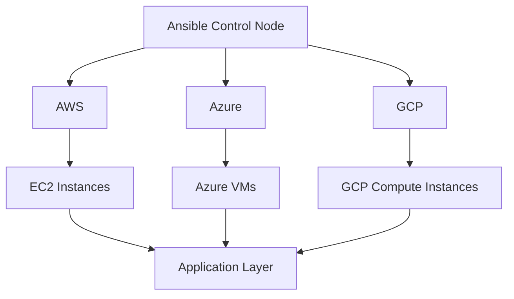

# Ansible Multi-Cloud Strategies

## Introduction

In today's cloud computing landscape, organizations often leverage multiple cloud providers to avoid vendor lock-in, optimize costs, and utilize specific services unique to each provider. However, managing infrastructure across different cloud platforms can be challenging due to varying APIs, tools, and configurations.

Ansible provides a unified approach to managing multi-cloud environments, allowing you to use the same playbooks and roles to orchestrate resources across AWS, Azure, Google Cloud Platform (GCP), and other cloud providers. This creates consistency, reduces complexity, and increases operational efficiency.

In this guide, we'll explore strategies for implementing multi-cloud deployments with Ansible, demonstrate practical examples, and discuss best practices for maintaining a scalable multi-cloud infrastructure.

## Prerequisites

Before diving into multi-cloud strategies, you should have:

- Basic understanding of Ansible concepts (playbooks, roles, inventory)
- Familiarity with at least one cloud provider
- Ansible installed on your control node
- Access credentials for cloud providers you plan to use

## Understanding Multi-Cloud Architectures

Multi-cloud architectures can be implemented in several ways:

1. **Redundant deployment**: Identical infrastructure deployed across multiple cloud providers for high availability
2. **Service-specific deployment**: Using specific services from different providers based on their strengths
3. **Hybrid approach**: Combining on-premises infrastructure with multiple cloud providers



## Setting Up Your Ansible Environment for Multi-Cloud

To effectively manage multiple cloud platforms, you need to organize your Ansible project properly:

### Directory Structure

```
ansible-multi-cloud/
├── inventory/
│   ├── aws.yml
│   ├── azure.yml
│   ├── gcp.yml
│   └── group_vars/
│       ├── aws.yml
│       ├── azure.yml
│       └── gcp.yml
├── playbooks/
│   ├── provision.yml
│   ├── configure.yml
│   └── deploy.yml
├── roles/
│   ├── common/
│   ├── aws-setup/
│   ├── azure-setup/
│   └── gcp-setup/
└── ansible.cfg
```

### Installing Required Collections

Ansible provides collections for each major cloud provider. Install these collections to get access to cloud-specific modules:

```bash
# Install AWS collection
ansible-galaxy collection install amazon.aws

# Install Azure collection
ansible-galaxy collection install azure.azcollection

# Install GCP collection
ansible-galaxy collection install google.cloud
```

### Setting Up Dynamic Inventory

Dynamic inventory plugins help Ansible discover and manage cloud resources automatically.

For AWS:

```yaml
# inventory/aws.yml
plugin: amazon.aws.aws_ec2
regions:
  - us-east-1
  - us-west-2
keyed_groups:
  - key: tags.Environment
    prefix: env
  - key: instance_type
    prefix: instance_type
```

For Azure:

```yaml
# inventory/azure.yml
plugin: azure.azcollection.azure_rm
include_vm_resource_groups:
  - prod-resource-group
  - staging-resource-group
keyed_groups:
  - prefix: azure
    key: resourceGroup
```

For GCP:

```yaml
# inventory/gcp.yml
plugin: google.cloud.gcp_compute
projects:
  - my-gcp-project
regions:
  - us-central1
  - us-east1
keyed_groups:
  - key: labels.environment
    prefix: env
```

## Creating Cloud-Agnostic Playbooks

One of the key benefits of Ansible in multi-cloud environments is the ability to create cloud-agnostic playbooks that can be reused across different providers.

### Using Variables for Cloud-Specific Configuration

```yaml
# group_vars/all.yml
app_name: my-web-app
app_port: 8080
instances_count: 3

# group_vars/aws.yml
provider: aws
instance_type: t2.micro
image_id: ami-0c55b159cbfafe1f0

# group_vars/azure.yml
provider: azure
vm_size: Standard_B1s
image:
  publisher: Canonical
  offer: UbuntuServer
  sku: 18.04-LTS
  version: latest

# group_vars/gcp.yml
provider: gcp
machine_type: n1-standard-1
image_family: ubuntu-1804-lts
image_project: ubuntu-os-cloud
```

### Example Provisioning Playbook

Here's an example of a provisioning playbook that works across multiple cloud providers:

```yaml
# playbooks/provision.yml
---
- name: Provision infrastructure on AWS
  hosts: localhost
  gather_facts: false
  vars_files:
    - ../group_vars/aws.yml
  tasks:
    - name: Create AWS instances
      when: provider == 'aws'
      amazon.aws.ec2_instance:
        name: "{{ app_name }}-{{ item }}"
        instance_type: "{{ instance_type }}"
        image_id: "{{ image_id }}"
        security_group: "{{ security_group }}"
        vpc_subnet_id: "{{ subnet_id }}"
        region: "{{ region }}"
        tags:
          Environment: "{{ environment }}"
          Application: "{{ app_name }}"
        wait: yes
        count: "{{ instances_count }}"
      loop: "{{ range(1, instances_count + 1) | list }}"
      register: aws_instances

- name: Provision infrastructure on Azure
  hosts: localhost
  gather_facts: false
  vars_files:
    - ../group_vars/azure.yml
  tasks:
    - name: Create Azure VMs
      when: provider == 'azure'
      azure.azcollection.azure_rm_virtualmachine:
        name: "{{ app_name }}-{{ item }}"
        resource_group: "{{ resource_group }}"
        vm_size: "{{ vm_size }}"
        admin_username: "{{ admin_username }}"
        ssh_password_enabled: false
        ssh_public_keys:
          - path: /home/{{ admin_username }}/.ssh/authorized_keys
            key_data: "{{ ssh_public_key }}"
        image: "{{ image }}"
        tags:
          Environment: "{{ environment }}"
          Application: "{{ app_name }}"
      loop: "{{ range(1, instances_count + 1) | list }}"
      register: azure_vms

- name: Provision infrastructure on GCP
  hosts: localhost
  gather_facts: false
  vars_files:
    - ../group_vars/gcp.yml
  tasks:
    - name: Create GCP instances
      when: provider == 'gcp'
      google.cloud.gcp_compute_instance:
        name: "{{ app_name }}-{{ item }}"
        machine_type: "{{ machine_type }}"
        disks:
          - auto_delete: true
            boot: true
            initialize_params:
              source_image: "projects/{{ image_project }}/global/images/family/{{ image_family }}"
        network_interfaces:
          - network: "{{ network }}"
            subnetwork: "{{ subnetwork }}"
        zone: "{{ zone }}"
        project: "{{ project }}"
        labels:
          environment: "{{ environment }}"
          application: "{{ app_name }}"
      loop: "{{ range(1, instances_count + 1) | list }}"
      register: gcp_instances
```

## Using Roles for Cloud Provider Abstraction

Roles allow you to abstract cloud-specific details and provide a unified interface for your playbooks.

### Common Role Structure

```
roles/
├── common/
│   ├── defaults/
│   │   └── main.yml
│   ├── tasks/
│   │   └── main.yml
│   └── templates/
│       └── app.conf.j2
├── provision/
│   ├── defaults/
│   │   └── main.yml
│   ├── tasks/
│   │   ├── main.yml
│   │   ├── aws.yml
│   │   ├── azure.yml
│   │   └── gcp.yml
│   └── vars/
│       ├── aws.yml
│       ├── azure.yml
│       └── gcp.yml
```

### Example Role Implementation

```yaml
# roles/provision/tasks/main.yml
---
- name: Include AWS provisioning tasks
  include_tasks: aws.yml
  when: provider == 'aws'

- name: Include Azure provisioning tasks
  include_tasks: azure.yml
  when: provider == 'azure'

- name: Include GCP provisioning tasks
  include_tasks: gcp.yml
  when: provider == 'gcp'
```

```yaml
# roles/provision/tasks/aws.yml
---
- name: Create AWS instances
  amazon.aws.ec2_instance:
    name: "{{ app_name }}-{{ item }}"
    instance_type: "{{ instance_type }}"
    image_id: "{{ image_id }}"
    security_group: "{{ security_group }}"
    vpc_subnet_id: "{{ subnet_id }}"
    region: "{{ region }}"
    tags:
      Environment: "{{ environment }}"
      Application: "{{ app_name }}"
    wait: yes
  loop: "{{ range(1, instances_count + 1) | list }}"
  register: aws_instances
```

### Simplified Playbook Using Roles

```yaml
# playbooks/multi-cloud-provision.yml
---
- name: Provision infrastructure across multiple clouds
  hosts: localhost
  gather_facts: false
  vars:
    app_name: multi-cloud-app
    environment: production
  tasks:
    - name: Set cloud provider facts
      set_fact:
        provider: "{{ cloud_provider }}"

    - name: Include provision role
      include_role:
        name: provision
```

## Practical Multi-Cloud Deployment Example

Let's build a complete example of deploying a web application across multiple cloud providers:

### 1. Create a Cloud-Agnostic Application Deployment Role

```yaml
# roles/webapp/tasks/main.yml
---
- name: Install common dependencies
  package:
    name:
      - nginx
      - python3
      - python3-pip
    state: present

- name: Copy application files
  copy:
    src: files/app/
    dest: /var/www/{{ app_name }}/
    mode: '0755'
    owner: www-data
    group: www-data

- name: Configure Nginx
  template:
    src: nginx.conf.j2
    dest: /etc/nginx/sites-available/{{ app_name }}
  notify: restart nginx

- name: Enable site
  file:
    src: /etc/nginx/sites-available/{{ app_name }}
    dest: /etc/nginx/sites-enabled/{{ app_name }}
    state: link
  notify: restart nginx

- name: Install application dependencies
  pip:
    requirements: /var/www/{{ app_name }}/requirements.txt
    state: present

- name: Start application
  systemd:
    name: "{{ app_name }}"
    state: started
    enabled: yes
```

### 2. Create a Multi-Cloud Deployment Playbook

```yaml
# playbooks/deploy-multi-cloud.yml
---
- name: Deploy to AWS instances
  hosts: aws
  become: true
  vars:
    app_name: my-web-app
    provider: aws
  roles:
    - common
    - webapp

- name: Deploy to Azure VMs
  hosts: azure
  become: true
  vars:
    app_name: my-web-app
    provider: azure
  roles:
    - common
    - webapp

- name: Deploy to GCP instances
  hosts: gcp
  become: true
  vars:
    app_name: my-web-app
    provider: gcp
  roles:
    - common
    - webapp
```

### 3. Implementing Load Balancing Across Providers

For a truly multi-cloud architecture, you might want to implement load balancing across different providers:

```yaml
# playbooks/setup-load-balancing.yml
---
- name: Configure global load balancer
  hosts: localhost
  gather_facts: false
  tasks:
    - name: Create DNS records for all instances
      community.general.cloudflare_dns:
        zone: example.com
        record: "{{ item.name }}"
        type: A
        value: "{{ item.public_ip }}"
        ttl: 120
        state: present
        account_email: "{{ cf_email }}"
        account_api_key: "{{ cf_api_key }}"
      loop: "{{ groups['aws'] + groups['azure'] + groups['gcp'] }}"
      
    - name: Configure load balancer
      community.general.cloudflare_load_balancer:
        zone: example.com
        name: global-lb
        fallback_pool: fallback-pool
        default_pools:
          - aws-pool
          - azure-pool
          - gcp-pool
        state: present
        account_email: "{{ cf_email }}"
        account_api_key: "{{ cf_api_key }}"
```

## Best Practices for Ansible Multi-Cloud Management

1. **Use dynamic inventory**: Maintain up-to-date resource information across cloud providers.

2. **Abstract provider-specific details**: Use variables and conditional tasks to handle provider differences.

3. **Implement credential management**: Use Ansible Vault or external systems like HashiCorp Vault to securely store cloud credentials.

```yaml
# Using Ansible Vault for secure credential storage
---
aws_access_key: !vault |
  $ANSIBLE_VAULT;1.1;AES256
  31393864343666623139393863373432336461623966303434653837613336313530313337363132
  6335303464323335323866323934313431336362613866630a326565323264363832663462393461
  65633439393833366432646133353964623631623535633538393539366133346633396637393731
  3939323433626236300a323031383334373934323663336134633166383062363631653638383832
  3539
```

4. **Implement tags and naming conventions**: Consistently tag resources across all cloud providers.

5. **Use environment-specific variables**: Separate variables for development, staging, and production.

```yaml
# group_vars/dev_aws.yml
environment: development
region: us-west-2
instance_type: t2.micro

# group_vars/prod_aws.yml
environment: production
region: us-east-1
instance_type: m5.large
```

6. **Create cloud-specific modules**: Develop custom modules for operations not covered by existing cloud modules.

7. **Implement testing**: Use Molecule to test your roles across different cloud providers.

## Advanced Multi-Cloud Patterns

### Disaster Recovery Between Clouds

```yaml
# playbooks/disaster-recovery.yml
---
- name: Setup primary infrastructure in AWS
  hosts: localhost
  roles:
    - role: aws-primary
      when: primary_provider == 'aws'

- name: Setup standby infrastructure in Azure
  hosts: localhost
  roles:
    - role: azure-standby
      when: secondary_provider == 'azure'

- name: Configure data replication
  hosts: aws_primary_db
  tasks:
    - name: Setup database replication to Azure
      include_role:
        name: db-replication
      vars:
        source_provider: aws
        target_provider: azure
```

### Cost Optimization Across Providers

```yaml
# playbooks/optimize-costs.yml
---
- name: Gather cloud usage data
  hosts: localhost
  tasks:
    - name: Get AWS cost data
      amazon.aws.aws_cost_explorer:
        granularity: MONTHLY
        time_period:
          start: "{{ start_date }}"
          end: "{{ end_date }}"
      register: aws_costs
      
    - name: Get Azure cost data
      azure.azcollection.azure_rm_costmanagement_query:
        time_period:
          from: "{{ start_date }}"
          to: "{{ end_date }}"
      register: azure_costs
      
    - name: Analyze costs and recommend optimizations
      template:
        src: cost_optimization_report.j2
        dest: reports/cost_optimization_{{ ansible_date_time.date }}.md
```

## Handling Multi-Cloud Security

Security is a critical concern in multi-cloud environments. Use Ansible to implement consistent security policies:

```yaml
# playbooks/security-compliance.yml
---
- name: Apply security policies across all cloud providers
  hosts: all
  become: true
  roles:
    - security-hardening
    - compliance-checks

- name: AWS-specific security measures
  hosts: aws
  become: true
  roles:
    - aws-security

- name: Azure-specific security measures
  hosts: azure
  become: true
  roles:
    - azure-security

- name: GCP-specific security measures
  hosts: gcp
  become: true
  roles:
    - gcp-security
```

## Monitoring Your Multi-Cloud Environment

Unified monitoring is essential for maintaining visibility across multi-cloud deployments:

```yaml
# playbooks/setup-monitoring.yml
---
- name: Install monitoring agents on all instances
  hosts: all
  become: true
  roles:
    - monitoring-agent

- name: Configure central monitoring server
  hosts: monitoring_server
  become: true
  roles:
    - role: prometheus
    - role: grafana
      vars:
        dashboards:
          - aws-dashboard
          - azure-dashboard
          - gcp-dashboard
```

## Summary

In this guide, we've explored comprehensive strategies for implementing multi-cloud environments using Ansible. We've covered:

- Setting up Ansible for multi-cloud management
- Creating cloud-agnostic playbooks and roles
- Implementing practical deployment examples
- Applying best practices for multi-cloud orchestration
- Advanced patterns for disaster recovery and cost optimization
- Securing and monitoring multi-cloud environments

By leveraging Ansible's flexibility and abstraction capabilities, you can create a unified approach to managing infrastructure across multiple cloud providers, reducing complexity and increasing operational efficiency.

## Additional Resources

- [Ansible Cloud Modules Documentation](https://docs.ansible.com/ansible/latest/collections/index_module.html)
- [AWS Collection for Ansible](https://docs.ansible.com/ansible/latest/collections/amazon/aws/index.html)
- [Azure Collection for Ansible](https://docs.ansible.com/ansible/latest/collections/azure/azcollection/index.html)
- [Google Cloud Collection for Ansible](https://docs.ansible.com/ansible/latest/collections/google/cloud/index.html)

## Exercises

1. Create a basic multi-cloud playbook that deploys a simple web server to AWS and Azure.
2. Implement a role that abstracts storage provisioning across different cloud providers.
3. Build a dynamic inventory configuration that combines resources from multiple cloud providers.
4. Create a disaster recovery playbook that fails over from one cloud provider to another.
5. Implement a cost monitoring solution that tracks spending across your multi-cloud environment.