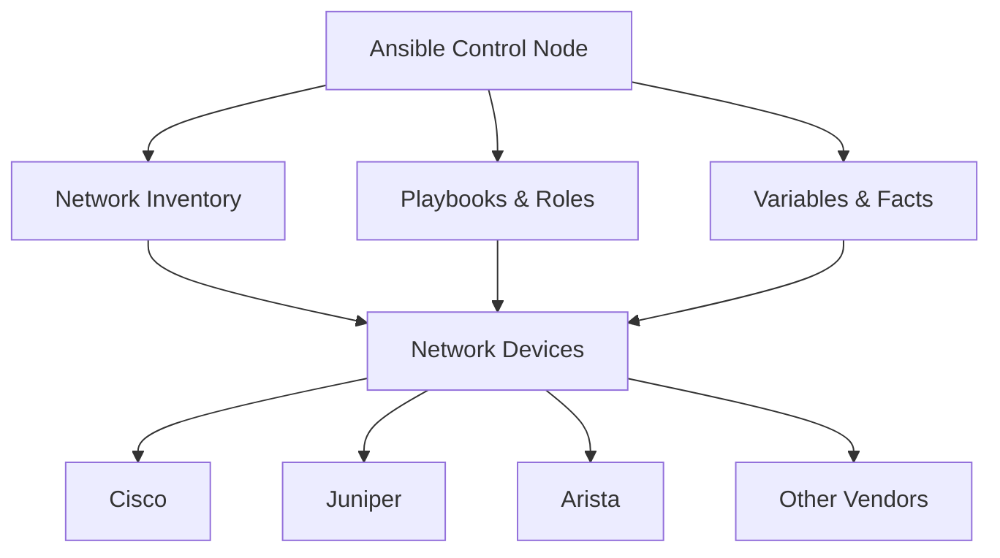

# Ansible Network Basics

## Introduction

Network automation has become essential in modern IT environments as networks grow in complexity and scale. Ansible offers a powerful yet approachable solution for automating network device configuration and management. Unlike traditional automation tools that require extensive programming knowledge, Ansible uses a declarative, YAML-based syntax that is easy to learn and understand.

In this guide, we'll explore the fundamentals of using Ansible for network automation, including how to connect to network devices, execute commands, manage configurations, and create reusable automation workflows.

## What is Ansible Network Automation?

Ansible Network Automation is a collection of Ansible modules, plugins, and roles specifically designed for automating tasks on network devices from various vendors including Cisco, Juniper, Arista, and more.



The key benefits of Ansible network automation include:

- **Agentless Architecture**: No need to install agents on network devices
- **Multi-vendor Support**: Works with equipment from various manufacturers
- **Simple Syntax**: YAML-based playbooks are easy to read and write
- **Idempotent Operations**: Changes are only applied when needed
- **Extensive Module Library**: Purpose-built modules for network operations

## Prerequisites

Before getting started with Ansible network automation, ensure you have:

1. Ansible installed (version 2.9 or newer recommended)
2. Network connection to your devices
3. Valid authentication credentials
4. Basic understanding of YAML syntax

## Installation and Setup

Let's start by installing Ansible and the required network collections:

```bash
# Install Ansible
pip install ansible

# Install network collections
ansible-galaxy collection install ansible.netcommon
ansible-galaxy collection install cisco.ios  # For Cisco IOS devices
ansible-galaxy collection install junipernetworks.junos  # For Juniper devices
ansible-galaxy collection install arista.eos  # For Arista devices
```

## Creating an Inventory

The inventory file defines the network devices you'll manage with Ansible. You can use either INI or YAML format:

### INI Format

```ini
[routers]
router1 ansible_host=192.168.1.1
router2 ansible_host=192.168.1.2

[switches]
switch1 ansible_host=192.168.1.101
switch2 ansible_host=192.168.1.102

[network:children]
routers
switches

[network:vars]
ansible_network_os=cisco.ios.ios
ansible_user=admin
ansible_password=cisco123
ansible_connection=network_cli
```

### YAML Format

```yaml
all:
  children:
    routers:
      hosts:
        router1:
          ansible_host: 192.168.1.1
        router2:
          ansible_host: 192.168.1.2
    switches:
      hosts:
        switch1:
          ansible_host: 192.168.1.101
        switch2:
          ansible_host: 192.168.1.102
    network:
      children:
        routers:
        switches:
      vars:
        ansible_network_os: cisco.ios.ios
        ansible_user: admin
        ansible_password: cisco123
        ansible_connection: network_cli
```

## Connection Methods

Ansible offers several connection methods for network devices:

1. **network_cli**: Command-line interface over SSH (most common)
2. **netconf**: XML-based protocol for configuration management
3. **httpapi**: REST API connections

Here's how to specify the connection method in your inventory:

```yaml
all:
  hosts:
    router1:
      ansible_connection: network_cli  # SSH CLI connection
    router2:
      ansible_connection: netconf  # NETCONF connection
    router3:
      ansible_connection: httpapi  # HTTP API connection
```

## Your First Network Playbook

Let's create a simple playbook to gather facts from network devices:

```yaml
---
- name: Gather Network Facts
  hosts: network
  gather_facts: false
  
  tasks:
    - name: Collect device facts
      cisco.ios.ios_facts:
        gather_subset: all
      register: device_facts
      
    - name: Display device model
      debug:
        msg: "Device {{ inventory_hostname }} is a {{ device_facts.ansible_facts.ansible_net_model }}"
```

Running this playbook:

```bash
ansible-playbook gather_facts.yml
```

Example output:

```
TASK [Display device model] *****************************
ok: [router1] => {
    "msg": "Device router1 is a CISCO2901/K9"
}
ok: [router2] => {
    "msg": "Device router2 is a CISCO2911/K9"
}
```

## Configuration Management

Ansible provides several approaches for managing network device configurations:

### 1. Running CLI Commands

```yaml
---
- name: Execute CLI Commands
  hosts: routers
  gather_facts: false
  
  tasks:
    - name: Run show commands
      cisco.ios.ios_command:
        commands:
          - show version
          - show ip interface brief
      register: output
      
    - name: Display command output
      debug:
        var: output.stdout_lines
```

### 2. Managing Configuration Sections

```yaml
---
- name: Configure SNMP
  hosts: network
  gather_facts: false
  
  tasks:
    - name: Configure SNMP settings
      cisco.ios.ios_config:
        lines:
          - snmp-server community public RO
          - snmp-server community private RW
          - snmp-server location "Data Center 1"
          - snmp-server contact "admin@example.com"
```

### 3. Using Configuration Templates

First, create a Jinja2 template file named `interfaces.j2`:

```jinja

interface {{ interface.name }}
 description {{ interface.description }}
 ip address {{ interface.ip_address }} {{ interface.subnet_mask }}

 no shutdown

 shutdown


```

Then, create a playbook to apply the template:

```yaml
---
- name: Configure Interfaces
  hosts: routers
  gather_facts: false
  
  vars:
    interfaces:
      - name: GigabitEthernet0/0
        description: "WAN Connection"
        ip_address: 192.168.1.1
        subnet_mask: 255.255.255.0
        enabled: true
      - name: GigabitEthernet0/1
        description: "LAN Connection"
        ip_address: 10.0.0.1
        subnet_mask: 255.255.255.0
        enabled: true
  
  tasks:
    - name: Configure interfaces from template
      cisco.ios.ios_config:
        src: templates/interfaces.j2
```

## Backup and Restore

Backing up configurations before making changes is a best practice:

```yaml
---
- name: Backup Network Configurations
  hosts: network
  gather_facts: false
  
  tasks:
    - name: Backup current config
      cisco.ios.ios_config:
        backup: yes
        backup_options:
          filename: "{{ inventory_hostname }}_config.{{ ansible_date_time.date }}"
          dir_path: ./backups
```

## Working with Multiple Vendors

One of Ansible's strengths is its ability to work with multiple vendors using a consistent interface:

```yaml
---
- name: Multi-vendor Configuration
  hosts: all
  gather_facts: false
  
  tasks:
    - name: Configure NTP on Cisco IOS
      cisco.ios.ios_config:
        lines:
          - ntp server 10.0.0.1
          - ntp server 10.0.0.2
      when: ansible_network_os == "cisco.ios.ios"
      
    - name: Configure NTP on Juniper
      junipernetworks.junos.junos_config:
        lines:
          - set system ntp server 10.0.0.1
          - set system ntp server 10.0.0.2
      when: ansible_network_os == "junipernetworks.junos.junos"
      
    - name: Configure NTP on Arista EOS
      arista.eos.eos_config:
        lines:
          - ntp server 10.0.0.1
          - ntp server 10.0.0.2
      when: ansible_network_os == "arista.eos.eos"
```

## Real-world Example: Network Compliance Check

This example checks network devices for compliance with security standards:

```yaml
---
- name: Network Security Compliance Check
  hosts: network
  gather_facts: false
  
  tasks:
    - name: Check for insecure services
      cisco.ios.ios_command:
        commands:
          - show run | include telnet
          - show run | include http server
      register: insecure_services
      
    - name: Flag devices with insecure services
      debug:
        msg: "WARNING: {{ inventory_hostname }} has insecure services enabled"
      when: insecure_services.stdout_lines[0] != [] or insecure_services.stdout_lines[1] != []
      
    - name: Check password policies
      cisco.ios.ios_command:
        commands:
          - show run | include password-encryption
          - show run | include service password-encryption
      register: password_policies
      
    - name: Flag devices with weak password policies
      debug:
        msg: "WARNING: {{ inventory_hostname }} has weak password policies"
      when: password_policies.stdout_lines[0] == [] or password_policies.stdout_lines[1] == []
```

## Using Roles for Reusable Automation

For more complex automations, Ansible roles provide a way to organize and reuse code:

```
ansible-galaxy init roles/network_baseline
```

Directory structure:

```
roles/network_baseline/
├── defaults
│   └── main.yml
├── files
├── handlers
│   └── main.yml
├── meta
│   └── main.yml
├── tasks
│   └── main.yml
├── templates
└── vars
    └── main.yml
```

Example role usage:

```yaml
---
- name: Apply Network Baseline
  hosts: network
  gather_facts: false
  
  roles:
    - role: network_baseline
      vars:
        baseline_ntp_servers:
          - 10.0.0.1
          - 10.0.0.2
        baseline_dns_servers:
          - 8.8.8.8
          - 8.8.4.4
```

## Network Automation Best Practices

1. **Always backup configurations** before making changes
2. **Use version control** for your Ansible code
3. **Validate changes** before applying to production
4. **Use variables** to make playbooks reusable
5. **Structure your inventory** to reflect your network topology
6. **Use tags** to run specific parts of playbooks
7. **Implement error handling** for robust automation
8. **Consider using Ansible Tower/AWX** for larger environments

## Summary

In this guide, we've covered the fundamentals of Ansible network automation:

- Setting up Ansible for network automation
- Creating network inventories
- Connecting to network devices
- Executing commands and managing configurations
- Creating templates for configuration management
- Working with multiple vendors
- Implementing practical network automation use cases

Ansible's simple syntax and powerful capabilities make it an excellent choice for network engineers looking to automate repetitive tasks, ensure configuration consistency, and scale their network management practices.

## Additional Resources

- **Ansible Network Documentation**: Comprehensive guide to Ansible's network capabilities
- **Network Automation Community**: Connect with other network automation enthusiasts
- **Vendor-specific collections**: Explore modules for your specific network hardware

## Practice Exercises

1. Create a playbook to collect interface statistics from all network devices
2. Build a template to standardize VLAN configurations across switches
3. Develop a role to implement a security baseline on all network devices
4. Create a playbook that validates network connectivity and reports issues
5. Build an inventory structure that represents your network's physical topology