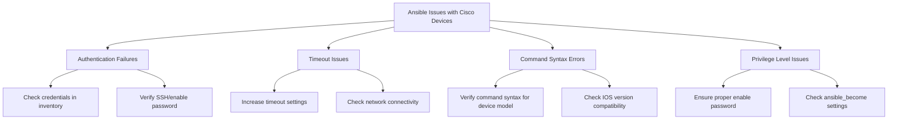

# Ansible Cisco Automation

## Introduction

Ansible is a powerful open-source automation tool that has revolutionized the way network engineers manage and configure network devices. In this guide, we'll explore how Ansible can be specifically used to automate Cisco network devices, enabling you to manage your infrastructure more efficiently and consistently.

Cisco network automation with Ansible allows you to:

- Configure multiple devices simultaneously
- Standardize network configurations
- Reduce human error
- Implement changes rapidly
- Create repeatable and auditable network operations

Whether you're maintaining a small network or managing thousands of devices across multiple data centers, Ansible's agentless architecture and simple YAML syntax make it an ideal choice for Cisco network automation.

## Prerequisites

Before diving into Cisco automation with Ansible, ensure you have:

- Basic understanding of Ansible concepts
- Ansible installed on your control node (version 2.9+)
- Python 3.6+ installed
- Network connectivity to your Cisco devices
- Valid credentials for your Cisco devices
- Basic familiarity with Cisco IOS commands

## Setting Up Your Environment

### Installing Required Packages

First, let's install the necessary Ansible collections for Cisco automation:

```bash
# Install Ansible Cisco collections
ansible-galaxy collection install cisco.ios
ansible-galaxy collection install ansible.netcommon
```

### Inventory Configuration

Create an inventory file to define your Cisco devices:

```ini
# inventory.ini
[cisco_switches]
switch1 ansible_host=192.168.1.101
switch2 ansible_host=192.168.1.102

[cisco_routers]
router1 ansible_host=192.168.1.201
router2 ansible_host=192.168.1.202

[cisco:children]
cisco_switches
cisco_routers

[cisco:vars]
ansible_network_os=ios
ansible_connection=network_cli
ansible_user=admin
ansible_password=your_secure_password
ansible_become=yes
ansible_become_method=enable
ansible_become_password=your_enable_password
```

### Ansible Configuration

Create or modify your `ansible.cfg` file to optimize for network automation:

```ini
[defaults]
inventory = ./inventory.ini
host_key_checking = False
timeout = 30
forks = 10
gathering = explicit

[persistent_connection]
connect_timeout = 60
command_timeout = 60
```

## Basic Cisco Operations with Ansible

### Gathering Device Information

Let's start with a simple playbook to gather information from your Cisco devices:

```yaml
---
# get_cisco_info.yml
- name: Gather Cisco device information
  hosts: cisco
  gather_facts: false
  
  tasks:
    - name: Collect device facts
      cisco.ios.ios_facts:
        gather_subset: all
      register: device_facts
    
    - name: Display device model
      debug:
        msg: "Device {{ inventory_hostname }} is a {{ device_facts.ansible_facts.ansible_net_model }}"
    
    - name: Display IOS version
      debug:
        msg: "Running IOS version: {{ device_facts.ansible_facts.ansible_net_version }}"
```

To run this playbook:

```bash
ansible-playbook get_cisco_info.yml
```

Example output:

```
TASK [Display device model] *********************************************************
ok: [switch1] => {
    "msg": "Device switch1 is a WS-C3750X-48P"
}
ok: [switch2] => {
    "msg": "Device switch2 is a WS-C3750X-24P"
}

TASK [Display IOS version] **********************************************************
ok: [switch1] => {
    "msg": "Running IOS version: 15.2(4)E7"
}
ok: [switch2] => {
    "msg": "Running IOS version: 15.2(4)E7"
}
```

### Configuring Interface Settings

Now, let's create a playbook to configure multiple interfaces:

```yaml
---
# configure_interfaces.yml
- name: Configure Cisco interfaces
  hosts: cisco_switches
  gather_facts: false
  
  vars:
    vlans:
      - id: 10
        name: DATA
      - id: 20
        name: VOICE
      - id: 30
        name: MANAGEMENT
  
  tasks:
    - name: Configure VLANs
      cisco.ios.ios_vlans:
        config:
          - name: "{{ item.name }}"
            vlan_id: "{{ item.id }}"
            state: active
        state: merged
      loop: "{{ vlans }}"
    
    - name: Configure access ports
      cisco.ios.ios_interfaces:
        config:
          - name: "GigabitEthernet1/0/1"
            description: "User Access Port - VLAN 10"
            enabled: true
          - name: "GigabitEthernet1/0/2"
            description: "User Access Port - VLAN 20"
            enabled: true
        state: merged
    
    - name: Assign VLANs to access ports
      cisco.ios.ios_l2_interfaces:
        config:
          - name: "GigabitEthernet1/0/1"
            mode: access
            access:
              vlan: 10
          - name: "GigabitEthernet1/0/2"
            mode: access
            access:
              vlan: 20
        state: merged
```

## Creating Backup and Restore Solutions

### Backing Up Configurations

Create a playbook to back up device configurations:

```yaml
---
# backup_configs.yml
- name: Backup Cisco configurations
  hosts: cisco
  gather_facts: false
  
  tasks:
    - name: Get current date and time
      set_fact:
        backup_time: "{{ lookup('pipe', 'date +%Y-%m-%d-%H-%M-%S') }}"
      run_once: true
    
    - name: Create backup directory
      file:
        path: "./backups/{{ backup_time }}"
        state: directory
      run_once: true
      delegate_to: localhost
    
    - name: Backup running configurations
      cisco.ios.ios_config:
        backup: yes
        backup_options:
          filename: "{{ inventory_hostname }}_config.txt"
          dir_path: "./backups/{{ backup_time }}"
```

### Restoring Configurations

A playbook to restore configurations:

```yaml
---
# restore_config.yml
- name: Restore Cisco configuration
  hosts: cisco
  gather_facts: false
  
  vars_prompt:
    - name: backup_dir
      prompt: "Enter backup directory name (format: YYYY-MM-DD-HH-MM-SS)"
      private: no
  
  tasks:
    - name: Check if backup exists
      stat:
        path: "./backups/{{ backup_dir }}/{{ inventory_hostname }}_config.txt"
      register: backup_file
      delegate_to: localhost
    
    - name: Fail if backup doesn't exist
      fail:
        msg: "Backup file for {{ inventory_hostname }} does not exist in the specified directory"
      when: not backup_file.stat.exists
    
    - name: Restore configuration
      cisco.ios.ios_config:
        src: "./backups/{{ backup_dir }}/{{ inventory_hostname }}_config.txt"
      when: backup_file.stat.exists
```

## Network Compliance and Validation

### Enforcing Security Policies

Create a playbook to enforce security best practices:

```yaml
---
# security_compliance.yml
- name: Enforce security policies on Cisco devices
  hosts: cisco
  gather_facts: false
  
  tasks:
    - name: Configure secure SSH
      cisco.ios.ios_config:
        lines:
          - ip ssh version 2
          - ip ssh authentication-retries 3
          - ip ssh time-out 60
          - login block-for 120 attempts 3 within 60
        save_when: modified
    
    - name: Disable unused services
      cisco.ios.ios_config:
        lines:
          - no service pad
          - no ip http server
          - no ip http secure-server
          - no cdp run
        save_when: modified
    
    - name: Configure NTP
      cisco.ios.ios_config:
        lines:
          - ntp server 192.168.1.250
          - ntp server 192.168.1.251
        save_when: modified
    
    - name: Configure logging
      cisco.ios.ios_config:
        lines:
          - logging host 192.168.1.200
          - logging trap notifications
          - logging buffered 16384
        save_when: modified
```

### Network State Validation

Create a playbook to validate network state:

```yaml
---
# validate_network.yml
- name: Validate network state
  hosts: cisco
  gather_facts: false
  
  tasks:
    - name: Check device uptime
      cisco.ios.ios_command:
        commands: show version | include uptime
      register: uptime_result
    
    - name: Display uptime
      debug:
        msg: "{{ inventory_hostname }}: {{ uptime_result.stdout[0] }}"
    
    - name: Check CPU utilization
      cisco.ios.ios_command:
        commands: show processes cpu | include CPU utilization
      register: cpu_result
    
    - name: Display CPU utilization
      debug:
        msg: "{{ inventory_hostname }}: {{ cpu_result.stdout[0] }}"
    
    - name: Check memory usage
      cisco.ios.ios_command:
        commands: show memory summary | include Processor
      register: memory_result
    
    - name: Display memory usage
      debug:
        msg: "{{ inventory_hostname }}: {{ memory_result.stdout[0] }}"
    
    - name: Check interface status
      cisco.ios.ios_command:
        commands: show ip interface brief
      register: interface_result
    
    - name: Create report directory
      file:
        path: "./reports"
        state: directory
      run_once: true
      delegate_to: localhost
    
    - name: Save interface status to file
      copy:
        content: "{{ interface_result.stdout[0] }}"
        dest: "./reports/{{ inventory_hostname }}_interfaces.txt"
      delegate_to: localhost
```

## Real-World Automation Workflow Example

Let's create a complete workflow for deploying a standard branch office configuration:

```yaml
---
# deploy_branch_office.yml
- name: Deploy branch office configuration
  hosts: new_branch_router
  gather_facts: false
  
  vars:
    branch_id: 101
    branch_prefix: 10.{{ branch_id }}.0.0
    branch_mask: 255.255.255.0
    wan_ip: 203.0.113.{{ branch_id }}
    wan_mask: 255.255.255.252
    
  tasks:
    - name: Configure hostname
      cisco.ios.ios_config:
        lines:
          - hostname BRANCH-{{ branch_id }}
        save_when: modified
    
    - name: Configure WAN interface
      cisco.ios.ios_config:
        parents: interface GigabitEthernet0/0
        lines:
          - description WAN Interface to HQ
          - ip address {{ wan_ip }} {{ wan_mask }}
          - no shutdown
        save_when: modified
    
    - name: Configure LAN interface
      cisco.ios.ios_config:
        parents: interface GigabitEthernet0/1
        lines:
          - description Branch LAN Interface
          - ip address {{ branch_prefix.split('.')[0] }}.{{ branch_prefix.split('.')[1] }}.1.1 {{ branch_mask }}
          - no shutdown
        save_when: modified
    
    - name: Configure default route
      cisco.ios.ios_config:
        lines:
          - ip route 0.0.0.0 0.0.0.0 {{ wan_ip | ipmath(1) }}
        save_when: modified
    
    - name: Configure DHCP service
      cisco.ios.ios_config:
        lines:
          - ip dhcp excluded-address {{ branch_prefix.split('.')[0] }}.{{ branch_prefix.split('.')[1] }}.1.1 {{ branch_prefix.split('.')[0] }}.{{ branch_prefix.split('.')[1] }}.1.10
          - ip dhcp pool BRANCH-{{ branch_id }}-POOL
          - network {{ branch_prefix.split('.')[0] }}.{{ branch_prefix.split('.')[1] }}.1.0 {{ branch_mask }}
          - default-router {{ branch_prefix.split('.')[0] }}.{{ branch_prefix.split('.')[1] }}.1.1
          - dns-server 8.8.8.8 8.8.4.4
          - lease 7
        save_when: modified
    
    - name: Configure basic security
      cisco.ios.ios_config:
        lines:
          - service password-encryption
          - no ip domain-lookup
          - ip domain-name branch{{ branch_id }}.example.com
          - crypto key generate rsa modulus 2048
        save_when: modified
    
    - name: Configure NTP and Logging
      cisco.ios.ios_config:
        lines:
          - ntp server 10.0.0.1
          - logging host 10.0.0.2
          - logging trap informational
        save_when: modified
    
    - name: Verify configuration
      cisco.ios.ios_command:
        commands:
          - show ip interface brief
          - show ip route
      register: verification
    
    - name: Display verification output
      debug:
        var: verification.stdout_lines
```

## Working with Cisco IOS Templates

### Creating Jinja2 Templates

Create a file named `interface_template.j2`:

```jinja

interface {{ interface.name }}
 description {{ interface.description }}
 
 ip address {{ interface.ip_address }} {{ interface.subnet_mask }}
 
 
 switchport mode access
 switchport access vlan {{ interface.vlan }}
 
 
 switchport mode trunk
 switchport trunk allowed vlan {{ interface.allowed_vlans | default('all') }}
 
 
 no shutdown
 
 shutdown
 

```

Now, create a playbook that uses this template:

```yaml
---
# configure_interfaces_template.yml
- name: Configure interfaces using template
  hosts: cisco_switches
  gather_facts: false
  
  vars:
    interfaces:
      - name: GigabitEthernet1/0/1
        description: User Port - Finance Department
        vlan: 10
        enabled: true
      - name: GigabitEthernet1/0/2
        description: User Port - Marketing Department
        vlan: 20
        enabled: true
      - name: GigabitEthernet1/0/3
        description: Printer Port
        vlan: 30
        enabled: true
      - name: GigabitEthernet1/0/24
        description: Uplink to Distribution Switch
        trunk: true
        allowed_vlans: "10,20,30,99"
        enabled: true
  
  tasks:
    - name: Generate configuration from template
      template:
        src: interface_template.j2
        dest: ./tmp/{{ inventory_hostname }}_interfaces.cfg
      delegate_to: localhost
    
    - name: Apply interface configuration
      cisco.ios.ios_config:
        src: ./tmp/{{ inventory_hostname }}_interfaces.cfg
```

## Troubleshooting and Debugging

Ansible provides several ways to troubleshoot issues when automating Cisco devices:

### Increasing Verbosity

Run playbooks with increased verbosity to see more details:

```bash
ansible-playbook -vvv your_playbook.yml
```

### Using Check Mode

Test playbooks without making actual changes:

```bash
ansible-playbook --check your_playbook.yml
```

### Using Debug Module

Add debug tasks to your playbooks:

```yaml
- name: Debug registration variable
  debug:
    var: your_registered_variable
    verbosity: 1
```

### Common Issues and Solutions

Here's a diagram showing common issues and their solutions:



## Advanced Topics

### Using Ansible Roles for Cisco Automation

Create a standardized role structure for Cisco automation:

```
cisco_automation_role/
├── defaults/
│   └── main.yml
├── tasks/
│   ├── main.yml
│   ├── backup.yml
│   ├── interfaces.yml
│   └── security.yml
├── templates/
│   ├── interfaces.j2
│   └── security.j2
├── vars/
│   └── main.yml
└── README.md
```

### Continuous Network Compliance

Create a playbook for automated compliance checks:

```yaml
---
# compliance_check.yml
- name: Network compliance verification
  hosts: cisco
  gather_facts: false
  
  tasks:
    - name: Check for security compliance
      cisco.ios.ios_command:
        commands:
          - show run | include password
          - show run | include ssh
          - show run | include access-list
      register: security_checks
    
    - name: Analyze compliance results
      set_fact:
        weak_passwords: "{{ security_checks.stdout[0] | regex_findall('password .{1,5}$') }}"
        ssh_v1: "{{ 'ip ssh version 1' in security_checks.stdout[1] }}"
    
    - name: Generate compliance report
      copy:
        content: |
          Compliance Report for {{ inventory_hostname }}
          ========================================
          Weak Passwords Found: {{ weak_passwords | length }}
          
          Weak Password Lines:
          
          - {{ line }}
          
          
          
          SSH Version 1 Enabled: {{ ssh_v1 }}
          
          Raw Security Output:
          {{ security_checks.stdout | join('

') }}
        dest: "./compliance/{{ inventory_hostname }}_report.txt"
      delegate_to: localhost
```

## Summary

In this guide, we've explored how to use Ansible to automate Cisco network devices, including:

- Setting up your Ansible environment for Cisco automation
- Creating playbooks for basic device information gathering
- Configuring interfaces, VLANs, and security settings
- Implementing backup and restore solutions
- Validating network state and compliance
- Using templates for more flexible configuration management
- Advanced topics like roles and continuous compliance

Ansible's declarative approach to network automation helps ensure consistency, reduce errors, and increase efficiency in your Cisco network operations. By leveraging the techniques covered in this guide, you can build a more reliable, consistent, and manageable network infrastructure.

## Additional Resources

To continue learning about Ansible Cisco automation:

- Practice with the provided examples on a lab environment
- Explore the official [Ansible Network Automation documentation](https://docs.ansible.com/ansible/latest/network/index.html)
- Join networking communities like Network to Code or DevNet
- Try implementing these automation techniques on a small set of devices before rolling out to production

## Exercises

1. Create a playbook that collects and formats "show version" output from all your Cisco devices
2. Develop a template to standardize SNMP configuration across your network
3. Build a complete role for deploying a standard switch configuration
4. Create a playbook that validates BGP neighbor relationships on your routers
5. Implement a workflow that can detect and report on configuration drift across your network