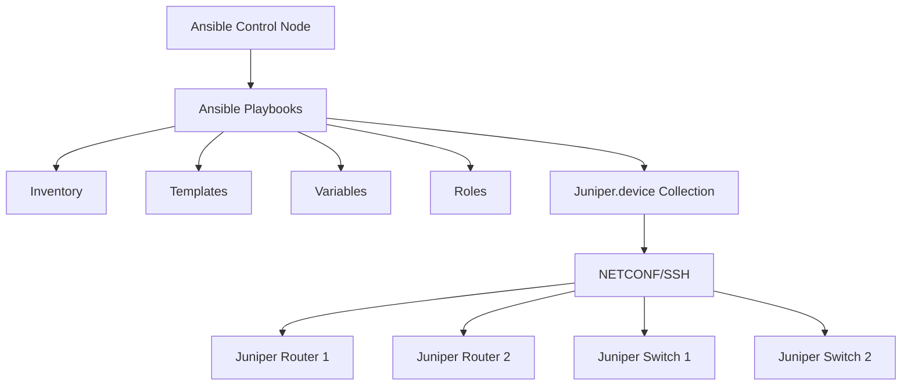

# Ansible Juniper Automation

## Introduction

Juniper Networks is one of the leading network equipment manufacturers, with their JunOS operating system powering routers, switches, and security devices across enterprise and service provider networks. As networks grow in complexity, automating configuration and management tasks becomes essential.

Ansible provides powerful tools for automating Juniper network devices through the `juniper.device` collection (formerly `Juniper.junos`). This module allows network engineers to automate routine tasks, enforce configuration standards, and manage network infrastructure as code.

In this guide, we'll explore how to use Ansible to automate Juniper network devices, from basic setup to practical examples for everyday automation tasks.

## Prerequisites

Before diving into Juniper automation with Ansible, you should have:

- Basic understanding of Ansible concepts
- Familiarity with YAML syntax
- Basic knowledge of Juniper JunOS configuration
- Ansible installed on your control node
- Network connectivity to your Juniper devices

## Setting Up Your Environment

### Installing Required Components

First, let's install the necessary components:

```bash
# Install Ansible
pip install ansible

# Install Juniper-specific dependencies
pip install junos-eznc jxmlease

# Install the Juniper Ansible collection
ansible-galaxy collection install juniper.device
```

### Creating Your Inventory

The inventory file defines the Juniper devices you'll be managing. Create a file named `inventory.ini`:

```ini
[juniper_routers]
router1 ansible_host=192.168.1.1
router2 ansible_host=192.168.1.2

[juniper_switches]
switch1 ansible_host=192.168.2.1
switch2 ansible_host=192.168.2.2

[juniper:children]
juniper_routers
juniper_switches

[juniper:vars]
ansible_network_os=junos
ansible_user=admin
ansible_ssh_private_key_file=~/.ssh/id_rsa
```

### Group Variables

Create a group variables file for Juniper devices at `group_vars/juniper.yml`:

```yaml
---
# Connection settings
ansible_connection: network_cli
ansible_network_os: junos
ansible_user: admin
ansible_ssh_private_key_file: ~/.ssh/id_rsa

# Juniper-specific settings
junos_provider:
  host: "{{ ansible_host }}"
  username: "{{ ansible_user }}"
  ssh_private_key_file: "{{ ansible_ssh_private_key_file }}"
```

## Basic Juniper Operations with Ansible

### Gathering Facts

Let's start with a simple playbook to gather facts from Juniper devices:

```yaml
---
- name: Gather Juniper Device Facts
  hosts: juniper
  gather_facts: no
  
  tasks:
    - name: Collect device facts
      juniper.device.junos_facts:
        gather_subset: all
      register: device_facts
      
    - name: Display device information
      debug:
        msg: "Device {{ inventory_hostname }} is running JunOS {{ device_facts.ansible_facts.ansible_net_version }}"
```

**Output example:**

```
TASK [Display device information] ************************************************
ok: [router1] => {
    "msg": "Device router1 is running JunOS 20.4R3-S2.4"
}
ok: [router2] => {
    "msg": "Device router2 is running JunOS 21.2R1.10"
}
```

### Backing Up Configurations

Before making changes, it's a good practice to backup device configurations:

```yaml
---
- name: Backup Juniper Configurations
  hosts: juniper
  gather_facts: no
  
  tasks:
    - name: Backup configuration
      juniper.device.junos_config:
        backup: yes
        backup_options:
          filename: "{{ inventory_hostname }}_config_{{ ansible_date_time.date }}.cfg"
          dir_path: ./backups
      register: backup_result
      
    - name: Show backup details
      debug:
        msg: "Configuration backed up to {{ backup_result.backup_path }}"
```

## Configuration Management

### Making Configuration Changes

Let's create a playbook to configure interfaces on Juniper devices:

```yaml
---
- name: Configure Juniper Interfaces
  hosts: juniper_routers
  gather_facts: no
  
  tasks:
    - name: Configure interface descriptions
      juniper.device.junos_config:
        lines:
          - set interfaces ge-0/0/0 description "Connection to ISP"
          - set interfaces ge-0/0/1 description "Internal Network"
        comment: "Updated by Ansible automation"
      register: config_result
      
    - name: Show config changes
      debug:
        var: config_result
```

### Using Configuration Templates

For more complex configurations, we can use Jinja2 templates:

1. Create a template file named `interface_config.j2`:

```jinja
interfaces {
  
  {{ interface.name }} {
    description "{{ interface.description }}";
    unit 0 {
      family inet {
        address {{ interface.ipv4_address }};
      }
    }
  }
  
}
```

2. Create a playbook to apply the template:

```yaml
---
- name: Configure Interfaces Using Templates
  hosts: router1
  gather_facts: no
  
  vars:
    interfaces:
      - name: ge-0/0/0
        description: WAN Connection
        ipv4_address: 203.0.113.1/30
      - name: ge-0/0/1
        description: LAN Connection
        ipv4_address: 192.168.1.1/24
  
  tasks:
    - name: Apply interface configuration
      juniper.device.junos_config:
        src: interface_config.j2
        comment: "Configured by Ansible from template"
        format: text
      register: config_result
      
    - name: Show result
      debug:
        var: config_result
```

## Operational Tasks

### Checking System Status

```yaml
---
- name: Check Juniper System Status
  hosts: juniper
  gather_facts: no
  
  tasks:
    - name: Run show commands
      juniper.device.junos_command:
        commands:
          - show system uptime
          - show chassis hardware
          - show interfaces terse
      register: system_status
    
    - name: Display uptime
      debug:
        var: system_status.stdout_lines[0]
```

### Validating Connectivity

```yaml
---
- name: Validate Network Connectivity
  hosts: juniper_routers
  gather_facts: no
  
  tasks:
    - name: Check BGP peer status
      juniper.device.junos_command:
        commands:
          - show bgp summary
        wait_for:
          - "result[0] contains Established"
      register: bgp_status
      ignore_errors: yes
    
    - name: Report BGP status
      debug:
        msg: "BGP sessions are established"
      when: not bgp_status.failed
    
    - name: Report BGP issues
      debug:
        msg: "Some BGP sessions are not established"
      when: bgp_status.failed
```

## Workflow Automation

Here's a practical example that combines multiple tasks into a workflow for deploying a new BGP configuration:

```yaml
---
- name: BGP Deployment Workflow
  hosts: juniper_routers
  gather_facts: no
  
  vars:
    as_number: 65001
    bgp_neighbors:
      - address: 192.168.100.2
        peer_as: 65002
      - address: 192.168.100.6
        peer_as: 65003
  
  tasks:
    - name: Backup current configuration
      juniper.device.junos_config:
        backup: yes
      register: backup
    
    - name: Create BGP configuration
      template:
        src: bgp_config.j2
        dest: "{{ inventory_hostname }}_bgp.conf"
      delegate_to: localhost
    
    - name: Apply BGP configuration
      juniper.device.junos_config:
        src: "{{ inventory_hostname }}_bgp.conf"
        load: merge
        commit: yes
        comment: "BGP configuration via Ansible"
      register: config_result
    
    - name: Verify BGP neighbors
      juniper.device.junos_command:
        commands:
          - show bgp neighbor
        wait_for:
          - "result[0] contains {{ item.address }}"
      loop: "{{ bgp_neighbors }}"
      register: verify_result
      until: not verify_result.failed
      retries: 6
      delay: 10
```

And the corresponding template `bgp_config.j2`:

```jinja
routing-options {
    autonomous-system {{ as_number }};
}
protocols {
    bgp {
        group EXTERNAL-PEERS {
            type external;
            
            neighbor {{ neighbor.address }} {
                peer-as {{ neighbor.peer_as }};
            }
            
        }
    }
}
```

## Network Compliance

Ansible can also be used to enforce network compliance by checking configurations against policies:

```yaml
---
- name: Network Compliance Checks
  hosts: juniper
  gather_facts: no
  
  tasks:
    - name: Check for root authentication
      juniper.device.junos_command:
        commands:
          - show configuration system root-authentication
        display: text
      register: root_auth
    
    - name: Verify SSH is enabled
      juniper.device.junos_command:
        commands:
          - show configuration system services ssh
        display: text
      register: ssh_config
    
    - name: Check NTP configuration
      juniper.device.junos_command:
        commands:
          - show configuration system ntp
        display: text
      register: ntp_config
    
    - name: Generate compliance report
      template:
        src: compliance_report.j2
        dest: "reports/{{ inventory_hostname }}_compliance.txt"
      delegate_to: localhost
      vars:
        checks:
          - name: "Root Authentication"
            status: "{{ 'PASS' if 'encrypted-password' in root_auth.stdout[0] else 'FAIL' }}"
          - name: "SSH Service"
            status: "{{ 'PASS' if ssh_config.stdout[0]|length > 0 else 'FAIL' }}"
          - name: "NTP Configuration"
            status: "{{ 'PASS' if 'server' in ntp_config.stdout[0] else 'FAIL' }}"
```

## Architecture Diagram

The following diagram represents the Ansible Juniper automation architecture:



## Best Practices

1. **Use version control**: Store your Ansible playbooks and templates in a git repository
2. **Validate before pushing**: Test changes in a staging environment before applying to production
3. **Modular design**: Use roles and includes to make playbooks more maintainable
4. **Idempotent operations**: Design playbooks to be safely run multiple times
5. **Error handling**: Include proper error handling and reporting
6. **Secure credentials**: Use Ansible Vault to encrypt sensitive information
7. **Backup before changes**: Always backup configurations before making changes

## Common Issues and Troubleshooting

### Connection Issues

If you encounter connection problems:

```yaml
- name: Test connectivity
  juniper.device.junos_command:
    commands: show version
  vars:
    ansible_connection: netconf
    ansible_network_os: junos
    ansible_netconf_port: 830
```

### Configuration Locks

If a configuration is locked by another user:

```yaml
- name: Release config lock if present
  juniper.device.junos_command:
    commands: show system commit
  register: commit_info

- name: Clear configuration lock
  juniper.device.junos_config:
    confirm_commit: yes
    confirm: 1
  when: "'lock' in commit_info.stdout[0]"
```

## Advanced Topics

### NETCONF vs CLI

Juniper devices can be managed through both CLI and NETCONF interfaces. NETCONF often provides more structured data:

```yaml
- name: Using NETCONF connection
  hosts: juniper
  gather_facts: no
  
  vars:
    ansible_connection: netconf
  
  tasks:
    - name: Get interface information via NETCONF
      juniper.device.junos_interfaces:
        state: gathered
      register: interfaces_info
```

### Event-Driven Automation

You can create event-driven automation by having Juniper devices trigger Ansible playbooks:

```yaml
---
- name: Handle Juniper Event
  hosts: localhost
  gather_facts: no
  
  tasks:
    - name: Process incoming event
      debug:
        msg: "Processing event from {{ device_ip }}"
      vars:
        device_ip: "{{ lookup('env', 'DEVICE_IP') }}"
    
    - name: Run remediation playbook
      command: ansible-playbook remediate.yml -e "device={{ device_ip }}"
      when: lookup('env', 'EVENT_TYPE') == 'LINK_DOWN'
```

## Summary

Ansible provides powerful capabilities for automating Juniper network devices, from basic operational tasks to complex configuration management. By leveraging the Juniper.device collection, network engineers can:

- Back up and restore configurations
- Make standardized configuration changes
- Validate network state and connectivity
- Enforce compliance policies
- Create repeatable workflows for complex operations

As you continue your Juniper automation journey, focus on building reusable, idempotent playbooks and leveraging Ansible's powerful templating capabilities to create dynamic configurations that adapt to your network's needs.

## Exercises

1. Create a playbook to backup configurations from all Juniper devices in your inventory
2. Develop a template to standardize SNMP configurations across your network
3. Write a playbook to check for security compliance (password policies, SSH settings, etc.)
4. Create a full workflow to deploy a new VLAN across multiple switches
5. Develop a report that shows version information for all devices in your inventory

## Additional Resources

- [Juniper.device Collection Documentation](https://galaxy.ansible.com/juniper/device)
- [Juniper PyEZ Python Library](https://github.com/Juniper/py-junos-eznc)
- [Ansible Network Automation Guide](https://docs.ansible.com/ansible/latest/network/index.html)
- [Juniper Networks Automation Examples](https://github.com/Juniper/ansible-junos-stdlib/tree/master/examples)