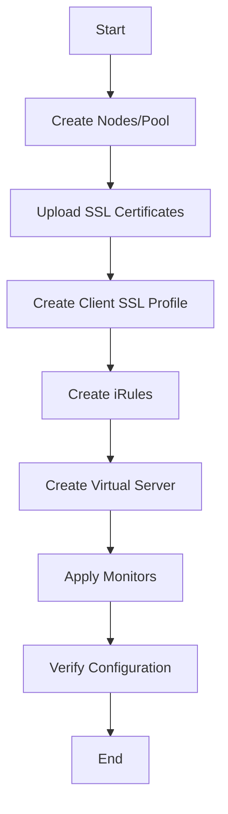

# Ansible F5 Automation

## Introduction

F5 BIG-IP is a popular suite of products used for load balancing, traffic management, and security in enterprise networks. As networks grow in complexity, manually configuring F5 devices becomes time-consuming and error-prone. This is where Ansible comes to the rescue.

Ansible F5 Automation allows network engineers to automate the configuration, deployment, and management of F5 BIG-IP devices using simple, human-readable YAML files called playbooks. By leveraging Ansible's declarative approach, you can define the desired state of your F5 infrastructure and let Ansible handle the implementation details.

In this guide, you'll learn how to use Ansible to automate various F5 BIG-IP tasks, from basic configuration to complex deployment scenarios.

## Prerequisites

Before diving into F5 automation with Ansible, make sure you have:

- Ansible installed (version 2.10 or higher)
- Access to an F5 BIG-IP device (physical or virtual)
- Basic understanding of Ansible concepts (playbooks, inventory, modules)
- Basic knowledge of F5 BIG-IP concepts

## Setting Up Your Environment

### Installing the F5 Ansible Collection

Ansible uses collections to organize and distribute modules. For F5 automation, you'll need the `f5networks.f5_modules` collection:

```bash
ansible-galaxy collection install f5networks.f5_modules
```

### Configuring Ansible Inventory

Create an inventory file that defines your F5 devices:

```ini
# inventory.ini
[f5_devices]
bigip01 ansible_host=192.168.1.245

[f5_devices:vars]
ansible_user=admin
ansible_password=admin
ansible_httpapi_port=443
ansible_httpapi_use_ssl=yes
ansible_httpapi_validate_certs=no
ansible_network_os=f5networks.f5_modules.bigip
ansible_connection=httpapi
```

## Basic F5 Operations with Ansible

### Gathering F5 Facts

Let's start with a simple playbook to gather facts from an F5 device:

```yaml
---
# gather_f5_facts.yml
- name: Gather F5 BIG-IP facts
  hosts: f5_devices
  gather_facts: no
  
  tasks:
    - name: Collect BIG-IP facts
      f5networks.f5_modules.bigip_device_info:
        gather_subset:
          - system-info
      register: device_facts

    - name: Display device information
      debug:
        msg: "Device {{ device_facts.system_info.marketing_name }} is running version {{ device_facts.system_info.product_version }}"
```

When you run this playbook with `ansible-playbook gather_f5_facts.yml`, you'll see output similar to:

```
TASK [Display device information] ****************************
ok: [bigip01] => {
    "msg": "Device BIG-IP Virtual Edition is running version 15.1.0"
}
```

### Creating a Virtual Server

Virtual servers are core components in F5 BIG-IP that process client connections. Here's how to create one with Ansible:

```yaml
---
# create_virtual_server.yml
- name: Create F5 virtual server
  hosts: f5_devices
  gather_facts: no
  
  tasks:
    - name: Create a pool
      f5networks.f5_modules.bigip_pool:
        name: web_pool
        lb_method: round-robin
        state: present
      
    - name: Add members to pool
      f5networks.f5_modules.bigip_pool_member:
        pool: web_pool
        host: "{{ item.ip }}"
        port: "{{ item.port }}"
        state: present
      loop:
        - { ip: '10.0.0.10', port: 80 }
        - { ip: '10.0.0.11', port: 80 }
    
    - name: Create virtual server
      f5networks.f5_modules.bigip_virtual_server:
        name: web_vs
        destination: 10.0.1.10
        port: 443
        pool: web_pool
        profiles:
          - http
          - clientssl
        state: present
```

This playbook:
1. Creates a pool named `web_pool` with round-robin load balancing
2. Adds two web servers to the pool
3. Creates a virtual server that listens on HTTPS (port 443) and forwards traffic to the pool

## Managing F5 Configurations

### Creating and Managing iRules

iRules are powerful scripts that give you control over how the BIG-IP system processes traffic:

```yaml
---
# create_irule.yml
- name: Manage iRules
  hosts: f5_devices
  gather_facts: no
  
  tasks:
    - name: Create an iRule
      f5networks.f5_modules.bigip_irule:
        name: redirect_http_to_https
        content: |
          when HTTP_REQUEST {
            HTTP::redirect https://[getfield [HTTP::host] ":" 1][HTTP::uri]
          }
        state: present
      
    - name: Attach iRule to virtual server
      f5networks.f5_modules.bigip_virtual_server:
        name: web_vs
        irules:
          - redirect_http_to_https
        state: present
```

This playbook creates an iRule that redirects HTTP requests to HTTPS and attaches it to our virtual server.

### Managing SSL Certificates

Securing your applications with SSL is crucial. Here's how to manage certificates with Ansible:

```yaml
---
# upload_certificate.yml
- name: Manage SSL certificates
  hosts: f5_devices
  gather_facts: no
  
  tasks:
    - name: Import certificate
      f5networks.f5_modules.bigip_ssl_certificate:
        name: example_cert
        content: "{{ lookup('file', 'certs/example.crt') }}"
        state: present
      
    - name: Import key
      f5networks.f5_modules.bigip_ssl_key:
        name: example_key
        content: "{{ lookup('file', 'certs/example.key') }}"
        state: present
        
    - name: Create client SSL profile
      f5networks.f5_modules.bigip_profile_client_ssl:
        name: example_clientssl
        cert_key_chain:
          - cert: example_cert
            key: example_key
        state: present
```

This playbook uploads a certificate and private key to the F5 device and creates a client SSL profile.

## F5 Automation Workflow Example

Let's tie everything together with a complete workflow for deploying a web application:



Here's the comprehensive playbook:

```yaml
---
# deploy_web_application.yml
- name: Deploy Web Application on F5
  hosts: f5_devices
  gather_facts: no
  
  tasks:
    - name: Create a pool
      f5networks.f5_modules.bigip_pool:
        name: webapp_pool
        lb_method: least-connections-member
        state: present
      
    - name: Add pool members
      f5networks.f5_modules.bigip_pool_member:
        pool: webapp_pool
        host: "{{ item.ip }}"
        port: "{{ item.port }}"
        state: present
      loop:
        - { ip: '10.0.0.20', port: 8080 }
        - { ip: '10.0.0.21', port: 8080 }
        - { ip: '10.0.0.22', port: 8080 }
    
    - name: Upload certificate
      f5networks.f5_modules.bigip_ssl_certificate:
        name: webapp_cert
        content: "{{ lookup('file', 'certs/webapp.crt') }}"
        state: present
      
    - name: Upload key
      f5networks.f5_modules.bigip_ssl_key:
        name: webapp_key
        content: "{{ lookup('file', 'certs/webapp.key') }}"
        state: present
    
    - name: Create client SSL profile
      f5networks.f5_modules.bigip_profile_client_ssl:
        name: webapp_clientssl
        cert_key_chain:
          - cert: webapp_cert
            key: webapp_key
        state: present
    
    - name: Create HTTP to HTTPS redirect iRule
      f5networks.f5_modules.bigip_irule:
        name: redirect_to_https
        content: |
          when HTTP_REQUEST {
            HTTP::redirect https://[HTTP::host][HTTP::uri]
          }
        state: present
    
    - name: Create HTTP virtual server (for redirect)
      f5networks.f5_modules.bigip_virtual_server:
        name: webapp_http_vs
        destination: 10.0.1.20
        port: 80
        irules:
          - redirect_to_https
        profiles:
          - http
        state: present
    
    - name: Create HTTPS virtual server
      f5networks.f5_modules.bigip_virtual_server:
        name: webapp_https_vs
        destination: 10.0.1.20
        port: 443
        pool: webapp_pool
        profiles:
          - http
          - webapp_clientssl
        state: present
    
    - name: Create health monitor
      f5networks.f5_modules.bigip_monitor_http:
        name: webapp_http_monitor
        send: "GET /health HTTP/1.1\r
Host: example.com\r
\r
"
        receive: "HTTP/1.1 200 OK"
        state: present
    
    - name: Apply monitor to pool
      f5networks.f5_modules.bigip_pool:
        name: webapp_pool
        monitor_type: and_list
        monitors:
          - webapp_http_monitor
        state: present
    
    - name: Verify configuration
      f5networks.f5_modules.bigip_command:
        commands: show ltm virtual
      register: virtual_server_output
    
    - name: Display virtual servers
      debug:
        var: virtual_server_output.stdout_lines
```

This comprehensive playbook:
1. Creates a pool with three backend servers
2. Uploads SSL certificates and creates a client SSL profile
3. Creates an iRule for HTTP to HTTPS redirection
4. Creates HTTP and HTTPS virtual servers
5. Configures health monitoring
6. Verifies the configuration

## Handling Multiple F5 Devices

In enterprise environments, you'll likely manage multiple F5 devices. Ansible makes this easy:

```yaml
---
# inventory.ini (expanded)
[f5_devices]
bigip_dc1_active ansible_host=10.1.1.10
bigip_dc1_standby ansible_host=10.1.1.11
bigip_dc2_active ansible_host=10.2.1.10
bigip_dc2_standby ansible_host=10.2.1.11

[dc1]
bigip_dc1_active
bigip_dc1_standby

[dc2]
bigip_dc2_active
bigip_dc2_standby

[active_devices]
bigip_dc1_active
bigip_dc2_active

# Group variables can be defined in separate files as well
```

Now you can target specific device groups:

```yaml
---
# update_all_active_devices.yml
- name: Update active F5 devices
  hosts: active_devices
  gather_facts: no
  
  tasks:
    - name: Create shared configuration
      f5networks.f5_modules.bigip_config:
        save: yes
      when: inventory_hostname in groups['active_devices']
```

## Idempotent Configuration Management

One of Ansible's strengths is idempotency – running the same playbook multiple times produces the same result:

```yaml
---
# idempotent_config.yml
- name: Ensure specific configuration exists
  hosts: f5_devices
  gather_facts: no
  
  tasks:
    - name: Ensure SNAT pool exists
      f5networks.f5_modules.bigip_snat_pool:
        name: outbound_snat_pool
        members:
          - 10.0.1.100
          - 10.0.1.101
        state: present
      
    - name: Ensure a virtual server has the correct profile
      f5networks.f5_modules.bigip_virtual_server:
        name: existing_virtual
        profiles:
          - http
          - webapp_clientssl
        state: present
```

This playbook ensures the specified configuration exists, without duplicating resources if they already exist.

## Error Handling and Recovery

Automation should be resilient. Add error handling to your playbooks:

```yaml
---
# error_handling.yml
- name: Configure F5 with error handling
  hosts: f5_devices
  gather_facts: no
  
  tasks:
    - name: Try to create a node
      f5networks.f5_modules.bigip_node:
        name: app_server
        host: 10.0.0.30
        state: present
      register: node_result
      ignore_errors: yes
    
    - name: Handle node creation failure
      debug:
        msg: "Failed to create node: {{ node_result.msg }}"
      when: node_result.failed
    
    - name: Create backup before major changes
      f5networks.f5_modules.bigip_config:
        save: yes
      when: inventory_hostname in groups['active_devices']
      
    - name: Verify configuration after changes
      f5networks.f5_modules.bigip_command:
        commands: show ltm virtual
      register: verify_output
      
    - name: Display verification output
      debug:
        var: verify_output.stdout_lines
```

This playbook includes error handling, backups, and verification steps to ensure reliable automation.

## Real-World Scenario: Blue-Green Deployment

Let's explore a practical scenario: implementing blue-green deployment for a web application:

```yaml
---
# blue_green_deployment.yml
- name: Implement Blue-Green deployment
  hosts: f5_devices
  gather_facts: no
  vars:
    active_environment: "{{ 'blue' if (lookup('file', 'current_env.txt') == 'green') else 'green' }}"
    inactive_environment: "{{ 'green' if active_environment == 'blue' else 'blue' }}"
  
  tasks:
    - name: Update inactive environment
      f5networks.f5_modules.bigip_pool:
        name: "{{ inactive_environment }}_pool"
        lb_method: round-robin
        state: present
      
    - name: Update pool members
      f5networks.f5_modules.bigip_pool_member:
        pool: "{{ inactive_environment }}_pool"
        host: "{{ item.ip }}"
        port: "{{ item.port }}"
        state: present
      loop:
        - { ip: '10.0.0.30', port: 8080 }
        - { ip: '10.0.0.31', port: 8080 }
    
    - name: Verify new environment health
      f5networks.f5_modules.bigip_command:
        commands: "show ltm pool {{ inactive_environment }}_pool members"
      register: pool_health
    
    - name: Switch traffic to new environment
      f5networks.f5_modules.bigip_virtual_server:
        name: production_vs
        pool: "{{ inactive_environment }}_pool"
        state: present
      when: '"up" in pool_health.stdout[0]'
      
    - name: Update current environment record
      copy:
        content: "{{ inactive_environment }}"
        dest: current_env.txt
      delegate_to: localhost
```

This playbook implements a blue-green deployment strategy, updating the inactive environment and then switching traffic only after verifying health.

## Troubleshooting F5 Ansible Automation

Even with well-written playbooks, issues may arise. Here are some common problems and solutions:

### Authentication Issues

If you encounter authentication problems:

```yaml
---
# troubleshoot_auth.yml
- name: Test authentication
  hosts: f5_devices
  gather_facts: no
  
  tasks:
    - name: Get system info
      f5networks.f5_modules.bigip_device_info:
        gather_subset:
          - system-info
      register: result
      
    - name: Display authentication success
      debug:
        msg: "Authentication successful"
      when: result is success
      
    - name: Display authentication failure
      debug:
        msg: "Authentication failed: {{ result.msg | default('Unknown error') }}"
      when: result is failed
```

### SSL Certificate Validation

If you're having SSL certificate validation issues:

```yaml
---
# disable_cert_validation.yml
- name: Configure without cert validation
  hosts: f5_devices
  gather_facts: no
  
  vars:
    ansible_httpapi_validate_certs: no
  
  tasks:
    - name: Get system info
      f5networks.f5_modules.bigip_device_info:
        gather_subset:
          - system-info
```

## Summary

In this guide, you've learned how to automate F5 BIG-IP devices using Ansible. We covered:

1. Setting up your environment with the F5 Ansible collection
2. Basic operations like creating pools and virtual servers
3. Managing configurations, including iRules and SSL certificates
4. Implementing complex workflows and blue-green deployments
5. Handling errors and troubleshooting common issues

Ansible F5 automation empowers network engineers to manage complex F5 infrastructures efficiently, reduce manual errors, and implement infrastructure as code practices.

## Additional Resources

To deepen your knowledge of Ansible F5 automation:

- F5 Ansible Documentation: [F5 Networks Collection](https://docs.ansible.com/ansible/latest/collections/f5networks/index.html)
- F5 DevCentral: [Community resources and examples](https://devcentral.f5.com)
- Ansible Galaxy: Browse for additional F5-related collections

## Exercises

1. **Basic Exercise**: Create a playbook to configure a simple load balancer with two web servers.
2. **Intermediate Exercise**: Implement a playbook that performs a rolling update of pool members without downtime.
3. **Advanced Exercise**: Create a complete CI/CD pipeline that tests F5 configurations in a staging environment before applying them to production.

By completing these exercises, you'll gain practical experience with Ansible F5 automation and be well-equipped to implement it in your own environment.