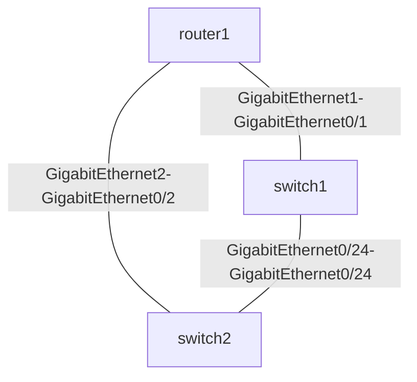

# Ansible Network Facts

## Introduction

Network facts are essential pieces of information about network devices that you can gather and use in your automation workflows. In Ansible, "facts" refer to system properties or attributes that are collected from remote systems. When working with network devices, these facts include details such as device model, operating system version, interface configuration, routing tables, and more.

Unlike server automation where Ansible uses the `setup` module to gather facts automatically, network devices require specific modules designed for each network platform. This guide will show you how to collect, display, and utilize network facts to build smarter, more dynamic network automation.

## Why Network Facts Matter

Before diving into implementation, let's understand why network facts are crucial:

1. **Inventory Enrichment** - Gather real-time data about your devices beyond what's in your inventory files
2. **Conditional Automation** - Make decisions in playbooks based on device attributes
3. **Documentation** - Automatically generate up-to-date network documentation
4. **Compliance** - Verify device configurations against standards
5. **Troubleshooting** - Quickly collect device state information

## Basic Network Facts Collection

Each network platform in Ansible has a dedicated facts module. Here are some examples:

- Cisco IOS/IOS-XE: `ios_facts`
- Cisco NX-OS: `nxos_facts`
- Juniper Junos: `junos_facts`
- Arista EOS: `eos_facts`

Let's start with a simple playbook that collects facts from Cisco IOS devices:

```yaml
---
- name: Gather Cisco IOS Facts
  hosts: cisco_routers
  gather_facts: no

  tasks:
    - name: Collect device facts
      cisco.ios.ios_facts:
        gather_subset: all

    - name: Display device facts
      debug:
        var: ansible_facts
```

When you run this playbook against a Cisco router, Ansible will:
1. Connect to the device
2. Run commands to collect information
3. Store the results in the `ansible_facts` variable
4. Display all the collected facts

## Understanding Network Facts Structure

The facts gathered are organized in a structured format. Let's examine what's typically included:

```yaml
ansible_facts:
  ansible_net_api: "cliconf"
  ansible_net_device_info:
    hardware: "CSR1000V"
    image: "bootflash:packages.conf"
    platform: "Virtual XE"
    serialnum: "9KIBQAQ3OPE"
  ansible_net_hostname: "router1"
  ansible_net_interfaces:
    GigabitEthernet1:
      bandwidth: 1000000
      description: "Management Interface"
      duplex: "Full"
      ipv4:
        - address: "192.168.1.1"
          subnet: "24"
      lineprotocol: "up"
      macaddress: "0800.2700.0001"
      mtu: 1500
      operstatus: "up"
      type: "CSR vNIC"
    GigabitEthernet2:
      # Similar structure for other interfaces
  ansible_net_model: "CSR1000V"
  ansible_net_neighbors:
    GigabitEthernet1:
      - host: "switch1"
        port: "GigabitEthernet0/1"
    GigabitEthernet2:
      - host: "switch2"
        port: "GigabitEthernet0/2"
  ansible_net_python_version: "3.8.10"
  ansible_net_serialnum: "9KIBQAQ3OPE"
  ansible_net_system: "ios"
  ansible_net_version: "16.9.3"
```

The exact structure varies by platform, but generally includes:
- Basic device information (model, serial number, hostname)
- Operating system details (version, image)
- Interface configuration (IP addresses, state, descriptions)
- Neighbor information (CDP/LLDP neighbors)

## Customizing Facts Collection

Most network facts modules allow you to gather specific subsets of information, which helps improve performance by collecting only what you need:

```yaml
- name: Collect specific facts
  cisco.ios.ios_facts:
    gather_subset:
      - "!hardware"  # Exclude hardware facts
      - "config"     # Include config
    gather_network_resources:
      - "interfaces"  # Only gather interface resources
      - "l2_interfaces"
```

The `gather_subset` parameter can include:
- `all` - Gather all basic facts
- `hardware` - Hardware-related facts
- `config` - Configuration facts
- `interfaces` - Interface information
- You can prefix with `!` to exclude a subset

The `gather_network_resources` parameter collects resource module-specific facts like:
- `interfaces`
- `vlans`
- `l2_interfaces`
- `l3_interfaces`
- And more, depending on platform support

## Practical Examples

### Example 1: Generate Interface Documentation

Let's create a playbook that generates Markdown documentation of all interfaces:

```yaml
---
- name: Generate Interface Documentation
  hosts: network_devices
  gather_facts: no
  
  tasks:
    - name: Collect interface facts
      ansible.builtin.include_tasks: collect_facts.yml
    
    - name: Create interface documentation
      template:
        src: interfaces.md.j2
        dest: "docs/{{ inventory_hostname }}-interfaces.md"
```

The included task file (`collect_facts.yml`):

```yaml
- name: Collect Cisco IOS facts
  cisco.ios.ios_facts:
    gather_subset: 
      - interfaces
  when: ansible_network_os == 'ios'

- name: Collect Juniper facts
  junos.junos.junos_facts:
    gather_subset: 
      - interfaces
  when: ansible_network_os == 'junos'

# Similar tasks for other platforms
```

And the Jinja2 template (`interfaces.md.j2`):

```markdown
# {{ ansible_facts.ansible_net_hostname }} Interface Documentation

Generated on: {{ ansible_date_time.date }}

| Interface | Status | IP Address | Description |
|-----------|--------|------------|-------------|

| {{ interface_name }} | {{ interface.operstatus }} | {{ interface.ipv4[0].address }}/{{ interface.ipv4[0].subnet }}N/A | {{ interface.description | default('No description') }} |

```

### Example 2: Conditional Automation Based on Facts

Using facts to make decisions in your playbooks:

```yaml
---
- name: Upgrade IOS based on current version
  hosts: cisco_routers
  gather_facts: no
  
  tasks:
    - name: Collect IOS facts
      cisco.ios.ios_facts:
        gather_subset: 
          - "!config"
    
    - name: Display current IOS version
      debug:
        msg: "Current IOS version: {{ ansible_facts.ansible_net_version }}"
    
    - name: Upgrade devices with outdated IOS
      block:
        - name: Copy IOS image to device
          net_put:
            src: files/ios_images/{{ ios_target_version }}.bin
            dest: flash:/{{ ios_target_version }}.bin
        
        - name: Set boot image
          ios_config:
            lines:
              - "boot system flash:/{{ ios_target_version }}.bin"
        
        - name: Schedule reload
          ios_command:
            commands:
              - command: "reload in 120"
                prompt: "Confirm"
                answer: "y"
      when: ansible_facts.ansible_net_version is version(minimum_ios_version, '<')
      vars:
        minimum_ios_version: "16.9.0"
        ios_target_version: "c1000v-universalk9.16.09.04.SPA"
```

### Example 3: Network Topology Visualization

We can use facts to automatically generate a topology diagram:

```yaml
---
- name: Generate Network Topology Diagram
  hosts: network_devices
  gather_facts: no
  
  tasks:
    - name: Collect CDP/LLDP neighbor facts
      include_tasks: collect_neighbor_facts.yml
    
    - name: Generate Mermaid diagram
      template:
        src: topology.mermaid.j2
        dest: "docs/network_topology.mermaid"
```

With this Jinja2 template (`topology.mermaid.j2`):

```
graph TD



  {{ host | replace('-', '_') }} -- {{ interface }}-{{ neighbor.port }} --- {{ neighbor.host | replace('-', '_') }}



```

This generates a diagram structure like:



## Working with Facts in Templates and Variables

Facts become particularly powerful when used in templates and variable manipulations. Here's how to work with them:

### Accessing Nested Facts

Use the dot notation or square brackets to access nested data:

```yaml
- name: Display hostname
  debug:
    msg: "Device hostname is: {{ ansible_facts.ansible_net_hostname }}"

- name: Display IP of a specific interface
  debug:
    msg: "Management IP is: {{ ansible_facts.ansible_net_interfaces['GigabitEthernet1'].ipv4[0].address }}"
```

### Transforming Facts with Filters

Ansible provides filters to transform and manipulate data:

```yaml
- name: Count interfaces
  debug:
    msg: "Device has {{ ansible_facts.ansible_net_interfaces | length }} interfaces"

- name: Get all interface names
  debug:
    var: ansible_facts.ansible_net_interfaces.keys() | list

- name: Find interfaces with description containing 'WAN'
  debug:
    msg: "WAN interfaces: {{ iface }} "
```

### Registering and Using Facts in Variables

You can register task results and use them alongside facts:

```yaml
- name: Run show command
  ios_command:
    commands: show ip route
  register: route_output

- name: Combine facts with command output
  debug:
    msg: "Device {{ ansible_facts.ansible_net_hostname }} has the following routes: {{ route_output.stdout[0] }}"
```

## Persistent Facts

By default, facts are collected during playbook execution and lost when the playbook completes. You can make facts persistent using the `set_fact` module:

```yaml
- name: Collect network facts
  cisco.ios.ios_facts:
    gather_subset: all

- name: Save facts to cached file
  set_fact:
    device_model: "{{ ansible_facts.ansible_net_model }}"
    device_version: "{{ ansible_facts.ansible_net_version }}"
    cacheable: yes
```

The `cacheable: yes` parameter tells Ansible to save these facts to a cache file, making them available across playbook runs.

## Best Practices for Working with Network Facts

1. **Be Selective** - Only gather the facts you need to improve performance
2. **Cache When Possible** - Use fact caching for data that doesn't change frequently
3. **Handle Missing Data** - Use Jinja2's `default` filter or conditional checks when accessing potentially missing data
4. **Use Facts for Documentation** - Generate up-to-date documentation using fact data
5. **Version Control Compliance** - Automatically check OS versions against required baselines
6. **Structure for Reuse** - Create task files for fact gathering that can be included in multiple playbooks

## Troubleshooting Network Facts

If you're having trouble with fact gathering:

1. **Enable Verbose Output** - Run ansible-playbook with `-v` or `-vvv` flags
2. **Check Authentication** - Ensure your authentication variables are correct
3. **Platform Support** - Verify your network OS is supported
4. **Module Availability** - Ensure the appropriate collection is installed
5. **Network Connectivity** - Check that the management network allows the required protocols

## Summary

Network facts are a powerful feature in Ansible that allow you to collect, display, and use information about your network devices. They transform static automation into dynamic workflows that adapt to your environment's actual state. By gathering facts about your devices, you can make informed decisions in your playbooks, generate documentation, and ensure compliance with your standards.

As you build more sophisticated network automation, facts will become a central part of your toolbox—enabling you to create more intelligent, adaptable, and maintainable automation solutions.

## Additional Resources

- [Ansible Network Resource Modules Documentation](https://docs.ansible.com/ansible/latest/network/user_guide/network_resource_modules.html)
- [Ansible Facts Cache Documentation](https://docs.ansible.com/ansible/latest/user_guide/playbooks_vars_facts.html#caching-facts)
- [Using Filters in Ansible](https://docs.ansible.com/ansible/latest/user_guide/playbooks_filters.html)

## Exercises

1. Create a playbook that collects facts from multiple network platforms and saves them to YAML files.
2. Build a dynamic inventory script that uses cached facts to group devices by OS version.
3. Write a compliance checking playbook that compares collected facts against your organization's standards.
4. Generate a network documentation site using facts from all your devices.
5. Create a playbook that uses interface facts to find and report on unused interfaces (those with "down" status for more than 30 days).