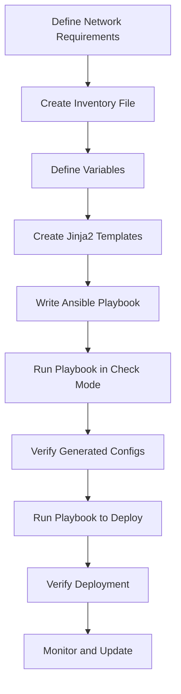

# Ansible Network Templates

## Introduction

Network configuration management can be complex and error-prone when done manually. Ansible Network Templates provide a powerful solution by allowing you to create standardized configuration templates that can be applied across multiple network devices. This approach ensures consistency, reduces human error, and dramatically speeds up the deployment process.

In this guide, we'll explore how to use Jinja2 templates with Ansible to create reusable, dynamic network configurations for various network devices like routers, switches, and firewalls.

## What are Ansible Network Templates?

Ansible Network Templates combine Ansible's automation capabilities with Jinja2's templating language to create dynamic configuration files for network devices. Rather than manually configuring each device or writing static configuration files, you can create templates that:

- Contain variables that get replaced with actual values at runtime
- Include conditional logic to handle different device types or requirements
- Loop through collections of data to generate repetitive configurations
- Inherit from other templates to build complex configurations from simpler components

## Getting Started with Jinja2 Templates

### Jinja2 Basics

Jinja2 is a modern and designer-friendly templating language for Python. Ansible uses Jinja2 for its template module. Here's a quick overview of Jinja2 syntax:

- Variables: `{{ variable_name }}`
- Control structures: `...`
- Loops: `...`
- Comments: `{# This is a comment #}`

Let's start with a simple example:

```jinja
hostname {{ inventory_hostname }}

interface Loopback0
 ip address {{ loopback_ip }} 255.255.255.255


interface {{ interface.name }}
 description {{ interface.description }}
 ip address {{ interface.ip_address }} {{ interface.subnet_mask }}

 shutdown


```

### Creating Your First Network Template

Let's create a basic template for configuring a Cisco router. First, create a template file named `cisco_router.j2`:

```jinja
! Basic configuration for {{ inventory_hostname }}
! Generated by Ansible on {{ ansible_date_time.date }}

hostname {{ inventory_hostname }}


ip domain-name {{ domain_name }}


! Configure interfaces

interface {{ interface.name }}
 description {{ interface.description | default('Configured by Ansible') }}
 ip address {{ interface.ip }} {{ interface.netmask }}

 no shutdown

 shutdown



! Configure routing

router ospf {{ ospf_process_id }}

 network {{ network.address }} {{ network.wildcard }} area {{ network.area }}


router eigrp {{ eigrp_as }}

 network {{ network }}



! End of configuration
```

## Using Templates in Ansible Playbooks

Now that we have our template, let's create a playbook that uses it:

```yaml
---
- name: Configure Network Devices
  hosts: routers
  gather_facts: no
  
  vars:
    domain_name: example.com
    routing_protocol: ospf
    ospf_process_id: 1
    ospf_networks:
      - address: 192.168.1.0
        wildcard: 0.0.0.255
        area: 0
      - address: 10.0.0.0
        wildcard: 0.0.0.255
        area: 0
  
  tasks:
    - name: Generate device configurations
      template:
        src: templates/cisco_router.j2
        dest: "configs/{{ inventory_hostname }}.cfg"
      
    - name: Deploy configurations to devices
      ios_config:
        src: "configs/{{ inventory_hostname }}.cfg"
```

### Variables and Inventory

For the templates to work properly, you need to define variables. This can be done in several ways:

1. In the inventory file:

```ini
[routers]
router1 ansible_host=192.168.1.1
router2 ansible_host=192.168.1.2

[routers:vars]
domain_name=example.com
routing_protocol=ospf
```

2. In host or group variable files:

Create a file in `host_vars/router1.yml`:

```yaml
interfaces:
  - name: GigabitEthernet0/0
    description: WAN Interface
    ip: 203.0.113.1
    netmask: 255.255.255.0
    state: up
  - name: GigabitEthernet0/1
    description: LAN Interface
    ip: 192.168.1.1
    netmask: 255.255.255.0
    state: up
```

## Advanced Template Techniques

### Template Filters

Jinja2 provides filters that allow you to transform data. Here are some useful ones:

```jinja
{{ interface.description | default('No description') }}  {# Provides a default value #}
{{ interface.name | upper }}  {# Converts to uppercase #}
{{ ip_address | ipaddr('network') }}  {# Extracts network address using the ipaddr filter #}
{{ vlans | join(', ') }}  {# Joins list elements with a comma and space #}
```

### Template Loops with Conditional Logic

You can combine loops with conditionals for more complex templates:

```jinja

vlan {{ vlan.id }}
 name {{ vlan.name }}



interface {{ interface.name }}

 switchport mode access
 switchport access vlan {{ interface.vlan }}

 switchport mode trunk
 switchport trunk allowed vlan {{ interface.allowed_vlans | join(',') }}


```

### Using Include Statements

You can break larger templates into smaller, reusable components:

```jinja
{# Main template: router_config.j2 #}




```

## Real-World Examples

### Example 1: Multi-Vendor Configuration Management

Let's create a more practical example where we configure devices from different vendors:

```yaml
---
- name: Configure Network Devices
  hosts: all
  gather_facts: no
  
  tasks:
    - name: Generate Cisco IOS configuration
      template:
        src: templates/{{ ansible_network_os }}_config.j2
        dest: "configs/{{ inventory_hostname }}.cfg"
      when: ansible_network_os == 'ios'
    
    - name: Generate Juniper JUNOS configuration
      template:
        src: templates/{{ ansible_network_os }}_config.j2
        dest: "configs/{{ inventory_hostname }}.cfg"
      when: ansible_network_os == 'junos'
    
    - name: Deploy Cisco configurations
      ios_config:
        src: "configs/{{ inventory_hostname }}.cfg"
      when: ansible_network_os == 'ios'
    
    - name: Deploy Juniper configurations
      junos_config:
        src: "configs/{{ inventory_hostname }}.cfg"
        format: text
      when: ansible_network_os == 'junos'
```

The Cisco template (`ios_config.j2`):

```jinja
hostname {{ inventory_hostname }}


ip access-list extended {{ acl.name }}

 {{ rule.permission }} {{ rule.protocol }} {{ rule.source }} {{ rule.destination }}


```

The Juniper template (`junos_config.j2`):

```jinja
system {
    host-name {{ inventory_hostname }};
    
    domain-name {{ domain_name }};
    
}


policy-options {
    prefix-list {{ prefix_list.name }} {
    
        {{ prefix }};
    
    }
}

```

### Example 2: Automating VLAN Configuration

Here's a template for configuring VLANs on multiple switches:

```jinja
{# vlan_config.j2 #}

vlan {{ vlan.id }}
 name {{ vlan.name }}



interface {{ interface.name }}
 description {{ interface.description }}
 switchport mode access
 switchport access vlan {{ interface.vlan_id }}
 spanning-tree portfast



interface {{ interface.name }}
 description {{ interface.description }}
 switchport mode trunk
 switchport trunk allowed vlan {{ interface.allowed_vlans | join(',') }}
 switchport trunk native vlan {{ interface.native_vlan }}

```

And the corresponding playbook:

```yaml
---
- name: Configure VLANs on Switches
  hosts: switches
  gather_facts: no
  
  tasks:
    - name: Generate VLAN configurations
      template:
        src: templates/vlan_config.j2
        dest: "configs/{{ inventory_hostname }}_vlans.cfg"
      vars:
        vlans:
          - id: 10
            name: Data
          - id: 20
            name: Voice
          - id: 30
            name: Management
        access_ports:
          - name: GigabitEthernet0/1
            description: Office PC
            vlan_id: 10
          - name: GigabitEthernet0/2
            description: IP Phone
            vlan_id: 20
        trunk_ports:
          - name: GigabitEthernet0/48
            description: Uplink to Core
            allowed_vlans: [10, 20, 30]
            native_vlan: 1
    
    - name: Deploy VLAN configurations
      ios_config:
        src: "configs/{{ inventory_hostname }}_vlans.cfg"
```

## Network Configuration Workflow with Templates

Let's visualize a complete workflow for network configuration management using Ansible templates:



## Best Practices for Ansible Network Templates

1. **Keep Templates Modular**: Break complex templates into smaller, reusable components.
2. **Use Version Control**: Store your templates in a version control system like Git.
3. **Test Templates Before Deployment**: Use Ansible's check mode (`--check`) to preview changes.
4. **Document Templates**: Add comments explaining the purpose and usage of each template.
5. **Use Consistent Naming Conventions**: Create a logical naming scheme for templates and variables.
6. **Validate Variables**: Check if required variables are defined before using them.
7. **Handle Errors Gracefully**: Use conditional checks to prevent template rendering errors.
8. **Create Backup Configurations**: Always backup current configurations before applying changes.

## Summary

Ansible Network Templates provide a powerful way to manage network configurations at scale. By combining Ansible's automation capabilities with Jinja2's flexible templating language, you can create dynamic, reusable configurations that work across multiple vendors and device types.

The key benefits of using templates include:
- Consistency across your network infrastructure
- Reduced human error
- Faster deployment and updates
- Easier maintenance and troubleshooting
- Better documentation and change tracking

As your network grows in size and complexity, templates become essential for efficient management and operations.

## Exercises

1. Create a basic template for configuring NTP on a Cisco router with at least three NTP servers.
2. Develop a template for configuring SNMP with different communities for read-only and read-write access.
3. Build a template that configures a router's interfaces based on a CSV file containing interface names, IP addresses, and descriptions.
4. Create a multi-vendor template that works for both Cisco IOS and Arista EOS devices.
5. Develop a playbook that uses templates to generate complete router configurations, including routing protocols, NTP, SNMP, and access control lists.

## Additional Resources

- [Ansible Documentation for Template Module](https://docs.ansible.com/ansible/latest/collections/ansible/builtin/template_module.html)
- [Jinja2 Template Designer Documentation](https://jinja.palletsprojects.com/en/3.0.x/templates/)
- [Ansible Network Automation Documentation](https://docs.ansible.com/ansible/latest/network/index.html)
- [Network Automation with Ansible Book](https://www.ansible.com/resources/ebooks/network-automation-for-everyone)