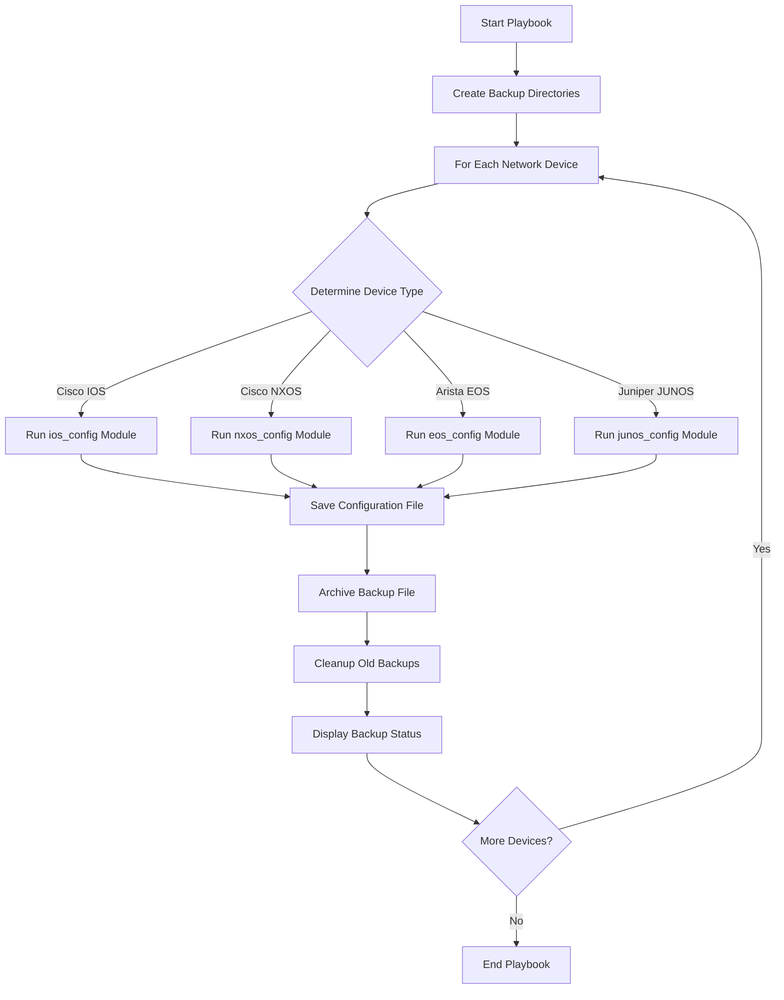

# Ansible Network Backups

## Introduction

Network device configuration backups are a critical aspect of any network management strategy. They provide a safety net for disaster recovery, enable configuration auditing, and help track changes over time. However, manually backing up configurations from numerous devices is time-consuming and error-prone.

This is where Ansible comes in. As a powerful automation tool, Ansible can streamline the process of backing up network device configurations across your entire infrastructure, regardless of the vendor or device type.

In this guide, we'll explore how to use Ansible to automate network device backups, making your network management more efficient and reliable.

## Why Automate Network Backups?

Before diving into the "how," let's understand the "why":

1. **Disaster Recovery**: If a device fails, having a recent backup allows for quick restoration
2. **Change Management**: Track configuration changes over time
3. **Compliance**: Meet regulatory requirements for configuration backups
4. **Consistency**: Ensure all devices are backed up using the same process
5. **Time Efficiency**: Save hours of manual work, especially in large networks

## Prerequisites

To follow along with this guide, you'll need:

- Ansible installed (version 2.9+)
- Basic understanding of YAML syntax
- Network devices that support SSH/CLI access
- Proper credentials for your network devices
- A control node that can reach your network devices

## Directory Structure

Let's set up a proper directory structure for our Ansible network backup project:

```
ansible-network-backups/
├── ansible.cfg
├── inventory.yml
├── backup.yml
├── host_vars/
├── group_vars/
│   └── all.yml
└── backup/
```

## Basic Configuration

### Ansible Configuration File

First, let's create an `ansible.cfg` file with some basic settings:

```ini
[defaults]
inventory = inventory.yml
host_key_checking = False
network_plugin = auto
stdout_callback = yaml
gathering = explicit
retry_files_enabled = False
```

### Inventory File

Now, create an `inventory.yml` file to define your network devices:

```yaml
---
all:
  children:
    network:
      children:
        cisco_ios:
          hosts:
            switch1:
              ansible_host: 192.168.1.101
            switch2:
              ansible_host: 192.168.1.102
        cisco_nxos:
          hosts:
            nexus1:
              ansible_host: 192.168.1.201
        arista_eos:
          hosts:
            arista1:
              ansible_host: 192.168.1.301
        juniper_junos:
          hosts:
            router1:
              ansible_host: 192.168.1.401
```

### Group Variables

Create `group_vars/all.yml` to store shared variables for authentication:

```yaml
---
ansible_connection: network_cli
ansible_user: admin
ansible_password: "{{ vault_ansible_password }}"
ansible_network_os: "{{ 'ios' if 'cisco_ios' in group_names else 
                        'nxos' if 'cisco_nxos' in group_names else 
                        'eos' if 'arista_eos' in group_names else 
                        'junos' if 'juniper_junos' in group_names else 
                        'unknown' }}"
```

For security, you should encrypt your passwords using Ansible Vault:

```bash
ansible-vault create group_vars/all/vault.yml
```

And add your password:

```yaml
---
vault_ansible_password: your_secure_password
```

## Creating the Backup Playbook

Let's create our `backup.yml` playbook:

```yaml
---
- name: Backup Network Device Configurations
  hosts: network
  gather_facts: no
  
  vars:
    backup_path: "./backup"
    timestamp: "{{ lookup('pipe', 'date +%Y%m%d-%H%M%S') }}"
  
  tasks:
    - name: Create backup directory if it doesn't exist
      delegate_to: localhost
      file:
        path: "{{ backup_path }}"
        state: directory
      run_once: true
      
    - name: Create vendor-specific backup directories
      delegate_to: localhost
      file:
        path: "{{ backup_path }}/{{ group_names[1] }}"
        state: directory
      
    - name: Backup Cisco IOS configurations
      when: ansible_network_os == 'ios'
      ios_config:
        backup: yes
        backup_options:
          filename: "{{ inventory_hostname }}_{{ timestamp }}.cfg"
          dir_path: "{{ backup_path }}/cisco_ios"
      
    - name: Backup Cisco NXOS configurations
      when: ansible_network_os == 'nxos'
      nxos_config:
        backup: yes
        backup_options:
          filename: "{{ inventory_hostname }}_{{ timestamp }}.cfg"
          dir_path: "{{ backup_path }}/cisco_nxos"
      
    - name: Backup Arista EOS configurations
      when: ansible_network_os == 'eos'
      eos_config:
        backup: yes
        backup_options:
          filename: "{{ inventory_hostname }}_{{ timestamp }}.cfg"
          dir_path: "{{ backup_path }}/arista_eos"
      
    - name: Backup Juniper JUNOS configurations
      when: ansible_network_os == 'junos'
      junos_config:
        backup: yes
        backup_options:
          filename: "{{ inventory_hostname }}_{{ timestamp }}.cfg"
          dir_path: "{{ backup_path }}/juniper_junos"
      
    - name: Display backup status
      debug:
        msg: "Successfully backed up configuration for {{ inventory_hostname }}"
```

## Running the Backup Playbook

To run the playbook:

```bash
ansible-playbook backup.yml --ask-vault-pass
```

If you want to back up only a specific group of devices:

```bash
ansible-playbook backup.yml --limit cisco_ios --ask-vault-pass
```

## Sample Output

When running the playbook, you should see output similar to:

```
PLAY [Backup Network Device Configurations] ************************************************************************

TASK [Create backup directory if it doesn't exist] *****************************************************************
ok: [switch1 -> localhost]

TASK [Create vendor-specific backup directories] *******************************************************************
ok: [switch1 -> localhost]
ok: [switch2 -> localhost]
ok: [nexus1 -> localhost]
ok: [arista1 -> localhost]
ok: [router1 -> localhost]

TASK [Backup Cisco IOS configurations] *****************************************************************************
ok: [switch1]
ok: [switch2]
skipping: [nexus1]
skipping: [arista1]
skipping: [router1]

TASK [Backup Cisco NXOS configurations] ***************************************************************************
skipping: [switch1]
skipping: [switch2]
ok: [nexus1]
skipping: [arista1]
skipping: [router1]

... [other tasks output] ...

TASK [Display backup status] **************************************************************************************
ok: [switch1] => {
    "msg": "Successfully backed up configuration for switch1"
}
ok: [switch2] => {
    "msg": "Successfully backed up configuration for switch2"
}
... [other hosts output] ...

PLAY RECAP ********************************************************************************************************
switch1                    : ok=4    changed=0    unreachable=0    failed=0    skipped=3    rescued=0    ignored=0   
switch2                    : ok=4    changed=0    unreachable=0    failed=0    skipped=3    rescued=0    ignored=0   
nexus1                     : ok=4    changed=0    unreachable=0    failed=0    skipped=3    rescued=0    ignored=0   
arista1                    : ok=4    changed=0    unreachable=0    failed=0    skipped=3    rescued=0    ignored=0   
router1                    : ok=4    changed=0    unreachable=0    failed=0    skipped=3    rescued=0    ignored=0   
```

## Advanced Configuration Backup Strategies

### Scheduling Regular Backups

To schedule regular backups, you can use cron jobs. Create a shell script called `run_backup.sh`:

```bash
#!/bin/bash
cd /path/to/ansible-network-backups
ansible-playbook backup.yml --vault-password-file .vault_pass.txt
```

Make it executable:

```bash
chmod +x run_backup.sh
```

Add a cron job to run it daily:

```bash
0 1 * * * /path/to/ansible-network-backups/run_backup.sh >> /var/log/ansible-backups.log 2>&1
```

### Multi-Vendor Enhanced Playbook

For more advanced requirements, here's an enhanced playbook that handles different backup formats and includes error handling:

```yaml
---
- name: Advanced Network Configuration Backup
  hosts: network
  gather_facts: no
  
  vars:
    backup_path: "./backup"
    timestamp: "{{ lookup('pipe', 'date +%Y%m%d-%H%M%S') }}"
    retention_days: 30
    
  tasks:
    - name: Create backup directories
      delegate_to: localhost
      file:
        path: "{{ backup_path }}/{{ item }}/{{ inventory_hostname }}"
        state: directory
      loop:
        - "running"
        - "startup"
        - "archives"
      
    - name: Set platform specific commands
      set_fact:
        show_running_config: "{{ 'show running-config' if ansible_network_os in ['ios', 'nxos', 'eos'] else 
                               'show configuration' if ansible_network_os == 'junos' else 
                               'unknown' }}"
        show_startup_config: "{{ 'show startup-config' if ansible_network_os in ['ios', 'nxos'] else 
                               'show boot-config' if ansible_network_os == 'eos' else 
                               'show configuration' if ansible_network_os == 'junos' else 
                               'unknown' }}"
    
    - name: Backup running configuration
      cli_command:
        command: "{{ show_running_config }}"
      register: running_config
      ignore_errors: yes
      
    - name: Save running configuration
      delegate_to: localhost
      copy:
        content: "{{ running_config.stdout | default('ERROR: Unable to retrieve configuration') }}"
        dest: "{{ backup_path }}/running/{{ inventory_hostname }}/{{ inventory_hostname }}_{{ timestamp }}.cfg"
      when: running_config is defined and running_config.stdout is defined
      
    - name: Backup startup configuration
      cli_command:
        command: "{{ show_startup_config }}"
      register: startup_config
      ignore_errors: yes
      
    - name: Save startup configuration
      delegate_to: localhost
      copy:
        content: "{{ startup_config.stdout | default('ERROR: Unable to retrieve configuration') }}"
        dest: "{{ backup_path }}/startup/{{ inventory_hostname }}/{{ inventory_hostname }}_{{ timestamp }}.cfg"
      when: startup_config is defined and startup_config.stdout is defined
      
    - name: Archive latest backup
      delegate_to: localhost
      archive:
        path: "{{ backup_path }}/running/{{ inventory_hostname }}/{{ inventory_hostname }}_{{ timestamp }}.cfg"
        dest: "{{ backup_path }}/archives/{{ inventory_hostname }}/{{ inventory_hostname }}_{{ timestamp }}.zip"
        format: zip
      when: running_config is defined and running_config.stdout is defined
      
    - name: Cleanup old backups
      delegate_to: localhost
      find:
        paths: "{{ backup_path }}/running/{{ inventory_hostname }}"
        patterns: "*.cfg"
        age: "{{ retention_days }}d"
      register: old_files
      
    - name: Remove old backup files
      delegate_to: localhost
      file:
        path: "{{ item.path }}"
        state: absent
      loop: "{{ old_files.files }}"
```

## Visualizing the Backup Process

Here's a Mermaid diagram showing the workflow of the Ansible network backup process:



## Best Practices for Network Backups

1. **Encryption**: Always encrypt sensitive information like passwords with Ansible Vault
2. **Regular Scheduling**: Set up cron jobs for consistent backups
3. **Backup Retention**: Implement a policy to manage the lifecycle of backup files
4. **Git Integration**: Consider storing configurations in a Git repository for change tracking
5. **Error Handling**: Implement robust error handling and notifications
6. **Centralized Storage**: Store backups in a centralized, secure location
7. **Verification**: Periodically verify that your backups are usable for restoration
8. **Documentation**: Document your backup strategy and restoration procedures

## Sample Git Integration Script

Here's a sample script to integrate your backups with Git for version control:

```bash
#!/bin/bash
BACKUP_DIR="/path/to/ansible-network-backups/backup"
GIT_REPO="/path/to/network-config-repo"

# Copy latest backups to Git repo
cp -R $BACKUP_DIR/running/* $GIT_REPO/

# Navigate to Git repo
cd $GIT_REPO

# Add all changes
git add .

# Commit with timestamp
git commit -m "Network configuration backup $(date +%Y-%m-%d_%H:%M:%S)"

# Push to remote repository
git push origin main
```

## Summary

Automating network device backups with Ansible provides several benefits:

- Significantly reduces the time and effort required for manual backups
- Ensures consistent backup processes across multiple device types
- Improves disaster recovery capabilities
- Enables configuration version tracking and change management
- Provides a foundation for more advanced network automation

By following this guide, you've learned how to set up a comprehensive network backup solution using Ansible. You can now customize and expand this solution to meet your specific requirements.

## Additional Resources

- **Ansible Network Documentation**: [Ansible Network Guide](https://docs.ansible.com/ansible/latest/network/index.html)
- **Ansible Collections for Network Devices**: [Ansible Network Collections](https://galaxy.ansible.com/ansible/netcommon)
- **Network Configuration Examples**: [Ansible Network Examples](https://github.com/ansible/workshops)

## Practice Exercises

1. Modify the backup playbook to send an email notification when backups complete
2. Create a playbook to restore a configuration from a backup file
3. Implement a solution to compare the differences between two backup files
4. Extend the backup playbook to handle additional network vendors
5. Create a simple web interface to view and manage your configuration backups

Remember that proper network backup strategies are essential for effective network management and disaster recovery planning. As you become more comfortable with Ansible network automation, you can expand your backup solution to include more advanced features and integrations.