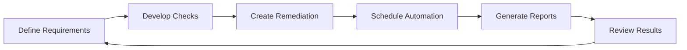

# Ansible Network Compliance

## Introduction

Network compliance is a critical aspect of network management that ensures your infrastructure adheres to organizational policies, industry standards, and regulatory requirements. As networks grow in complexity, manually verifying and enforcing compliance becomes increasingly challenging. This is where Ansible's network automation capabilities become invaluable.

Ansible Network Compliance combines the power of infrastructure as code, idempotent operations, and declarative configurations to automate compliance checks, remediation, and reporting across your entire network estate. In this guide, we'll explore how to implement network compliance automation with Ansible, providing you with the tools to maintain consistent, secure, and compliant network infrastructure.

## What is Network Compliance?

Network compliance involves ensuring that your network devices and infrastructure:

1. **Follow security best practices** (password policies, access controls, encryption)
2. **Adhere to regulatory standards** (PCI DSS, HIPAA, SOX, NIST, etc.)
3. **Maintain operational standards** (naming conventions, configuration parameters, routing protocols)
4. **Meet performance requirements** (QoS settings, bandwidth allocation)

Traditionally, maintaining compliance involves manual configuration reviews, periodic audits, and reactive remediation efforts. With Ansible, we can transform this approach to be automated, proactive, and consistent.

## Core Components of Ansible Network Compliance

### 1. **Compliance as Code**

With Ansible, compliance requirements are defined as code in playbooks and roles:

```yaml
---
- name: Verify password complexity requirements
  hosts: network_devices
  gather_facts: no
  
  tasks:
    - name: Check password minimum length
      ios_command:
        commands: show running-config | include password
      register: password_config
      
    - name: Analyze password configuration
      assert:
        that:
          - "'min-length 12' in password_config.stdout[0]"
        fail_msg: "Password minimum length does not meet requirements"
        success_msg: "Password minimum length meets requirements"
```

### 2. **Declarative Compliance States**

Instead of focusing on how to make a device compliant, Ansible allows you to declare what a compliant state looks like:

```yaml
---
- name: Ensure NTP configuration compliance
  hosts: cisco_routers
  gather_facts: no
  
  vars:
    compliant_ntp_servers:
      - 10.1.1.1
      - 10.1.1.2
  
  tasks:
    - name: Configure NTP servers
      ios_config:
        lines:
          - ntp server {{ item }}
        parents: ntp
      loop: "{{ compliant_ntp_servers }}"
```

### 3. **Idempotent Compliance Checks**

Ansible's idempotent nature ensures that compliance checks can be run repeatedly without changing already-compliant systems:

```yaml
---
- name: Ensure banner configuration
  hosts: network_devices
  gather_facts: no
  
  tasks:
    - name: Configure login banner
      ios_banner:
        banner: login
        text: |
          AUTHORIZED ACCESS ONLY
          This system is the property of Example Corp.
          Unauthorized access is prohibited.
        state: present
```

## Implementing Network Compliance with Ansible

### Step 1: Define Your Compliance Requirements

Begin by documenting your compliance requirements in a structured format. For example:

```yaml
# compliance_requirements.yml
---
password_policy:
  min_length: 12
  complexity: true
  encryption: type 9
  
access_control:
  ssh_version: 2
  timeout: 600
  acl: management_only
  
logging:
  servers:
    - 10.2.2.1
    - 10.2.2.2
  level: informational
```

### Step 2: Create Compliance Verification Playbooks

Develop playbooks that check current configurations against your compliance requirements:

```yaml
---
- name: Verify SSH configuration compliance
  hosts: all_network_devices
  gather_facts: no
  
  tasks:
    - name: Get current SSH configuration
      ios_command:
        commands:
          - show ip ssh
      register: ssh_config
      when: ansible_network_os == 'ios'
    
    - name: Verify SSH version
      assert:
        that:
          - "'SSH Version 2.0 Enabled' in ssh_config.stdout[0]"
        fail_msg: "SSH version 2 is not enabled"
        success_msg: "SSH version 2 is properly configured"
      when: ansible_network_os == 'ios'
```

### Step 3: Create Remediation Playbooks

Build playbooks that correct non-compliant configurations:

```yaml
---
- name: Remediate SSH configuration
  hosts: all_network_devices
  gather_facts: no
  
  tasks:
    - name: Configure SSH version 2
      ios_config:
        lines:
          - ip ssh version 2
      when: ansible_network_os == 'ios'
      
    - name: Set SSH timeout
      ios_config:
        lines:
          - ip ssh time-out 600
      when: ansible_network_os == 'ios'
```

### Step 4: Develop Compliance Reports

Create playbooks that generate and distribute compliance reports:

```yaml
---
- name: Generate compliance reports
  hosts: localhost
  gather_facts: no
  
  vars:
    report_date: "{{ lookup('pipe', 'date +%Y-%m-%d') }}"
  
  tasks:
    - name: Compile compliance results
      template:
        src: templates/compliance_report.j2
        dest: "reports/network_compliance_{{ report_date }}.html"

    - name: Email compliance report
      mail:
        host: smtp.example.com
        port: 25
        to: network-team@example.com
        subject: "Network Compliance Report - {{ report_date }}"
        body: "Please find attached the latest network compliance report."
        attach:
          - "reports/network_compliance_{{ report_date }}.html"
```

## Real-World Compliance Scenarios

### Scenario 1: PCI DSS Compliance

The Payment Card Industry Data Security Standard (PCI DSS) requires specific network security controls:

```yaml
---
- name: Ensure PCI DSS firewall compliance
  hosts: edge_firewalls
  gather_facts: no
  
  tasks:
    - name: Get current firewall configuration
      ios_command:
        commands:
          - show access-lists
      register: acl_config
      
    - name: Verify cardholder data network isolation
      assert:
        that:
          - "'permit ip host 10.100.0.0 0.0.255.255 any' not in acl_config.stdout[0]"
        fail_msg: "Cardholder data network is not properly isolated"
        success_msg: "Cardholder data network isolation is compliant"
      
    - name: Configure compliant access list
      ios_config:
        lines:
          - "no access-list 110 permit ip any 10.100.0.0 0.0.255.255"
          - "access-list 110 deny ip any 10.100.0.0 0.0.255.255"
          - "access-list 110 permit ip 10.200.0.0 0.0.0.255 10.100.0.0 0.0.255.255"
      when: "'permit ip any 10.100.0.0 0.0.255.255' in acl_config.stdout[0]"
```

### Scenario 2: Operational Configuration Standards

Ensure network devices follow organizational standards:

```yaml
---
- name: Validate device naming convention compliance
  hosts: all_network_devices
  gather_facts: yes
  
  vars:
    naming_pattern: "^(sw|rt|fw)-(\\w{3})-(\\d{2})$"  # Example: sw-nyc-01
  
  tasks:
    - name: Check hostname against naming convention
      assert:
        that:
          - "inventory_hostname | regex_search(naming_pattern)"
        fail_msg: "Device name {{ inventory_hostname }} does not follow naming convention"
        success_msg: "Device name {{ inventory_hostname }} follows naming convention"
      
    - name: Update hostname if non-compliant
      ios_config:
        lines:
          - "hostname {{ inventory_hostname }}"
      when: "inventory_hostname | regex_search(naming_pattern) and ansible_net_hostname != inventory_hostname"
```

## Implementing Continuous Compliance

For effective compliance management, implement a continuous approach:



### Schedule with Ansible Tower/AWX

Implement scheduled compliance checks using Ansible Tower or AWX:

```yaml
---
- name: Set up compliance workflow
  hosts: localhost
  gather_facts: no
  
  tasks:
    - name: Create compliance job template
      awx.awx.job_template:
        name: "Network Compliance Check"
        job_type: "run"
        inventory: "Network Inventory"
        project: "Network Compliance"
        playbook: "compliance_check.yml"
        credential: "Network Credentials"
        state: present
        
    - name: Schedule daily compliance checks
      awx.awx.schedule:
        name: "Daily Network Compliance"
        unified_job_template: "Network Compliance Check"
        rrule: "FREQ=DAILY;BYDAY=MO,TU,WE,TH,FR"
        state: present
```

## Building a Compliance Framework

For comprehensive network compliance, create a structured framework:

```yaml
# File: compliance_framework/main.yml
---
- name: Import compliance modules
  import_playbook: "modules/{{ item }}.yml"
  loop:
    - password_policy
    - access_control
    - logging
    - snmp
    - ntp
    - interface_security
```

Each module addresses specific compliance domains:

```yaml
# File: compliance_framework/modules/password_policy.yml
---
- name: Password policy compliance
  hosts: all_network_devices
  gather_facts: no
  
  tasks:
    - name: Import tasks for specific device types
      include_tasks: "../tasks/{{ ansible_network_os }}_password_policy.yml"
```

## Practical Example: STIG Compliance for Cisco Devices

Security Technical Implementation Guides (STIGs) provide security standards for network devices:

```yaml
---
- name: Apply Cisco Router STIG compliance
  hosts: cisco_routers
  gather_facts: no
  
  tasks:
    # STIG-ID: CISC-ND-000010
    - name: Ensure password encryption is enabled
      ios_config:
        lines:
          - service password-encryption
          
    # STIG-ID: CISC-ND-000020
    - name: Disable unused services
      ios_config:
        lines:
          - no service tcp-small-servers
          - no service udp-small-servers
          - no ip finger
          - no ip bootp server
          
    # STIG-ID: CISC-ND-000030
    - name: Configure AAA authentication
      ios_config:
        lines:
          - aaa new-model
          - aaa authentication login default group tacacs+ local
          - aaa authorization exec default group tacacs+ local
          - aaa accounting exec default start-stop group tacacs+
```

## Output and Reporting

Generate formatted compliance reports to demonstrate adherence:

```html
<!-- templates/compliance_report.j2 -->
<!DOCTYPE html>
<html>
<head>
    <title>Network Compliance Report</title>
    <style>
        .compliant { color: green; }
        .non-compliant { color: red; }
        table { border-collapse: collapse; width: 100%; }
        th, td { border: 1px solid #ddd; padding: 8px; }
    </style>
</head>
<body>
    <h1>Network Compliance Report - {{ report_date }}</h1>
    
    <h2>Summary</h2>
    <p>Devices Checked: {{ compliance_results | length }}</p>
    <p>Compliant Devices: {{ compliance_results | selectattr('compliant', 'equalto', true) | list | length }}</p>
    <p>Non-Compliant Devices: {{ compliance_results | selectattr('compliant', 'equalto', false) | list | length }}</p>
    
    <h2>Detailed Results</h2>
    <table>
        <tr>
            <th>Device</th>
            <th>Status</th>
            <th>Issues</th>
        </tr>
        
        <tr>
            <td>{{ device.name }}</td>
            <td class="compliantnon-compliant">
                CompliantNon-Compliant
            </td>
            <td>
                
                <ul>
                    
                    <li>{{ issue }}</li>
                    
                </ul>
                
            </td>
        </tr>
        
    </table>
</body>
</html>
```

## Integration with Compliance Tools

Enhance your network compliance by integrating Ansible with specialized tools:

```yaml
---
- name: Run compliance scan with third-party tool
  hosts: localhost
  gather_facts: no
  
  tasks:
    - name: Execute Nessus scan
      command: >
        /opt/nessus/bin/nessuscli scan --targets {{ inventory_hostname }}
        --policy 'Network Device Compliance'
      register: nessus_results
      delegate_to: localhost
      
    - name: Parse scan results
      set_fact:
        compliance_issues: "{{ nessus_results.stdout | from_json | json_query('findings[*].description') }}"
        
    - name: Remediate findings with Ansible
      include_tasks: "remediation/{{ item | regex_replace(' ', '_') }}.yml"
      loop: "{{ compliance_issues }}"
```

## Summary

Ansible Network Compliance provides a powerful approach to maintaining secure, consistent, and policy-compliant network infrastructure. By leveraging Ansible's automation capabilities, you can:

- Transform manual compliance processes into automated, repeatable workflows
- Detect and remediate compliance issues proactively
- Generate comprehensive compliance reports for auditing purposes
- Scale compliance efforts across your entire network infrastructure
- Reduce human error and configuration drift

The approach outlined in this guide helps you build a robust compliance framework that adapts to changing requirements and scales with your network.

## Additional Resources and Exercises

### Resources

- [Ansible Network Automation Documentation](https://docs.ansible.com/ansible/latest/network/index.html)
- [Ansible Network Resource Modules](https://docs.ansible.com/ansible/latest/network/user_guide/network_resource_modules.html)
- [Network Compliance with Red Hat Ansible](https://www.redhat.com/en/resources/network-automation-technical-brief)

### Exercises

1. **Basic Compliance Check**:
   Create a playbook that checks your network devices for basic security settings like SSH version, timeout values, and AAA configuration.

2. **Custom Compliance Module**:
   Develop a custom Ansible module that verifies a specific compliance requirement unique to your organization.

3. **Compliance Report Dashboard**:
   Build a simple web dashboard using the Ansible-generated compliance reports that displays compliance status across your network.

4. **Multi-Vendor Compliance**:
   Extend your compliance framework to support different network vendors (Cisco, Juniper, Arista) while maintaining consistent compliance requirements.

5. **Integration Challenge**:
   Integrate your Ansible compliance framework with a version control system like Git to track compliance changes over time.