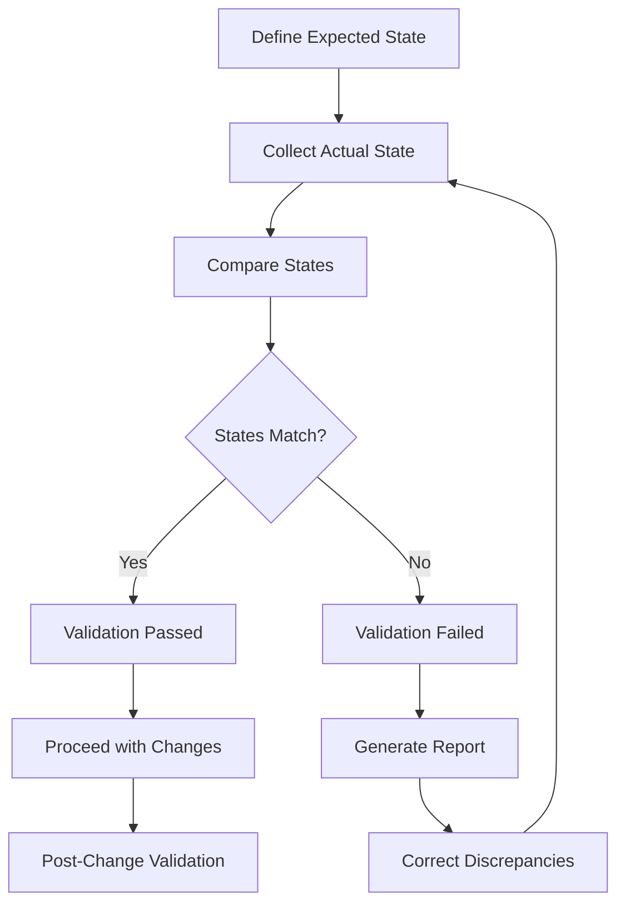

# Ansible Network Validation

## Introduction

Network validation is a critical aspect of network automation that ensures configurations, operations, and changes meet expected standards before and after deployment. In the world of rapidly evolving network infrastructures, manual validation is time-consuming and error-prone. Ansible, with its agentless architecture and declarative approach, provides powerful tools for automating network validation processes.

This guide explores how to implement comprehensive network validation using Ansible, allowing you to verify configurations, test connectivity, and ensure compliance across your network infrastructure.

## Why Network Validation Matters

Network validation serves several crucial purposes:

- **Preventing Outages**: Validates changes before they cause disruptions
- **Ensuring Compliance**: Verifies that configurations meet regulatory and security standards
- **Maintaining Consistency**: Confirms uniform configurations across similar devices
- **Reducing Mean Time to Resolution**: Quickly identifies and localizes issues
- **Enabling Continuous Integration**: Supports automated testing in CI/CD pipelines

## Prerequisites

Before diving into network validation with Ansible, ensure you have:

- Ansible 2.9 or newer installed
- Basic understanding of YAML syntax
- Network devices accessible via SSH or API
- Python 3.6+ installed
- Required Python libraries: `netaddr`, `jmespath`

## Setting Up Your Environment

First, let's install the necessary components:

```bash
# Install Ansible and required packages
pip install ansible netaddr jmespath

# Verify the installation
ansible --version
```

Next, create a basic Ansible project structure:

```bash
mkdir ansible-network-validation
cd ansible-network-validation
mkdir -p inventory/group_vars
mkdir playbooks
mkdir templates
mkdir tests
touch inventory/hosts
touch ansible.cfg
```

Configure your `ansible.cfg` file:

```ini
[defaults]
inventory = inventory/hosts
host_key_checking = False
retry_files_enabled = False
gathering = explicit
stdout_callback = yaml
interpreter_python = auto_silent
```

## Basic Network Validation Techniques

### 1. Connectivity Testing

One of the simplest forms of validation is testing basic connectivity. Let's create a playbook that pings devices to check reachability:

```yaml
---
# playbooks/validate_connectivity.yml
- name: Validate Network Connectivity
  hosts: all
  gather_facts: no
  
  tasks:
    - name: Ping remote devices
      ansible.builtin.ping:
      register: ping_result
      
    - name: Display ping results
      ansible.builtin.debug:
        var: ping_result
        
    - name: Fail if ping unsuccessful
      ansible.builtin.fail:
        msg: "Cannot reach {{ inventory_hostname }}"
      when: ping_result.ping is not defined
```

Running this playbook:

```bash
ansible-playbook playbooks/validate_connectivity.yml
```

Example output:

```
PLAY [Validate Network Connectivity] ******************************************

TASK [Ping remote devices] ***************************************************
ok: [router1]
ok: [switch1]
ok: [switch2]
failed: [router2]

TASK [Display ping results] **************************************************
ok: [router1] => {
    "ping_result": {
        "changed": false,
        "ping": "pong"
    }
}
...

TASK [Fail if ping unsuccessful] *********************************************
skipping: [router1]
skipping: [switch1]
skipping: [switch2]
fatal: [router2]: FAILED! => {
    "msg": "Cannot reach router2"
}
```

### 2. Configuration Validation

Ansible can validate that device configurations match expected states. Let's create a playbook to check interface configurations:

```yaml
---
# playbooks/validate_interfaces.yml
- name: Validate Interface Configurations
  hosts: network_devices
  gather_facts: no
  
  tasks:
    - name: Collect interface information
      ansible.netcommon.cli_command:
        command: show interfaces
      register: interfaces
      
    - name: Parse interface output
      ansible.builtin.set_fact:
        parsed_interfaces: "{{ interfaces.stdout | parse_cli_textfsm('ntc_templates/cisco_ios_show_interfaces.textfsm') }}"
      
    - name: Validate interface status
      ansible.builtin.assert:
        that:
          - item.status == "up"
          - item.protocol == "up"
        fail_msg: "Interface {{ item.interface }} is not fully operational"
        success_msg: "Interface {{ item.interface }} is operational"
      loop: "{{ parsed_interfaces }}"
      when: item.interface in ['GigabitEthernet0/0', 'GigabitEthernet0/1']
```

## Advanced Validation Techniques

### 1. Using `assert` Module for Validation

The `assert` module is a powerful tool for validating network states and configurations:

```yaml
---
# playbooks/validate_bgp.yml
- name: Validate BGP Configuration
  hosts: routers
  gather_facts: no
  
  tasks:
    - name: Get BGP neighbor information
      cisco.ios.ios_command:
        commands: show ip bgp summary
      register: bgp_output
      
    - name: Validate BGP neighbors are established
      ansible.builtin.assert:
        that:
          - "'Established' in item"
        fail_msg: "BGP neighbor {{ item.split()[0] }} is not established"
        success_msg: "BGP neighbor {{ item.split()[0] }} is established"
      loop: "{{ bgp_output.stdout[0].split('
') | select('search', '^[0-9]') | list }}"
```

### 2. Validation with Structured Data

Using structured data makes validation more reliable and maintainable:

```yaml
---
# playbooks/validate_ospf.yml
- name: Validate OSPF Neighbors
  hosts: ospf_routers
  gather_facts: no
  
  tasks:
    - name: Collect OSPF neighbor information
      cisco.ios.ios_facts:
        gather_subset:
          - '!all'
          - '!min'
        gather_network_resources:
          - ospf_interfaces
      
    - name: Validate OSPF interfaces configuration
      ansible.builtin.assert:
        that:
          - ansible_network_resources.ospf_interfaces | length > 0
          - item.process_id == "1"
          - item.area is defined
        fail_msg: "OSPF configuration on {{ item.name }} is incorrect"
        success_msg: "OSPF configuration on {{ item.name }} is correct"
      loop: "{{ ansible_network_resources.ospf_interfaces }}"
```

## Validation with Network Resource Modules

Ansible's network resource modules are idempotent and perfect for validation:

```yaml
---
# playbooks/validate_with_resource_modules.yml
- name: Validate VLANs Using Resource Modules
  hosts: switches
  gather_facts: no
  
  tasks:
    - name: Gather existing VLAN configuration
      cisco.ios.ios_vlans:
        state: gathered
      register: existing_vlans
      
    - name: Define required VLANs
      ansible.builtin.set_fact:
        required_vlans:
          - vlan_id: 10
            name: "DATA"
          - vlan_id: 20
            name: "VOICE"
          - vlan_id: 30
            name: "MANAGEMENT"
            
    - name: Validate required VLANs exist
      ansible.builtin.assert:
        that:
          - item.vlan_id | string in existing_vlans.gathered | map(attribute='vlan_id') | map('string') | list
          - existing_vlans.gathered | selectattr('vlan_id', 'equalto', item.vlan_id | string) | map(attribute='name') | first == item.name
        fail_msg: "VLAN {{ item.vlan_id }} ({{ item.name }}) not properly configured"
        success_msg: "VLAN {{ item.vlan_id }} ({{ item.name }}) correctly configured"
      loop: "{{ required_vlans }}"
```

## Creating Test Templates

Test templates help standardize validation across your network:

```yaml
---
# templates/validate_router.yml
- name: Check NTP configuration
  ansible.builtin.assert:
    that:
      - "'ntp server 10.0.0.1' in config"
      - "'ntp server 10.0.0.2' in config"
    fail_msg: "NTP servers not properly configured"
    
- name: Check DNS configuration
  ansible.builtin.assert:
    that:
      - "'ip name-server 8.8.8.8' in config"
      - "'ip name-server 8.8.4.4' in config"
    fail_msg: "DNS servers not properly configured"
    
- name: Check logging configuration
  ansible.builtin.assert:
    that:
      - "'logging host 10.1.1.1' in config"
      - "'logging buffered 16384' in config"
    fail_msg: "Logging not properly configured"
```

Use the template in a playbook:

```yaml
---
# playbooks/validate_all.yml
- name: Comprehensive Network Validation
  hosts: network_devices
  gather_facts: no
  
  tasks:
    - name: Collect device configuration
      ansible.netcommon.cli_command:
        command: show running-config
      register: config_output
      
    - name: Set config as fact
      ansible.builtin.set_fact:
        config: "{{ config_output.stdout }}"
        
    - name: Include appropriate validation template
      ansible.builtin.include_tasks: "templates/validate_{{ device_role }}.yml"
```

## Creating a Pre-Change Validation Workflow

Building a pre-change validation workflow ensures changes don't disrupt your network:

```yaml
---
# playbooks/pre_change_validation.yml
- name: Pre-Change Validation
  hosts: target_devices
  gather_facts: no
  
  tasks:
    - name: Backup current configuration
      cisco.ios.ios_config:
        backup: yes
      register: backup_result
      
    - name: Test connectivity to critical services
      ansible.netcommon.net_ping:
        dest: "{{ item }}"
        count: 5
      loop:
        - 10.0.0.1  # Core router
        - 192.168.1.10  # Authentication server
        - 8.8.8.8  # Internet connectivity
      register: ping_results
      
    - name: Validate existing BGP sessions
      ansible.builtin.include_tasks: tasks/validate_bgp.yml
      
    - name: Create pre-change report
      ansible.builtin.template:
        src: templates/pre_change_report.j2
        dest: "reports/{{ inventory_hostname }}_pre_change_{{ lookup('pipe', 'date +%Y%m%d_%H%M%S') }}.txt"
      delegate_to: localhost
      
    - name: Prompt for confirmation
      ansible.builtin.pause:
        prompt: "Pre-change validation complete. Proceed with changes? (yes/no)"
      register: confirmation
      delegate_to: localhost
      
    - name: Abort if not confirmed
      ansible.builtin.fail:
        msg: "Change aborted by user"
      when: confirmation.user_input != "yes"
```

## Post-Change Validation

Similarly, post-change validation ensures your changes worked as expected:

```yaml
---
# playbooks/post_change_validation.yml
- name: Post-Change Validation
  hosts: target_devices
  gather_facts: no
  
  tasks:
    - name: Wait for network convergence
      ansible.builtin.pause:
        seconds: 30
        
    - name: Retest connectivity to critical services
      ansible.netcommon.net_ping:
        dest: "{{ item }}"
        count: 5
      loop:
        - 10.0.0.1
        - 192.168.1.10
        - 8.8.8.8
      register: ping_results
      
    - name: Compare with pre-change ping results
      ansible.builtin.debug:
        msg: "Ping to {{ item.item }} {{ 'successful' if item.packet_loss == '0.0%' else 'FAILED with ' + item.packet_loss + ' packet loss' }}"
      loop: "{{ ping_results.results }}"
      
    - name: Revalidate BGP sessions
      ansible.builtin.include_tasks: tasks/validate_bgp.yml
      
    - name: Create post-change report
      ansible.builtin.template:
        src: templates/post_change_report.j2
        dest: "reports/{{ inventory_hostname }}_post_change_{{ lookup('pipe', 'date +%Y%m%d_%H%M%S') }}.txt"
      delegate_to: localhost
```

## Visualizing the Validation Process

Network validation typically follows this workflow:



## Building a Complete Validation Framework

Let's put everything together into a comprehensive validation framework:

```yaml
---
# playbooks/validation_framework.yml
- name: Network Validation Framework
  hosts: all
  gather_facts: no
  
  vars:
    validation_phase: "{{ phase | default('pre') }}"
    
  tasks:
    - name: Set validation type
      ansible.builtin.set_fact:
        validation_tasks: "{{ validation_phase }}_validation_tasks.yml"
        
    - name: Include common validation tasks
      ansible.builtin.include_tasks: tasks/common_validations.yml
      
    - name: Include device-specific validation tasks
      ansible.builtin.include_tasks: "tasks/{{ ansible_network_os }}_validations.yml"
      when: ansible_network_os is defined
      
    - name: Include phase-specific validation tasks
      ansible.builtin.include_tasks: "tasks/{{ validation_tasks }}"
      when: validation_tasks is defined
      
    - name: Generate validation report
      ansible.builtin.template:
        src: templates/validation_report.j2
        dest: "reports/{{ inventory_hostname }}_{{ validation_phase }}_validation_{{ lookup('pipe', 'date +%Y%m%d_%H%M%S') }}.txt"
      delegate_to: localhost
```

## Integration with CI/CD Pipelines

Network validation can be integrated into CI/CD pipelines by creating stages for pre-deployment validation, deployment, and post-deployment validation:

```yaml
---
# ci_cd_pipeline.yml
stages:
  - pre_validation
  - deploy
  - post_validation

pre_validation:
  stage: pre_validation
  script:
    - ansible-playbook playbooks/validation_framework.yml -e "phase=pre"
  artifacts:
    paths:
      - reports/
      
deploy:
  stage: deploy
  script:
    - ansible-playbook playbooks/deploy_network_changes.yml
  when: on_success
  dependencies:
    - pre_validation
    
post_validation:
  stage: post_validation
  script:
    - ansible-playbook playbooks/validation_framework.yml -e "phase=post"
  artifacts:
    paths:
      - reports/
  when: on_success
  dependencies:
    - deploy
```

## Real-World Example: Validating a Multi-Vendor Network

Let's examine a practical example of validating a network with different vendors:

```yaml
---
# playbooks/multi_vendor_validation.yml
- name: Multi-Vendor Network Validation
  hosts: all
  gather_facts: no
  
  tasks:
    - name: Run Cisco IOS validation
      ansible.builtin.include_tasks: tasks/cisco_ios_validation.yml
      when: ansible_network_os == 'ios'
      
    - name: Run Juniper Junos validation
      ansible.builtin.include_tasks: tasks/juniper_junos_validation.yml
      when: ansible_network_os == 'junos'
      
    - name: Run Arista EOS validation
      ansible.builtin.include_tasks: tasks/arista_eos_validation.yml
      when: ansible_network_os == 'eos'
```

Example task file for Cisco IOS devices:

```yaml
---
# tasks/cisco_ios_validation.yml
- name: Collect interface information
  cisco.ios.ios_command:
    commands: show interfaces
  register: interfaces
  
- name: Collect routing information
  cisco.ios.ios_command:
    commands: show ip route
  register: routes
  
- name: Validate connectivity to default gateway
  ansible.netcommon.net_ping:
    dest: "{{ default_gateway }}"
  register: gateway_ping
  
- name: Validate interface status
  ansible.builtin.assert:
    that:
      - "'{{ critical_interface }}' in interfaces.stdout[0]"
      - "'line protocol is up' in interfaces.stdout[0].split('{{ critical_interface }}')[1].splitlines()[0]"
    fail_msg: "Critical interface {{ critical_interface }} is not up"
```

## Summary

Network validation with Ansible provides a structured, automated approach to ensuring network configurations and operations meet expected standards. By implementing comprehensive validation workflows, you can:

- Prevent outages caused by misconfigurations
- Ensure consistency across your network infrastructure
- Integrate validation into your CI/CD pipelines
- Create auditable records of network state
- Reduce the time to identify and resolve issues

The techniques covered in this guide—from basic connectivity testing to comprehensive validation frameworks—provide a solid foundation for implementing network validation in your organization.

## Additional Resources

To continue learning about Ansible network validation:

1. Explore Ansible's network resource modules, which provide built-in validation capabilities
2. Learn more about network test-driven development (TDD) principles
3. Study Jinja2 templating for more sophisticated validation reports
4. Practice creating validation playbooks for different network technologies

## Practice Exercises

1. Create a validation playbook that checks for the presence of specific security configurations on your network devices
2. Build a validation workflow that compares configurations against compliance requirements
3. Design a test suite for validating OSPF adjacencies across your network
4. Implement a validation framework that can be triggered by network monitoring systems
5. Create custom validation modules for your specific network requirements