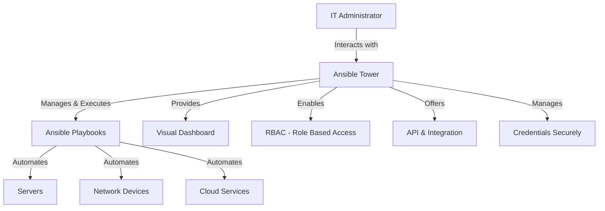
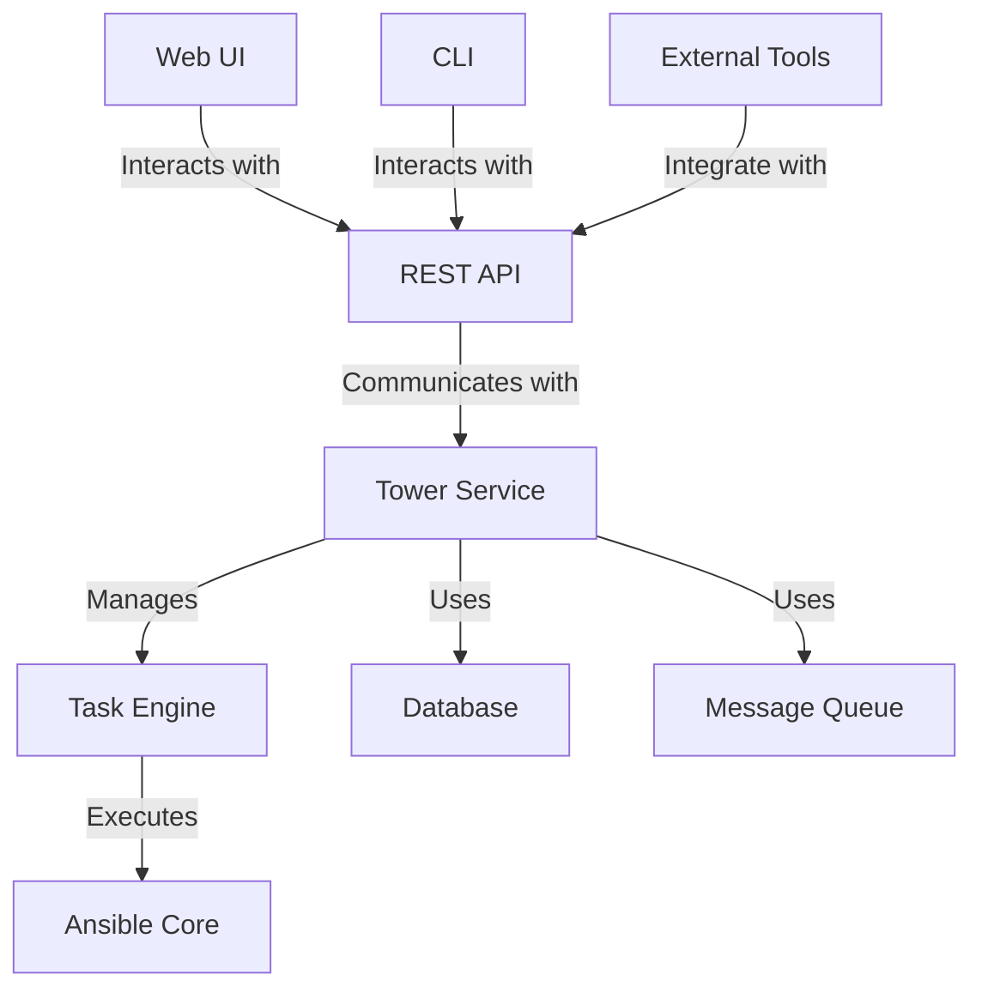

# Ansible Tower Introduction

## What is Ansible Tower?

Ansible Tower (now known as Red Hat Ansible Automation Platform) is a web-based solution that makes Ansible more accessible to teams by providing a user interface, role-based access control, job scheduling, integrated notifications, and graphical inventory management. It is the commercial offering from Red Hat, while AWX is the upstream open-source project that Tower is built from.

Think of Ansible Tower as a control center for your Ansible automation:



## Why Use Ansible Tower?

If you're already familiar with Ansible, you might wonder why you need Tower. Here are some compelling reasons:

1. **Centralized UI**: Tower provides a graphical interface to manage playbooks, inventories, and job runs.
2. **Role-Based Access Control (RBAC)**: Control who can access what in your automation infrastructure.
3. **Job Scheduling**: Schedule playbooks to run at specific times.
4. **Real-time Job Status Updates**: Monitor automation jobs in real-time.
5. **Credential Management**: Securely store and manage sensitive credentials.
6. **RESTful API**: Integrate Ansible automation with other tools and services.
7. **Workflow Builder**: Create complex workflows by chaining multiple playbooks together.
8. **Scalability**: Easily scale your automation as your infrastructure grows.

## Ansible Tower vs. AWX

Before diving deeper, let's clarify an important distinction:

| Feature | Ansible Tower | AWX |
|---------|---------------|-----|
| License | Commercial (Paid) | Open Source (Free) |
| Support | Official Red Hat Support | Community Support |
| Stability | Enterprise-ready, Stable | Latest Features, Potentially Less Stable |
| Updates | Regular, Scheduled | Frequent |

AWX is the upstream project for Ansible Tower. Think of the relationship between Fedora and Red Hat Enterprise Linux – AWX is where new features are developed before they make their way into the stable Tower release.

## Tower Architecture

Ansible Tower has a straightforward architecture that consists of several key components:



The key components include:
- **Web UI**: The graphical interface users interact with
- **REST API**: The backbone that allows integration with other systems
- **Database**: Stores projects, inventories, credentials, and results
- **Task Engine**: Coordinates job execution
- **Ansible Core**: The actual Ansible engine that executes playbooks

## Getting Started with Ansible Tower

### Installation Options

There are several ways to install Ansible Tower:

1. **Bundle Installation**: The simplest method for standalone servers
2. **Distributed Installation**: For larger environments requiring high availability
3. **OpenShift/Kubernetes Installation**: Deploy Tower on container platforms

For beginners, the bundle installation is recommended. Here's a simplified example of the process:

```bash
# Download the latest Tower bundle
wget https://releases.ansible.com/ansible-tower/setup/ansible-tower-setup-latest.tar.gz

# Extract the bundle
tar xvf ansible-tower-setup-latest.tar.gz
cd ansible-tower-setup-<version>

# Edit the inventory file to configure Tower
vi inventory

# Run the setup script
./setup.sh
```

The inventory file requires configuration of these basic parameters:

```ini
[tower]
localhost ansible_connection=local

[database]
localhost ansible_connection=local

[all:vars]
admin_password='your_password_here'
pg_password='your_pg_password_here'
secret_key='your_secret_key_here'
```

### Exploring the Tower Interface

After installation, you can access Tower at `https://<your-tower-server>`. Upon first login, you'll see the dashboard:

1. **Dashboard**: Shows recent job activity and status
2. **Projects**: Where you manage your Ansible repositories
3. **Inventories**: Define and manage the hosts you automate
4. **Templates**: Create job and workflow templates
5. **Credentials**: Securely store authentication information
6. **Organizations**: Group users and teams logically
7. **Users**: Manage user accounts and permissions

## Working with Tower: Basic Concepts

### Managing Projects

Projects in Tower are collections of Ansible Playbooks. Here's how to create one:

1. Navigate to **Projects** > **Add**
2. Fill out the form:
   - Name: `Example Project`
   - Organization: Select your organization
   - SCM Type: Git (most common)
   - SCM URL: `https://github.com/yourusername/your-ansible-repo.git`
   - SCM Branch: `main`
   - Update Options: Select as needed

Once created, Tower will sync with your repository and make the playbooks available.

### Creating Inventories

Inventories define the hosts and groups to run your playbooks against:

1. Navigate to **Inventories** > **Add**
2. Fill out the form:
   - Name: `Production Servers`
   - Organization: Select your organization
3. Save the inventory
4. Add hosts by clicking on **Hosts** > **Add**:
   - Host Name: `web1.example.com`
   - Variables (YAML):
     ```yaml
     ansible_host: 192.168.1.101
     server_role: webserver
     ```

### Managing Credentials

Credentials allow Tower to authenticate with your infrastructure:

1. Navigate to **Credentials** > **Add**
2. Fill out the form:
   - Name: `Production SSH Key`
   - Organization: Select your organization
   - Credential Type: Machine
   - SSH Private Key: Paste your key or use a file
   - Privilege Escalation Method: sudo (if needed)

### Creating Job Templates

Job Templates combine projects, inventories, and credentials to create runnable jobs:

1. Navigate to **Templates** > **Add** > **Job Template**
2. Fill out the form:
   - Name: `Deploy Web Application`
   - Job Type: Run
   - Inventory: `Production Servers`
   - Project: `Example Project`
   - Playbook: Select a playbook from the dropdown
   - Credentials: `Production SSH Key`
   - Extra Variables (if needed):
     ```yaml
     app_version: 1.2.3
     deploy_mode: rolling
     ```

Once saved, you can run the template by clicking the rocket icon.

### Workflow Templates

For more complex automation scenarios, Workflow Templates allow you to chain multiple job templates together:

1. Navigate to **Templates** > **Add** > **Workflow Template**
2. Fill out the basic information
3. Click **Save** and then **Workflow Editor**
4. Use the visual editor to add nodes and define the workflow:
   - Add job templates as nodes
   - Connect them with success/failure paths
   - Add approval nodes for human intervention when needed

## Real-World Examples

### Example 1: Automated Server Provisioning

Let's say you want to automate the provisioning of web servers. Here's how you might set it up in Tower:

1. Create a Project linked to a Git repo containing your provisioning playbooks
2. Set up an Inventory for your cloud provider
3. Configure cloud Credentials
4. Create a Job Template that runs your `provision_webserver.yml` playbook
5. Set up a Survey to capture variables like:
   - Number of servers
   - Server size/flavor
   - Environment (dev/test/prod)

Now users can provision servers by simply filling out a form, without needing to understand the underlying Ansible code.

### Example 2: Compliance Enforcement

For organizations with strict compliance requirements:

1. Create a Project containing compliance-checking playbooks
2. Set up an Inventory with all systems requiring compliance checks
3. Create a Job Template that runs your compliance playbooks
4. Schedule the Job Template to run nightly
5. Configure notifications to alert security teams of non-compliant systems
6. Create a remediation Workflow Template that:
   - Identifies non-compliant systems
   - Applies necessary fixes
   - Verifies the fixes were successful
   - Generates compliance reports

### Example 3: Application Deployment Pipeline

Create a complete CI/CD pipeline using Tower:

1. Set up a Workflow Template with the following nodes:
   - Run application tests
   - Deploy to staging environment
   - Run integration tests on staging
   - Approval node requiring manual confirmation
   - Deploy to production environment
   - Verify production deployment
   - Send notification of successful deployment

Connect this workflow to your CI system (like Jenkins or GitLab CI) using Tower's API to automatically trigger deployments when new code is pushed.

## Tower API and Automation

Tower provides a comprehensive RESTful API that allows you to integrate with other systems and automate Tower itself. Here's a simple example using Python to launch a job template:

```python
import requests
import json

# Tower connection details
TOWER_URL = "https://tower.example.com"
TOWER_USERNAME = "admin"
TOWER_PASSWORD = "password"

# Get an authentication token
response = requests.post(
    f"{TOWER_URL}/api/v2/tokens/",
    auth=(TOWER_USERNAME, TOWER_PASSWORD),
    verify=False  # Only for testing, use proper certificate verification in production
)

token = response.json()["token"]
headers = {"Authorization": f"Bearer {token}", "Content-Type": "application/json"}

# Launch a job template by ID
job_template_id = 42
response = requests.post(
    f"{TOWER_URL}/api/v2/job_templates/{job_template_id}/launch/",
    headers=headers,
    data=json.dumps({"extra_vars": {"deploy_environment": "production"}})
)

# Get the job ID from the response
job_id = response.json()["job"]
print(f"Job launched: {TOWER_URL}/#/jobs/playbook/{job_id}")

# Monitor the job status
while True:
    job_response = requests.get(
        f"{TOWER_URL}/api/v2/jobs/{job_id}/",
        headers=headers
    )
    status = job_response.json()["status"]
    print(f"Job status: {status}")
    
    if status in ["successful", "failed", "error", "canceled"]:
        break
    
    time.sleep(5)
```

## Best Practices

To get the most out of Ansible Tower:

1. **Use Source Control**: Always store your playbooks in a git repository.
2. **Implement RBAC Properly**: Carefully plan your roles and permissions.
3. **Use Surveys**: They make templates more user-friendly and reduce errors.
4. **Create Templates for Everything**: Even simple tasks benefit from standardization.
5. **Set Up Notifications**: Keep stakeholders informed of automation results.
6. **Regular Backups**: Backup your Tower database regularly.
7. **Monitor Tower Performance**: Watch resource usage as your automation grows.
8. **Consider Clustering**: For large environments, implement Tower clusters for high availability.

## Summary

Ansible Tower transforms Ansible from a command-line tool into an enterprise automation platform. By providing a web-based UI, role-based access control, scheduling, and integration capabilities, Tower makes automation accessible to entire organizations, not just individual administrators.

Key benefits include:
- Centralized control of automation
- Enhanced security through RBAC and credential management
- Improved visibility with dashboards and notifications
- Scalability for enterprise environments
- Simplified automation through templates and workflows

Whether you're managing a small environment or a large enterprise, Tower can help streamline your automation processes and improve collaboration across teams.

## Additional Resources

To continue your Ansible Tower journey:

- Practice creating different types of job templates
- Experiment with workflow templates for complex automation
- Learn how to integrate Tower with other systems using the API
- Explore advanced features like Instance Groups and Clustered Tower

As you become more comfortable with Tower, you'll discover even more ways to enhance your automation capabilities and bring efficiency to your organization.