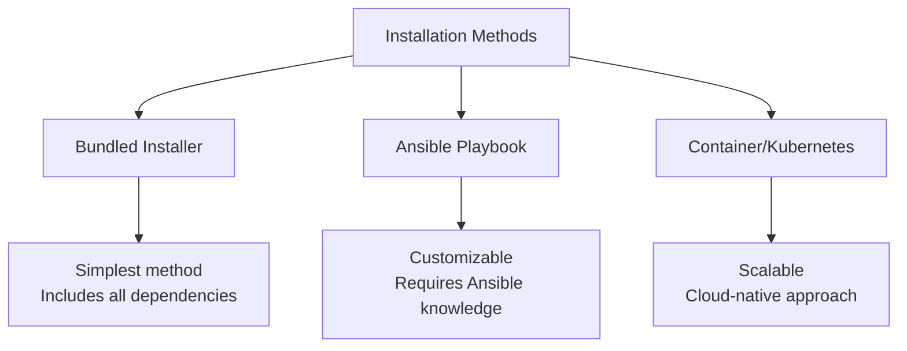

# Ansible Tower Installation

## Introduction

Ansible Tower (now part of Red Hat Automation Platform) is a web-based solution that makes Ansible more accessible to teams by providing a user interface, role-based access control, job scheduling, and graphical inventory management. It's essentially a centralized hub for your automation tasks.

This guide will walk you through the process of installing Ansible Tower in your environment, from prerequisites to verification. By the end, you'll have a working Ansible Tower instance ready to streamline your automation workflows.

## Prerequisites

Before installing Ansible Tower, ensure your system meets these requirements:

- A 64-bit Red Hat Enterprise Linux (RHEL) 8/9, CentOS 8/9, or equivalent
- Minimum 4GB RAM (8GB+ recommended for production)
- Minimum 20GB disk space
- 2+ CPU cores
- A valid Red Hat subscription or trial license for Ansible Tower
- Python 3.6 or later
- Internet connectivity for downloading packages

## Installation Methods

There are three primary methods to install Ansible Tower:



We'll focus on the bundled installer method as it's the most straightforward for beginners.

## Step-by-Step Installation Process

### 1. Download the Installer

First, download the latest Ansible Tower installer package:

```bash
# Create a directory for the installer
mkdir ~/ansible-tower-install
cd ~/ansible-tower-install

# Download the latest bundle (replace X.Y.Z with the current version)
curl -O https://releases.ansible.com/ansible-tower/setup/ansible-tower-setup-latest.tar.gz

# Extract the package
tar -xvzf ansible-tower-setup-latest.tar.gz

# Move into the extracted directory
cd ansible-tower-setup-*
```

### 2. Configure the Installation

Next, edit the `inventory` file to customize your installation:

```bash
# Make a backup of the original inventory file
cp inventory inventory.bak

# Edit the inventory file
vi inventory
```

Here's what a basic `inventory` file looks like:

```ini
[tower]
localhost ansible_connection=local

[database]
localhost ansible_connection=local

[all:vars]
admin_password='YourAdminPassword'
pg_password='YourDatabasePassword'
secret_key='YourRandomSecretKey'
```

Adjust these values:
- `admin_password`: The password for the Tower admin user
- `pg_password`: The password for the PostgreSQL database
- `secret_key`: A random string used for encryption (should be at least 32 characters)

### 3. Run the Installation

Now, execute the setup script:

```bash
sudo ./setup.sh
```

This process can take 15-30 minutes depending on your system's performance and internet connection. The installer will:

1. Install dependencies
2. Configure PostgreSQL
3. Set up the Tower application
4. Configure NGINX as a web server
5. Start all necessary services

The output will look similar to:

```
PLAY RECAP *********************************************************************
localhost                  : ok=142  changed=61   unreachable=0    failed=0
```

If you see `failed=0`, your installation was successful!

### 4. Verify Installation

Open a web browser and navigate to your server's address:

```
https://your-server-ip
```

You should see the Ansible Tower login page. Log in with:
- Username: `admin`
- Password: The `admin_password` you set in the inventory file

## Advanced Installation Options

### Using an External Database

For production environments, you might want to use an external database server:

```ini
[tower]
tower.example.com

[database]
db.example.com

[all:vars]
admin_password='YourAdminPassword'
pg_password='YourDatabasePassword'
pg_host='db.example.com'
pg_port='5432'
pg_database='tower'
pg_username='tower'
secret_key='YourRandomSecretKey'
```

### Clustered Installation

For high availability, Tower supports clustered deployments:

```ini
[tower]
tower1.example.com
tower2.example.com
tower3.example.com

[database]
db.example.com

[all:vars]
admin_password='YourAdminPassword'
pg_password='YourDatabasePassword'
pg_host='db.example.com'
pg_port='5432'
pg_database='tower'
pg_username='tower'
secret_key='YourRandomSecretKey'
```

## Troubleshooting Common Issues

### Installation Fails with PostgreSQL Errors

If you encounter database-related errors:

```bash
# Ensure PostgreSQL is running
sudo systemctl status postgresql

# Check if another PostgreSQL instance is installed
ps aux | grep postgres
```

### Web Interface Not Accessible

If you can't access the web interface:

```bash
# Check if Tower services are running
sudo ansible-tower-service status

# Check for firewall issues
sudo firewall-cmd --list-all

# Add http/https to allowed services if needed
sudo firewall-cmd --permanent --add-service=https
sudo firewall-cmd --permanent --add-service=http
sudo firewall-cmd --reload
```

### License Issues

If you see license-related errors:

1. Go to **Settings** > **System** > **License**
2. Upload your license file or enter your subscription information
3. Save the changes

## Post-Installation Configuration

After successful installation, you should:

1. **Update your license** - Upload your Red Hat license or start a trial
2. **Configure authentication** - Set up LDAP, SAML, or other authentication methods
3. **Create organizations** - Logical groupings for your teams
4. **Set up inventories** - Define where your automation will run
5. **Add credentials** - Securely store connection information
6. **Create projects** - Connect to your Ansible repositories

## Example: Basic Setup After Installation

Let's create a simple inventory and run a ping test:

1. **Create an inventory**:
   - Navigate to **Inventories** > **Add**
   - Name: "Web Servers"
   - Organization: "Default"
   - Save

2. **Add a host**:
   - In your inventory, click **Hosts** > **Add**
   - Name: "webserver1.example.com"
   - Save

3. **Create a credential**:
   - Navigate to **Credentials** > **Add**
   - Name: "Server SSH Key"
   - Credential Type: "Machine"
   - SSH Private Key: Paste your private key
   - Save

4. **Create a project**:
   - Navigate to **Projects** > **Add**
   - Name: "Sample Project"
   - SCM Type: "Git"
   - SCM URL: "https://github.com/ansible/ansible-examples.git"
   - Save

5. **Create a job template**:
   - Navigate to **Templates** > **Add** > **Job Template**
   - Name: "Ping Test"
   - Inventory: "Web Servers"
   - Project: "Sample Project"
   - Playbook: "ping.yml"
   - Credentials: "Server SSH Key"
   - Save
   - Launch the job

## Upgrading Ansible Tower

When a new version becomes available, the upgrade process is similar to installation:

```bash
# Download the new version
curl -O https://releases.ansible.com/ansible-tower/setup/ansible-tower-setup-latest.tar.gz

# Extract and navigate to the directory
tar -xvzf ansible-tower-setup-latest.tar.gz
cd ansible-tower-setup-*

# Copy your old inventory file (optional)
cp /path/to/old/inventory ./inventory

# Run the setup script
sudo ./setup.sh
```

## Summary

In this guide, we've covered:

- Prerequisites for installing Ansible Tower
- The step-by-step installation process
- Configuration options for different deployment scenarios
- Troubleshooting common installation issues
- Basic post-installation setup
- The upgrade process

Ansible Tower provides a powerful web interface and additional features on top of Ansible, making it easier to manage automation at scale. With your installation complete, you're ready to start centralizing and organizing your automation workflows.

## Additional Resources

- [Official Ansible Tower Documentation](https://docs.ansible.com/ansible-tower/)
- [Red Hat Ansible Automation Platform](https://www.redhat.com/en/technologies/management/ansible)
- [Ansible Tower API Guide](https://docs.ansible.com/ansible-tower/latest/html/towerapi/index.html)

## Practice Exercises

1. Install Ansible Tower in a test environment using the bundled installer
2. Configure Tower to use an external PostgreSQL database
3. Set up LDAP authentication for your Tower instance
4. Create a clustered Tower installation for high availability
5. Write a script to automate the backup of your Tower configuration