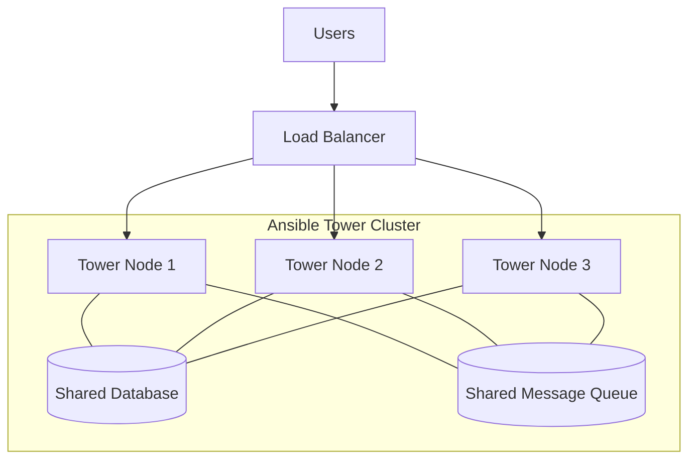

# Ansible Tower Clustering

## Introduction

Ansible Tower (or its open-source counterpart AWX) is a powerful web-based solution that adds a user interface, role-based access control, job scheduling, and more to Ansible automation. By default, Ansible Tower runs as a standalone instance, which might be sufficient for small environments. However, as your automation needs grow, you might need more capacity and redundancy.

This is where **Ansible Tower Clustering** comes into play. Clustering allows you to distribute Ansible automation workloads across multiple nodes, providing high availability, fault tolerance, and increased capacity for your automation platform.

## What is Ansible Tower Clustering?

Ansible Tower Clustering is the process of connecting multiple Tower instances together to function as a single logical unit. In a Tower cluster:

- All nodes share a common database
- All nodes share a common message queue (RabbitMQ)
- Job workloads are distributed across all available nodes
- If one node fails, others continue to process jobs



## Benefits of Clustering

1. **High Availability**: If one Tower node fails, the others continue to operate, preventing disruption to your automation workflows.

2. **Increased Capacity**: Distribute automation jobs across multiple nodes to handle more concurrent tasks.

3. **Horizontal Scalability**: Add more nodes to the cluster as your automation needs grow.

4. **Load Balancing**: Evenly distribute user interface traffic and job processing across available nodes.

5. **Redundancy**: Eliminate single points of failure in your automation infrastructure.

## Prerequisites for Tower Clustering

Before setting up an Ansible Tower cluster, ensure you have:

- A minimum of three Tower nodes (recommended for production)
- Shared PostgreSQL database (external to Tower nodes)
- Shared message queue (RabbitMQ)
- Network connectivity between all nodes
- Sufficient resources (CPU, memory) on each node
- Valid Tower licenses for all nodes

## Setting Up an Ansible Tower Cluster

Let's walk through the process of setting up a basic Ansible Tower cluster.

### Step 1: Prepare Your Inventory File

First, create an inventory file that defines your Tower nodes, database, and other components:

```ini
[tower]
tower1.example.com
tower2.example.com
tower3.example.com

[database]
db.example.com

[all:vars]
admin_password='password'
pg_host='db.example.com'
pg_port='5432'
pg_database='tower'
pg_username='tower'
pg_password='dbpassword'
rabbitmq_port=5672
rabbitmq_vhost=tower
rabbitmq_username='tower'
rabbitmq_password='rabbitpassword'
rabbitmq_cookie=cookiemonster

# Isolated Tower nodes automatically generate an auth token to authenticate
# with the cluster nodes. This token can be re-used to add more nodes later.
# Set to a blank string if you don't want the installer to create one.
# tower_isolated_key=''
```

### Step 2: Run the Tower Setup Script

Execute the Tower setup script with your inventory file:

```bash
./setup.sh -i inventory_file
```

The installation process will:
1. Install Tower on all nodes
2. Configure the shared database connection
3. Set up the shared message queue
4. Establish cluster communication

### Step 3: Verify Cluster Status

After installation, verify your cluster by logging into the Tower web interface. Navigate to **Settings → Instance Groups** to see all your cluster nodes:

```
Instance Name    | Capacity | Used Capacity | State
----------------|----------|--------------|--------
tower1.example.com | 100      | 0            | running
tower2.example.com | 100      | 0            | running  
tower3.example.com | 100      | 0            | running
```

## Understanding Instance Groups

In Ansible Tower, nodes are organized into **Instance Groups**. By default, all nodes belong to the `tower` instance group, but you can create additional groups for workload isolation.

### Creating a Custom Instance Group

1. Navigate to **Settings → Instance Groups**
2. Click **Add**
3. Provide a name for your instance group (e.g., `production`)
4. Add nodes to this instance group
5. Click **Save**

Now you can associate specific job templates with this instance group.

```javascript
// Example API call to create an instance group
const createInstanceGroup = async () => {
  const response = await fetch('/api/v2/instance_groups/', {
    method: 'POST',
    headers: {
      'Content-Type': 'application/json',
      'Authorization': 'Bearer YOUR_TOKEN'
    },
    body: JSON.stringify({
      name: 'production',
      instances: [1, 2, 3] // IDs of Tower nodes
    })
  });
  return await response.json();
};
```

## Configuring Job Templates for Instance Groups

To specify which instance group should run a particular job template:

1. Edit a job template
2. Scroll to the **Instance Groups** section
3. Select one or more instance groups
4. Click **Save**

This allows you to direct specific workloads to designated nodes, which can be useful for resource-intensive or environment-specific jobs.

## Capacity Management

Each node in a Tower cluster has a capacity value that determines how many jobs it can run concurrently. By default, this is set based on the number of CPU cores available:

- Capacity = (Number of CPU cores - 1)
- Minimum capacity: 1

You can adjust this value in the Tower settings:

1. Navigate to **Settings → Instance Groups**
2. Click on an instance
3. Modify the **Capacity Adjustment** field
4. Click **Save**

```bash
# Example: Set capacity of a node using the API
curl -X PATCH \
  https://tower.example.com/api/v2/instances/1/ \
  -H 'Authorization: Bearer TOKEN' \
  -H 'Content-Type: application/json' \
  -d '{"capacity_adjustment": 0.5}'
```

This would reduce the node's capacity by 50%.

## Monitoring Cluster Health

Regularly monitoring your Tower cluster is essential. Here are key metrics to watch:

1. **Instance Status**: Ensure all nodes show as "running"
2. **Instance Capacity**: Monitor used vs. total capacity
3. **Database Performance**: Watch for slow queries or high load
4. **Message Queue Health**: Check RabbitMQ status and queue sizes

Tower provides health check endpoints for monitoring:

```bash
# Health check endpoint
curl https://tower.example.com/api/v2/ping/

# Expected response
{"ping": "pong"}
```

## Troubleshooting Common Cluster Issues

### Issue: Node Not Joining Cluster

**Possible Causes:**
- Network connectivity issues
- Firewall blocking communication
- Wrong database credentials

**Solution:**
Check Tower logs on the affected node:

```bash
sudo tail -f /var/log/tower/tower.log
```

### Issue: Uneven Job Distribution

**Possible Causes:**
- Capacity imbalance
- Node health issues

**Solution:**
Check instance capacity settings and adjust if necessary.

### Issue: Database Connectivity Problems

**Possible Causes:**
- Database overload
- Network issues

**Solution:**
Verify database connection and status:

```bash
psql -h db.example.com -U tower -d tower -c "SELECT 1"
```

## Advanced Clustering Features

### Isolated Nodes

Isolated nodes are Tower instances that exist in a network-restricted environment but are controlled by the cluster. They're useful for running jobs in segregated networks like DMZs.

To configure isolated nodes:

```ini
[tower]
tower1.example.com
tower2.example.com

[isolated_group_dmz]
isolated1.example.com
isolated2.example.com

[isolated_group_dmz:vars]
controller=tower1.example.com
```

### Container Groups

Container Groups allow Tower to dispatch jobs to OpenShift or Kubernetes pods instead of Tower nodes. This provides dynamic scaling based on workload.

To set up a Container Group:

1. Navigate to **Settings → Instance Groups**
2. Click **Add**
3. Toggle **Container Group**
4. Configure your Kubernetes or OpenShift connection
5. Click **Save**

## Real-World Example: Scaling for Peak Automation Periods

Let's look at a practical scenario where clustering helps solve a real business problem.

**Scenario**: A retail company needs to process thousands of inventory updates every weekend, but their standalone Tower instance can't handle the load.

**Solution**: Implement a cluster architecture with workload scheduling:

1. Set up a 3-node Tower cluster
2. Create a dedicated instance group called `inventory_processing`
3. Configure weekend job templates to use this instance group
4. Schedule inventory jobs with appropriate concurrency limits

**Result**: The company can now process all inventory updates within their maintenance window without overloading their system.

```yaml
# Example Ansible playbook to run inventory updates
- name: Update Store Inventory
  hosts: all
  gather_facts: false
  tasks:
    - name: Process inventory feeds
      include_role:
        name: process_inventory
      vars:
        store_id: "{{ inventory_hostname }}"
        update_type: full
```

## Summary

Ansible Tower Clustering provides an effective way to scale your automation platform for high availability and increased capacity. By understanding the clustering architecture and properly configuring instance groups, you can build a robust automation infrastructure that meets your organization's needs.

Key takeaways:
- Tower clusters share a common database and message queue
- Instance groups allow for workload isolation and targeting
- Proper capacity planning ensures efficient job execution
- Regular monitoring helps maintain cluster health

## Additional Resources

- [Ansible Tower Administration Guide](https://docs.ansible.com/ansible-tower/latest/html/administration/index.html)
- [Instance Groups and Job Isolation](https://docs.ansible.com/ansible-tower/latest/html/administration/clustering.html)
- [Ansible Tower API Guide](https://docs.ansible.com/ansible-tower/latest/html/towerapi/index.html)

## Exercises

1. Set up a three-node Tower cluster in a test environment using virtual machines.
2. Create two separate instance groups and configure different job templates to target each group.
3. Simulate a node failure and observe how the cluster handles job distribution.
4. Write an Ansible playbook that uses the Tower API to check the health of all nodes in your cluster.
5. Configure a container group and run jobs using Kubernetes or OpenShift pods.