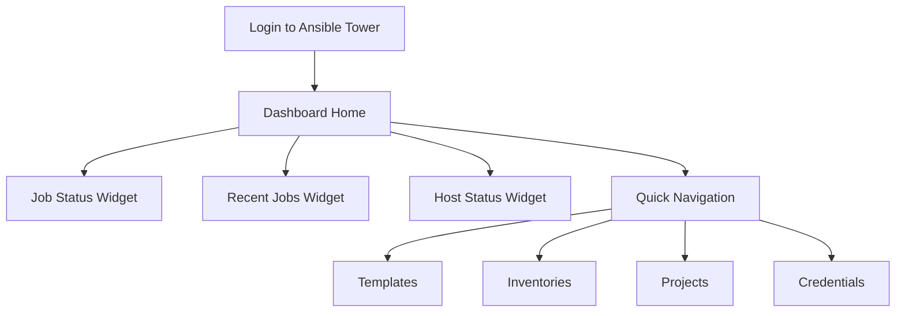

# Ansible Tower Dashboard

## Introduction

The Ansible Tower Dashboard (also known as the AWX Dashboard in the open-source version) is the primary interface for managing and monitoring your automation infrastructure. It provides a centralized web-based console where administrators and operators can control, schedule, and track automation jobs across their entire environment. For beginners entering the world of infrastructure automation, the dashboard serves as your command center for all Ansible operations.

## Dashboard Overview

When you first log into Ansible Tower, you're presented with the dashboard - a comprehensive visual representation of your automation environment's health and activity. The dashboard is designed to give you at-a-glance information about your automation status while providing quick access to common tasks.



## Key Dashboard Components

### 1. Job Status Widget

The Job Status widget provides a visual summary of all job activities across your environment.

#### Components:

- **Success/Failure Ratio**: A pie chart showing the proportion of successful vs. failed jobs
- **Recent Activity Timeline**: Displays job execution over time
- **Failed Jobs Spotlight**: Highlights problematic automation to address

### 2. Recent Jobs Widget

This section lists the most recently run automation jobs, including:

- Job name
- Template source
- Status (success, failed, running)
- Start and end times
- Initiated by (user)

This area allows you to quickly identify who is running what in your environment and troubleshoot recent failures.

### 3. Host Status Widget

The Host Status widget displays the current state of the hosts managed by Tower:

- **Total Hosts**: Count of all managed hosts
- **Host Status Breakdown**: Shows how many hosts are:
  - OK/Green (healthy)
  - Warning/Yellow (issues detected)
  - Error/Red (failed or unreachable)

### 4. Quick Navigation

The dashboard includes shortcuts to your most important resources:

- **Templates**: Predefined job configurations
- **Inventories**: Lists of managed hosts
- **Projects**: Ansible playbook repositories
- **Credentials**: Authentication details for managed systems

## Customizing Your Dashboard

Ansible Tower allows you to customize the dashboard to focus on what matters most to your operations.

### Adding and Removing Widgets

```javascript
// Example settings JSON representation for dashboard customization
{
  "widgets": [
    {
      "name": "job_status",
      "position": 1,
      "size": "medium",
      "visible": true
    },
    {
      "name": "recent_jobs",
      "position": 2, 
      "size": "large",
      "visible": true
    }
  ]
}
```

To customize your dashboard:

1. Click on the gear icon in the top right of the dashboard
2. Select "Edit Dashboard"
3. Drag and drop widgets to reposition them
4. Click the "X" on any widget to remove it
5. Click "Add Widget" to restore previously removed widgets
6. Click "Save" when finished

## Practical Dashboard Usage Examples

### Example 1: Monitoring Critical Production Jobs

For a DevOps team managing critical infrastructure, you might configure your dashboard to prominently display:

1. The Job Status widget, filtered to show only production environment jobs
2. Recent Jobs limited to critical service deployments
3. Host Status focused on production servers

### Example 2: Team Activity Monitoring

For a team lead tracking automation adoption:

1. Configure the Recent Jobs widget to show all team member activities
2. Add the "Most Active Users" widget to track engagement
3. Monitor template usage statistics to identify popular automation

### Example 3: Dashboard for Incident Response

During an incident:

1. Filter Recent Jobs to show only related system components
2. Add Host Status widgets for affected service groups
3. Create quick access shortcuts to incident response playbooks

## Deep Dive: Dashboard Navigation and Features

### The Navigation Bar

The Ansible Tower dashboard includes a persistent navigation bar with the following sections:

- **VIEWS**: Dashboard, Jobs, Schedules, My View
- **RESOURCES**: Templates, Credentials, Projects, Inventories
- **ACCESS**: Organizations, Users, Teams
- **ADMINISTRATION**: Settings, Instance Groups, Management Jobs

For beginners, the most frequently used sections will be VIEWS and RESOURCES.

### Using the Dashboard Search

The global search function in the top navigation bar allows you to quickly find resources:

```bash
# Search syntax examples
name:webserver    # Find all items named webserver
kind:job status:failed    # Find all failed jobs
inventory:production template:deploy    # Find deployment templates using production inventory
```

### Understanding Dashboard Notifications

The dashboard displays notifications in several ways:

1. **System Alerts**: Appear at the top of the dashboard for critical issues
2. **Job Notifications**: Popup in the corner when jobs complete
3. **Warning Indicators**: Yellow/red icons on affected components

## Practical Exercises

### Exercise 1: Dashboard Orientation

1. Log into your Ansible Tower instance
2. Identify all the main dashboard widgets
3. Navigate to each of the main sections in the navigation bar
4. Return to the dashboard using the shortcut in the top navigation

### Exercise 2: Dashboard Customization

1. Rearrange your dashboard widgets in order of importance to your workflow
2. Remove a widget you don't regularly use
3. Add it back and position it at the bottom of your dashboard
4. Save your custom layout

### Exercise 3: Job Monitoring

1. Launch a simple job template (create one if needed)
2. Observe how it appears in the Recent Jobs widget
3. Click on the job to see detailed output
4. Return to the dashboard and note any changes in the Job Status widget

## Summary

The Ansible Tower Dashboard is your central command center for automation management. It provides vital information about your infrastructure's automation health, recent activities, and quick access to common tasks. As a beginner, becoming familiar with the dashboard components will help you efficiently manage your automation environment.

As you grow more comfortable with Ansible Tower, you'll likely customize the dashboard to focus on the metrics and activities most relevant to your specific responsibilities and workflows. The dashboard is designed to scale from simple automation monitoring to enterprise-level infrastructure management.

## Additional Resources

- Ansible Tower Documentation
- Red Hat Ansible Automation Platform Learning Resources
- AWX Project Documentation (for the open-source version)
- Ansible Community Forums

## Next Steps

After becoming familiar with the Ansible Tower Dashboard, explore:

1. **Job Templates**: Learn how to create and execute automation templates
2. **Inventory Management**: How to organize and group your infrastructure
3. **Role-Based Access Control**: Setting up proper permissions for your team
4. **Workflow Creation**: Building complex multi-step automation workflows