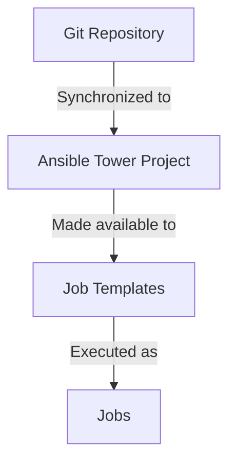

# Ansible Tower Projects

## Introduction

In the world of IT automation, Ansible Tower (and its open-source counterpart AWX) serves as a powerful web-based solution that extends Ansible's capabilities with a user-friendly interface, role-based access control, and centralized management. At the heart of Ansible Tower's organization structure lies the concept of **Projects**.

Projects in Ansible Tower are logical collections of Ansible playbooks and related files that define your automation tasks. They serve as containers that organize your automation content and connect your playbook repositories to Tower's automation engine. Understanding how to work with projects is fundamental to effectively using Ansible Tower.

In this guide, we'll explore what Ansible Tower Projects are, how they work, and how to use them effectively in your automation journey.

## What Are Ansible Tower Projects?

A project in Ansible Tower/AWX is essentially a connection to a source code management (SCM) system that contains your Ansible playbooks, roles, and other related files. Think of projects as the bridge between your version-controlled Ansible code and Tower's execution environment.



Key characteristics of Ansible Tower Projects:

- **Source Control Integration**: Projects typically link to version control systems like Git, allowing your team to maintain playbooks using standard development practices.
- **Playbook Organization**: Projects provide a structured way to organize related playbooks and roles.
- **Automatic Updates**: Tower can automatically sync with your source repositories to ensure it's always using the latest version of your playbooks.
- **Inventory Association**: Projects can be linked to specific inventories, limiting the scope of automation to relevant infrastructure.

## Types of Project Sources

Ansible Tower supports multiple project source types:

1. **Git**: The most common source type, connecting to Git repositories like GitHub, GitLab, or Bitbucket.
2. **Subversion (SVN)**: For teams using SVN as their version control system.
3. **Mercurial (hg)**: For Mercurial-based repositories.
4. **Manual**: Upload playbooks directly to Tower without using version control.

## Creating a Project in Ansible Tower

Let's walk through the process of creating a new project in Ansible Tower:

### Step 1: Access the Projects Section

Navigate to the Projects section in the Ansible Tower dashboard.

### Step 2: Create a New Project

Click the "Add" button to create a new project and fill in the required fields:

- **Name**: A descriptive name for your project (e.g., "Web Server Configuration")
- **Description**: Optional detailed information about the project's purpose
- **Organization**: The organization that will own this project
- **SCM Type**: Select your source control system (Git, SVN, Mercurial, or Manual)

### Step 3: Configure SCM Details

For a Git-based project, provide the following information:

```yaml
SCM Type: Git
SCM URL: https://github.com/your-username/your-playbooks-repo.git
SCM Branch/Tag/Commit: main
SCM Credential: [Select your Git credential]
```

### Step 4: Configure Update Options

Set your project update options:

- **Update Revision on Launch**: Ensures the latest version is used when running playbooks
- **Clean**: Removes any local modifications before updating
- **Delete on Update**: Deletes the local repository and recreates it on each update
- **Update on Launch**: Automatically updates the project when a job template using it is launched

### Step 5: Save the Project

Click "Save" to create your project. Ansible Tower will immediately attempt to sync with your repository.

## Example: Setting Up a Project with a Git Repository

Let's create a real-world example of setting up a project that connects to a GitHub repository containing web server configuration playbooks.

### First, ensure your repository structure follows Ansible best practices:

```
web-server-config/
├── inventory/
│   └── hosts.ini
├── roles/
│   ├── nginx/
│   └── apache/
├── playbooks/
│   ├── setup_nginx.yml
│   └── setup_apache.yml
└── README.md
```

### Then, in Ansible Tower:

1. Navigate to **Projects** and click **Add**
2. Fill in the details:
   - **Name**: Web Server Configuration
   - **Description**: Playbooks for configuring and managing web servers
   - **Organization**: Operations
   - **SCM Type**: Git
   - **SCM URL**: `https://github.com/your-org/web-server-config.git`
   - **SCM Branch**: `main`
   - **SCM Update Options**: 
     - ✓ Update on Launch
     - ✓ Clean
   - **Cache Timeout**: 86400 (24 hours)

3. Click **Save**

Once saved, Ansible Tower will sync with your Git repository and make the playbooks available for use in job templates.

## Managing Project Updates

Keeping your projects updated is crucial for ensuring you're using the latest version of your playbooks. Ansible Tower provides several ways to manage project updates:

### Manual Updates

To manually update a project:

1. Navigate to the Projects section
2. Find your project in the list
3. Click the update icon (circular arrow)

Tower will then pull the latest changes from your source control system.

### Scheduled Updates

For projects that change frequently, you can set up scheduled updates:

1. Navigate to the Projects section
2. Select your project
3. Click "Schedules"
4. Click "Add" to create a new schedule
5. Configure the update frequency (hourly, daily, weekly, etc.)

Example schedule configuration for a daily update at 2 AM:

```yaml
Name: Nightly Update
Start Date: 2023-09-01
Start Time: 02:00:00
Repeat Frequency: Daily
```

### Update on Launch

Enabling the "Update on Launch" option ensures that your project is always updated before a job template using it is executed. This guarantees that the latest version of your playbooks is always used.

## Working with Project Content

Once your project is set up and synchronized, you can use its playbooks in job templates. Here's how the process works:

1. **Project Sync**: Tower downloads your playbooks from source control
2. **Content Discovery**: Tower scans the project directory for playbooks
3. **Job Template Creation**: You create job templates that reference playbooks in your project
4. **Job Execution**: When a job template runs, it uses the playbooks from your project

Let's look at how to create a job template using a playbook from our web server project:

1. Navigate to **Templates** and click **Add > Job Template**
2. Fill in the details:
   - **Name**: Deploy Nginx Web Server
   - **Description**: Configures and deploys Nginx on target servers
   - **Inventory**: Web Servers
   - **Project**: Web Server Configuration
   - **Playbook**: `playbooks/setup_nginx.yml`
   - **Credentials**: Add the necessary credentials for your target servers

3. Click **Save**

Now you can run this job template to execute the `setup_nginx.yml` playbook from your project.

## Project Organization Best Practices

To get the most out of Ansible Tower projects, follow these best practices:

### 1. Use a Consistent Repository Structure

Maintain a consistent structure across your repositories:

```
project-name/
├── collections/
│   └── requirements.yml
├── inventories/
│   ├── development/
│   └── production/
├── roles/
├── playbooks/
└── README.md
```

### 2. Separate Projects by Function

Instead of creating one massive project, divide your automation by function:

- Infrastructure provisioning
- Application deployment
- Security compliance
- System updates and patching

### 3. Use Branch-Based Workflows

Leverage Git branches for development workflows:

- `development` branch for testing new playbooks
- `production` branch for stable, tested automation
- Feature branches for new automation development

Create separate Ansible Tower projects for each branch to facilitate testing.

### 4. Document Your Projects

Include comprehensive README files in your repositories with:

- Project purpose and scope
- Playbook descriptions and usage
- Required variables and credentials
- Prerequisites and dependencies

### 5. Implement Proper Version Control

Use version tags in your repositories to mark stable releases. This allows you to configure Tower projects to use specific versions of your playbooks.

## Troubleshooting Project Issues

When working with Ansible Tower projects, you might encounter some common issues:

### Failed Project Sync

If your project fails to synchronize, check:

1. **SCM Credentials**: Ensure your credentials have proper access to the repository
2. **Repository URL**: Verify the URL is correct and accessible from Tower
3. **Network Connectivity**: Confirm Tower can reach your SCM server

Examine the project update job output for specific error messages:

```
ERROR: Failed to update project 'Web Server Config': 
Error checking out revision 'main': Authentication failed
```

### Missing Playbooks

If playbooks are not appearing in your job templates:

1. **Project Path**: Verify playbooks are in the expected location in your repository
2. **File Extensions**: Ensure playbooks have the correct extension (`.yml` or `.yaml`)
3. **Project Update**: Check if the project has been updated since adding new playbooks

### Permission Issues

If you encounter permission problems:

1. **User Permissions**: Verify users have appropriate permissions on the project
2. **Organization Visibility**: Check if the project is visible to the correct organization
3. **Role-Based Access**: Ensure users have the proper roles assigned for project access

## Summary

Ansible Tower Projects serve as the foundation for organizing and executing your automation content. By connecting your version-controlled playbooks to Tower, projects enable structured, repeatable, and collaborative automation workflows.

Key takeaways from this guide:

- Projects link your source-controlled Ansible content to Tower
- Multiple SCM types are supported, with Git being the most common
- Projects can be updated manually, on a schedule, or automatically when used
- Properly structured projects lead to more maintainable automation
- Following best practices helps create scalable automation systems

By mastering Ansible Tower Projects, you've taken a significant step toward building a robust automation platform that can scale with your organization's needs.

## Additional Resources

To further enhance your understanding of Ansible Tower Projects:

- Explore the [Ansible Tower User Guide](https://docs.ansible.com/ansible-tower/latest/html/userguide/projects.html)
- Practice creating different types of projects with various SCM systems
- Try implementing branch-based workflows with separate projects for development and production
- Experiment with project update schedules to find the right balance for your team

## Exercise: Building Your First Project

Try this exercise to apply what you've learned:

1. Create a Git repository with a simple playbook structure
2. Set up an Ansible Tower project that connects to your repository
3. Configure automatic updates on launch
4. Create a job template that uses a playbook from your project
5. Run the job template and observe how the project update occurs before execution

This hands-on experience will solidify your understanding of how Ansible Tower Projects work in practice.