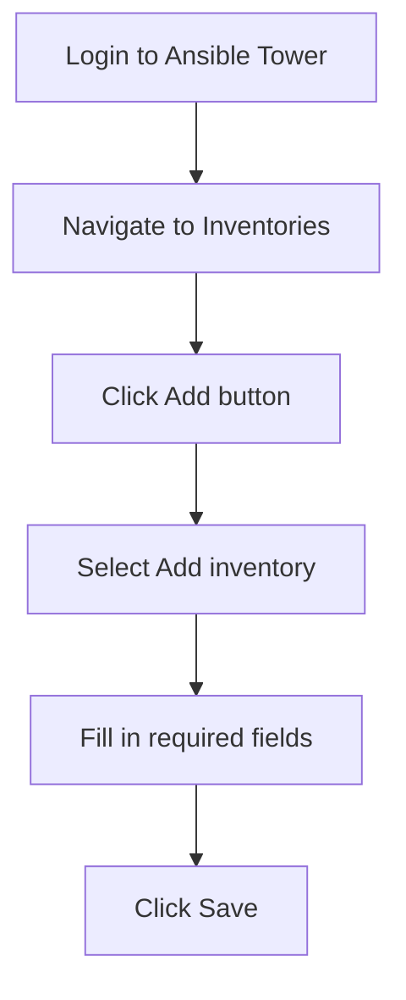

# Ansible Tower Inventories

## Introduction

When managing infrastructure with Ansible, one of the first and most important components you'll work with is inventories. In Ansible Tower (or its open-source counterpart AWX), inventories are central to organizing and targeting your automation. An inventory is essentially a collection of hosts and groups that Ansible can manage, along with their variables and connection details.

Think of an inventory as your "address book" for automation - it tells Ansible Tower which systems it can reach, how to reach them, and provides additional information about those systems that can be used during playbook execution.

## Understanding Inventory Basics

### What Are Inventories in Ansible Tower?

Inventories in Ansible Tower extend the concept of basic Ansible inventories with additional features:

- **Web-based management**: Create and edit inventories through a user-friendly interface
- **Role-based access control**: Control who can view or modify inventory information
- **Dynamic inventories**: Automatically populate hosts from external sources
- **Real-time status**: See which hosts are available and their latest facts
- **Multi-credential support**: Use different authentication methods for different hosts

### Types of Inventories

Ansible Tower supports two main types of inventories:

1. **Static Inventories**: Manually defined lists of hosts and groups
2. **Dynamic Inventories**: Automatically generated from external sources like cloud providers, virtualization platforms, or CMDBs

## Creating and Managing Inventories

### Creating a Static Inventory

Let's start by creating a basic static inventory in Ansible Tower:

1. Navigate to **Inventories** in the Ansible Tower dashboard
2. Click the **Add** button and select **Add inventory**
3. Fill in the required fields:
   - **Name**: A descriptive name (e.g., "Production Servers")
   - **Organization**: Your organization in Ansible Tower
   - **Description**: Optional information about the inventory



### Adding Hosts to an Inventory

Once you've created an inventory, you can add hosts:

1. From your inventory, click the **Hosts** button
2. Click **Add**
3. Enter the hostname or IP address
4. Add any variables specific to this host
5. Click **Save**

Example host variables in YAML format:

```yaml
ansible_host: 192.168.1.100
ansible_user: admin
ansible_connection: ssh
ansible_ssh_private_key_file: /path/to/key
environment: production
role: web_server
```

### Creating Host Groups

Groups help organize hosts by function, location, or other criteria:

1. From your inventory, click the **Groups** button
2. Click **Add**
3. Enter a name and description
4. Click **Save**
5. Select the group and click **Hosts**
6. Add hosts to the group

Groups can also contain other groups, allowing for hierarchical organization:

```yaml
all:
  children:
    datacenter_east:
      children:
        web_servers:
          hosts:
            web01.example.com:
            web02.example.com:
        database_servers:
          hosts:
            db01.example.com:
            db02.example.com:
    datacenter_west:
      children:
        web_servers:
          hosts:
            web03.example.com:
            web04.example.com:
```

## Using Variables with Inventories

Ansible Tower inventories support variables at multiple levels:

### Host Variables

Variables specific to individual hosts:

1. Navigate to a host within your inventory
2. Click on the **Variables** tab
3. Enter variables in YAML or JSON format:

```yaml
ansible_port: 2222
memory_size: 8GB
application_version: 1.5.2
backup_enabled: true
```

### Group Variables

Variables applied to all hosts in a group:

1. Navigate to a group within your inventory
2. Click on the **Variables** tab
3. Enter variables in YAML or JSON format:

```yaml
ntp_server: ntp.example.com
dns_servers:
  - 8.8.8.8
  - 8.8.4.4
security_updates: daily
monitoring_enabled: true
```

### Inventory Variables

Variables applied to the entire inventory:

1. Navigate to your inventory
2. Click on the **Variables** tab
3. Enter variables in YAML or JSON format:

```yaml
ansible_become: true
ansible_become_method: sudo
company_name: "Acme Inc."
default_timezone: "UTC"
```

## Working with Dynamic Inventories

Dynamic inventories automatically fetch host information from external sources.

### Setting Up a Dynamic Inventory

1. Navigate to **Inventories** and click **Add**
2. Select **Add inventory source**
3. Fill in the required fields:
   - **Name**: A descriptive name (e.g., "AWS EC2 Instances")
   - **Source**: Select your inventory source (AWS, GCP, VMware, etc.)
   - **Credential**: Select the appropriate credential for the source
   - **Update Options**: Configure how often to sync

### Example: AWS EC2 Dynamic Inventory

Here's how to set up a dynamic inventory for AWS EC2 instances:

1. Create an AWS credential in Ansible Tower
2. Create a new inventory
3. Add an inventory source with the following settings:
   - **Source**: Amazon EC2
   - **Credential**: Your AWS credential
   - **Regions**: Select AWS regions to include
   - **Instance Filters**: Optional filters (e.g., `tag:Environment=Production`)
   - **Update Options**: Enable "Update on Launch"

When this inventory syncs, it will automatically:
- Create groups based on AWS attributes (regions, availability zones, security groups, tags)
- Import all instance details as host variables
- Update when instances are created or terminated

## Practical Examples

### Example 1: Multi-Environment Web Application Deployment

Let's create an inventory structure for a web application with multiple environments:

```yaml
# Inventory Variables
---
ansible_become: true
default_ssh_user: deployer

# Group: All Environments
all:
  children:
    development:
      vars:
        environment: dev
        debug_mode: true
      hosts:
        dev-web01:
          ansible_host: 192.168.10.101
        dev-web02:
          ansible_host: 192.168.10.102
        dev-db01:
          ansible_host: 192.168.10.201
          db_role: primary
    
    staging:
      vars:
        environment: stage
        debug_mode: false
      hosts:
        stage-web01:
          ansible_host: 192.168.20.101
        stage-web02:
          ansible_host: 192.168.20.102
        stage-db01:
          ansible_host: 192.168.20.201
          db_role: primary
    
    production:
      vars:
        environment: prod
        debug_mode: false
        backup_retention: 30
      hosts:
        prod-web01:
          ansible_host: 192.168.30.101
        prod-web02:
          ansible_host: 192.168.30.102
        prod-web03:
          ansible_host: 192.168.30.103
        prod-db01:
          ansible_host: 192.168.30.201
          db_role: primary
        prod-db02:
          ansible_host: 192.168.30.202
          db_role: replica
```

This structure allows you to:
- Target specific environments (e.g., `development`, `staging`, `production`)
- Apply environment-specific variables
- Run playbooks against all web servers or database servers across environments

### Example 2: Using Inventory to Target Specific Hosts

When running a job template in Ansible Tower, you can use the inventory structure to target specific hosts or groups:

```yaml
# Playbook: update_web_servers.yml
---
- name: Update Web Servers
  hosts: development:staging  # Target both development and staging environments
  tasks:
    - name: Update packages
      apt:
        update_cache: yes
        upgrade: yes
      become: yes
      
    - name: Restart web service
      service:
        name: nginx
        state: restarted
      become: yes
```

### Example 3: Using Inventory Variables in Templates

You can use inventory variables in your templates to customize configurations:

```yaml
# Template: nginx.conf.j2
server {
    listen 80;
    server_name {{ inventory_hostname }};
    
    
    # Development-specific settings
    error_log /var/log/nginx/error.log debug;
    
    # Production-specific settings
    error_log /var/log/nginx/error.log warn;
    
    
    location / {
        root /var/www/{{ application_name }};
        index index.html;
    }
}
```

## Best Practices for Ansible Tower Inventories

### 1. Use a Consistent Naming Convention

Adopt a consistent naming scheme for hosts and groups:
- Use descriptive names that indicate function and environment
- Consider including location or datacenter information
- Be consistent with case and separators

### 2. Implement a Logical Group Hierarchy

Create a sensible hierarchy that reflects your infrastructure:
- Group by environment (dev, test, prod)
- Group by function (web, database, cache)
- Group by location (east, west, europe)
- Use nested groups to represent relationships

### 3. Leverage Variables Effectively

Use variables at the appropriate level:
- Host variables for host-specific settings
- Group variables for shared settings
- Inventory variables for global settings

### 4. Keep Credentials Separate

Don't store sensitive data in your inventory:
- Use Ansible Tower's credential system instead
- Leverage lookups or Ansible Vault for sensitive variables
- Use different credentials for different environments

### 5. Set Up Regular Syncs for Dynamic Inventories

Keep your dynamic inventories up to date:
- Schedule regular syncs
- Enable "Update on Launch" for job templates
- Monitor sync failures

### 6. Document Your Inventory Structure

Maintain documentation about your inventory:
- Add descriptions to inventories, groups, and hosts
- Use comments in variable files
- Document the purpose of custom variables

## Troubleshooting Inventory Issues

### Common Problems and Solutions

1. **Hosts Not Showing Up in Dynamic Inventory**
   - Check credential permissions
   - Verify API access to the source
   - Review filters that might be excluding hosts

2. **Cannot Connect to Hosts**
   - Verify network connectivity
   - Check SSH key or password credentials
   - Ensure correct ansible_host variable is set
   - Verify firewall rules allow connections

3. **Variable Precedence Issues**
   - Remember Ansible's variable precedence order:
     - Host variables override group variables
     - Child group variables override parent group variables
   - Use `ansible-inventory --list` to verify the final variable values

## Summary

Ansible Tower inventories are a powerful way to organize and manage your infrastructure for automation. By properly structuring your inventories, you can:

- Keep your infrastructure organized and documented
- Target specific groups of hosts for different tasks
- Apply variables at the appropriate levels
- Automatically sync with external sources
- Control access to sensitive infrastructure information

Mastering inventories is a fundamental skill for effectively using Ansible Tower/AWX and is essential for scaling your automation efforts across large or complex environments.

## Additional Resources

- [Ansible Tower Documentation](https://docs.ansible.com/ansible-tower/)
- [Ansible Inventory Guide](https://docs.ansible.com/ansible/latest/user_guide/intro_inventory.html)
- [Ansible AWX Project](https://github.com/ansible/awx)

## Exercises

1. Create a static inventory for a three-tier application with web, application, and database servers in development and production environments.

2. Set up a dynamic inventory source for your preferred cloud provider and organize the imported hosts into custom groups.

3. Create a playbook that targets specific host groups in your inventory and uses inventory variables to customize the configuration.

4. Build an inventory structure that models a multi-datacenter infrastructure with redundant services in each location.

5. Experiment with inventory plugins to automatically generate inventory from external sources like CSV files or custom APIs.