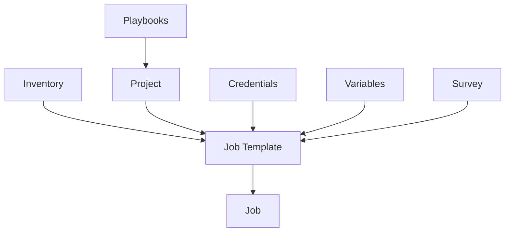

# Ansible Tower Job Templates

## Introduction

Job Templates are one of the most powerful features in Ansible Tower (or its open-source counterpart, AWX). They allow you to encapsulate Ansible playbook runs with specific parameters, credentials, inventories, and permissions into reusable objects. Think of job templates as "recipes" for automation tasks that can be executed with a single click or API call.

Job Templates solve several key challenges in automation:

- They provide a consistent way to run playbooks
- They allow non-technical users to safely execute complex automation
- They enable scheduling, notifications, and access control for automation tasks
- They create an audit trail of who ran what automation and when

In this guide, we'll explore how to create, configure, and use job templates effectively in Ansible Tower/AWX.

## Basic Concepts

Before diving into job templates, let's understand how they fit into the Ansible Tower workflow:



As you can see, a Job Template connects multiple components:

- **Projects**: Where your playbooks are stored
- **Inventories**: Define the hosts to run against
- **Credentials**: Authentication for connecting to hosts
- **Variables**: Parameters that modify playbook behavior
- **Surveys**: Forms for collecting variable inputs at runtime

## Creating Your First Job Template

Let's walk through creating a basic job template step by step:

### Prerequisites

Before creating a job template, ensure you have:

1. A project containing your Ansible playbooks
2. An inventory with target hosts
3. Necessary credentials to access those hosts

### Step-by-Step Creation Process

1. **Navigate to Templates**: In the Ansible Tower/AWX web UI, click on "Templates" in the left sidebar.

2. **Add a New Template**: Click the "Add" button and select "Job Template".

3. **Configure Basic Details**:

   ```yaml
   Name: "Update Web Servers"
   Description: "Updates packages on all web servers"
   Job Type: "Run" (default)
   Inventory: "Production Servers"
   Project: "Website Maintenance"
   Playbook: "update_webservers.yml"
   Execution Environment: "Default execution environment"
   ```

4. **Add Credentials**:
   Select the appropriate credential(s) needed to connect to your target hosts.

5. **Configure Additional Options**:
   - **Forks**: Limits how many parallel connections Ansible will make (default: 5)
   - **Limit**: Restrict execution to a subset of inventory hosts
   - **Verbosity**: Set debug level (0-4)
   - **Job Tags**: Only run tasks with specific tags
   - **Skip Tags**: Exclude tasks with specific tags

6. **Save**: Click the "Save" button to create your template.

### Example Configuration

Here's an example of a completed job template configuration:

```yaml
Name: "OS Security Updates"
Description: "Apply critical security updates to Linux servers"
Job Type: "Run"
Inventory: "Production Linux Servers"
Project: "System Maintenance"
Playbook: "security_updates.yml"
Credentials: "Prod-Linux-SSH-Key"
Forks: 10
Verbosity: 1
Options:
  - Privilege Escalation
  - Concurrent Jobs
Job Tags: "security,packages"
```

## Advanced Job Template Features

Once you've mastered the basics, let's explore some more powerful features:

### Using Variables

Job templates can use variables from multiple sources:

1. **Extra Variables**: Specified directly in the job template
2. **Survey Variables**: Collected from users at runtime
3. **Inventory Variables**: From host and group vars
4. **Credential Variables**: Stored in credential types

To add extra variables to a job template:

1. Scroll to the "Variables" section when creating/editing a template
2. Add your variables in YAML or JSON format

Example:

```yaml
---
app_version: 1.5.2
environment: production
debug_mode: false
notification_email: admin@example.com
```

### Creating Surveys

Surveys allow you to prompt users for input when they run a job template. This is perfect for making your automation more flexible and user-friendly.

To add a survey:

1. Create or edit a job template
2. Click the "Survey" tab
3. Click "Add" to create survey questions

Example survey questions:

```yaml
- Question: "Which application version to deploy?"
  Variable Name: "app_version"
  Type: "Text"
  Default: "latest"
  Required: true

- Question: "Send notification when complete?"
  Variable Name: "send_notification"
  Type: "Multiple Choice (single select)"
  Choices: ["Yes", "No"]
  Default: "Yes"
  Required: true
```

The survey responses will be available as variables in your playbook:

```yaml
- name: Deploy application
  ansible.builtin.git:
    repo: https://github.com/company/app.git
    version: "{{ app_version }}"
    dest: /var/www/app
```

### Setting Up Notifications

Job templates can trigger notifications when jobs succeed, fail, or require approval:

1. First, configure notification templates in Ansible Tower/AWX
2. Then, add them to your job template:
   - Navigate to your job template
   - Click the "Notifications" tab
   - Add notifications for different job states

Example notification configuration:

```yaml
Type: "Slack"
Event: "Job Failed"
Webhook URL: "https://hooks.slack.com/services/..."
Channel: "#operations-alerts"
```

### Scheduling Jobs

For recurring automation tasks, you can schedule job templates:

1. Navigate to your job template
2. Click the "Schedules" tab
3. Click "Add" to create a new schedule

Example schedule configurations:

```yaml
Name: "Nightly Security Updates"
Start Date: "2023-08-01"
Time: "02:00 AM"
Repeat Frequency: "Daily"
```

Or for more complex schedules:

```yaml
Name: "Monthly Compliance Check"
Start Date: "2023-08-15"
Time: "09:00 AM"
Repeat Frequency: "Monthly"
On Days: "Third Monday"
```

## Real-World Examples

Let's explore some practical examples of how job templates can be used:

### Example 1: Application Deployment

This job template deploys a web application to production:

```yaml
Name: "Deploy Web Application"
Inventory: "Production Web Servers"
Project: "Web Applications"
Playbook: "deploy_webapp.yml"
Credentials:
  - "Production SSH Key"
  - "GitHub Access Token"
```

The corresponding survey might include:

```yaml
- Question: "Application version to deploy"
  Variable Name: "app_version"
  Type: "Text"
  Default: "latest"

- Question: "Deploy to which servers?"
  Variable Name: "server_group"
  Type: "Multiple Choice"
  Choices: ["app-server-1", "app-server-2", "all"]
  Default: "all"
```

### Example 2: System Patching Workflow

A more complex example using job templates as part of a workflow:

```yaml
# First Job Template
Name: "Check Systems Before Patching"
Inventory: "All Servers"
Project: "System Maintenance"
Playbook: "pre_patch_checks.yml"

# Second Job Template
Name: "Apply System Patches"
Inventory: "All Servers"
Project: "System Maintenance"
Playbook: "apply_patches.yml"
Options:
  - Use Fact Cache

# Third Job Template
Name: "Verify Systems After Patching"
Inventory: "All Servers"
Project: "System Maintenance"
Playbook: "post_patch_verification.yml"
```

These can be combined in a Workflow Template to run sequentially with conditional branching based on the success or failure of each step.

### Example 3: Self-Service User Creation

A job template that allows HR to create new user accounts:

```yaml
Name: "Create New Employee Account"
Inventory: "Identity Management Servers"
Project: "User Management"
Playbook: "create_user.yml"
Credentials: "Admin SSH Key"
```

With a survey:

```yaml
- Question: "Employee Full Name"
  Variable Name: "full_name"
  Type: "Text"
  Required: true

- Question: "Department"
  Variable Name: "department"
  Type: "Multiple Choice"
  Choices: ["IT", "Finance", "HR", "Marketing", "Operations"]
  Required: true

- Question: "Access Level"
  Variable Name: "access_level"
  Type: "Multiple Choice"
  Choices: ["Basic", "Standard", "Administrative"]
  Default: "Standard"
  Required: true
```

## Best Practices

To get the most out of job templates, consider these best practices:

### Template Organization

- **Use Naming Conventions**: Create a consistent naming scheme (e.g., `[Environment]-[Purpose]-[Component]`)
- **Organize with Labels**: Apply labels to templates for easier filtering and organization
- **Create Template Descriptions**: Always include a clear description of what the template does

### Security Considerations

- **Least Privilege**: Grant minimum necessary permissions to job templates
- **Use Approval Workflows**: For sensitive operations, require approval before execution
- **Credential Management**: Use credential types appropriately and avoid embedding secrets in variables

### Performance Optimization

- **Adjust Forks**: Increase forks for faster execution on large inventories
- **Use Fact Caching**: Enable fact caching to speed up playbook runs
- **Job Slicing**: For very large inventories, use job slicing to split the workload

### Maintainability Tips

- **Version Your Templates**: Export templates as code and store them in version control
- **Documentation**: Document the purpose and usage of each template
- **Test Templates**: Always test templates in development before promoting to production

## Common Issues and Troubleshooting

Here are some common issues you might encounter with job templates:

### Template Execution Failures

**Problem**: Job template fails with "Unable to find playbook"
**Solution**: Ensure your project has successfully synced and the playbook path is correct

**Problem**: Credential authentication issues
**Solution**: Verify credential data and test connection using the ad-hoc commands feature

### Survey Problems

**Problem**: Survey variables not appearing in playbook
**Solution**: Ensure variable names match exactly and check if they're being overridden by other variables

**Problem**: Survey validation fails
**Solution**: Check the data types and constraints on your survey fields

### Performance Issues

**Problem**: Jobs running too slowly
**Solution**: 
- Increase forks parameter
- Check for network bottlenecks
- Optimize playbook with tags and conditionals

## Summary

Job Templates in Ansible Tower/AWX transform complex automation tasks into reusable, secure, and user-friendly operations. They provide a consistent interface for running playbooks and enable non-technical users to safely execute automation tasks.

Key takeaways:

- Job templates connect playbooks, inventories, credentials, and variables
- Surveys make templates flexible and user-friendly
- Scheduling enables recurring automation
- Notifications keep teams informed of job status
- Proper organization and security practices are essential

By mastering job templates, you'll unlock the full potential of Ansible Tower/AWX and create a more efficient, secure, and scalable automation environment.

## Additional Resources

- [Ansible Tower User Guide](https://docs.ansible.com/ansible-tower/latest/html/userguide/job_templates.html)
- [Red Hat Ansible Automation Platform Documentation](https://access.redhat.com/documentation/en-us/red_hat_ansible_automation_platform/)
- [AWX Project Documentation](https://github.com/ansible/awx/tree/devel/docs)

## Exercises

1. Create a basic job template to install a package on a group of servers
2. Build a job template with a survey that deploys an application to a chosen environment
3. Set up a scheduled job template that runs system updates every Sunday at 2 AM
4. Create a workflow template that combines multiple job templates with conditional logic
5. Design a self-service job template with a survey that non-technical users can safely run