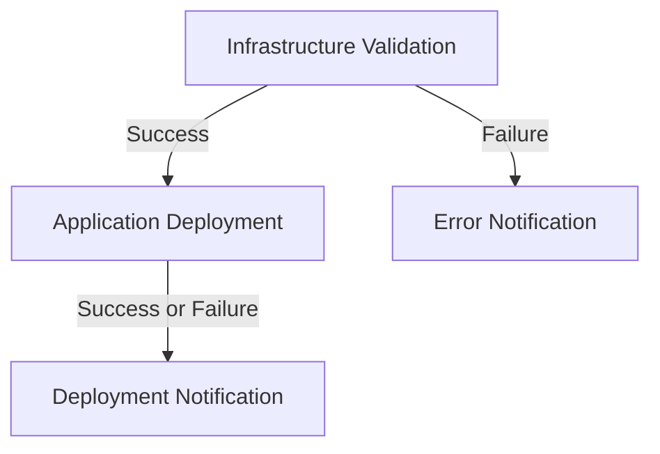
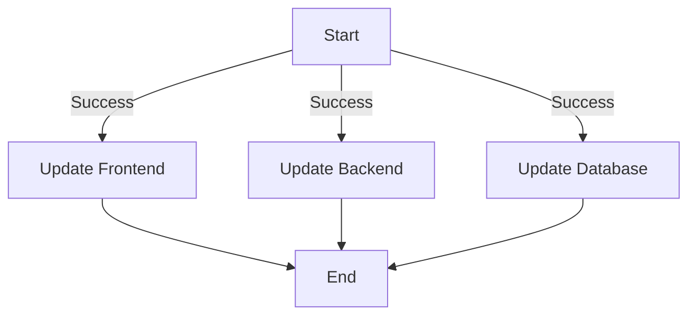
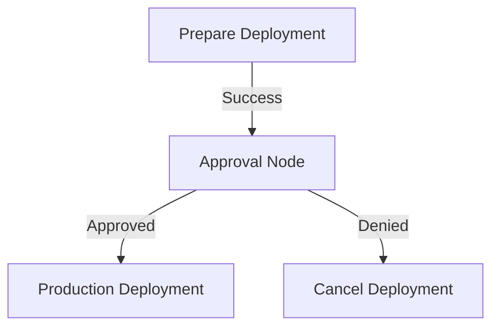
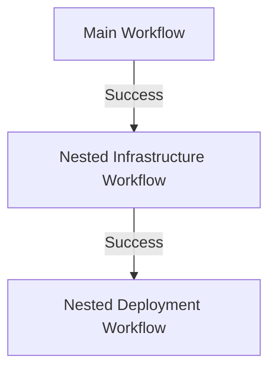
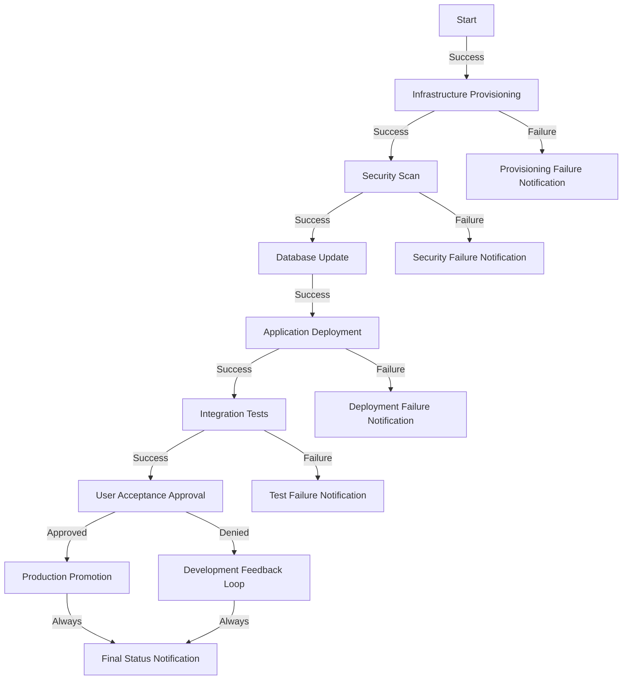

# Ansible Tower Workflows

## Introduction

Ansible Tower Workflows (also available in AWX, the open-source version of Tower) are a powerful feature that allows you to chain together multiple job templates, project syncs, and inventory updates into a single process. Workflows enable you to create complex automation sequences with decision points, parallel execution, and conditional branching.

Think of workflows as the conductor of an orchestra, where each individual job template is a musician. The workflow coordinates when and how each job template plays its part, creating a harmonious automation symphony.

## Why Use Workflows?

Before diving into the technical details, let's understand why workflows are valuable:

1. **Complex Dependencies**: Run jobs that depend on the outcome of previous jobs
2. **Parallel Execution**: Execute independent tasks simultaneously to save time
3. **Error Handling**: Implement different paths based on success or failure
4. **Cross-Team Orchestration**: Combine job templates from different teams into a single process
5. **Reduced Manual Intervention**: Automate decision-making between tasks

## Basic Workflow Concepts

### Job Templates vs. Workflow Templates

In Ansible Tower, there are two primary types of templates:

| Job Template | Workflow Template |
|--------------|-------------------|
| Runs a single Ansible playbook | Orchestrates multiple job templates |
| Operates on a specific inventory | Can involve multiple inventories |
| Has a linear execution | Can branch based on success/failure/always |
| Simpler to set up | More powerful but more complex |

### Workflow Nodes

A workflow consists of multiple nodes, with each node representing:
- A job template
- A project sync
- An inventory source update
- An approval node (requiring manual confirmation)
- Another workflow template (nested workflows)

Nodes are connected by success, failure, or always paths, determining what happens next based on the outcome of each node.

## Creating Your First Workflow Template

Let's walk through creating a basic workflow template that deploys an application after first ensuring the infrastructure is properly configured.

### Step 1: Access the Workflow Template Creation Page

1. Log in to Ansible Tower/AWX
2. Navigate to Templates
3. Click the "Add" button and select "Workflow Template"

### Step 2: Configure Basic Settings

```
Name: Application Deployment Workflow
Description: Workflow to validate infrastructure and deploy application
Organization: Your Organization
Inventory: Leave empty (will use job template inventories)
```

### Step 3: Create the Workflow Diagram

After saving the basic settings, you'll be prompted to create the workflow diagram. This is where you define the flow of operations.

Let's create a workflow with the following nodes:

1. **Infrastructure Validation** job template
2. **Application Deployment** job template (runs if validation succeeds)
3. **Notification** job template (runs regardless of deployment outcome)

Here's how this would look as a diagram:



### Step 4: Add Nodes to Your Workflow

In the visual editor:

1. Click the "Start" button to add your first node
2. Select "Infrastructure Validation" job template
3. Click on the Infrastructure Validation node
4. Select "Add a node on success" and choose "Application Deployment" job template
5. Click on the Infrastructure Validation node again
6. Select "Add a node on failure" and choose "Error Notification" job template
7. Click on the Application Deployment node
8. Select "Add a node always" and choose "Deployment Notification" job template

### Step 5: Save and Launch

Save your workflow template. You can now launch it like any other template in Tower.

## Code Example: Creating Workflows with the Tower CLI

You can also create and manage workflows programmatically using the Ansible Tower CLI. Here's how to create the same workflow from our example:

```bash
# Install the Tower CLI
pip install ansible-tower-cli

# Configure the CLI
tower-cli config host tower.example.com
tower-cli config username admin
tower-cli config password password

# Create the workflow template
tower-cli workflow create --name "Application Deployment Workflow" \
  --description "Workflow to validate infrastructure and deploy application" \
  --organization "Your Organization"

# Add nodes to the workflow
# First, get the workflow template ID
WORKFLOW_ID=$(tower-cli workflow get --name "Application Deployment Workflow" -f id)

# Add infrastructure validation as the first step
tower-cli workflow_node create --workflow_job_template $WORKFLOW_ID \
  --unified_job_template "Infrastructure Validation" \
  --identifier "infra_validation"

# Add application deployment (on success from validation)
tower-cli workflow_node create --workflow_job_template $WORKFLOW_ID \
  --unified_job_template "Application Deployment" \
  --identifier "app_deployment"

# Connect the nodes
tower-cli workflow_node_connection create \
  --workflow_job_template $WORKFLOW_ID \
  --source "infra_validation" \
  --target "app_deployment" \
  --connection success

# Add error notification (on failure from validation)
tower-cli workflow_node create --workflow_job_template $WORKFLOW_ID \
  --unified_job_template "Error Notification" \
  --identifier "error_notification"

tower-cli workflow_node_connection create \
  --workflow_job_template $WORKFLOW_ID \
  --source "infra_validation" \
  --target "error_notification" \
  --connection failure

# Add deployment notification (always runs after deployment)
tower-cli workflow_node create --workflow_job_template $WORKFLOW_ID \
  --unified_job_template "Deployment Notification" \
  --identifier "deployment_notification"

tower-cli workflow_node_connection create \
  --workflow_job_template $WORKFLOW_ID \
  --source "app_deployment" \
  --target "deployment_notification" \
  --connection always
```

## Advanced Workflow Features

### Parallel Execution

You can configure multiple nodes to run simultaneously by connecting them to the same parent node. This is useful for tasks that don't depend on each other.



### Approval Nodes

Approval nodes pause workflow execution until a user manually approves or denies the continuation. This is useful for critical deployments that require human oversight.



To add an approval node:
1. Create a node as usual
2. Select "Approval" as the node type
3. Configure the approval timeout and description
4. Connect it to your workflow

### Nested Workflows

You can include entire workflows as nodes within another workflow, allowing for modular and reusable automation sequences.



## Practical Example: Full Application Lifecycle

Let's create a more complex workflow that manages a complete application lifecycle, from infrastructure provisioning to deployment and testing.



This workflow demonstrates:
- Parallel execution (security scan and infrastructure tasks)
- Conditional branching based on success/failure
- Approval node for user acceptance
- Notification nodes for various outcomes

## Best Practices for Ansible Tower Workflows

1. **Start Simple**: Begin with linear workflows before adding complexity
2. **Use Descriptive Names**: Name your nodes clearly to make the workflow easy to understand
3. **Include Error Handling**: Add failure paths for all critical nodes
4. **Implement Notifications**: Keep stakeholders informed of important events
5. **Create Reusable Components**: Build modular workflows that can be nested in other workflows
6. **Document Extensively**: Use descriptions and labels to explain the purpose of each node
7. **Test Thoroughly**: Test each job template individually before incorporating it into a workflow
8. **Monitor Execution**: Use Tower's dashboard to monitor workflow execution
9. **Implement Approval Nodes**: For critical changes that require human oversight
10. **Limit Concurrent Jobs**: Configure resource constraints to prevent overloading your systems

## Troubleshooting Workflows

### Common Issues and Solutions

| Issue | Possible Cause | Solution |
|-------|---------------|----------|
| Workflow fails at specific node | Job template has errors | Check the job template logs |
| Workflow hangs | Approval node waiting for input | Check for pending approvals |
| Unexpected branching | Incorrect success/failure paths | Review node connections |
| All nodes showing as successful but outcome incorrect | Logic error in workflow design | Review workflow logic |
| Performance issues | Too many concurrent jobs | Configure concurrency limits |

### Debugging Tips

1. Use the visual workflow editor to review the execution path
2. Check individual job template logs for specific errors
3. Use the Tower API to get detailed information about workflow jobs
4. Test job templates individually before incorporating them into workflows
5. Use a staging environment to test complex workflows before production use

## Summary

Ansible Tower Workflows provide a powerful way to orchestrate complex automation processes. By chaining together job templates with conditional logic, parallel execution, and approval requirements, you can create sophisticated automation solutions that reduce manual effort and improve reliability.

Key takeaways:
- Workflows chain multiple job templates together
- Nodes can be connected based on success, failure, or always paths
- Parallel execution and conditional branching provide flexibility
- Approval nodes allow for human oversight when needed
- Nested workflows enable modular, reusable automation

## Additional Resources

- [Ansible Tower Documentation](https://docs.ansible.com/ansible-tower/)
- [Ansible AWX Project](https://github.com/ansible/awx)
- [Red Hat Ansible Automation Platform](https://www.redhat.com/en/technologies/management/ansible)

## Exercises

1. Create a simple three-node workflow that provisions infrastructure, deploys an application, and sends a notification.
2. Modify your workflow to include error handling for each step.
3. Add an approval node before a critical deployment step.
4. Create a workflow that executes three job templates in parallel and waits for all to complete.
5. Design a workflow that uses nested workflows for different stages of your deployment process.