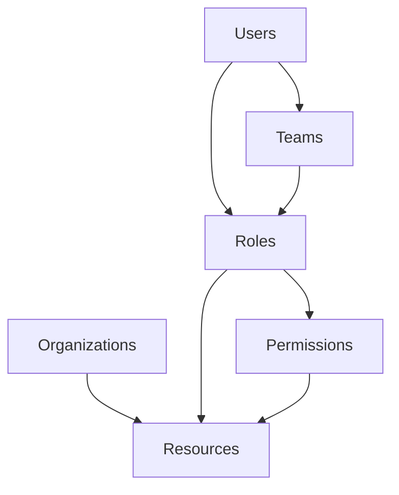

# Ansible Tower RBAC

## Introduction

Role-Based Access Control (RBAC) is a crucial security feature in Ansible Tower (and its open-source counterpart AWX) that allows administrators to define who can access what resources and perform specific operations. As organizations scale their automation efforts, having proper access controls becomes essential to maintain security and operational integrity.

In this guide, we'll explore how Ansible Tower's RBAC system works, how to configure it properly, and best practices for implementing it in your environment.

## Understanding RBAC Components

Ansible Tower's RBAC system consists of several key components that work together:

1. **Users**: Individual accounts that authenticate to the system
2. **Teams**: Groups of users that share permissions
3. **Organizations**: Top-level containers for resources
4. **Roles**: Sets of permissions that define what actions can be performed
5. **Permissions**: Specific actions that can be performed on resources

Let's look at how these components relate to each other:



## Setting Up Users and Teams

### Creating Users

The first step in implementing RBAC is to create user accounts. Users can be created locally in Ansible Tower or synchronized from external authentication systems like LDAP or SAML.

To create a local user:

1. Navigate to **Settings** → **Users** → **Add**
2. Fill in the required information:

```
Username: automation_admin
Email: admin@example.com
First Name: Automation
Last Name: Admin
Password: ************
Confirm Password: ************
User Type: Normal User
```

### Creating Teams

Teams group users together to make permission management easier. To create a team:

1. Navigate to **Settings** → **Teams** → **Add**
2. Provide a name and description:

```
Name: DevOps
Description: DevOps team responsible for infrastructure automation
Organization: Default
```

3. Add users to the team by clicking on the team name, then **Users** → **Add**

## Understanding Roles in Ansible Tower

Ansible Tower provides several built-in roles with predefined permissions:

| Role | Description |
|------|-------------|
| **Admin** | Full access to all resources within an organization |
| **Auditor** | Read-only access to all resources |
| **Project Admin** | Manage projects and project schedules |
| **Inventory Admin** | Manage inventories, groups, and hosts |
| **Credential Admin** | Manage credentials |
| **Template Admin** | Manage job templates |
| **Execute** | Run job templates |
| **Member** | Basic organization membership |
| **Read** | Read-only access to specific resources |

## Assigning Permissions

Permissions in Ansible Tower are assigned by granting roles to users or teams on specific resources. Let's look at some examples:

### Example 1: Granting Organization-Level Access

To give a team admin access to an organization:

1. Navigate to **Organizations** → select your organization
2. Click on **Permissions** → **Add**
3. Select **Teams** and choose your team
4. Set the role to **Admin**
5. Click **Save**

### Example 2: Limiting Access to Specific Inventories

To give a team access to run jobs against a specific inventory:

1. Navigate to **Inventories** → select your inventory
2. Click on **Permissions** → **Add**
3. Select **Teams** and choose your team
4. Set the role to **Use** role
5. Click **Save**

## Practical Examples

Let's walk through a real-world scenario to implement RBAC for a typical organization.

### Scenario: Multi-Team Environment

Imagine a company with the following teams:
- **DevOps**: Manages the automation infrastructure
- **Developers**: Need to run specific deployment jobs
- **QA**: Needs to deploy to test environments

Here's how we might set up the RBAC structure:

1. Create three teams in Tower
2. Assign users to appropriate teams
3. Set up resources with appropriate permissions

### Implementation

Let's implement this with specific commands and configurations:

#### Setting Up Organizations and Teams

First, we'll use the Ansible Tower CLI tool (`tower-cli`) to create our structure:

```bash
# Create teams
tower-cli team create --name "DevOps" --description "Infrastructure team" --organization "Default"
tower-cli team create --name "Developers" --description "Application developers" --organization "Default"
tower-cli team create --name "QA" --description "Quality assurance team" --organization "Default"

# Add users to teams
tower-cli team associate --team "DevOps" --user "devops_user1"
tower-cli team associate --team "Developers" --user "dev_user1"
tower-cli team associate --team "QA" --user "qa_user1"
```

#### Setting Up Inventories with Permissions

Now, let's create inventories with the appropriate permissions:

```bash
# Create inventories
tower-cli inventory create --name "Production" --organization "Default"
tower-cli inventory create --name "Staging" --organization "Default"
tower-cli inventory create --name "Testing" --organization "Default"

# Assign permissions
tower-cli role grant --team "DevOps" --type "admin" --inventory "Production"
tower-cli role grant --team "DevOps" --type "admin" --inventory "Staging"
tower-cli role grant --team "DevOps" --type "admin" --inventory "Testing"

tower-cli role grant --team "Developers" --type "use" --inventory "Staging"
tower-cli role grant --team "QA" --type "use" --inventory "Testing"
```

#### Setting Up Job Templates with Permissions

Finally, let's create job templates and assign permissions:

```bash
# Create job templates
tower-cli job_template create --name "Deploy to Production" --inventory "Production" --project "Deployment" --playbook "deploy.yml"
tower-cli job_template create --name "Deploy to Staging" --inventory "Staging" --project "Deployment" --playbook "deploy.yml"
tower-cli job_template create --name "Deploy to Testing" --inventory "Testing" --project "Deployment" --playbook "deploy.yml"

# Assign permissions
tower-cli role grant --team "DevOps" --type "admin" --job-template "Deploy to Production"
tower-cli role grant --team "DevOps" --type "admin" --job-template "Deploy to Staging"
tower-cli role grant --team "DevOps" --type "admin" --job-template "Deploy to Testing"

tower-cli role grant --team "Developers" --type "execute" --job-template "Deploy to Staging"
tower-cli role grant --team "QA" --type "execute" --job-template "Deploy to Testing"
```

## Custom Roles and Advanced RBAC

Starting with Ansible Tower 3.4, you can create custom roles by combining permissions from existing roles. This allows for more granular access control.

### Example: Creating a Custom Role using API

You can use the Ansible Tower API to create custom roles:

```bash
curl -X POST \
  https://tower.example.com/api/v2/roles/ \
  -H 'Authorization: Bearer TOKEN' \
  -H 'Content-Type: application/json' \
  -d '{
    "name": "Deployment Manager",
    "description": "Can view and execute job templates but not edit them",
    "permissions": [
      "view_jobtemplate",
      "execute_jobtemplate"
    ]
  }'
```

## RBAC Best Practices

When implementing RBAC in Ansible Tower, consider these best practices:

1. **Follow the Principle of Least Privilege**: Grant users only the permissions they need to perform their duties.

2. **Use Teams**: Group users into teams based on their roles in the organization. This makes permission management more scalable.

3. **Regular Audits**: Periodically review permissions to ensure they align with current responsibilities and organizational structure.

4. **Documentation**: Maintain documentation of your RBAC structure, including which teams have what access to which resources.

5. **Standardized Naming Conventions**: Use clear naming conventions for users, teams, and resources to make permission management easier.

6. **Credential Isolation**: Use credential types and permissions to ensure sensitive credentials are only accessible to appropriate users.

## Troubleshooting RBAC Issues

Common RBAC issues and their solutions:

### Users Can't See Resources

If users can't see expected resources:

1. Check that they are members of the correct team
2. Ensure the team has the appropriate role for the resource
3. Verify the resource belongs to an organization the user/team has access to

### Permission Denied Errors

If users receive "Permission Denied" errors:

1. Check the specific permission required for the action
2. Verify the user has a role that includes that permission
3. Look at the Tower logs for more specific error information:

```bash
sudo tail -f /var/log/tower/tower.log | grep permission
```

## Summary

Role-Based Access Control in Ansible Tower provides a powerful way to secure your automation environment by controlling who can access and modify resources. By properly implementing RBAC, you can ensure that users have the access they need while maintaining security and compliance requirements.

Key takeaways:
- RBAC is built around users, teams, organizations, roles, and permissions
- Built-in roles provide predefined sets of permissions for common use cases
- Permissions are assigned by granting roles to users or teams on specific resources
- Custom roles can be created for more granular control
- Following best practices ensures a secure and manageable implementation

## Additional Resources

- [Ansible Tower User Guide - RBAC](https://docs.ansible.com/ansible-tower/latest/html/userguide/security.html#role-based-access-controls)
- [Ansible Tower Administration Guide](https://docs.ansible.com/ansible-tower/latest/html/administration/index.html)
- [AWX Project Documentation](https://github.com/ansible/awx/blob/devel/SECURITY.md)

## Practice Exercises

1. Set up a basic RBAC structure with three teams and appropriate permissions for a development, testing, and production environment.

2. Create a custom role that allows users to view and execute job templates but not modify them.

3. Implement an RBAC structure that isolates different business units while allowing a central IT team to manage all resources.

4. Audit your existing RBAC implementation and document any improvements that could be made.