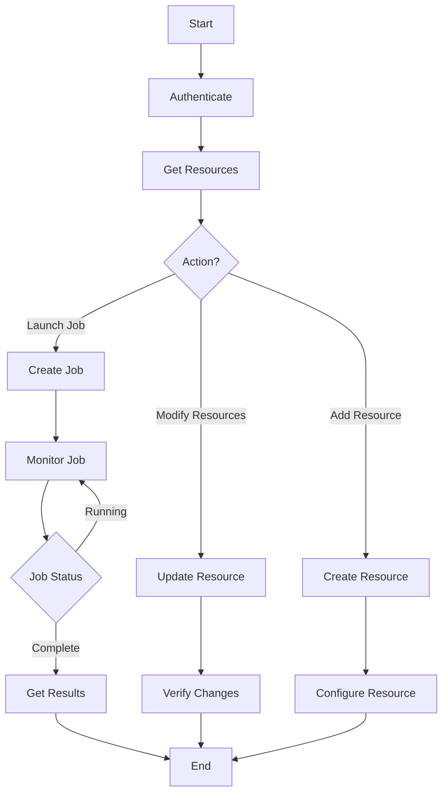

# Ansible Tower API

## Introduction

Ansible Tower (and its open-source counterpart AWX) provides a powerful web-based interface for managing your Ansible automation. But what if you want to integrate Tower with other systems or automate Tower itself? That's where the Ansible Tower API comes in.

The Ansible Tower API is a RESTful interface that allows you to programmatically interact with all aspects of Tower/AWX. Through this API, you can:

- Launch jobs and workflows
- Create and manage inventories
- Configure job templates
- Monitor job status
- Extract reporting data
- And much more!

This guide will walk you through the basics of using the Ansible Tower API, with practical examples to get you started on your automation journey.

## Understanding RESTful APIs

Before diving into the Tower API specifically, let's briefly understand what a RESTful API is:

A REST (Representational State Transfer) API uses HTTP requests to perform CRUD operations (Create, Read, Update, Delete) on resources. The Ansible Tower API follows this pattern, using:

- **GET** requests to retrieve data
- **POST** requests to create new resources
- **PUT/PATCH** requests to update existing resources
- **DELETE** requests to remove resources

## Authentication

Before making any API calls, you need to authenticate. Ansible Tower API supports several authentication methods:

### Basic Authentication

The simplest method is to use basic authentication with your username and password:

```python
import requests
import json

# Tower connection details
tower_url = "https://tower.example.com/api/v2/"
username = "admin"
password = "password"

# Make an authenticated request
response = requests.get(
    tower_url + "me/",
    auth=(username, password),
    verify=False  # Only use in testing environments
)

# Print the response
print(json.dumps(response.json(), indent=4))
```

Output:
```json
{
    "id": 1,
    "username": "admin",
    "first_name": "Admin",
    "last_name": "User",
    "email": "admin@example.com",
    "is_superuser": true,
    "is_system_auditor": false,
    "ldap_dn": "",
    "last_login": "2025-03-10T14:22:31.023456Z",
    "external_account": null
}
```

### OAuth2 Token Authentication

For more secure applications, you should use token-based authentication:

```python
import requests
import json

# Tower connection details
tower_url = "https://tower.example.com/api/v2/"
oauth_token = "your_oauth2_token_here"

headers = {
    "Authorization": f"Bearer {oauth_token}",
    "Content-Type": "application/json"
}

# Make an authenticated request
response = requests.get(
    tower_url + "job_templates/",
    headers=headers,
    verify=False  # Only use in testing environments
)

# Print the response
print(json.dumps(response.json(), indent=4))
```

### Obtaining a Token

You can obtain a token programmatically:

```python
import requests
import json

# Tower connection details
tower_url = "https://tower.example.com/api/v2/"
username = "admin"
password = "password"

# Request a token
response = requests.post(
    tower_url + "tokens/",
    auth=(username, password),
    verify=False  # Only use in testing environments
)

# Extract and print the token
token = response.json().get("token")
print(f"Your token: {token}")
```

## Exploring the API

One of the best features of the Tower API is its self-documenting nature. You can explore the API by simply making a GET request to the base URL:

```python
import requests
import json

# Tower connection details
tower_url = "https://tower.example.com/api/v2/"
username = "admin"
password = "password"

# Get the API root
response = requests.get(
    tower_url,
    auth=(username, password),
    verify=False  # Only use in testing environments
)

# Print available endpoints
print(json.dumps(response.json(), indent=4))
```

Output:
```json
{
    "ping": "/api/v2/ping/",
    "instances": "/api/v2/instances/",
    "instance_groups": "/api/v2/instance_groups/",
    "config": "/api/v2/config/",
    "settings": "/api/v2/settings/",
    "me": "/api/v2/me/",
    "dashboard": "/api/v2/dashboard/",
    "organizations": "/api/v2/organizations/",
    "users": "/api/v2/users/",
    "projects": "/api/v2/projects/",
    "teams": "/api/v2/teams/",
    "credentials": "/api/v2/credentials/",
    "inventory": "/api/v2/inventories/",
    "inventory_scripts": "/api/v2/inventory_scripts/",
    "inventory_sources": "/api/v2/inventory_sources/",
    "inventory_updates": "/api/v2/inventory_updates/",
    "groups": "/api/v2/groups/",
    "hosts": "/api/v2/hosts/",
    "job_templates": "/api/v2/job_templates/",
    "jobs": "/api/v2/jobs/",
    "job_events": "/api/v2/job_events/",
    "ad_hoc_commands": "/api/v2/ad_hoc_commands/",
    "system_job_templates": "/api/v2/system_job_templates/",
    "system_jobs": "/api/v2/system_jobs/",
    "schedules": "/api/v2/schedules/",
    "roles": "/api/v2/roles/",
    "notification_templates": "/api/v2/notification_templates/",
    "notifications": "/api/v2/notifications/",
    "labels": "/api/v2/labels/",
    "unified_job_templates": "/api/v2/unified_job_templates/",
    "unified_jobs": "/api/v2/unified_jobs/",
    "activity_stream": "/api/v2/activity_stream/",
    "workflow_job_templates": "/api/v2/workflow_job_templates/",
    "workflow_jobs": "/api/v2/workflow_jobs/",
    "workflow_job_template_nodes": "/api/v2/workflow_job_template_nodes/",
    "workflow_job_nodes": "/api/v2/workflow_job_nodes/"
}
```

## Common API Operations

Let's explore some common operations you might perform with the Tower API:

### Listing Resources

To get a list of resources, simply make a GET request to the appropriate endpoint:

```python
import requests
import json

# Tower connection details
tower_url = "https://tower.example.com/api/v2/"
username = "admin"
password = "password"

# List all job templates
response = requests.get(
    tower_url + "job_templates/",
    auth=(username, password),
    verify=False  # Only use in testing environments
)

# Print the job templates
data = response.json()
print(f"Total job templates: {data['count']}")
for template in data['results']:
    print(f"- {template['name']} (ID: {template['id']})")
```

Output:
```
Total job templates: 3
- Update Web Servers (ID: 1)
- Deploy Application (ID: 2)
- Backup Database (ID: 3)
```

### Creating Resources

To create a new resource, use a POST request with the required data:

```python
import requests
import json

# Tower connection details
tower_url = "https://tower.example.com/api/v2/"
username = "admin"
password = "password"

# Data for a new inventory
inventory_data = {
    "name": "Web Servers",
    "description": "Production web servers",
    "organization": 1
}

# Create the inventory
response = requests.post(
    tower_url + "inventories/",
    auth=(username, password),
    json=inventory_data,
    verify=False  # Only use in testing environments
)

if response.status_code == 201:
    print("Inventory created successfully!")
    print(f"Inventory ID: {response.json()['id']}")
else:
    print(f"Error: {response.status_code}")
    print(response.text)
```

Output:
```
Inventory created successfully!
Inventory ID: 7
```

### Launching a Job

One of the most common operations is launching a job from a job template:

```python
import requests
import json
import time

# Tower connection details
tower_url = "https://tower.example.com/api/v2/"
username = "admin"
password = "password"

# Job template ID to launch
job_template_id = 2

# Extra variables to pass to the job (optional)
extra_vars = {
    "app_version": "1.2.3",
    "environment": "production"
}

# Launch the job
response = requests.post(
    f"{tower_url}job_templates/{job_template_id}/launch/",
    auth=(username, password),
    json={"extra_vars": extra_vars},
    verify=False  # Only use in testing environments
)

if response.status_code == 201:
    job_id = response.json()['id']
    print(f"Job launched successfully with ID: {job_id}")
    
    # Monitor the job status
    job_status = "pending"
    while job_status in ["pending", "waiting", "running"]:
        time.sleep(5)
        job_response = requests.get(
            f"{tower_url}jobs/{job_id}/",
            auth=(username, password),
            verify=False
        )
        job_status = job_response.json()['status']
        print(f"Job status: {job_status}")
    
    print(f"Final job status: {job_status}")
else:
    print(f"Error launching job: {response.status_code}")
    print(response.text)
```

Output:
```
Job launched successfully with ID: 42
Job status: pending
Job status: waiting
Job status: running
Job status: running
Job status: successful
Final job status: successful
```

## Pagination

When listing resources, Tower paginates the results to improve performance. The response includes pagination information:

```python
import requests
import json

# Tower connection details
tower_url = "https://tower.example.com/api/v2/"
username = "admin"
password = "password"

# Get all hosts with pagination
all_hosts = []
next_page = tower_url + "hosts/"

while next_page:
    response = requests.get(
        next_page,
        auth=(username, password),
        verify=False  # Only use in testing environments
    )
    data = response.json()
    all_hosts.extend(data['results'])
    next_page = data['next']
    
print(f"Total hosts collected: {len(all_hosts)}")
```

Output:
```
Total hosts collected: 127
```

## Filtering and Searching

The Tower API supports filtering and searching for resources:

```python
import requests
import json

# Tower connection details
tower_url = "https://tower.example.com/api/v2/"
username = "admin"
password = "password"

# Search for jobs with a specific status
params = {
    "status": "failed",
    "order_by": "-started"  # Order by start time, newest first
}

response = requests.get(
    tower_url + "jobs/",
    auth=(username, password),
    params=params,
    verify=False  # Only use in testing environments
)

# Print the failed jobs
data = response.json()
print(f"Recent failed jobs: {data['count']}")
for job in data['results']:
    print(f"- {job['name']} (Started: {job['started']})")
```

Output:
```
Recent failed jobs: 3
- Deploy Application (Started: 2025-03-10T09:32:14.123456Z)
- Update Web Servers (Started: 2025-03-09T22:15:07.987654Z)
- Backup Database (Started: 2025-03-08T14:42:38.567890Z)
```

## Using the Tower API with Different Programming Languages

While our examples so far have used Python, you can use any language that can make HTTP requests. Here's an example using JavaScript:

```javascript
// Using fetch API in JavaScript
const fetchJobTemplates = async () => {
  const tower_url = "https://tower.example.com/api/v2/";
  const username = "admin";
  const password = "password";

  // Create Base64 encoded credentials
  const credentials = btoa(`${username}:${password}`);
  
  try {
    const response = await fetch(`${tower_url}job_templates/`, {
      method: 'GET',
      headers: {
        'Authorization': `Basic ${credentials}`,
        'Content-Type': 'application/json'
      }
    });
    
    const data = await response.json();
    console.log(`Total job templates: ${data.count}`);
    data.results.forEach(template => {
      console.log(`- ${template.name} (ID: ${template.id})`);
    });
  } catch (error) {
    console.error('Error fetching job templates:', error);
  }
};

fetchJobTemplates();
```

## Building a Simple Tower API Wrapper

For more complex applications, it can be helpful to build a reusable wrapper for the Tower API:

```python
import requests
import json
import time

class TowerAPI:
    def __init__(self, base_url, username=None, password=None, token=None, verify_ssl=True):
        self.base_url = base_url.rstrip('/') + '/api/v2/'
        self.username = username
        self.password = password
        self.token = token
        self.verify_ssl = verify_ssl
        
    def _get_headers(self):
        if self.token:
            return {
                "Authorization": f"Bearer {self.token}",
                "Content-Type": "application/json"
            }
        return {"Content-Type": "application/json"}
    
    def _get_auth(self):
        if self.username and self.password:
            return (self.username, self.password)
        return None
    
    def get(self, endpoint, params=None):
        url = self.base_url + endpoint.lstrip('/')
        response = requests.get(
            url,
            auth=self._get_auth(),
            headers=self._get_headers(),
            params=params,
            verify=self.verify_ssl
        )
        response.raise_for_status()
        return response.json()
    
    def post(self, endpoint, data=None):
        url = self.base_url + endpoint.lstrip('/')
        response = requests.post(
            url,
            auth=self._get_auth(),
            headers=self._get_headers(),
            json=data,
            verify=self.verify_ssl
        )
        response.raise_for_status()
        return response.json()
    
    def launch_job_template(self, template_id, extra_vars=None):
        data = {}
        if extra_vars:
            data["extra_vars"] = extra_vars
            
        return self.post(f"job_templates/{template_id}/launch/", data)
    
    def wait_for_job(self, job_id, interval=5, timeout=None):
        start_time = time.time()
        while True:
            job_data = self.get(f"jobs/{job_id}/")
            status = job_data["status"]
            
            if status not in ["pending", "waiting", "running"]:
                return job_data
                
            if timeout and (time.time() - start_time > timeout):
                raise TimeoutError(f"Job {job_id} did not complete within {timeout} seconds")
                
            time.sleep(interval)

# Example usage
tower = TowerAPI(
    "https://tower.example.com",
    username="admin",
    password="password",
    verify_ssl=False  # Only use in testing environments
)

# List job templates
templates = tower.get("job_templates/")
print(f"Total job templates: {templates['count']}")

# Launch a job
job = tower.launch_job_template(2, {"app_version": "1.2.3"})
print(f"Job launched with ID: {job['id']}")

# Wait for job completion
final_job = tower.wait_for_job(job['id'])
print(f"Job finished with status: {final_job['status']}")
```

Output:
```
Total job templates: 5
Job launched with ID: 43
Job finished with status: successful
```

## Real-World Example: Automated Provisioning Workflow

Let's build a more comprehensive example that shows how to use the Tower API in a real-world scenario. This example will:

1. Create a new inventory
2. Add hosts to the inventory
3. Create an inventory source to sync from a cloud provider
4. Launch the inventory sync
5. Wait for the sync to complete
6. Launch a job template that deploys to the new inventory
7. Wait for the job to complete

```python
import requests
import json
import time

# Tower connection details
tower_url = "https://tower.example.com/api/v2/"
username = "admin"
password = "password"

# Authentication and headers setup
auth = (username, password)
headers = {"Content-Type": "application/json"}

def make_request(method, endpoint, data=None, params=None):
    """Helper function to make API requests"""
    url = tower_url + endpoint
    
    if method == "GET":
        response = requests.get(url, auth=auth, headers=headers, params=params, verify=False)
    elif method == "POST":
        response = requests.post(url, auth=auth, headers=headers, json=data, verify=False)
    elif method == "PUT":
        response = requests.put(url, auth=auth, headers=headers, json=data, verify=False)
    elif method == "DELETE":
        response = requests.delete(url, auth=auth, headers=headers, verify=False)
    else:
        raise ValueError(f"Unsupported method: {method}")
    
    if response.status_code >= 400:
        print(f"Error {response.status_code}: {response.text}")
        response.raise_for_status()
        
    return response.json() if response.content else None

def wait_for_job(job_id, job_type="jobs"):
    """Wait for a job to complete"""
    print(f"Waiting for {job_type} {job_id} to complete...")
    while True:
        job_data = make_request("GET", f"{job_type}/{job_id}/")
        status = job_data["status"]
        print(f"Status: {status}")
        
        if status not in ["pending", "waiting", "running"]:
            return job_data
            
        time.sleep(5)

# 1. Create a new inventory
print("Creating new inventory...")
inventory_data = {
    "name": "Cloud Web Servers",
    "description": "Web servers in the cloud",
    "organization": 1
}
inventory = make_request("POST", "inventories/", inventory_data)
inventory_id = inventory["id"]
print(f"Created inventory with ID: {inventory_id}")

# 2. Add a host to the inventory
print("Adding host to inventory...")
host_data = {
    "name": "webserver01.example.com",
    "description": "Primary web server",
    "inventory": inventory_id,
    "variables": json.dumps({
        "ansible_host": "10.0.0.101",
        "ansible_user": "ansible",
        "http_port": 80,
        "server_role": "web"
    })
}
host = make_request("POST", "hosts/", host_data)
print(f"Added host with ID: {host['id']}")

# 3. Create an inventory source
print("Creating inventory source...")
source_data = {
    "name": "AWS EC2 Source",
    "description": "Sync from AWS EC2",
    "source": "ec2",
    "inventory": inventory_id,
    "credential": 3,  # ID of AWS credential
    "source_regions": "us-east-1",
    "source_vars": json.dumps({
        "instance_filters": "tag:Environment=production",
        "group_by": "tags"
    }),
    "update_on_launch": True,
    "overwrite": True
}
source = make_request("POST", "inventory_sources/", source_data)
source_id = source["id"]
print(f"Created inventory source with ID: {source_id}")

# 4. Launch the inventory sync
print("Launching inventory sync...")
sync = make_request("POST", f"inventory_sources/{source_id}/update/")
sync_id = sync["id"]
print(f"Inventory sync launched with ID: {sync_id}")

# 5. Wait for the sync to complete
final_sync = wait_for_job(sync_id, "inventory_updates")
print(f"Inventory sync completed with status: {final_sync['status']}")

# 6. Launch a job template
print("Launching deployment job...")
job_template_id = 4  # ID of deployment job template
job_data = {
    "inventory": inventory_id,
    "extra_vars": json.dumps({
        "app_version": "2.0.0",
        "deploy_mode": "rolling"
    })
}
job = make_request("POST", f"job_templates/{job_template_id}/launch/", job_data)
job_id = job["id"]
print(f"Deployment job launched with ID: {job_id}")

# 7. Wait for the job to complete
final_job = wait_for_job(job_id)
print(f"Deployment job completed with status: {final_job['status']}")

# Print a summary
print("
Provisioning workflow complete!")
print(f"Inventory: {inventory['name']} (ID: {inventory_id})")
print(f"Sync Status: {final_sync['status']}")
print(f"Deployment Status: {final_job['status']}")
```

Output:
```
Creating new inventory...
Created inventory with ID: 12
Adding host to inventory...
Added host with ID: 237
Creating inventory source...
Created inventory source with ID: 8
Launching inventory sync...
Inventory sync launched with ID: 53
Waiting for inventory_updates 53 to complete...
Status: pending
Status: running
Status: running
Status: successful
Inventory sync completed with status: successful
Launching deployment job...
Deployment job launched with ID: 45
Waiting for jobs 45 to complete...
Status: pending
Status: waiting
Status: running
Status: running
Status: running
Status: successful
Deployment job completed with status: successful

Provisioning workflow complete!
Inventory: Cloud Web Servers (ID: 12)
Sync Status: successful
Deployment Status: successful
```

## API Flow Visualization

To better understand the common API workflows, here's a diagram showing how different API endpoints relate to each other:



## Error Handling

When working with the Tower API, you'll need to handle various errors properly:

```python
import requests
import json

# Tower connection details
tower_url = "https://tower.example.com/api/v2/"
username = "admin"
password = "password"

def make_api_request(endpoint, method="GET", data=None):
    """Make an API request with proper error handling"""
    url = tower_url + endpoint
    
    try:
        if method == "GET":
            response = requests.get(url, auth=(username, password), verify=False)
        elif method == "POST":
            response = requests.post(url, auth=(username, password), json=data, verify=False)
        else:
            raise ValueError(f"Unsupported method: {method}")
            
        # Check for HTTP errors
        response.raise_for_status()
        
        return response.json() if response.content else None
        
    except requests.exceptions.HTTPError as e:
        status_code = e.response.status_code
        
        if status_code == 401:
            print("Authentication failed. Please check your credentials.")
        elif status_code == 403:
            print("Permission denied. Your user doesn't have access to this resource.")
        elif status_code == 404:
            print(f"Resource not found: {endpoint}")
        elif status_code == 400:
            error_data = e.response.json()
            print(f"Bad request: {json.dumps(error_data, indent=2)}")
        else:
            print(f"HTTP Error: {e}")
            
    except requests.exceptions.ConnectionError:
        print("Connection error. Please check if Tower is accessible.")
    except requests.exceptions.Timeout:
        print("Request timed out. Tower might be under heavy load.")
    except requests.exceptions.RequestException as e:
        print(f"Request error: {e}")
    except ValueError as e:
        print(f"Value error: {e}")
    except json.JSONDecodeError:
        print("Failed to parse JSON response.")
        
    return None

# Example usage
job_templates = make_api_request("job_templates/")
if job_templates:
    print(f"Found {job_templates['count']} job templates")
```

## Security Best Practices

When working with the Ansible Tower API, follow these security best practices:

1. **Use Token Authentication**: Prefer token-based authentication over basic authentication when possible.

2. **Use SSL Verification**: In production, always enable SSL verification:

```python
# Always verify SSL in production
response = requests.get(url, auth=auth, verify=True)
```

3. **Create Service Accounts**: Create dedicated service accounts with minimal permissions for your API integrations.

4. **Rotate Credentials**: Regularly rotate tokens and passwords used for API access.

5. **Secure Credential Storage**: Never hardcode credentials in your scripts. Use environment variables or secure credential management systems.

```python
import os

# Get credentials from environment variables
username = os.environ.get("TOWER_USERNAME")
password = os.environ.get("TOWER_PASSWORD")
tower_url = os.environ.get("TOWER_URL")
```

6. **Use HTTPS**: Always connect to Tower using HTTPS, never HTTP.

## Summary

The Ansible Tower API is a powerful tool that allows you to automate and integrate Ansible Tower with your existing systems and workflows. In this guide, we've covered:

- Basic API concepts and authentication methods
- How to explore and navigate the Tower API
- Common operations like listing, creating, and updating resources
- Launching and monitoring jobs
- Building reusable API wrappers
- Real-world examples for automation workflows
- Error handling and security best practices

By leveraging the Tower API, you can build sophisticated automation systems that extend the capabilities of Ansible Tower and integrate it with your existing tools and processes.

## Additional Resources

To continue learning about the Ansible Tower API:

1. **Official Documentation**: Refer to the official Ansible Tower API documentation for detailed information about all available endpoints.

2. **API Browser**: Use the built-in API browser in Tower by navigating to `/api/` in your Tower installation.

3. **Community Forums**: Join the Ansible community forums to discuss API usage and share solutions.

4. **Python Client Libraries**: Explore the `awxkit` Python library, which provides a convenient interface to the Tower API.

## Practice Exercises

1. Write a script that lists all failed jobs from the past 24 hours.

2. Create a script that generates a report of all inventories and their host counts.

3. Build a tool that launches a job template and sends the results via email when it completes.

4. Create a dashboard that displays the status of recently run jobs.

5. Implement a script that clones a job template with all its associated resources.