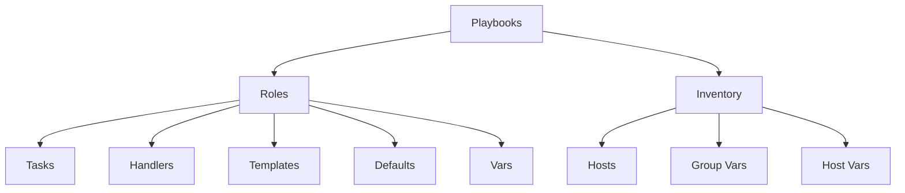

# Ansible Directory Structure

## Introduction

When you start working with Ansible, one of the first challenges you'll face is figuring out how to organize your files and directories. A well-planned directory structure is critical for keeping your automation code maintainable, reusable, and scalable as your infrastructure grows.

In this guide, we'll explore the recommended directory structure for Ansible projects, from simple playbooks to complex multi-environment deployments. By the end, you'll understand how to organize your Ansible projects effectively following best practices.

## Basic Ansible Project Structure

Let's start with a simple Ansible project structure. Even for basic automations, having a consistent structure helps maintain organization:

```
my_ansible_project/
├── inventory
│   └── hosts
├── playbooks/
│   └── site.yml
├── roles/
└── ansible.cfg
```

### Key Components

- **inventory/**: Contains inventory files that define the hosts and groups Ansible will manage
- **playbooks/**: Contains YAML files defining the tasks to be executed on the managed hosts
- **roles/**: Contains roles that organize playbooks into reusable components
- **ansible.cfg**: Configuration file for customizing Ansible behavior

Let's look at each component in detail.

## Inventory Directory

The inventory directory contains files that define which hosts Ansible will manage and how they're organized into groups.

```
inventory/
├── hosts                  # Main inventory file
├── group_vars/            # Variables for groups
│   ├── all.yml            # Variables for all hosts
│   ├── webservers.yml     # Variables for webservers group
│   └── dbservers.yml      # Variables for dbservers group
└── host_vars/             # Variables for individual hosts
    ├── web1.example.com.yml
    └── db1.example.com.yml
```

### Example Inventory File

Here's a simple example of an inventory file:

```ini
# inventory/hosts

[webservers]
web1.example.com
web2.example.com

[dbservers]
db1.example.com
db2.example.com

[datacenter:children]
webservers
dbservers
```

### Group Variables

Group variables apply to all hosts in a specific group:

```yaml
# inventory/group_vars/webservers.yml

http_port: 80
max_connections: 1000
```

These variables can be used in playbooks and templates that target the webservers group.

## Playbooks Directory

Playbooks define the tasks to be executed on your managed hosts:

```
playbooks/
├── site.yml               # Main playbook
├── webservers.yml         # Playbook for webservers
└── dbservers.yml          # Playbook for dbservers
```

### Example Playbook

```yaml
# playbooks/webservers.yml

---
- name: Configure webservers
  hosts: webservers
  become: true
  
  roles:
    - common
    - nginx
    
  tasks:
    - name: Ensure http port is open
      ansible.posix.firewalld:
        port: "{{ http_port }}/tcp"
        permanent: true
        state: enabled
```

## Roles Directory

Roles are the primary mechanism for breaking down playbooks into reusable components:

```
roles/
├── common/               # Common role applied to all servers
│   ├── defaults/         # Default variables for the role
│   │   └── main.yml
│   ├── files/            # Static files to be deployed
│   ├── handlers/         # Handlers for the role
│   │   └── main.yml
│   ├── meta/             # Role metadata and dependencies
│   │   └── main.yml
│   ├── tasks/            # Tasks for the role
│   │   └── main.yml
│   ├── templates/        # Jinja2 templates
│   └── vars/             # Variables with higher precedence
│       └── main.yml
├── nginx/                # Nginx web server role
└── mysql/                # MySQL database role
```

### Example Role Structure

Let's examine the structure of a simple role:

```yaml
# roles/nginx/tasks/main.yml

---
- name: Install nginx
  ansible.builtin.package:
    name: nginx
    state: present

- name: Configure nginx
  ansible.builtin.template:
    src: nginx.conf.j2
    dest: /etc/nginx/nginx.conf
  notify: restart nginx

- name: Start nginx service
  ansible.builtin.service:
    name: nginx
    state: started
    enabled: true
```

```yaml
# roles/nginx/handlers/main.yml

---
- name: restart nginx
  ansible.builtin.service:
    name: nginx
    state: restarted
```

```yaml
# roles/nginx/defaults/main.yml

---
nginx_worker_processes: auto
nginx_worker_connections: 1024
```

## Advanced Directory Structure

For larger projects with multiple environments, you might want a more sophisticated structure:

```
project/
├── inventories/
│   ├── production/
│   │   ├── hosts
│   │   ├── group_vars/
│   │   └── host_vars/
│   ├── staging/
│   │   ├── hosts
│   │   ├── group_vars/
│   │   └── host_vars/
│   └── development/
│       ├── hosts
│       ├── group_vars/
│       └── host_vars/
├── playbooks/
├── roles/
│   ├── external/        # Roles from Ansible Galaxy
│   └── internal/        # Custom roles
├── library/             # Custom modules
├── module_utils/        # Custom module utilities
├── filter_plugins/      # Custom filter plugins
├── ansible.cfg
└── requirements.yml     # Required external roles/collections
```

In this structure, we separate inventories by environment, which makes it easier to manage different configurations.

```bash
# Running a playbook in the production environment
ansible-playbook -i inventories/production playbooks/site.yml
```

## Structuring Collections

For even more complex projects, Ansible Collections provide a way to distribute and organize content:

```
collection/
├── docs/
├── galaxy.yml           # Collection metadata
├── plugins/             # Plugin code
│   ├── modules/
│   └── module_utils/
├── playbooks/           # Playbooks in the collection
└── roles/               # Roles in the collection
```

## Visualizing Directory Structure

Here's a diagram showing the relationship between different components:



## Best Practices for Directory Structure

1. **Keep related files together**: Each role should contain all the files needed for that specific functionality.

2. **Use environment-specific inventories**: Separate your inventory by environment to make it easier to manage different settings.

3. **Version control everything**: Store your entire Ansible directory structure in a version control system like Git.

4. **Use meaningful names**: Choose descriptive names for your playbooks, roles, and variables.

5. **Document your structure**: Include README files to explain the purpose of different components.

6. **Use default variables**: Define reasonable defaults in `defaults/main.yml` so roles can be used without extensive configuration.

7. **Limit role dependencies**: While role dependencies can be useful, excessive dependencies can make your code harder to maintain.

## Practical Example: Web Application Deployment

Let's look at a real-world example of deploying a web application with a database backend:

```
webapp_project/
├── inventories/
│   ├── production/
│   │   ├── hosts
│   │   └── group_vars/
│   │       ├── all.yml
│   │       ├── webservers.yml
│   │       └── dbservers.yml
│   └── staging/
│       ├── hosts
│       └── group_vars/
│           ├── all.yml
│           ├── webservers.yml
│           └── dbservers.yml
├── playbooks/
│   ├── site.yml
│   ├── deploy.yml
│   └── rollback.yml
├── roles/
│   ├── common/
│   ├── nginx/
│   ├── postgresql/
│   └── webapp/
└── ansible.cfg
```

Example deployment playbook:

```yaml
# playbooks/deploy.yml

---
- name: Deploy database servers
  hosts: dbservers
  become: true
  roles:
    - common
    - postgresql

- name: Deploy web servers
  hosts: webservers
  become: true
  roles:
    - common
    - nginx
    - webapp
```

## Summary

A well-organized Ansible directory structure is essential for creating maintainable automation code. The structure you choose should evolve with your project's complexity, from simple playbooks to sophisticated multi-environment deployments and collections.

Key takeaways:
- Organize your Ansible projects with clear separation between inventories, playbooks, and roles
- Use group and host variables to manage configuration across different environments
- Break down complex automations into reusable roles
- Follow best practices to keep your Ansible code maintainable as it grows

## Additional Resources

- [Ansible Documentation on Directory Layout](https://docs.ansible.com/ansible/latest/user_guide/playbooks_best_practices.html)
- [Ansible Galaxy](https://galaxy.ansible.com/) for community-contributed roles
- [Ansible Collections Documentation](https://docs.ansible.com/ansible/latest/user_guide/collections_using.html)

## Exercises

1. Create a basic Ansible project structure with an inventory file, a simple playbook, and at least one role.

2. Modify your project to support multiple environments (development, staging, production).

3. Create a role that installs and configures a web server, including templates for configuration files and handlers for service restarts.

4. Write a playbook that applies different roles to different host groups and uses variables from both group_vars and role defaults.